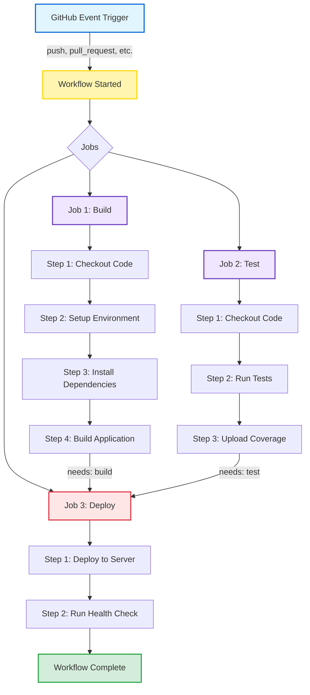
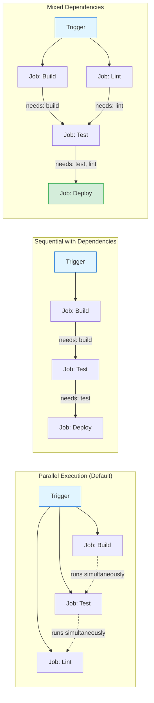

# 🚧 CICD and GitHub Actions

## Introduction to GitHub Actions

GitHub Actions is a powerful CI/CD platform that allows you to automate your software development workflows directly in your GitHub repository. It enables you to build, test, and deploy your code right from GitHub.

**Key Benefits:**

- Automate repetitive tasks
- Ensure code quality through automated testing
- Deploy applications automatically
- Integrate with thousands of third-party services
- Respond to GitHub events (push, pull requests, issues, etc.)

### 📊 [SLIDE PLACEHOLDER: GitHub Actions Overview Diagram]

_Include: Visual representation of GitHub Actions ecosystem_

---

## Core Concepts

### 1. Workflow

A **workflow** is an automated process that you define in your repository. Workflows are made up of one or more jobs and can be triggered by events, scheduled, or manually.

**Characteristics:**

- Defined in YAML files
- Stored in `.github/workflows/` directory
- Can contain multiple jobs that run in parallel or sequentially
- Triggered by events (push, pull_request, schedule, etc.)

**Example workflow triggers:**

```yaml
on:
  push:
    branches: [ main, develop ]
  pull_request:
    branches: [ main ]
  schedule:
    - cron: '0 0 * * 0'  # Weekly on Sunday
  workflow_dispatch:  # Manual trigger
```

### 📊 Workflow Lifecycle Diagram



**Workflow Execution Flow:**

1. **Trigger** → Event occurs (push, PR, schedule, manual)
2. **Workflow** → YAML file defines the automation
3. **Jobs** → Execute in parallel (unless dependencies defined)
4. **Steps** → Run sequentially within each job
5. **Actions** → Reusable code units within steps

---

### 2. Jobs

A **job** is a set of steps that execute on the same runner. By default, jobs run in parallel, but you can configure them to run sequentially with dependencies.

**Key Features:**

- Each job runs in a fresh virtual environment (runner)
- Jobs can depend on other jobs using `needs` keyword
- Can run on different operating systems
- Can share data between jobs using artifacts

**Example:**

```yaml
jobs:
  build:
    runs-on: ubuntu-latest
    steps:
      # steps here
  
  test:
    needs: build  # This job waits for build to complete
    runs-on: ubuntu-latest
    steps:
      # test steps here
  
  deploy:
    needs: [build, test]  # Waits for both jobs
    runs-on: ubuntu-latest
    steps:
      # deployment steps here
```

### 📊 Jobs Execution Pattern

#### **Parallel vs Sequential Job Execution with Dependencies**



**Visual Representation:**

```yaml
┌─────────────────────────────────────────────────────────────────────┐
│ Pattern 1: PARALLEL EXECUTION (Default - No Dependencies)           │
├─────────────────────────────────────────────────────────────────────┤
│                                                                     │
│   Trigger Event                                                     │
│         │                                                           │
│         ├──────────┬──────────┬──────────┐                          │
│         ▼          ▼          ▼          ▼                          │
│     [Build]    [Test]     [Lint]    [Security]                      │
│         │          │          │          │                          │
│         └──────────┴──────────┴──────────┘                          │
│                     ▼                                               │
│              All Complete                                           │
│                                                                     │
│   ⏱️  Total Time: ~5 min (slowest job)                              │
└─────────────────────────────────────────────────────────────────────┘

┌─────────────────────────────────────────────────────────────────────┐
│ Pattern 2: SEQUENTIAL EXECUTION (With Dependencies)                 │
├─────────────────────────────────────────────────────────────────────┤
│                                                                     │
│   Trigger Event                                                     │
│         │                                                           │
│         ▼                                                           │
│     [Build] ─── needs: none                                         │
│         │                                                           │
│         ▼                                                           │
│     [Test] ──── needs: build                                        │
│         │                                                           │
│         ▼                                                           │
│     [Deploy] ── needs: test                                         │
│         │                                                           │
│         ▼                                                           │
│     Complete                                                        │
│                                                                     │
│   ⏱️  Total Time: ~15 min (sum of all jobs)                         │
└─────────────────────────────────────────────────────────────────────┘

┌─────────────────────────────────────────────────────────────────────┐
│ Pattern 3: MIXED (Parallel + Sequential)                            │
├─────────────────────────────────────────────────────────────────────┤
│                                                                     │
│   Trigger Event                                                     │
│         │                                                           │
│         ├──────────┬──────────┐                                     │
│         ▼          ▼          ▼                                     │
│     [Build]    [Lint]    [Security]  ← Run in parallel              │
│         │          │          │                                     │
│         └────┬─────┴──────────┘                                     │
│              ▼                                                      │
│          [Test] ──── needs: [build, lint, security]                 │
│              │                                                      │
│              ▼                                                      │
│          [Deploy] ── needs: test                                    │
│              │                                                      │
│              ▼                                                      │
│          Complete                                                   │
│                                                                     │
│   ⏱️  Total Time: ~10 min (optimized)                               │
└─────────────────────────────────────────────────────────────────────┘
```

**YAML Examples:**

```yaml
# Parallel (Default)
jobs:
  build:
    runs-on: ubuntu-latest
  test:
    runs-on: ubuntu-latest
  lint:
    runs-on: ubuntu-latest
  # All run simultaneously

# Sequential
jobs:
  build:
    runs-on: ubuntu-latest
  test:
    needs: build  # Waits for build
    runs-on: ubuntu-latest
  deploy:
    needs: test   # Waits for test
    runs-on: ubuntu-latest

# Mixed
jobs:
  build:
    runs-on: ubuntu-latest
  lint:
    runs-on: ubuntu-latest
  test:
    needs: [build, lint]  # Waits for both
    runs-on: ubuntu-latest
  deploy:
    needs: test
    runs-on: ubuntu-latest
```

---

### 3. Steps

**Steps** are individual tasks that run commands or actions within a job. Steps execute in order and are sequential within a job.

**Types of Steps:**

1. **Run commands**: Execute shell commands
2. **Use actions**: Reusable units of code from marketplace or custom

**Example:**

```yaml
steps:
  - name: Checkout code
    uses: actions/checkout@v3
  
  - name: Set up Node.js
    uses: actions/setup-node@v3
    with:
      node-version: '18'
  
  - name: Install dependencies
    run: npm install
  
  - name: Run tests
    run: npm test
```

### 📊 [SLIDE PLACEHOLDER: Step Execution Flow]

_Include: Sequential execution of steps within a job_

---

## Runners

A **runner** is a server that executes your workflows. Runners listen for available jobs, run one job at a time, and report progress, logs, and results back to GitHub.

### GitHub-Hosted Runners

**Pre-configured environments** provided and maintained by GitHub.

**Available Operating Systems:**

- Ubuntu Linux (`ubuntu-latest`, `ubuntu-22.04`, `ubuntu-20.04`)
- Windows (`windows-latest`, `windows-2022`, `windows-2019`)
- macOS (`macos-latest`, `macos-13`, `macos-12`)

**Advantages:**

- ✅ No maintenance required
- ✅ Automatic updates
- ✅ Free minutes included (2,000/month for free tier)
- ✅ Clean environment for each job

**Limitations:**

- ⚠️ Limited customization
- ⚠️ Costs beyond free tier
- ⚠️ No access to internal network resources
- ⚠️ Fixed hardware specifications

**Example:**

```yaml
jobs:
  build:
    runs-on: ubuntu-latest  # GitHub-hosted runner
```

### 📊 [SLIDE PLACEHOLDER: GitHub-Hosted Runner Infrastructure]

_Include: Diagram showing GitHub's cloud infrastructure_

---

### Self-Hosted Runners

**Custom servers** that you configure and manage yourself.

**Use Cases:**

- Access to internal network resources (databases, private services)
- Custom hardware requirements (GPU, specific CPU)
- Better control over environment and installed software
- Reduced costs for high-volume usage
- Compliance and security requirements

**Advantages:**

- ✅ Full control over environment
- ✅ Custom hardware and software
- ✅ Access to private networks
- ✅ No minute limits
- ✅ Can reuse build cache between runs

**Limitations:**

- ⚠️ Requires setup and maintenance
- ⚠️ Security considerations (don't use for public repos)
- ⚠️ Must manage updates and dependencies

**Setup Example:**

```bash
# On your server
# 1. Download the runner application
mkdir actions-runner && cd actions-runner
curl -o actions-runner-linux-x64-2.311.0.tar.gz -L \
  https://github.com/actions/runner/releases/download/v2.311.0/actions-runner-linux-x64-2.311.0.tar.gz

# 2. Extract and configure
tar xzf ./actions-runner-linux-x64-2.311.0.tar.gz
./config.sh --url https://github.com/YOUR_REPO --token YOUR_TOKEN

# 3. Run the runner
./run.sh
```

**Usage in Workflow:**

```yaml
jobs:
  build:
    runs-on: self-hosted  # Uses your self-hosted runner
    # OR use labels
    runs-on: [self-hosted, linux, x64, gpu]
```

### Self-Hosted Runner Architecture

**Connection Flow:**

1. **Runner Registration** → Self-hosted runner connects to GitHub via HTTPS
2. **Job Polling** → Runner continuously checks for available jobs
3. **Job Execution** → Receives and executes workflow steps
4. **Resource Access** → Can access internal networks, databases, and private services
5. **Results Reporting** → Sends logs and results back to GitHub

**Key Components:**

- **GitHub API**: Communication endpoint for job management
- **Runner Application**: Agent software running on your server
- **Execution Environment**: Your custom OS, tools, and dependencies
- **Internal Resources**: Databases, APIs, file systems, private networks
- **Security Layer**: Firewall rules, VPN connections, access controls

**Network Architecture:**

```yaml
GitHub.com (Cloud)
    ↕ HTTPS
Your Self-Hosted Runner
    ↓ Direct Access
    ├─ Internal Database
    ├─ Private API Services
    ├─ File Storage/NAS
    └─ Other Internal Resources
```

### Runner Comparison

| Feature | GitHub-Hosted Runners | Self-Hosted Runners |
|---------|----------------------|---------------------|
| **Setup & Maintenance** | ✅ No setup required | ⚠️ Manual setup and maintenance |
| **Cost** | Free tier: 2,000 min/month<br>Pay-per-use beyond limit | No minute limits<br>Infrastructure costs only |
| **Environment** | Pre-configured (Ubuntu, Windows, macOS) | Fully customizable |
| **Updates** | ✅ Automatic | Manual updates required |
| **Hardware** | Fixed specifications | Custom hardware (GPU, CPU, memory) |
| **Network Access** | Public internet only | ✅ Access to private networks |
| **Security** | Isolated, clean environment | ⚠️ Not recommended for public repos |
| **Performance** | Standard performance | Optimized for your needs |
| **Cache Persistence** | No persistent cache | ✅ Persistent cache between runs |
| **Startup Time** | ~10-20 seconds | Faster (already running) |
| **Concurrent Jobs** | Based on plan limits | Based on available runners |
| **Best For** | Public repos, standard builds | Private repos, custom requirements, internal resources |

---

## Complete Workflow YAML Structure

Here's a comprehensive example workflow with detailed explanations for each section:

```yaml
# Workflow name (appears in GitHub Actions UI)
name: CI/CD Pipeline

# Triggers: Define when this workflow runs
on:
  # Run on push to specific branches
  push:
    branches: 
      - main
      - develop
    paths:
      - 'src/**'        # Only trigger if files in src/ change
      - 'package.json'
    
  # Run on pull requests targeting main
  pull_request:
    branches: 
      - main
    
  # Scheduled runs (cron syntax)
  schedule:
    - cron: '0 2 * * 1'  # Every Monday at 2 AM UTC
  
  # Manual trigger from GitHub UI
  workflow_dispatch:
    inputs:
      environment:
        description: 'Environment to deploy to'
        required: true
        default: 'staging'
        type: choice
        options:
          - staging
          - production

# Environment variables available to all jobs
env:
  NODE_VERSION: '18'
  DOCKER_REGISTRY: 'ghcr.io'

# Define the jobs
jobs:
  # Job 1: Build and Test
  build:
    # Job name displayed in UI
    name: Build and Test Application
    
    # Runner environment
    runs-on: ubuntu-latest
    
    # Job-level environment variables
    env:
      CI: true
    
    # Job outputs that other jobs can use
    outputs:
      version: ${{ steps.get_version.outputs.version }}
    
    # Sequential steps within this job
    steps:
      # Step 1: Checkout the repository code
      - name: Checkout code
        uses: actions/checkout@v4
        with:
          fetch-depth: 0  # Fetch all history for all branches
      
      # Step 2: Set up Node.js environment
      - name: Setup Node.js
        uses: actions/setup-node@v4
        with:
          node-version: ${{ env.NODE_VERSION }}
          cache: 'npm'  # Cache npm dependencies
      
      # Step 3: Install dependencies
      - name: Install dependencies
        run: npm ci  # ci is faster and more reliable for CI
      
      # Step 4: Run linting
      - name: Lint code
        run: npm run lint
        continue-on-error: false  # Fail job if linting fails
      
      # Step 5: Run tests
      - name: Run tests
        run: npm test -- --coverage
        env:
          NODE_ENV: test
      
      # Step 6: Upload coverage reports
      - name: Upload coverage to Codecov
        uses: codecov/codecov-action@v3
        with:
          files: ./coverage/coverage-final.json
          fail_ci_if_error: true
      
      # Step 7: Build the application
      - name: Build application
        run: npm run build
      
      # Step 8: Get version for other jobs
      - name: Get version
        id: get_version
        run: echo "version=$(node -p "require('./package.json').version")" >> $GITHUB_OUTPUT
      
      # Step 9: Upload build artifacts
      - name: Upload build artifacts
        uses: actions/upload-artifact@v4
        with:
          name: build-artifacts
          path: dist/
          retention-days: 7
  
  # Job 2: Security Scanning
  security:
    name: Security Scan
    runs-on: ubuntu-latest
    
    # Run in parallel with build job
    steps:
      - name: Checkout code
        uses: actions/checkout@v4
      
      - name: Run Trivy vulnerability scanner
        uses: aquasecurity/trivy-action@master
        with:
          scan-type: 'fs'
          scan-ref: '.'
          format: 'sarif'
          output: 'trivy-results.sarif'
      
      - name: Upload Trivy results to GitHub Security
        uses: github/codeql-action/upload-sarif@v2
        with:
          sarif_file: 'trivy-results.sarif'
  
  # Job 3: Docker Build
  docker:
    name: Build Docker Image
    runs-on: ubuntu-latest
    needs: [build, security]  # Wait for both jobs to complete
    
    # Only run on main branch
    if: github.ref == 'refs/heads/main'
    
    steps:
      - name: Checkout code
        uses: actions/checkout@v4
      
      # Download artifacts from build job
      - name: Download build artifacts
        uses: actions/download-artifact@v4
        with:
          name: build-artifacts
          path: dist/
      
      - name: Set up Docker Buildx
        uses: docker/setup-buildx-action@v3
      
      - name: Login to Container Registry
        uses: docker/login-action@v3
        with:
          registry: ${{ env.DOCKER_REGISTRY }}
          username: ${{ github.actor }}
          password: ${{ secrets.GITHUB_TOKEN }}
      
      - name: Extract metadata
        id: meta
        uses: docker/metadata-action@v5
        with:
          images: ${{ env.DOCKER_REGISTRY }}/${{ github.repository }}
          tags: |
            type=ref,event=branch
            type=semver,pattern={{version}}
            type=sha
      
      - name: Build and push Docker image
        uses: docker/build-push-action@v5
        with:
          context: .
          push: true
          tags: ${{ steps.meta.outputs.tags }}
          labels: ${{ steps.meta.outputs.labels }}
          cache-from: type=gha
          cache-to: type=gha,mode=max
  
  # Job 4: Deploy to Staging
  deploy-staging:
    name: Deploy to Staging
    runs-on: ubuntu-latest
    needs: docker
    environment: 
      name: staging
      url: https://staging.example.com
    
    steps:
      - name: Checkout code
        uses: actions/checkout@v4
      
      - name: Deploy to staging server
        run: |
          echo "Deploying version ${{ needs.build.outputs.version }}"
          # Add your deployment script here
        env:
          DEPLOY_KEY: ${{ secrets.STAGING_DEPLOY_KEY }}
      
      - name: Run smoke tests
        run: |
          # Add health check or smoke test commands
          curl --retry 5 --retry-delay 10 https://staging.example.com/health
  
  # Job 5: Deploy to Production
  deploy-production:
    name: Deploy to Production
    runs-on: ubuntu-latest
    needs: deploy-staging
    environment:
      name: production
      url: https://example.com
    
    # Only deploy to production on manual approval
    if: github.event_name == 'workflow_dispatch'
    
    steps:
      - name: Deploy to production
        run: |
          echo "Deploying to production"
          # Add production deployment script
        env:
          DEPLOY_KEY: ${{ secrets.PRODUCTION_DEPLOY_KEY }}
      
      - name: Notify team
        if: always()
        uses: 8398a7/action-slack@v3
        with:
          status: ${{ job.status }}
          webhook_url: ${{ secrets.SLACK_WEBHOOK }}
```

---

## Detailed Explanation of Each Section

### 1. **Workflow Name**

```yaml
name: CI/CD Pipeline
```

- Identifies the workflow in the GitHub Actions UI
- Optional but recommended for clarity

---

### 2. **Triggers (`on`)**

```yaml
on:
  push:
    branches: [main]
```

- **`push`**: Triggers on code push to specified branches
- **`pull_request`**: Triggers when PR is opened/updated
- **`schedule`**: Runs on a schedule (cron syntax)
- **`workflow_dispatch`**: Manual trigger from UI
- **`paths`**: Filter by changed files
- **Event types**: `release`, `issues`, `issue_comment`, etc.

---

## GitHub Events Deep Dive

GitHub Actions workflows are triggered by **events** that occur in your repository. Understanding event activity types and filters is crucial for creating efficient, targeted workflows.

### Event Activity Types

Each event can have multiple **activity types** that specify **-when exactly-** the workflow should run. By default, workflows trigger on all activity types for an event, but you can filter to specific ones.

#### Common Events and Their Activity Types

**1. `pull_request` and `pull_request_target`**

```yaml
on:
  pull_request:
    types: [opened, synchronize, reopened, closed]
```

**Available activity types:**

- `opened` - PR is created
- `synchronize` - New commits pushed to the PR branch
- `reopened` - Previously closed PR is reopened
- `closed` - PR is closed (merged or not)
- `assigned` / `unassigned` - Assignee added/removed
- `labeled` / `unlabeled` - Label added/removed
- `review_requested` / `review_request_removed` - Reviewer requested/removed
- `ready_for_review` - Draft PR marked as ready
- `converted_to_draft` - PR converted to draft
- `auto_merge_enabled` / `auto_merge_disabled` - Auto-merge toggled
- `locked` / `unlocked` - Conversation locked/unlocked
- `edited` - PR title or body edited

**Common use cases:**

```yaml
# Run tests only when PR is opened or updated with new commits
on:
  pull_request:
    types: [opened, synchronize]

# Run deployment cleanup when PR is closed
on:
  pull_request:
    types: [closed]

# Auto-label PR when it's ready for review
on:
  pull_request:
    types: [ready_for_review]
```

---

**2. `issues`**

```yaml
on:
  issues:
    types: [opened, edited, deleted, closed, reopened]
```

**Available activity types:**

- `opened` - New issue created
- `edited` - Issue title/body edited
- `deleted` - Issue deleted
- `closed` - Issue closed
- `reopened` - Closed issue reopened
- `assigned` / `unassigned` - Assignee changed
- `labeled` / `unlabeled` - Label changed
- `locked` / `unlocked` - Issue locked/unlocked
- `transferred` - Issue transferred to another repo
- `pinned` / `unpinned` - Issue pinned/unpinned
- `milestoned` / `demilestoned` - Milestone added/removed

**Example:**

```yaml
# Auto-assign issues based on labels
on:
  issues:
    types: [labeled]
```

---

**3. `release`**

```yaml
on:
  release:
    types: [published, created, edited, deleted]
```

**Available activity types:**

- `published` - Release published (not draft, not pre-release)
- `unpublished` - Release converted to draft
- `created` - Draft release created
- `edited` - Release details edited
- `deleted` - Release deleted
- `prereleased` - Pre-release published
- `released` - Release or pre-release published

**Example:**

```yaml
# Deploy only on official releases (not pre-releases)
on:
  release:
    types: [published]
```

---

**4. `issue_comment`**

```yaml
on:
  issue_comment:
    types: [created, edited, deleted]
```

**Note:** Triggers on comments in both issues AND pull requests.

---

**5. `push` and `create`/`delete`**

```yaml
on:
  push:
    # push has no activity types, use branches/tags filters
```

The `push` event doesn't have activity types, but you can use `create` and `delete` events for branch/tag creation/deletion:

```yaml
on:
  create:  # Branch or tag created
  delete:  # Branch or tag deleted
```

---

**6. `workflow_run`**

```yaml
on:
  workflow_run:
    workflows: ["CI"]
    types: [completed, requested, in_progress]
```

Trigger when another workflow runs. Useful for sequential workflows.

---

### Event Filters

Filters allow you to narrow down when a workflow runs based on specific criteria like branches, tags, file paths, or activity types.

#### 1. **Branch and Tag Filters**

**Branch filtering:**

```yaml
on:
  push:
    branches:
      - main
      - develop
      - 'releases/**'  # Pattern matching
      - '!releases/**-beta'  # Exclude pattern
    branches-ignore:
      - 'experimental/**'
```

**Tag filtering:**

```yaml
on:
  push:
    tags:
      - 'v*.*.*'  # Semantic versioning tags
      - '!v*-alpha'  # Exclude alpha versions
    tags-ignore:
      - 'test-*'
```

**Pattern matching:**

- `*` - Matches any character except `/`
- `**` - Matches any character including `/`
- `?` - Matches single character
- `!` - Negates the pattern (must come first)

---

#### 2. **Path Filters**

Trigger only when specific files change:

```yaml
on:
  push:
    paths:
      - 'src/**'           # Any file in src/
      - 'package.json'      # Specific file
      - '**.js'             # All JS files
      - 'docs/**/*.md'      # Markdown in docs
      - '!docs/draft/**'    # Exclude drafts
    paths-ignore:
      - '**.md'             # Ignore markdown files
      - 'docs/**'           # Ignore docs folder
```

**Important notes:**

- Cannot use both `paths` and `paths-ignore` in the same event
- Path filters check only changed files, not all files
- Paths are relative to repository root
- At least one path must match for the workflow to run

---

#### 3. **Combining Activity Types and Filters**

```yaml
on:
  pull_request:
    types: [opened, synchronize]
    branches:
      - main
      - 'release/**'
    paths:
      - 'src/**'
      - 'tests/**'
      - 'package.json'
```

This runs only when:

- ✅ PR is opened OR new commits are pushed
- ✅ AND PR targets `main` or `release/**` branches
- ✅ AND changes include files in `src/`, `tests/`, or `package.json`

---

#### 4. **Advanced Filter Patterns**

**Multiple events with different filters:**

```yaml
on:
  push:
    branches: [main]
    paths:
      - 'src/**'
  
  pull_request:
    types: [opened, synchronize]
    branches: [main]
    paths:
      - 'src/**'
  
  schedule:
    - cron: '0 0 * * 0'  # Weekly full build
```

**Conditional execution within workflow:**

```yaml
on:
  pull_request:
    types: [opened, synchronize, labeled]

jobs:
  deploy-preview:
    if: github.event.action == 'labeled' && github.event.label.name == 'deploy-preview'
    runs-on: ubuntu-latest
    steps:
      - run: echo "Deploying preview environment"
```

---

### Event Filter Best Practices

1. **Be specific with paths** - Avoid running unnecessary workflows
  
   ```yaml
   paths:
     - 'backend/**'  # Don't trigger backend tests for frontend changes
   ```

2. **Use activity types wisely** - Select only needed types
  
   ```yaml
   types: [opened, synchronize]  # Skip labeled, assigned, etc.
   ```

3. **Combine filters for precision** - Use multiple filters together
  
   ```yaml
   pull_request:
     types: [opened, synchronize]
     branches: [main]
     paths: ['src/**']
   ```

4. **Consider `paths-ignore` for docs** - Skip CI for documentation changes
  
   ```yaml
   paths-ignore:
     - '**.md'
     - 'docs/**'
   ```

5. **Test complex patterns** - Verify filter patterns work as expected

---

### Quick Reference Table

| Event | Common Activity Types | Typical Filters |
|-------|----------------------|-----------------|
| `push` | N/A | `branches`, `tags`, `paths` |
| `pull_request` | `opened`, `synchronize`, `closed` | `branches`, `paths`, `types` |
| `issues` | `opened`, `labeled`, `closed` | `types` |
| `release` | `published`, `created` | `types` |
| `schedule` | N/A | `cron` expression |
| `workflow_dispatch` | N/A | Input parameters |
| `issue_comment` | `created`, `edited` | `types` |

---

### 3. **Environment Variables**

```yaml
env:
  NODE_VERSION: '18'
```

- **Workflow-level**: Available to all jobs
- **Job-level**: Available to all steps in that job
- **Step-level**: Available only to that step
- Access with: `${{ env.VARIABLE_NAME }}`

---

### 4. **Jobs**

```yaml
jobs:
  build:
    runs-on: ubuntu-latest
```

- **`runs-on`**: Specifies the runner (OS environment)
- **`needs`**: Defines job dependencies
- **`if`**: Conditional execution
- **`environment`**: Deployment environment (with protection rules)
- **`outputs`**: Data passed to dependent jobs

---

### 5. **Steps**

Each step can be:

**a) Action (uses):**

```yaml
- name: Checkout code
  uses: actions/checkout@v4
  with:
    fetch-depth: 0
```

- Reusable community or custom actions
- Format: `owner/repo@version`
- `with`: Input parameters for the action

**b) Shell command (run):**

```yaml
- name: Install dependencies
  run: npm ci
  working-directory: ./app
  shell: bash
```

- Execute shell commands
- Multi-line commands supported
- `working-directory`: Change directory for this step
- `shell`: Specify shell (bash, pwsh, python, etc.)

---

### 6. **Contexts and Expressions**

```yaml
${{ github.ref }}
${{ secrets.API_KEY }}
${{ steps.step_id.outputs.value }}
```

**Common contexts:**

- **`github`**: Workflow information (`github.ref`, `github.actor`, `github.sha`)
- **`env`**: Environment variables
- **`secrets`**: Encrypted secrets from repository settings
- **`steps`**: Output from previous steps
- **`jobs`**: Output from other jobs
- **`runner`**: Runner information

---

### 7. **Artifacts**

```yaml
- uses: actions/upload-artifact@v4
  with:
    name: build-artifacts
    path: dist/
```

- Share data between jobs
- Store build outputs
- Available for download after workflow completes
- Automatic cleanup after retention period

---

### 8. **Conditional Execution**

```yaml
if: github.ref == 'refs/heads/main'
if: success() && github.event_name == 'push'
if: failure()
```

- **Status functions**: `success()`, `failure()`, `always()`, `cancelled()`
- **Operators**: `==`, `!=`, `&&`, `||`, `!`

---

### 9. **Matrix Strategy**

```yaml
strategy:
  matrix:
    os: [ubuntu-latest, windows-latest, macos-latest]
    node: [16, 18, 20]
```

- Run job with multiple configurations
- Creates job for each combination
- Access with: `${{ matrix.os }}`, `${{ matrix.node }}`

---

## Best Practices

1. **Use specific action versions**: `actions/checkout@v4` (not `@main`)
2. **Cache dependencies**: Speed up workflows with caching
3. **Fail fast**: Use `continue-on-error: false` for critical steps
4. **Use secrets**: Never hardcode credentials
5. **Limit concurrency**: Prevent multiple deployments
6. **Use environments**: Add protection rules for production
7. **Keep workflows DRY**: Use reusable workflows and composite actions
8. **Monitor usage**: Check action minutes and storage

### 📊 [SLIDE PLACEHOLDER: Best Practices Checklist]
_Include: Visual checklist of workflow optimization tips_

---

## Common Workflow Patterns

### 📊 [SLIDE PLACEHOLDER: Common CI/CD Patterns]
_Include: Visual examples of mono-repo, microservices, and deployment patterns_

---

## Next Steps

- Setting up secrets and environment variables
- Creating reusable workflows
- Advanced GitHub Actions features
- Integrating with external services
- Monitoring and debugging workflows
