# 🚧 CICD and GitHub Actions

## Introduction to GitHub Actions

GitHub Actions is a powerful CI/CD platform that allows you to automate your software development workflows directly in your GitHub repository. It enables you to build, test, and deploy your code right from GitHub.

**Key Benefits:**

- Automate repetitive tasks
- Ensure code quality through automated testing
- Deploy applications automatically
- Integrate with thousands of third-party services
- Respond to GitHub events (push, pull requests, issues, etc.)

### 📊 [SLIDE PLACEHOLDER: GitHub Actions Overview Diagram]

_Include: Visual representation of GitHub Actions ecosystem_

---

## Core Concepts

### 1. Workflow

A **workflow** is an automated process that you define in your repository. Workflows are made up of one or more jobs and can be triggered by events, scheduled, or manually.

**Characteristics:**

- Defined in YAML files
- Stored in `.github/workflows/` directory
- Can contain multiple jobs that run in parallel or sequentially
- Triggered by events (push, pull_request, schedule, etc.)

**Example workflow triggers:**

```yaml
on:
  push:
    branches: [ main, develop ]
  pull_request:
    branches: [ main ]
  schedule:
    - cron: '0 0 * * 0'  # Weekly on Sunday
  workflow_dispatch:  # Manual trigger
```

### 📊 Workflow Lifecycle Diagram


**Workflow Execution Flow:**

1. **Trigger** → Event occurs (push, PR, schedule, manual)
2. **Workflow** → YAML file defines the automation
3. **Jobs** → Execute in parallel (unless dependencies defined)
4. **Steps** → Run sequentially within each job
5. **Actions** → Reusable code units within steps

---

### 2. Jobs

A **job** is a set of steps that execute on the same runner. By default, jobs run in parallel, but you can configure them to run sequentially with dependencies.

**Key Features:**

- Each job runs in a fresh virtual environment (runner)
- Jobs can depend on other jobs using `needs` keyword
- Can run on different operating systems
- Can share data between jobs using artifacts

**Example:**

```yaml
jobs:
  build:
    runs-on: ubuntu-latest
    steps:
      # steps here
  
  test:
    needs: build  # This job waits for build to complete
    runs-on: ubuntu-latest
    steps:
      # test steps here
  
  deploy:
    needs: [build, test]  # Waits for both jobs
    runs-on: ubuntu-latest
    steps:
      # deployment steps here
```

### 📊 Jobs Execution Pattern

#### **Parallel vs Sequential Job Execution with Dependencies**


**Visual Representation:**

```yaml
┌─────────────────────────────────────────────────────────────────────┐
│ Pattern 1: PARALLEL EXECUTION (Default - No Dependencies)           │
├─────────────────────────────────────────────────────────────────────┤
│                                                                     │
│   Trigger Event                                                     │
│         │                                                           │
│         ├──────────┬──────────┬──────────┐                          │
│         ▼          ▼          ▼          ▼                          │
│     [Build]    [Test]     [Lint]    [Security]                      │
│         │          │          │          │                          │
│         └──────────┴──────────┴──────────┘                          │
│                     ▼                                               │
│              All Complete                                           │
│                                                                     │
│   ⏱️  Total Time: ~5 min (slowest job)                              │
└─────────────────────────────────────────────────────────────────────┘

┌─────────────────────────────────────────────────────────────────────┐
│ Pattern 2: SEQUENTIAL EXECUTION (With Dependencies)                 │
├─────────────────────────────────────────────────────────────────────┤
│                                                                     │
│   Trigger Event                                                     │
│         │                                                           │
│         ▼                                                           │
│     [Build] ─── needs: none                                         │
│         │                                                           │
│         ▼                                                           │
│     [Test] ──── needs: build                                        │
│         │                                                           │
│         ▼                                                           │
│     [Deploy] ── needs: test                                         │
│         │                                                           │
│         ▼                                                           │
│     Complete                                                        │
│                                                                     │
│   ⏱️  Total Time: ~15 min (sum of all jobs)                         │
└─────────────────────────────────────────────────────────────────────┘

┌─────────────────────────────────────────────────────────────────────┐
│ Pattern 3: MIXED (Parallel + Sequential)                            │
├─────────────────────────────────────────────────────────────────────┤
│                                                                     │
│   Trigger Event                                                     │
│         │                                                           │
│         ├──────────┬──────────┐                                     │
│         ▼          ▼          ▼                                     │
│     [Build]    [Lint]    [Security]  ← Run in parallel              │
│         │          │          │                                     │
│         └────┬─────┴──────────┘                                     │
│              ▼                                                      │
│          [Test] ──── needs: [build, lint, security]                 │
│              │                                                      │
│              ▼                                                      │
│          [Deploy] ── needs: test                                    │
│              │                                                      │
│              ▼                                                      │
│          Complete                                                   │
│                                                                     │
│   ⏱️  Total Time: ~10 min (optimized)                               │
└─────────────────────────────────────────────────────────────────────┘
```

**YAML Examples:**

```yaml
# Parallel (Default)
jobs:
  build:
    runs-on: ubuntu-latest
  test:
    runs-on: ubuntu-latest
  lint:
    runs-on: ubuntu-latest
  # All run simultaneously

# Sequential
jobs:
  build:
    runs-on: ubuntu-latest
  test:
    needs: build  # Waits for build
    runs-on: ubuntu-latest
  deploy:
    needs: test   # Waits for test
    runs-on: ubuntu-latest

# Mixed
jobs:
  build:
    runs-on: ubuntu-latest
  lint:
    runs-on: ubuntu-latest
  test:
    needs: [build, lint]  # Waits for both
    runs-on: ubuntu-latest
  deploy:
    needs: test
    runs-on: ubuntu-latest
```

---

### 3. Steps

**Steps** are individual tasks that run commands or actions within a job. Steps execute in order and are sequential within a job.

**Types of Steps:**

1. **Run commands**: Execute shell commands
2. **Use actions**: Reusable units of code from marketplace or custom

**Example:**

```yaml
steps:
  - name: Checkout code
    uses: actions/checkout@v3
  
  - name: Set up Node.js
    uses: actions/setup-node@v3
    with:
      node-version: '18'
  
  - name: Install dependencies
    run: npm install
  
  - name: Run tests
    run: npm test
```

### 📊 Step Execution Flow

#### **Sequential execution of steps within a job**


**Visual Representation:**

```yaml
┌─────────────────────────────────────────────────────────────┐
│              SEQUENTIAL STEP EXECUTION                      │
│                    (Within a Job)                           │
├─────────────────────────────────────────────────────────────┤
│                                                             │
│  Job Starts                                                 │
│      │                                                      │
│      ▼                                                      │
│  ┌─────────────────────────────────┐                        │
│  │ Step 1: Checkout Code           │  uses: checkout@v4     │
│  └────────────┬────────────────────┘                        │
│               │  ✅ Success                                 │
│               ▼                                             │
│  ┌─────────────────────────────────┐                        │
│  │ Step 2: Setup Node.js           │  uses: setup-node@v4   │
│  └────────────┬────────────────────┘                        │
│               │  ✅ Success                                 │
│               ▼                                             │
│  ┌─────────────────────────────────┐                        │
│  │ Step 3: Install Dependencies    │  run: npm ci           │
│  └────────────┬────────────────────┘                        │
│               │  ✅ Success                                 │
│               ▼                                             │
│  ┌─────────────────────────────────┐                        │
│  │ Step 4: Run Linter              │  run: npm run lint     │
│  └────────────┬────────────────────┘                        │
│               │  ✅ Success                                 │
│               ▼                                             │
│  ┌─────────────────────────────────┐                        │
│  │ Step 5: Run Tests               │  run: npm test         │
│  └────────────┬────────────────────┘                        │
│               │  ✅ Success                                 │
│               ▼                                             │
│  ┌─────────────────────────────────┐                        │
│  │ Step 6: Build Application       │  run: npm run build    │
│  └────────────┬────────────────────┘                        │
│               │  ✅ Success                                 │
│               ▼                                             │
│  ┌─────────────────────────────────┐                        │
│  │ Step 7: Upload Artifacts        │  uses: upload@v4       │
│  └────────────┬────────────────────┘                        │
│               │  ✅ Success                                 │
│               ▼                                             │
│  Job Complete ✅                                            │
│                                                             │
├─────────────────────────────────────────────────────────────┤
│  ⚠️  If ANY step fails:                                     │
│      • Remaining steps are SKIPPED                          │
│      • Job marked as FAILED ❌                              │
│      • Use continue-on-error: true to bypass                │
└─────────────────────────────────────────────────────────────┘
```

**Key Points:**

- **Sequential**: Steps run one after another, top to bottom
- **Same Runner**: All steps execute on the same machine
- **Shared Context**: Environment variables and files persist between steps
- **Fail Fast**: By default, if a step fails, subsequent steps are skipped
- **Exit Codes**: Non-zero exit code = failure (unless `continue-on-error: true`)

**Example with Error Handling:**

```yaml
steps:
  - name: Checkout code
    uses: actions/checkout@v4
  
  - name: Run tests
    run: npm test
    continue-on-error: true  # Job continues even if tests fail
  
  - name: Upload test results
    if: always()  # Runs even if previous step failed
    uses: actions/upload-artifact@v4
```

---

## Runners

A **runner** is a server that executes your workflows. Runners listen for available jobs, run one job at a time, and report progress, logs, and results back to GitHub.

### GitHub-Hosted Runners

**Pre-configured environments** provided and maintained by GitHub.

**Available Operating Systems:**

- Ubuntu Linux (`ubuntu-latest`, `ubuntu-22.04`, `ubuntu-20.04`)
- Windows (`windows-latest`, `windows-2022`, `windows-2019`)
- macOS (`macos-latest`, `macos-13`, `macos-12`)

**Advantages:**

- ✅ No maintenance required
- ✅ Automatic updates
- ✅ Free minutes included (2,000/month for free tier)
- ✅ Clean environment for each job

**Limitations:**

- ⚠️ Limited customization
- ⚠️ Costs beyond free tier
- ⚠️ No access to internal network resources
- ⚠️ Fixed hardware specifications

**Example:**

```yaml
jobs:
  build:
    runs-on: ubuntu-latest  # GitHub-hosted runner
```

### 📊 GitHub-Hosted Runner Infrastructure

#### **GitHub's Cloud Infrastructure**


**Visual Representation:**

```yaml
┌─────────────────────────────────────────────────────────────────────┐
│                   GITHUB-HOSTED RUNNER ARCHITECTURE                 │
├─────────────────────────────────────────────────────────────────────┤
│                                                                     │
│  Developer                                                          │
│      │                                                              │
│      │ git push / PR / manual trigger                               │
│      ▼                                                              │
│  ┌──────────────────────────────────────┐                           │
│  │      GitHub Actions Service          │                           │
│  │  (Workflow orchestration & queue)    │                           │
│  └──────────┬───────────────────────────┘                           │
│             │                                                       │
│             │ Assigns job to available runner                       │
│             │                                                       │
│    ┌────────┴────────┬──────────────┬──────────────┐                │
│    ▼                 ▼              ▼              ▼                │
│ ┌─────────┐    ┌──────────┐   ┌──────────┐   ┌─────────┐            │
│ │ Ubuntu  │    │ Windows  │   │  macOS   │   │  More   │            │
│ │ Runner  │    │  Runner  │   │  Runner  │   │ Runners │            │
│ │  Pool   │    │   Pool   │   │   Pool   │   │  ...    │            │
│ └────┬────┘    └─────┬────┘   └─────┬────┘   └─────────┘            │
│      │               │              │                               │
│   [VM Pool]       [VM Pool]     [VM Pool]                           │
│      │               │              │                               │
│      ▼               ▼              ▼                               │
│ ┌─────────────────────────────────────────┐                         │
│ │  Fresh Virtual Machine Provisioned      │                         │
│ │  • Pre-installed tools & dependencies   │                         │
│ │  • Clean environment (no state)         │                         │
│ │  • Network access (internet only)       │                         │
│ │  • Executes your workflow steps         │                         │
│ └──────────────────┬──────────────────────┘                         │
│                    │                                                │
│                    │ Job completes                                  │
│                    ▼                                                │
│             ┌──────────────┐                                        │
│             │  Logs & Data │                                        │
│             │ Sent to GitHub│                                       │
│             └──────┬───────┘                                        │
│                    │                                                │
│                    ▼                                                │
│             VM Destroyed 🗑️                                         │
│                                                                     │
├─────────────────────────────────────────────────────────────────────┤
│  Characteristics:                                                   │
│  ✅ Managed by GitHub (no maintenance)                              │
│  ✅ Multiple OS options (Ubuntu, Windows, macOS)                    │
│  ✅ Pre-installed software & tools                                  │
│  ✅ Clean environment for each job                                  │
│  ✅ Auto-scaling based on demand                                    │
│  ⚠️  Public internet access only                                    │
│  ⚠️  No persistent storage between runs                             │
│  ⚠️  Usage limits based on plan                                     │
└─────────────────────────────────────────────────────────────────────┘
```

**How It Works:**

1. **Workflow Triggered** → Event occurs (push, PR, schedule)
2. **Job Queued** → GitHub Actions service receives the job
3. **Runner Selected** → Available runner from the appropriate pool (OS-specific)
4. **VM Provisioned** → Fresh virtual machine spins up with pre-installed tools
5. **Job Executed** → Your workflow steps run in the clean environment
6. **Results Returned** → Logs and artifacts sent back to GitHub
7. **VM Destroyed** → Machine is deleted (no state persists)

**Pre-installed Software:**

Each runner comes with common tools:

- **Ubuntu**: Node.js, Python, Ruby, Java, Docker, Git, npm, etc.
- **Windows**: PowerShell, Chocolatey, Node.js, Python, .NET, Visual Studio
- **macOS**: Xcode, Homebrew, Node.js, Python, Ruby, CocoaPods

**Network Access:**

- ✅ Public internet (GitHub, npm, PyPI, Docker Hub, etc.)
- ❌ Private networks (internal databases, corporate resources)
- ❌ Localhost services from your development machine

---

### Self-Hosted Runners

**Custom servers** that you configure and manage yourself.

**Use Cases:**

- Access to internal network resources (databases, private services)
- Custom hardware requirements (GPU, specific CPU)
- Better control over environment and installed software
- Reduced costs for high-volume usage
- Compliance and security requirements

**Advantages:**

- ✅ Full control over environment
- ✅ Custom hardware and software
- ✅ Access to private networks
- ✅ No minute limits
- ✅ Can reuse build cache between runs

**Limitations:**

- ⚠️ Requires setup and maintenance
- ⚠️ Security considerations (don't use for public repos)
- ⚠️ Must manage updates and dependencies

**Setup Example:**

```bash
# On your server
# 1. Download the runner application
mkdir actions-runner && cd actions-runner
curl -o actions-runner-linux-x64-2.311.0.tar.gz -L \
  https://github.com/actions/runner/releases/download/v2.311.0/actions-runner-linux-x64-2.311.0.tar.gz

# 2. Extract and configure
tar xzf ./actions-runner-linux-x64-2.311.0.tar.gz
./config.sh --url https://github.com/YOUR_REPO --token YOUR_TOKEN

# 3. Run the runner
./run.sh
```

**Usage in Workflow:**

```yaml
jobs:
  build:
    runs-on: self-hosted  # Uses your self-hosted runner
    # OR use labels
    runs-on: [self-hosted, linux, x64, gpu]
```

### Self-Hosted Runner Architecture

**Connection Flow:**

1. **Runner Registration** → Self-hosted runner connects to GitHub via HTTPS
2. **Job Polling** → Runner continuously checks for available jobs
3. **Job Execution** → Receives and executes workflow steps
4. **Resource Access** → Can access internal networks, databases, and private services
5. **Results Reporting** → Sends logs and results back to GitHub

**Key Components:**

- **GitHub API**: Communication endpoint for job management
- **Runner Application**: Agent software running on your server
- **Execution Environment**: Your custom OS, tools, and dependencies
- **Internal Resources**: Databases, APIs, file systems, private networks
- **Security Layer**: Firewall rules, VPN connections, access controls

**Network Architecture:**

```yaml
GitHub.com (Cloud)
    ↕ HTTPS
Your Self-Hosted Runner
    ↓ Direct Access
    ├─ Internal Database
    ├─ Private API Services
    ├─ File Storage/NAS
    └─ Other Internal Resources
```

### Runner Comparison

| Feature | GitHub-Hosted Runners | Self-Hosted Runners |
|---------|----------------------|---------------------|
| **Setup & Maintenance** | ✅ No setup required | ⚠️ Manual setup and maintenance |
| **Cost** | Free tier: 2,000 min/month<br>Pay-per-use beyond limit | No minute limits<br>Infrastructure costs only |
| **Environment** | Pre-configured (Ubuntu, Windows, macOS) | Fully customizable |
| **Updates** | ✅ Automatic | Manual updates required |
| **Hardware** | Fixed specifications | Custom hardware (GPU, CPU, memory) |
| **Network Access** | Public internet only | ✅ Access to private networks |
| **Security** | Isolated, clean environment | ⚠️ Not recommended for public repos |
| **Performance** | Standard performance | Optimized for your needs |
| **Cache Persistence** | No persistent cache | ✅ Persistent cache between runs |
| **Startup Time** | ~10-20 seconds | Faster (already running) |
| **Concurrent Jobs** | Based on plan limits | Based on available runners |
| **Best For** | Public repos, standard builds | Private repos, custom requirements, internal resources |

---

## Complete Workflow YAML Structure

Here's a comprehensive example workflow with detailed explanations for each section:

```yaml
# Workflow name (appears in GitHub Actions UI)
name: CI/CD Pipeline

# Triggers: Define when this workflow runs
on:
  # Run on push to specific branches
  push:
    branches: 
      - main
      - develop
    paths:
      - 'src/**'        # Only trigger if files in src/ change
      - 'package.json'
    
  # Run on pull requests targeting main
  pull_request:
    branches: 
      - main
    
  # Scheduled runs (cron syntax)
  schedule:
    - cron: '0 2 * * 1'  # Every Monday at 2 AM UTC
  
  # Manual trigger from GitHub UI
  workflow_dispatch:
    inputs:
      environment:
        description: 'Environment to deploy to'
        required: true
        default: 'staging'
        type: choice
        options:
          - staging
          - production

# Environment variables available to all jobs
env:
  NODE_VERSION: '18'
  DOCKER_REGISTRY: 'ghcr.io'

# Define the jobs
jobs:
  # Job 1: Build and Test
  build:
    # Job name displayed in UI
    name: Build and Test Application
    
    # Runner environment
    runs-on: ubuntu-latest
    
    # Job-level environment variables
    env:
      CI: true
    
    # Job outputs that other jobs can use
    outputs:
      version: ${{ steps.get_version.outputs.version }}
    
    # Sequential steps within this job
    steps:
      # Step 1: Checkout the repository code
      - name: Checkout code
        uses: actions/checkout@v4
        with:
          fetch-depth: 0  # Fetch all history for all branches
      
      # Step 2: Set up Node.js environment
      - name: Setup Node.js
        uses: actions/setup-node@v4
        with:
          node-version: ${{ env.NODE_VERSION }}
          cache: 'npm'  # Cache npm dependencies
      
      # Step 3: Install dependencies
      - name: Install dependencies
        run: npm ci  # ci is faster and more reliable for CI
      
      # Step 4: Run linting
      - name: Lint code
        run: npm run lint
        continue-on-error: false  # Fail job if linting fails
      
      # Step 5: Run tests
      - name: Run tests
        run: npm test -- --coverage
        env:
          NODE_ENV: test
      
      # Step 6: Upload coverage reports
      - name: Upload coverage to Codecov
        uses: codecov/codecov-action@v3
        with:
          files: ./coverage/coverage-final.json
          fail_ci_if_error: true
      
      # Step 7: Build the application
      - name: Build application
        run: npm run build
      
      # Step 8: Get version for other jobs
      - name: Get version
        id: get_version
        run: echo "version=$(node -p "require('./package.json').version")" >> $GITHUB_OUTPUT
      
      # Step 9: Upload build artifacts
      - name: Upload build artifacts
        uses: actions/upload-artifact@v4
        with:
          name: build-artifacts
          path: dist/
          retention-days: 7
  
  # Job 2: Security Scanning
  security:
    name: Security Scan
    runs-on: ubuntu-latest
    
    # Run in parallel with build job
    steps:
      - name: Checkout code
        uses: actions/checkout@v4
      
      - name: Run Trivy vulnerability scanner
        uses: aquasecurity/trivy-action@master
        with:
          scan-type: 'fs'
          scan-ref: '.'
          format: 'sarif'
          output: 'trivy-results.sarif'
      
      - name: Upload Trivy results to GitHub Security
        uses: github/codeql-action/upload-sarif@v2
        with:
          sarif_file: 'trivy-results.sarif'
  
  # Job 3: Docker Build
  docker:
    name: Build Docker Image
    runs-on: ubuntu-latest
    needs: [build, security]  # Wait for both jobs to complete
    
    # Only run on main branch
    if: github.ref == 'refs/heads/main'
    
    steps:
      - name: Checkout code
        uses: actions/checkout@v4
      
      # Download artifacts from build job
      - name: Download build artifacts
        uses: actions/download-artifact@v4
        with:
          name: build-artifacts
          path: dist/
      
      - name: Set up Docker Buildx
        uses: docker/setup-buildx-action@v3
      
      - name: Login to Container Registry
        uses: docker/login-action@v3
        with:
          registry: ${{ env.DOCKER_REGISTRY }}
          username: ${{ github.actor }}
          password: ${{ secrets.GITHUB_TOKEN }}
      
      - name: Extract metadata
        id: meta
        uses: docker/metadata-action@v5
        with:
          images: ${{ env.DOCKER_REGISTRY }}/${{ github.repository }}
          tags: |
            type=ref,event=branch
            type=semver,pattern={{version}}
            type=sha
      
      - name: Build and push Docker image
        uses: docker/build-push-action@v5
        with:
          context: .
          push: true
          tags: ${{ steps.meta.outputs.tags }}
          labels: ${{ steps.meta.outputs.labels }}
          cache-from: type=gha
          cache-to: type=gha,mode=max
  
  # Job 4: Deploy to Staging
  deploy-staging:
    name: Deploy to Staging
    runs-on: ubuntu-latest
    needs: docker
    environment: 
      name: staging
      url: https://staging.example.com
    
    steps:
      - name: Checkout code
        uses: actions/checkout@v4
      
      - name: Deploy to staging server
        run: |
          echo "Deploying version ${{ needs.build.outputs.version }}"
          # Add your deployment script here
        env:
          DEPLOY_KEY: ${{ secrets.STAGING_DEPLOY_KEY }}
      
      - name: Run smoke tests
        run: |
          # Add health check or smoke test commands
          curl --retry 5 --retry-delay 10 https://staging.example.com/health
  
  # Job 5: Deploy to Production
  deploy-production:
    name: Deploy to Production
    runs-on: ubuntu-latest
    needs: deploy-staging
    environment:
      name: production
      url: https://example.com
    
    # Only deploy to production on manual approval
    if: github.event_name == 'workflow_dispatch'
    
    steps:
      - name: Deploy to production
        run: |
          echo "Deploying to production"
          # Add production deployment script
        env:
          DEPLOY_KEY: ${{ secrets.PRODUCTION_DEPLOY_KEY }}
      
      - name: Notify team
        if: always()
        uses: 8398a7/action-slack@v3
        with:
          status: ${{ job.status }}
          webhook_url: ${{ secrets.SLACK_WEBHOOK }}
```

---

## Detailed Explanation of Each Section

### 1. **Workflow Name**

```yaml
name: CI/CD Pipeline
```

- Identifies the workflow in the GitHub Actions UI
- Optional but recommended for clarity

---

### 2. **Triggers (`on`)**

```yaml
on:
  push:
    branches: [main]
```

- **`push`**: Triggers on code push to specified branches
- **`pull_request`**: Triggers when PR is opened/updated
- **`schedule`**: Runs on a schedule (cron syntax)
- **`workflow_dispatch`**: Manual trigger from UI
- **`paths`**: Filter by changed files
- **Event types**: `release`, `issues`, `issue_comment`, etc.

---

## GitHub Events Deep Dive

GitHub Actions workflows are triggered by **events** that occur in your repository. Understanding event activity types and filters is crucial for creating efficient, targeted workflows.

### Event Activity Types

Each event can have multiple **activity types** that specify **-when exactly-** the workflow should run. By default, workflows trigger on all activity types for an event, but you can filter to specific ones.

#### Common Events and Their Activity Types

**1. `pull_request` and `pull_request_target`**

```yaml
on:
  pull_request:
    types: [opened, synchronize, reopened, closed]
```

**Available activity types:**

- `opened` - PR is created
- `synchronize` - New commits pushed to the PR branch
- `reopened` - Previously closed PR is reopened
- `closed` - PR is closed (merged or not)
- `assigned` / `unassigned` - Assignee added/removed
- `labeled` / `unlabeled` - Label added/removed
- `review_requested` / `review_request_removed` - Reviewer requested/removed
- `ready_for_review` - Draft PR marked as ready
- `converted_to_draft` - PR converted to draft
- `auto_merge_enabled` / `auto_merge_disabled` - Auto-merge toggled
- `locked` / `unlocked` - Conversation locked/unlocked
- `edited` - PR title or body edited

**Common use cases:**

```yaml
# Run tests only when PR is opened or updated with new commits
on:
  pull_request:
    types: [opened, synchronize]

# Run deployment cleanup when PR is closed
on:
  pull_request:
    types: [closed]

# Auto-label PR when it's ready for review
on:
  pull_request:
    types: [ready_for_review]
```

---

**2. `issues`**

```yaml
on:
  issues:
    types: [opened, edited, deleted, closed, reopened]
```

**Available activity types:**

- `opened` - New issue created
- `edited` - Issue title/body edited
- `deleted` - Issue deleted
- `closed` - Issue closed
- `reopened` - Closed issue reopened
- `assigned` / `unassigned` - Assignee changed
- `labeled` / `unlabeled` - Label changed
- `locked` / `unlocked` - Issue locked/unlocked
- `transferred` - Issue transferred to another repo
- `pinned` / `unpinned` - Issue pinned/unpinned
- `milestoned` / `demilestoned` - Milestone added/removed

**Example:**

```yaml
# Auto-assign issues based on labels
on:
  issues:
    types: [labeled]
```

---

**3. `release`**

```yaml
on:
  release:
    types: [published, created, edited, deleted]
```

**Available activity types:**

- `published` - Release published (not draft, not pre-release)
- `unpublished` - Release converted to draft
- `created` - Draft release created
- `edited` - Release details edited
- `deleted` - Release deleted
- `prereleased` - Pre-release published
- `released` - Release or pre-release published

**Example:**

```yaml
# Deploy only on official releases (not pre-releases)
on:
  release:
    types: [published]
```

---

**4. `issue_comment`**

```yaml
on:
  issue_comment:
    types: [created, edited, deleted]
```

**Note:** Triggers on comments in both issues AND pull requests.

---

**5. `push` and `create`/`delete`**

```yaml
on:
  push:
    # push has no activity types, use branches/tags filters
```

The `push` event doesn't have activity types, but you can use `create` and `delete` events for branch/tag creation/deletion:

```yaml
on:
  create:  # Branch or tag created
  delete:  # Branch or tag deleted
```

---

**6. `workflow_run`**

```yaml
on:
  workflow_run:
    workflows: ["CI"]
    types: [completed, requested, in_progress]
```

Trigger when another workflow runs. Useful for sequential workflows.

---

### Event Filters

Filters allow you to narrow down when a workflow runs based on specific criteria like branches, tags, file paths, or activity types.

#### 1. **Branch and Tag Filters**

**Branch filtering:**

```yaml
on:
  push:
    branches:
      - main
      - develop
      - 'releases/**'  # Pattern matching
      - '!releases/**-beta'  # Exclude pattern
    branches-ignore:
      - 'experimental/**'
```

**Tag filtering:**

```yaml
on:
  push:
    tags:
      - 'v*.*.*'  # Semantic versioning tags
      - '!v*-alpha'  # Exclude alpha versions
    tags-ignore:
      - 'test-*'
```

**Pattern matching:**

- `*` - Matches any character except `/`
- `**` - Matches any character including `/`
- `?` - Matches single character
- `!` - Negates the pattern (must come first)

---

#### 2. **Path Filters**

Trigger only when specific files change:

```yaml
on:
  push:
    paths:
      - 'src/**'           # Any file in src/
      - 'package.json'      # Specific file
      - '**.js'             # All JS files
      - 'docs/**/*.md'      # Markdown in docs
      - '!docs/draft/**'    # Exclude drafts
    paths-ignore:
      - '**.md'             # Ignore markdown files
      - 'docs/**'           # Ignore docs folder
```

**Important notes:**

- Cannot use both `paths` and `paths-ignore` in the same event
- Path filters check only changed files, not all files
- Paths are relative to repository root
- At least one path must match for the workflow to run

---

#### 3. **Combining Activity Types and Filters**

```yaml
on:
  pull_request:
    types: [opened, synchronize]
    branches:
      - main
      - 'release/**'
    paths:
      - 'src/**'
      - 'tests/**'
      - 'package.json'
```

This runs only when:

- ✅ PR is opened OR new commits are pushed
- ✅ AND PR targets `main` or `release/**` branches
- ✅ AND changes include files in `src/`, `tests/`, or `package.json`

---

#### 4. **Advanced Filter Patterns**

**Multiple events with different filters:**

```yaml
on:
  push:
    branches: [main]
    paths:
      - 'src/**'
  
  pull_request:
    types: [opened, synchronize]
    branches: [main]
    paths:
      - 'src/**'
  
  schedule:
    - cron: '0 0 * * 0'  # Weekly full build
```

**Conditional execution within workflow:**

```yaml
on:
  pull_request:
    types: [opened, synchronize, labeled]

jobs:
  deploy-preview:
    if: github.event.action == 'labeled' && github.event.label.name == 'deploy-preview'
    runs-on: ubuntu-latest
    steps:
      - run: echo "Deploying preview environment"
```

---

### Event Filter Best Practices

1. **Be specific with paths** - Avoid running unnecessary workflows
  
   ```yaml
   paths:
     - 'backend/**'  # Don't trigger backend tests for frontend changes
   ```

2. **Use activity types wisely** - Select only needed types
  
   ```yaml
   types: [opened, synchronize]  # Skip labeled, assigned, etc.
   ```

3. **Combine filters for precision** - Use multiple filters together
  
   ```yaml
   pull_request:
     types: [opened, synchronize]
     branches: [main]
     paths: ['src/**']
   ```

4. **Consider `paths-ignore` for docs** - Skip CI for documentation changes
  
   ```yaml
   paths-ignore:
     - '**.md'
     - 'docs/**'
   ```

5. **Test complex patterns** - Verify filter patterns work as expected

---

### Quick Reference Table

| Event | Common Activity Types | Typical Filters |
|-------|----------------------|-----------------|
| `push` | N/A | `branches`, `tags`, `paths` |
| `pull_request` | `opened`, `synchronize`, `closed` | `branches`, `paths`, `types` |
| `issues` | `opened`, `labeled`, `closed` | `types` |
| `release` | `published`, `created` | `types` |
| `schedule` | N/A | `cron` expression |
| `workflow_dispatch` | N/A | Input parameters |
| `issue_comment` | `created`, `edited` | `types` |

---

### 3. **Environment Variables**

```yaml
env:
  NODE_VERSION: '18'
```

- **Workflow-level**: Available to all jobs
- **Job-level**: Available to all steps in that job
- **Step-level**: Available only to that step
- Access with: `${{ env.VARIABLE_NAME }}`

---

### 4. **Jobs**

```yaml
jobs:
  build:
    runs-on: ubuntu-latest
```

- **`runs-on`**: Specifies the runner (OS environment)
- **`needs`**: Defines job dependencies
- **`if`**: Conditional execution
- **`environment`**: Deployment environment (with protection rules)
- **`outputs`**: Data passed to dependent jobs

---

### 5. **Steps**

Each step can be:

**a) Action (uses):**

```yaml
- name: Checkout code
  uses: actions/checkout@v4
  with:
    fetch-depth: 0
```

- Reusable community or custom actions
- Format: `owner/repo@version`
- `with`: Input parameters for the action

**b) Shell command (run):**

```yaml
- name: Install dependencies
  run: npm ci
  working-directory: ./app
  shell: bash
```

- Execute shell commands
- Multi-line commands supported
- `working-directory`: Change directory for this step
- `shell`: Specify shell (bash, pwsh, python, etc.)

---

### 6. **Contexts and Expressions**

```yaml
${{ github.ref }}
${{ secrets.API_KEY }}
${{ steps.step_id.outputs.value }}
```

**Common contexts:**

- **`github`**: Workflow information (`github.ref`, `github.actor`, `github.sha`)
- **`env`**: Environment variables
- **`secrets`**: Encrypted secrets from repository settings
- **`steps`**: Output from previous steps
- **`jobs`**: Output from other jobs
- **`runner`**: Runner information

---

### 7. **Artifacts**

```yaml
- uses: actions/upload-artifact@v4
  with:
    name: build-artifacts
    path: dist/
```

- Share data between jobs
- Store build outputs
- Available for download after workflow completes
- Automatic cleanup after retention period

---

### 8. **Conditional Execution**

```yaml
if: github.ref == 'refs/heads/main'
if: success() && github.event_name == 'push'
if: failure()
```

- **Status functions**: `success()`, `failure()`, `always()`, `cancelled()`
- **Operators**: `==`, `!=`, `&&`, `||`, `!`

---

### 9. **Matrix Strategy**

```yaml
strategy:
  matrix:
    os: [ubuntu-latest, windows-latest, macos-latest]
    node: [16, 18, 20]
```

- Run job with multiple configurations
- Creates job for each combination
- Access with: `${{ matrix.os }}`, `${{ matrix.node }}`

---

## Best Practices

1. **Use specific action versions**: `actions/checkout@v4` (not `@main`)
2. **Cache dependencies**: Speed up workflows with caching
3. **Fail fast**: Use `continue-on-error: false` for critical steps
4. **Use secrets**: Never hardcode credentials
5. **Limit concurrency**: Prevent multiple deployments
6. **Use environments**: Add protection rules for production
7. **Keep workflows DRY**: Use reusable workflows and composite actions
8. **Monitor usage**: Check action minutes and storage

### 📊 Best Practices Checklist

#### **Workflow Optimization Tips**

```mermaid
graph TD
    A[GitHub Actions Best Practices] --> B[Security]
    A --> C[Performance]
    A --> D[Maintainability]
    A --> E[Cost Optimization]
    
    B --> B1[✓ Use specific action versions]
    B --> B2[✓ Secure secrets properly]
    B --> B3[✓ Limit permissions GITHUB_TOKEN]
    B --> B4[✓ Pin dependencies]
    
    C --> C1[✓ Cache dependencies]
    C --> C2[✓ Parallelize jobs]
    C --> C3[✓ Use matrix strategy]
    C --> C4[✓ Optimize Docker layers]
    
    D --> D1[✓ Use reusable workflows]
    D --> D2[✓ Document workflows]
    D --> D3[✓ Keep workflows DRY]
    D --> D4[✓ Use composite actions]
    
    E --> E1[✓ Path filters to skip builds]
    E --> E2[✓ Cancel redundant runs]
    E --> E3[✓ Use self-hosted for heavy]
    E --> E4[✓ Set job timeouts]
    
    style A fill:#e1f5ff,stroke:#0366d6,stroke-width:3px
    style B fill:#ffe6e6,stroke:#dc3545,stroke-width:2px
    style C fill:#e6ffe6,stroke:#28a745,stroke-width:2px
    style D fill:#fff5e6,stroke:#fd7e14,stroke-width:2px
    style E fill:#f0e6ff,stroke:#6f42c1,stroke-width:2px
```



**Best Practices Checklist:**

#### 🔒 Security

```yaml
# ✅ DO: Use specific versions
- uses: actions/checkout@v4

# ❌ DON'T: Use branches (can change)
- uses: actions/checkout@main

# ✅ DO: Limit permissions
permissions:
  contents: read
  pull-requests: write

# ✅ DO: Use secrets for credentials
env:
  API_KEY: ${{ secrets.API_KEY }}

# ❌ DON'T: Hardcode credentials
env:
  API_KEY: "abc123xyz"
```

#### ⚡ Performance

```yaml
# ✅ Cache dependencies
- uses: actions/cache@v4
  with:
    path: ~/.npm
    key: ${{ runner.os }}-node-${{ hashFiles('**/package-lock.json') }}

# ✅ Parallelize independent jobs
jobs:
  test:
    runs-on: ubuntu-latest
  lint:
    runs-on: ubuntu-latest  # Runs in parallel with test

# ✅ Use matrix for multiple versions
strategy:
  matrix:
    node: [16, 18, 20]
    os: [ubuntu-latest, windows-latest]

# ✅ Fail fast for quick feedback
strategy:
  fail-fast: true
```

#### 🛠️ Maintainability

```yaml
# ✅ Use reusable workflows
jobs:
  call-workflow:
    uses: ./.github/workflows/reusable.yml

# ✅ Create composite actions for repeated steps
- uses: ./.github/actions/setup-environment
  with:
    node-version: 18

# ✅ Add clear names and documentation
- name: Install dependencies and build
  run: npm ci && npm run build
  # This step prepares the application for deployment
```

#### 💰 Cost Optimization

```yaml
# ✅ Use path filters to skip unnecessary runs
on:
  push:
    paths:
      - 'src/**'
      - '!docs/**'

# ✅ Cancel redundant workflow runs
concurrency:
  group: ${{ github.workflow }}-${{ github.ref }}
  cancel-in-progress: true

# ✅ Set reasonable timeouts
jobs:
  build:
    timeout-minutes: 10

# ✅ Use self-hosted runners for high-volume
jobs:
  heavy-build:
    runs-on: self-hosted
```

#### 🎯 Additional Tips

| Practice | Description | Example |
|----------|-------------|---------|
| **Conditional steps** | Skip unnecessary steps | `if: github.event_name == 'push'` |
| **Continue on error** | Don't fail entire job | `continue-on-error: true` |
| **Environment protection** | Add manual approval | `environment: production` |
| **Artifacts retention** | Clean up old artifacts | `retention-days: 7` |
| **Job outputs** | Share data between jobs | `outputs: version: ${{ steps.x.outputs.version }}` |
| **Workflow triggers** | Be specific with events | `on: pull_request: types: [opened]` |
| **Debug logging** | Enable when needed | `ACTIONS_STEP_DEBUG: true` |

---

## Common Workflow Patterns

### 📊 Common CI/CD Patterns

#### **Visual examples of mono-repo, microservices, and deployment patterns**


#### Pattern 1: Mono-repo CI/CD

**Use Case:** Multiple projects in one repository

```yaml
name: Mono-repo CI/CD

on:
  push:
    branches: [main]
    
jobs:
  detect-changes:
    runs-on: ubuntu-latest
    outputs:
      frontend: ${{ steps.changes.outputs.frontend }}
      backend: ${{ steps.changes.outputs.backend }}
    steps:
      - uses: actions/checkout@v4
      - uses: dorny/paths-filter@v2
        id: changes
        with:
          filters: |
            frontend:
              - 'packages/frontend/**'
            backend:
              - 'packages/backend/**'
  
  build-frontend:
    needs: detect-changes
    if: needs.detect-changes.outputs.frontend == 'true'
    runs-on: ubuntu-latest
    steps:
      - uses: actions/checkout@v4
      - run: npm ci --workspace=packages/frontend
      - run: npm test --workspace=packages/frontend
      - run: npm run build --workspace=packages/frontend
  
  build-backend:
    needs: detect-changes
    if: needs.detect-changes.outputs.backend == 'true'
    runs-on: ubuntu-latest
    steps:
      - uses: actions/checkout@v4
      - run: npm ci --workspace=packages/backend
      - run: npm test --workspace=packages/backend
```

#### Pattern 2: Microservices Deployment

**Use Case:** Independent service deployment

```yaml
name: Microservices Deploy

on:
  push:
    paths:
      - 'services/**'

jobs:
  detect-service:
    runs-on: ubuntu-latest
    outputs:
      services: ${{ steps.services.outputs.matrix }}
    steps:
      - uses: actions/checkout@v4
        with:
          fetch-depth: 2
      - id: services
        run: |
          # Detect which services changed
          CHANGED=$(git diff --name-only HEAD^..HEAD | grep '^services/' | cut -d'/' -f2 | sort -u | jq -R -s -c 'split("\n")[:-1]')
          echo "matrix=$CHANGED" >> $GITHUB_OUTPUT
  
  build-and-deploy:
    needs: detect-service
    if: needs.detect-service.outputs.services != '[]'
    strategy:
      matrix:
        service: ${{ fromJson(needs.detect-service.outputs.services) }}
    runs-on: ubuntu-latest
    steps:
      - uses: actions/checkout@v4
      - name: Build ${{ matrix.service }}
        run: docker build -t ${{ matrix.service }} ./services/${{ matrix.service }}
      - name: Deploy ${{ matrix.service }}
        run: echo "Deploying ${{ matrix.service }}"
```

#### Pattern 3: Multi-Environment Pipeline

**Use Case:** Dev → Staging → Production flow

```yaml
name: Multi-Environment Pipeline

on:
  push:
    branches: [main]

jobs:
  build:
    runs-on: ubuntu-latest
    steps:
      - uses: actions/checkout@v4
      - run: npm ci
      - run: npm test
      - run: npm run build
      - uses: actions/upload-artifact@v4
        with:
          name: build
          path: dist/
  
  deploy-dev:
    needs: build
    runs-on: ubuntu-latest
    environment:
      name: development
      url: https://dev.example.com
    steps:
      - uses: actions/download-artifact@v4
      - run: echo "Deploy to dev"
  
  deploy-staging:
    needs: deploy-dev
    runs-on: ubuntu-latest
    environment:
      name: staging
      url: https://staging.example.com
    steps:
      - uses: actions/download-artifact@v4
      - run: echo "Deploy to staging"
  
  deploy-production:
    needs: deploy-staging
    runs-on: ubuntu-latest
    environment:
      name: production
      url: https://example.com
    steps:
      - uses: actions/download-artifact@v4
      - run: echo "Deploy to production"
```

#### Pattern 4: Feature Branch Preview

**Use Case:** Deploy preview for each PR

```yaml
name: Preview Deployment

on:
  pull_request:
    types: [opened, synchronize, closed]

jobs:
  preview:
    runs-on: ubuntu-latest
    steps:
      - uses: actions/checkout@v4
      
      - name: Deploy preview
        if: github.event.action != 'closed'
        run: |
          # Deploy to preview URL
          PREVIEW_URL="https://pr-${{ github.event.number }}.preview.example.com"
          echo "Deploying to $PREVIEW_URL"
      
      - name: Cleanup preview
        if: github.event.action == 'closed'
        run: |
          echo "Cleaning up preview for PR ${{ github.event.number }}"
      
      - name: Comment PR
        if: github.event.action != 'closed'
        uses: actions/github-script@v7
        with:
          script: |
            github.rest.issues.createComment({
              issue_number: context.issue.number,
              owner: context.repo.owner,
              repo: context.repo.repo,
              body: '🚀 Preview deployed to https://pr-${{ github.event.number }}.preview.example.com'
            })
```

---

## Artifacts, Job Outputs & Caching

Understanding how to share data between jobs and optimize workflow performance is crucial for efficient CI/CD pipelines.

### 📊 Data Sharing Overview


### Artifacts vs Job Outputs vs Cache

| Feature | **Artifacts** | **Job Outputs** | **Cache** |
|---------|---------------|------------------|-----------|
| **Purpose** | Share files between jobs | Share variables/strings | Speed up builds |
| **Data Type** | Files, directories | Strings, variables | Dependencies, build cache |
| **Size Limit** | 10 GB per workflow | 1 MB total | 10 GB per repository |
| **Persistence** | Days/weeks (configurable) | Current workflow only | Across workflows |
| **Access** | Download in other jobs | Access via `needs.job.outputs` | Automatic if cache hit |
| **Use Case** | Build outputs, test results | Version numbers, status | node_modules, pip cache |

---

### 1. Artifacts - File Sharing Between Jobs

**Artifacts** are files created during workflow execution that can be shared between jobs or downloaded after the workflow completes.

#### Automatic Artifact Creation


##### **Example: Automatic Build Artifacts**

```yaml
name: Build and Deploy Pipeline

jobs:
  build:
    runs-on: ubuntu-latest
    steps:
      - uses: actions/checkout@v4
      
      - name: Setup Node.js
        uses: actions/setup-node@v4
        with:
          node-version: '18'
      
      - name: Install dependencies
        run: npm ci
      
      - name: Build application
        run: npm run build
      
      # 📦 Upload build artifacts automatically
      - name: Upload build artifacts
        uses: actions/upload-artifact@v4
        with:
          name: build-files
          path: |
            dist/
            package.json
          retention-days: 7  # Keep for 7 days
          if-no-files-found: error  # Fail if no files found
  
  test:
    needs: build
    runs-on: ubuntu-latest
    steps:
      - uses: actions/checkout@v4
      
      # 📥 Download artifacts automatically
      - name: Download build artifacts
        uses: actions/download-artifact@v4
        with:
          name: build-files
          path: ./build
      
      - name: Run tests against built files
        run: |
          ls -la ./build
          # Run integration tests using built files
          npm run test:integration
  
  deploy:
    needs: [build, test]
    runs-on: ubuntu-latest
    environment: production
    steps:
      # 📥 Download the same artifacts
      - name: Download build artifacts
        uses: actions/download-artifact@v4
        with:
          name: build-files
          path: ./deploy
      
      - name: Deploy to production
        run: |
          echo "Deploying files:"
          ls -la ./deploy
          # Deploy the built application
```

#### Manual Artifact Management

```yaml
jobs:
  generate-reports:
    runs-on: ubuntu-latest
    steps:
      - name: Generate test report
        run: |
          mkdir -p reports
          echo "Test results" > reports/test-report.html
          echo "Coverage: 85%" > reports/coverage.txt
      
      # 📦 Upload multiple artifacts with different retention
      - name: Upload test reports
        uses: actions/upload-artifact@v4
        with:
          name: test-reports-${{ github.run_number }}
          path: reports/
          retention-days: 30
      
      - name: Upload logs
        uses: actions/upload-artifact@v4
        with:
          name: application-logs
          path: logs/*.log
          retention-days: 3  # Short retention for logs
      
      # 📦 Conditional artifact upload
      - name: Upload failure artifacts
        if: failure()
        uses: actions/upload-artifact@v4
        with:
          name: failure-debug-${{ github.run_number }}
          path: |
            debug/
            *.core
          retention-days: 14
```

---

### 2. Job Outputs - Variable Sharing

**Job outputs** allow you to pass string data from one job to another.

#### Job Output Flow


##### **Example: Version and Status Outputs**

```yaml
name: Build with Dynamic Versioning

jobs:
  prepare:
    runs-on: ubuntu-latest
    outputs:
      # 📤 Define outputs
      version: ${{ steps.version.outputs.version }}
      should-deploy: ${{ steps.check.outputs.deploy }}
      build-matrix: ${{ steps.matrix.outputs.matrix }}
    steps:
      - uses: actions/checkout@v4
      
      # 📤 Generate semantic version
      - name: Generate version
        id: version
        run: |
          if [[ "${{ github.event_name }}" == "release" ]]; then
            VERSION=${{ github.event.release.tag_name }}
          else
            VERSION="1.0.0-dev.${{ github.run_number }}"
          fi
          echo "version=$VERSION" >> $GITHUB_OUTPUT
          echo "Generated version: $VERSION"
      
      # 📤 Determine if should deploy
      - name: Check deployment conditions
        id: check
        run: |
          if [[ "${{ github.ref }}" == "refs/heads/main" ]]; then
            echo "deploy=true" >> $GITHUB_OUTPUT
          else
            echo "deploy=false" >> $GITHUB_OUTPUT
          fi
      
      # 📤 Generate build matrix dynamically
      - name: Generate matrix
        id: matrix
        run: |
          if [[ "${{ github.event_name }}" == "pull_request" ]]; then
            MATRIX='["ubuntu-latest"]'
          else
            MATRIX='["ubuntu-latest", "windows-latest", "macos-latest"]'
          fi
          echo "matrix=$MATRIX" >> $GITHUB_OUTPUT
  
  build:
    needs: prepare
    strategy:
      matrix:
        # 📥 Use dynamic matrix from outputs
        os: ${{ fromJson(needs.prepare.outputs.build-matrix) }}
    runs-on: ${{ matrix.os }}
    steps:
      - uses: actions/checkout@v4
      
      - name: Build with version
        run: |
          # 📥 Use version output
          echo "Building version: ${{ needs.prepare.outputs.version }}"
          # Set version in build process
          npm version ${{ needs.prepare.outputs.version }} --no-git-tag-version
          npm run build
  
  deploy:
    needs: [prepare, build]
    # 📥 Conditional deployment based on output
    if: needs.prepare.outputs.should-deploy == 'true'
    runs-on: ubuntu-latest
    steps:
      - name: Deploy
        run: |
          echo "Deploying version: ${{ needs.prepare.outputs.version }}"
          # Use the version in deployment
```

---

### 3. Caching - Performance Optimization

**Caching** stores dependencies and build artifacts to speed up subsequent workflow runs.

#### Cache Strategy Flow

```mermaid
flowchart TD
    A[Workflow Starts] --> B{Check Cache}
    
    subgraph "Cache Miss Path (First Run)"
        B -->|No Cache Found| C[Install Dependencies<br/>⏱️ 3-5 minutes]
        C --> D[Run Build Process]
        D --> E[Save to Cache]
        E --> F[Workflow Complete<br/>⏱️ Total: 5-6 minutes]
    end
    
    subgraph "Cache Hit Path (Subsequent Runs)"
        B -->|Cache Found| G[Restore Dependencies<br/>⚡ 15-30 seconds]
        G --> H[Run Build Process]
        H --> I[Workflow Complete<br/>⚡ Total: 2-3 minutes]
    end
    
    subgraph "Cache Invalidation Triggers"
        J[package.json changed]
        K[package-lock.json changed]
        L[Cache expired]
        M[Manual cache clear]
    end
    
    J --> N[Generate New Cache Key]
    K --> N
    L --> N
    M --> N
    N --> B
    
    style C fill:#ffe6e6,stroke:#dc3545,stroke-width:2px
    style G fill:#e6ffe6,stroke:#28a745,stroke-width:2px
    style F fill:#ffe6e6,stroke:#dc3545,stroke-width:1px
    style I fill:#e6ffe6,stroke:#28a745,stroke-width:1px
    style N fill:#fff5e6,stroke:#fd7e14,stroke-width:2px
```



**Performance Comparison:**

```yaml
┌─────────────────────────────────────────────────────────────────────┐
│                     CACHE PERFORMANCE IMPACT                        │
├─────────────────────────────────────────────────────────────────────┤
│                                                                     │
│ 🔴 FIRST RUN (Cache Miss):                                          │
│ ┌─────────────────────────────────────────────────────────────────┐ │
│ │ ⏱️  Checkout Code:           30s                                │ │
│ │ ⏱️  Install Dependencies:    3-4 min                            │ │
│ │ ⏱️  Build Application:       2 min                              │ │
│ │ ⏱️  Save Cache:              30s                                │ │
│ │ ═══════════════════════════════════════                         │ │
│ │ 🔴 TOTAL TIME:               6-7 minutes                        │ │
│ └─────────────────────────────────────────────────────────────────┘ │
│                                                                     │
│ 🟢 SUBSEQUENT RUNS (Cache Hit):                                     │
│ ┌─────────────────────────────────────────────────────────────────┐ │
│ │ ⏱️  Checkout Code:           30s                                │ │
│ │ ⚡ Restore from Cache:       15-30s                              │ │
│ │ ⏱️  Build Application:       2 min                              │ │
│ │ ═════════════════════════════════════════════════════════════   │ │
│ │ 🟢 TOTAL TIME:               2.5-3 minutes                      │ │
│ └─────────────────────────────────────────────────────────────────┘ │
│                                                                     │
│ 📊 IMPROVEMENT:                                                     │
│ • ⚡ 50-60% faster build times                                       │
│ • 💰 Reduced CI/CD minutes usage                                    │
│ • 🚀 Better developer experience                                    │
│ • 🌍 Lower infrastructure costs                                     │
│                                                                     │
└─────────────────────────────────────────────────────────────────────┘
```

#### Comprehensive Caching Examples

##### **Node.js Dependency Caching**

```yaml
name: Node.js with Caching

jobs:
  build:
    runs-on: ubuntu-latest
    steps:
      - uses: actions/checkout@v4
      
      - name: Setup Node.js
        uses: actions/setup-node@v4
        with:
          node-version: '18'
          # 🚀 Built-in npm cache
          cache: 'npm'
      
      # 🚀 Manual cache for additional speed
      - name: Cache node_modules
        uses: actions/cache@v4
        with:
          path: |
            node_modules
            ~/.npm
          # 🔑 Cache key includes package-lock for invalidation
          key: ${{ runner.os }}-node-${{ hashFiles('**/package-lock.json') }}
          restore-keys: |
            ${{ runner.os }}-node-
      
      - name: Install dependencies
        run: |
          # Only install if cache miss or package.json changed
          if [ ! -d "node_modules" ]; then
            echo "Installing dependencies..."
            npm ci
          else
            echo "Using cached dependencies!"
          fi
      
      - name: Build
        run: npm run build
```

###### **Multi-Language Caching**

```yaml
name: Multi-Language Project

jobs:
  build:
    runs-on: ubuntu-latest
    steps:
      - uses: actions/checkout@v4
      
      # 🚀 Python dependencies cache
      - name: Setup Python
        uses: actions/setup-python@v4
        with:
          python-version: '3.9'
          cache: 'pip'
      
      # 🚀 Ruby dependencies cache
      - name: Setup Ruby
        uses: ruby/setup-ruby@v1
        with:
          ruby-version: '3.0'
          bundler-cache: true
      
      # 🚀 Custom build cache
      - name: Cache build outputs
        uses: actions/cache@v4
        with:
          path: |
            target/
            build/
            .build-cache/
          key: build-${{ runner.os }}-${{ hashFiles('**/Cargo.lock', '**/package-lock.json') }}
          restore-keys: |
            build-${{ runner.os }}-
      
      # 🚀 Docker layer caching
      - name: Setup Docker Buildx
        uses: docker/setup-buildx-action@v3
      
      - name: Build with cache
        uses: docker/build-push-action@v5
        with:
          context: .
          cache-from: type=gha
          cache-to: type=gha,mode=max
```

#### Advanced Caching Patterns

##### **Cache Matrix Strategy**

```yaml
name: Matrix with Caching

jobs:
  build:
    strategy:
      matrix:
        os: [ubuntu-latest, windows-latest, macos-latest]
        node: [16, 18, 20]
    runs-on: ${{ matrix.os }}
    steps:
      - uses: actions/checkout@v4
      
      # 🚀 OS and version specific cache
      - name: Cache dependencies
        uses: actions/cache@v4
        with:
          path: ~/.npm
          # 🔑 Include OS and Node version in cache key
          key: ${{ matrix.os }}-node${{ matrix.node }}-${{ hashFiles('**/package-lock.json') }}
          restore-keys: |
            ${{ matrix.os }}-node${{ matrix.node }}-
            ${{ matrix.os }}-node-
```

##### **Conditional Cache Strategy**

```yaml
name: Smart Caching

jobs:
  build:
    runs-on: ubuntu-latest
    steps:
      - uses: actions/checkout@v4
      
      # 🚀 Only cache on main branch (saves storage)
      - name: Cache dependencies
        if: github.ref == 'refs/heads/main'
        uses: actions/cache@v4
        with:
          path: node_modules
          key: ${{ runner.os }}-deps-${{ hashFiles('package-lock.json') }}
      
      # 🚀 Fallback to restore-only cache for PRs
      - name: Restore cache for PRs
        if: github.ref != 'refs/heads/main'
        uses: actions/cache/restore@v4
        with:
          path: node_modules
          key: ${{ runner.os }}-deps-${{ hashFiles('package-lock.json') }}
          restore-keys: |
            ${{ runner.os }}-deps-
```

#### Performance Impact Visualization

```yaml
┌──────────────────────────────────────────────────────────────────────┐
│                    PERFORMANCE COMPARISON                            │
├──────────────────────────────────────────────────────────────────────┤
│                                                                      │
│  WITHOUT CACHING:                                                    │
│  ┌─────────────────────────────────────────────────────────────────┐ │
│  │ Checkout (30s) → Install Deps (3min) → Build (2min) = 5.5min    │ │
│  └─────────────────────────────────────────────────────────────────┘ │
│                                                                      │
│  WITH CACHING (Cache Hit):                                           │
│  ┌─────────────────────────────────────────────────────────────────┐ │
│  │ Checkout (30s) → Restore Cache (15s) → Build (2min) = 2.75min   │ │
│  └─────────────────────────────────────────────────────────────────┘ │
│                                                                      │
│  💰 SAVINGS: ~50% faster builds, reduced CI/CD costs                 │
│  ⚡ BEST FOR: Dependencies, build artifacts, test data                │
│  🔄 INVALIDATES: When dependency files change                        │
│                                                                      │
└──────────────────────────────────────────────────────────────────────┘
```

### Best Practices Summary

#### 🎯 When to Use What

- **Artifacts**: Share build outputs, test reports, deployment packages
- **Job Outputs**: Share version numbers, deployment URLs, status flags
- **Cache**: Speed up dependency installation, build processes

#### 🔧 Optimization Tips

```yaml
# ✅ Use specific cache keys
key: ${{ runner.os }}-npm-${{ hashFiles('**/package-lock.json') }}

# ✅ Set appropriate retention periods
retention-days: 7  # For artifacts

# ✅ Use restore-keys for fallback
restore-keys: |
  ${{ runner.os }}-npm-
  ${{ runner.os }}-

# ✅ Cache multiple paths efficiently
path: |
  ~/.npm
  ~/.yarn
  node_modules

# ✅ Use conditional caching
if: success() && github.ref == 'refs/heads/main'
```

---

## Environment Variables and Secrets

Managing configuration and sensitive data is crucial for secure and flexible CI/CD pipelines.

### 📊 Environment Variables & Secrets Overview


### Understanding Environment Variables

**Environment variables** store non-sensitive configuration data that can be accessed throughout your workflow.

#### Variable Scope Hierarchy

```yaml
┌─────────────────────────────────────────────────────────────────────┐
│                     ENVIRONMENT VARIABLE SCOPE                      │
├─────────────────────────────────────────────────────────────────────┤
│                                                                     │
│  1️⃣  WORKFLOW LEVEL (Broadest Scope)                                │
│     ┌───────────────────────────────────────────────────────────────┐ │
│     │ env:                                                        │ │
│     │   NODE_VERSION: '18'                                       │ │
│     │   CI: true                                                 │ │
│     └───┬───────────────────────────────────────────────────────────┘ │
│         │ ↓ Available to ALL jobs and steps                       │
│         │                                                         │
│  2️⃣  JOB LEVEL (Medium Scope)                                       │
│     ┌───┴───────────────────────────────────────────────────────────┐ │
│     │ jobs:                                                       │ │
│     │   build:                                                    │ │
│     │     env:                                                    │ │
│     │       BUILD_ENV: production                                │ │
│     └───┬───────────────────────────────────────────────────────────┘ │
│         │ ↓ Available to ALL steps in this job                   │
│         │                                                         │
│  3️⃣  STEP LEVEL (Narrowest Scope)                                   │
│     ┌───┴───────────────────────────────────────────────────────────┐ │
│     │ steps:                                                      │ │
│     │   - name: Deploy                                            │ │
│     │     env:                                                    │ │
│     │       DEPLOY_TARGET: aws-prod                              │ │
│     └─────────────────────────────────────────────────────────────────┘ │
│         ↓ Available ONLY to this step                             │
│                                                                     │
│  💡 TIP: Lower levels override higher levels                       │
└─────────────────────────────────────────────────────────────────────┘
```

#### Complete Example with All Levels

```yaml
name: Multi-Level Environment Variables

# 🌍 WORKFLOW-LEVEL: Available everywhere
env:
  NODE_VERSION: '18'
  APP_NAME: 'my-application'
  GLOBAL_VAR: 'accessible-everywhere'

on:
  push:
    branches: [main]

jobs:
  build:
    runs-on: ubuntu-latest
    # 🏢 JOB-LEVEL: Available to all steps in this job
    env:
      BUILD_ENV: 'production'
      JOB_VAR: 'accessible-in-build-job'
    
    steps:
      - uses: actions/checkout@v4
      
      # Using workflow and job level variables
      - name: Display environment info
        run: |
          echo "App: ${{ env.APP_NAME }}"              # Workflow level
          echo "Node: ${{ env.NODE_VERSION }}"         # Workflow level
          echo "Environment: ${{ env.BUILD_ENV }}"     # Job level
          echo "Global: ${{ env.GLOBAL_VAR }}"         # Workflow level
      
      # 🎯 STEP-LEVEL: Only for this step
      - name: Build with step-specific env
        env:
          BUILD_TARGET: 'linux-x64'
          STEP_VAR: 'only-in-this-step'
        run: |
          echo "Building for: $BUILD_TARGET"
          echo "Using Node: ${{ env.NODE_VERSION }}"   # Still accessible
          npm run build
      
      # Step-level variable not accessible here
      - name: Next step
        run: |
          echo "BUILD_TARGET not available here"
          echo "But NODE_VERSION is: ${{ env.NODE_VERSION }}"
  
  test:
    runs-on: ubuntu-latest
    # Different job-level environment
    env:
      TEST_ENV: 'ci'
      JOB_VAR: 'accessible-in-test-job'
    
    steps:
      - name: Run tests
        run: |
          echo "Global var: ${{ env.GLOBAL_VAR }}"     # ✅ Accessible
          echo "Test env: ${{ env.TEST_ENV }}"         # ✅ Accessible
          echo "Build env: ${{ env.BUILD_ENV }}"       # ❌ Not accessible (different job)
```

#### Default Environment Variables

GitHub Actions provides many **default environment variables**:

```yaml
steps:
  - name: Show default variables
    run: |
      echo "Repository: $GITHUB_REPOSITORY"           # owner/repo-name
      echo "Ref: $GITHUB_REF"                         # refs/heads/main
      echo "SHA: $GITHUB_SHA"                         # commit hash
      echo "Actor: $GITHUB_ACTOR"                     # username who triggered
      echo "Workflow: $GITHUB_WORKFLOW"               # workflow name
      echo "Run Number: $GITHUB_RUN_NUMBER"           # auto-incrementing number
      echo "Run ID: $GITHUB_RUN_ID"                   # unique run identifier
      echo "Event Name: $GITHUB_EVENT_NAME"           # push, pull_request, etc.
      echo "Workspace: $GITHUB_WORKSPACE"             # working directory path
      echo "Runner OS: $RUNNER_OS"                    # Linux, Windows, macOS
```

**Common Default Variables:**

| Variable | Description | Example |
|----------|-------------|---------|
| `GITHUB_REPOSITORY` | Owner and repository name | `username/repo` |
| `GITHUB_REF` | Branch or tag ref | `refs/heads/main` |
| `GITHUB_SHA` | Commit SHA | `ffac537e6cbbf934b08745a378932722df287a53` |
| `GITHUB_ACTOR` | User who triggered | `octocat` |
| `GITHUB_EVENT_NAME` | Event type | `push`, `pull_request` |
| `RUNNER_OS` | Operating system | `Linux`, `Windows`, `macOS` |

---

### Working with Secrets

**Secrets** are encrypted environment variables for sensitive data like passwords, API keys, and tokens.

#### Secret Types and Hierarchy


#### How to Create Secrets

**Repository Secrets:**
1. Go to your repository on GitHub
2. Navigate to **Settings** → **Secrets and variables** → **Actions**
3. Click **New repository secret**
4. Enter name (e.g., `API_KEY`) and value
5. Click **Add secret**

**Environment Secrets:**
1. Go to **Settings** → **Environments**
2. Create or select an environment (e.g., `production`)
3. Add **Environment secrets**
4. Optionally configure protection rules

#### Using Secrets in Workflows

```yaml
name: Working with Secrets

on:
  push:
    branches: [main]

jobs:
  deploy:
    runs-on: ubuntu-latest
    steps:
      - uses: actions/checkout@v4
      
      # ✅ Using secrets in environment variables
      - name: Deploy with credentials
        env:
          API_KEY: ${{ secrets.API_KEY }}
          DB_PASSWORD: ${{ secrets.DB_PASSWORD }}
          AWS_ACCESS_KEY: ${{ secrets.AWS_ACCESS_KEY_ID }}
          AWS_SECRET_KEY: ${{ secrets.AWS_SECRET_ACCESS_KEY }}
        run: |
          # Secrets are automatically masked in logs
          echo "Deploying application..."
          # API_KEY value will appear as *** in logs
          ./deploy.sh
      
      # ✅ Using secrets in action inputs
      - name: Login to Docker Hub
        uses: docker/login-action@v3
        with:
          username: ${{ secrets.DOCKER_USERNAME }}
          password: ${{ secrets.DOCKER_PASSWORD }}
      
      # ✅ Using GitHub token (automatically provided)
      - name: Create release
        uses: actions/create-release@v1
        env:
          GITHUB_TOKEN: ${{ secrets.GITHUB_TOKEN }}
        with:
          tag_name: v1.0.0
          release_name: Release 1.0.0
```

#### Secret Security Best Practices

```yaml
# ❌ DON'T: Echo or print secrets (defeats masking)
- name: Bad practice
  run: |
    echo "My API key is: ${{ secrets.API_KEY }}"     # Don't do this!
    echo "Password: ${{ secrets.PASSWORD }}"         # Secrets exposed!

# ✅ DO: Use secrets without exposing them
- name: Good practice
  env:
    API_KEY: ${{ secrets.API_KEY }}
  run: |
    # Use the secret, don't print it
    curl -H "Authorization: Bearer $API_KEY" https://api.example.com

# ❌ DON'T: Store secrets in code
- name: Bad practice
  env:
    API_KEY: "hardcoded-key-123"                     # Never do this!

# ✅ DO: Always use GitHub secrets
- name: Good practice
  env:
    API_KEY: ${{ secrets.API_KEY }}

# ✅ DO: Use environment secrets for sensitive deployments
- name: Production deployment
  environment: production                            # Requires approval
  env:
    PROD_API_KEY: ${{ secrets.PROD_API_KEY }}

# ✅ DO: Limit GITHUB_TOKEN permissions
permissions:
  contents: read
  pull-requests: write
  # Don't grant unnecessary permissions
```

---

### Job Environments

**Environments** provide deployment protection rules and environment-specific secrets/variables.

#### Environment Configuration


#### Complete Environment Example

```yaml
name: Multi-Environment Deployment

on:
  push:
    branches: [main]

jobs:
  # Development - No protection
  deploy-dev:
    runs-on: ubuntu-latest
    environment:
      name: development
      url: https://dev.example.com
    steps:
      - uses: actions/checkout@v4
      
      - name: Deploy to dev
        env:
          # Environment-specific secrets
          API_KEY: ${{ secrets.DEV_API_KEY }}
          DATABASE_URL: ${{ secrets.DEV_DATABASE_URL }}
          # Environment variables
          ENVIRONMENT: development
        run: |
          echo "Deploying to: ${{ vars.DEPLOYMENT_REGION }}"
          echo "Environment: $ENVIRONMENT"
          ./deploy.sh dev
  
  # Staging - Wait timer protection
  deploy-staging:
    needs: deploy-dev
    runs-on: ubuntu-latest
    environment:
      name: staging
      url: https://staging.example.com
    steps:
      - uses: actions/checkout@v4
      
      - name: Deploy to staging
        env:
          API_KEY: ${{ secrets.STAGING_API_KEY }}
          DATABASE_URL: ${{ secrets.STAGING_DATABASE_URL }}
          ENVIRONMENT: staging
        run: |
          ./deploy.sh staging
  
  # Production - Manual approval required
  deploy-production:
    needs: deploy-staging
    runs-on: ubuntu-latest
    environment:
      name: production
      url: https://example.com
    steps:
      - uses: actions/checkout@v4
      
      - name: Deploy to production
        env:
          # Production secrets (different from dev/staging)
          API_KEY: ${{ secrets.PROD_API_KEY }}
          DATABASE_URL: ${{ secrets.PROD_DATABASE_URL }}
          ENVIRONMENT: production
          # Additional production configs
          CDN_URL: ${{ secrets.CDN_URL }}
          MONITORING_KEY: ${{ secrets.DATADOG_API_KEY }}
        run: |
          echo "Deploying to production..."
          ./deploy.sh production
      
      - name: Notify deployment
        env:
          SLACK_WEBHOOK: ${{ secrets.SLACK_WEBHOOK }}
        run: |
          curl -X POST $SLACK_WEBHOOK \
            -d '{"text":"🚀 Production deployment complete!"}'
```

#### Environment Protection Rules

Configure in GitHub: **Settings** → **Environments** → **[Environment Name]**

**Available Protection Rules:**

1. **Required Reviewers**
   - Specify users/teams who must approve
   - Up to 6 reviewers
   - Useful for production deployments

2. **Wait Timer**
   - Delay deployment by specified minutes
   - Good for staged rollouts
   - Allows time for monitoring

3. **Deployment Branches**
   - Restrict which branches can deploy
   - E.g., only `main` can deploy to production
   - Prevents accidental deployments from feature branches

**Example Protection Setup:**

```yaml
# In GitHub UI, configure:
# Environment: production
# - Required reviewers: @senior-devs, @ops-team
# - Wait timer: 5 minutes
# - Deployment branches: main only

# Then in workflow:
jobs:
  deploy-production:
    environment: production  # Will enforce all rules above
    runs-on: ubuntu-latest
    steps:
      - name: Deploy
        run: echo "Deploying after approval and wait"
```

#### Environment Variables vs Secrets

```yaml
name: Variables and Secrets

jobs:
  example:
    runs-on: ubuntu-latest
    environment: production
    steps:
      # Environment Variables (non-sensitive)
      # Set in: Settings → Environments → [env] → Variables
      - name: Use environment variables
        run: |
          echo "Region: ${{ vars.DEPLOYMENT_REGION }}"
          echo "Cluster: ${{ vars.K8S_CLUSTER_NAME }}"
          echo "Replicas: ${{ vars.REPLICA_COUNT }}"
      
      # Environment Secrets (sensitive)
      # Set in: Settings → Environments → [env] → Secrets
      - name: Use environment secrets
        env:
          API_KEY: ${{ secrets.API_KEY }}
          DATABASE_URL: ${{ secrets.DATABASE_URL }}
        run: |
          # Secrets are masked in logs
          echo "Connecting to database..."
          ./app --api-key=$API_KEY
```

### Quick Reference

#### Accessing Variables and Secrets

| Type | Syntax | Example | Scope |
|------|--------|---------|-------|
| Environment Variable | `${{ env.VAR }}` | `${{ env.NODE_VERSION }}` | Workflow/Job/Step |
| Secret | `${{ secrets.SECRET }}` | `${{ secrets.API_KEY }}` | Workflow/Job/Step |
| Environment Variable | `${{ vars.VAR }}` | `${{ vars.REGION }}` | Environment-specific |
| Default Variable | `$GITHUB_VAR` | `$GITHUB_SHA` | Anywhere |
| Context Variable | `${{ github.var }}` | `${{ github.ref }}` | Anywhere |

#### Best Practices Summary [Environment Variables]

✅ **DO:**

- Use secrets for all sensitive data (passwords, tokens, keys)
- Rotate secrets regularly
- Use environment-specific secrets for different stages
- Set minimal required permissions for `GITHUB_TOKEN`
- Use environment protection rules for production
- Name secrets in UPPER_SNAKE_CASE

❌ **DON'T:**

- Print or echo secret values
- Hardcode credentials in workflows
- Use the same secrets across all environments
- Grant broad permissions unnecessarily
- Store secrets in code or commit them to git

---

## Next Steps

- Creating reusable workflows
- Advanced GitHub Actions features
- Integrating with external services
- Monitoring and debugging workflows
