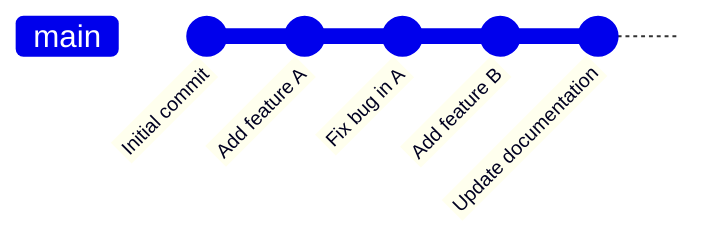
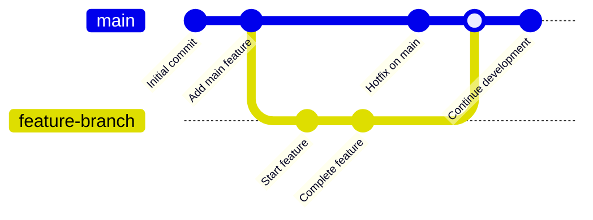
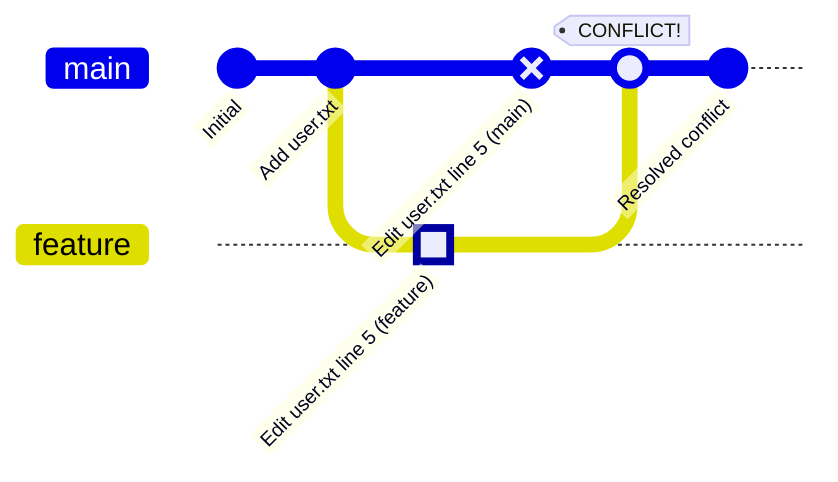
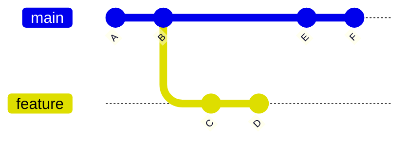
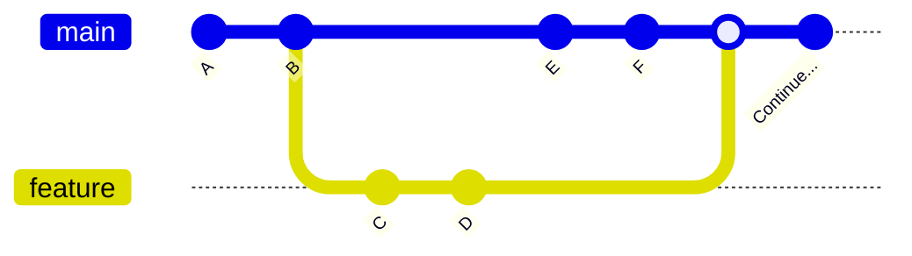
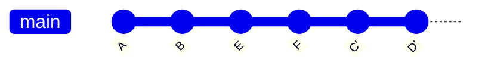
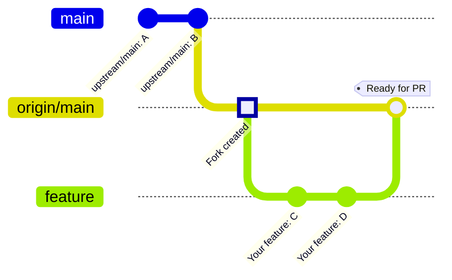
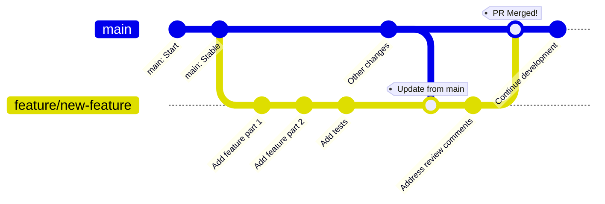

# 🔀 Git & GitHub Reference Guide

This guide is divided into two main parts:

* **Part 1:** Git - The version control system itself
* **Part 2:** GitHub - The hosting platform and how it relates to Git

---

## PART 1: GIT - The Version Control System

**Git** is a free, open-source distributed version control system. It is a standalone software tool that runs entirely on your local machine and does not require any external service or internet connection.

### 📖 What is Git?

Git stands for **Goddamn idiotic truckload of 💩** 😂

Git is a **local version control system** that:

* Tracks changes in files over time
* Maintains complete project history
* Allows branching and merging of code
* Works completely offline
* Is distributed (every clone is a full backup)
* Was created by Linus Torvalds in 2005

**Important:** Git is software you install on your computer. It has no built-in knowledge of GitHub, GitLab, or any hosting service.

---

## 🚀 Installing Git

```bash
# Ubuntu/Debian
sudo apt update
sudo apt install git

# Fedora/RHEL
sudo dnf install git

# macOS (with Homebrew)
brew install git

# Verify installation
git --version
```

---

## ⚙️ Git Configuration

### Initial Setup (Required)

```bash
# Set your identity (required for every commit)
git config --global user.name "Your Name"
git config --global user.email "your.email@example.com"

# Set default branch name
git config --global init.defaultBranch main

# Set default editor
git config --global core.editor "vim"

# Or, you can set your default editor to VSCODE
git config --global core.editor "code --wait"

# Set merge tool 
git config --global merge.tool vimdiff

# Also, you can set the merge editor to VSCODE
git config --global merge.tool vscode
git config --global mergetool.vscode.cmd "code --wait $MERGED"

# Enable colored output
git config --global color.ui auto
```

### View Configuration

```bash
# View all configuration
git config --list

# View global configuration
git config --global --list

# View specific setting
git config user.name
git config user.email

# View where settings are defined
git config --list --show-origin
```

### Configuration Levels

Git has three configuration levels:

```bash
# System level (all users on the machine)
git config --system setting.name "value"

# Global level (your user account)
git config --global setting.name "value"

# Local level (current repository only)
git config --local setting.name "value"
```

**Priority:** Local > Global > System

---

## 📂 Creating Repositories

**⚠️ Important Note:** Always check if a repository is already initialized before creating a new one by running `git status`

### Initialize a New Repository

```bash
# Initialize Git in current directory
git init

# Create new directory and initialize
git init my-project
cd my-project

# Check status
git status
```

### Clone a Repository

```bash
# Clone from a local path
git clone /path/to/repository

# Clone from a network location (if accessible)
git clone user@server:/path/to/repository

# Clone to specific directory name
git clone /path/to/repository my-folder

# Shallow clone (only recent history)
git clone --depth 1 /path/to/repository
```

---

## 📊 Git Workflow - The Three States

Every file in Git can be in one of three states:

```text
Working Directory  →  Staging Area  →  Repository
   (Modified)          (Staged)         (Committed)
```

* **Working Directory:** Where you modify files
* **Staging Area (Index):** Where you prepare files for commit
* **Repository (.git directory):** Where Git stores committed snapshots

### Visual Workflow



The diagram above shows how commits build upon each other in a linear history. Each commit represents a snapshot saved in the repository after changes have moved through: **Working Directory** → `git add` → **Staging Area** → `git commit` → **Repository**.

---

## 📝 Basic Git Operations

### Checking Status

```bash
# View repository status
git status

# Short format
git status -s

# Show branch info
git status -b
```

### Adding Files to Staging

```bash
# Add specific file
git add <filename.txt>

# Add all files in current directory
git add .

# Add all changes (including deletions)
git add -A

# Using wild character to stage all the (e.g.) .js files
git add *.js

# Add files interactively [by asking you if you want to continue]
git add -i
```

The output will be like this:

```bash
username@user:~/myfolder/$ git add -i
           staged     unstaged path
  1:    unchanged        +4/-4 Git.md

*** Commands ***
  1: status       2: update       3: revert       4: add untracked
  5: patch        6: diff         7: quit         8: help
What now> q
Bye.
```

```bash
# Add parts of a file
git add -p <filename.txt>
```

### Removing from Staging

```bash
# Unstage specific file
git reset HEAD <filename.txt>

# Unstage all files
git reset HEAD

# Modern syntax
git restore --staged <filename.txt>
```

### Committing Changes

```bash
# Commit staged changes
git commit -m "Your commit message"

# Add and commit in one step (tracked files only)
git commit -a -m "Message"
```

> **💡 Tip:** If you use `git commit` without any flags, your default editor will open, allowing you to write a multi-line commit message. The default editor is **VIM**, for which you can find an introduction in the **VIM Editor Reference Guide** page. Alternatively, you can change your default editor to VS Code for convenience, as explained in the configuration section above.

```bash
# Commit with multi-line message
git commit

# Amend last commit [only for the last commit done by you]
git commit --amend -m "Updated message"

# Commit with detailed message
git commit -m "Short summary" -m "Detailed description"
```

---

## 📜 Viewing History

### Git Log

```bash
# View commit history
git log

# One line per commit
git log --oneline

# Show branch graph
git log --graph --oneline --all

# Show diffs
git log -p

# Show statistics
git log --stat

# Limit number of commits
git log -n 5

# Filter by date
git log --since="2 weeks ago"
git log --until="2023-12-31"
git log --after="2023-01-01" --before="2023-12-31"

# Filter by author
git log --author="John"

# Search commit messages
git log --grep="bug fix"

# Show commits affecting a file
git log -- filename.txt
```

### Show Commits

```bash
# Show latest commit
git show

# Show specific commit
git show commit-hash

# Show specific file from a commit
git show commit-hash:path/to/file.txt

# Show commit relative to HEAD
git show HEAD~1    # Previous commit
git show HEAD~3    # 3 commits ago
git show HEAD^     # Parent of HEAD
```

---

## 🔍 Viewing Differences

```bash
# Changes in working directory (unstaged)
git diff

# Changes in staging area (staged)
git diff --staged
git diff --cached

# All changes (staged and unstaged)
git diff HEAD

# Compare two commits
git diff commit1 commit2

# Compare branches
git diff branch1 branch2

# Compare specific file
git diff filename.txt

# Word-level diff
git diff --word-diff
```

---

## 🌿 Branching and Merging

### Understanding Branches

Branches allow you to diverge from the main line of development and work independently.

### Visual: Basic Branching and Merging



This diagram shows:

1. Creating a new branch (`feature-branch`) from `main`
2. Making commits on the feature branch
3. Meanwhile, `main` continues with its own commits
4. Merging the feature branch back into `main`

```bash
# List all local branches
git branch

# List all branches (including remote-tracking)
git branch -a

# List remote-tracking branches
git branch -r

# Show current branch
git branch --show-current
```

### Creating and Switching Branches

```bash
# Create new branch
git branch feature-branch

# Switch to branch
git checkout feature-branch

# Create and switch in one command
git checkout -b feature-branch

# Modern syntax (Git 2.23+)
git switch feature-branch
git switch -c feature-branch

# Create branch from specific commit
git branch new-branch commit-hash
```

### Renaming Branches

```bash
# Rename current branch
git branch -m new-name

# Rename specific branch
git branch -m old-name new-name
```

### Deleting Branches

```bash
# Delete merged branch
git branch -d branch-name

# Force delete branch
git branch -D branch-name
```

### Merging Branches

```bash
# Merge branch into current branch
git merge feature-branch

# Merge with no fast-forward (always create merge commit)
git merge --no-ff feature-branch

# Squash commits into one
git merge --squash feature-branch

# Abort merge
git merge --abort
```

### Handling Merge Conflicts

When Git cannot automatically merge changes, you need to resolve conflicts manually.

### Visual: How Merge Conflicts Occur



This diagram shows a conflict scenario:

* Both `main` and `feature` branches modified the same line in `user.txt`
* When merging, Git cannot decide which change to keep
* You must manually resolve the conflict before completing the merge

```bash
# When conflict occurs:
# 1. View conflicted files
git status

# 2. Edit files to resolve conflicts (remove conflict markers)

# 3. Mark as resolved
git add conflicted-file.txt

# 4. Complete the merge
git commit
```

---

## 🏷️ Tagging

Tags are used to mark specific points in history (usually releases).

```bash
# List all tags
git tag

# Create lightweight tag
git tag v1.0.0

# Create annotated tag (recommended)
git tag -a v1.0.0 -m "Version 1.0.0"

# Tag specific commit
git tag -a v1.0.0 commit-hash -m "Message"

# Show tag details
git show v1.0.0

# Delete tag
git tag -d v1.0.0

# List tags matching pattern
git tag -l "v1.*"
```

When you pull a repo, you can fetch the desired tags to your local machine.

```bash
git clone <repository>

# Fetch all the tags [you can also fetch a specifi tag name if you know in advance]
git fetch --tags

# Check waht are the available tags
git tag

# Checkout the specific tag in "Detached HEAD" mode
git checkout <tag_name>
```

---

## 🔄 Undoing Changes

### Discard Changes in Working Directory

```bash
# Discard changes to specific file
git checkout -- filename.txt

# Modern syntax
git restore filename.txt

# Discard all changes
git checkout -- .
git restore .
```

### Unstage Files

```bash
# Unstage file
git reset HEAD filename.txt
git restore --staged filename.txt
```

### Undo Commits

```bash
# Undo last commit, keep changes staged
git reset --soft HEAD~1

# Undo last commit, keep changes unstaged (default)
git reset HEAD~1
git reset --mixed HEAD~1

# Undo last commit, discard all changes
git reset --hard HEAD~1

# Undo multiple commits
git reset --hard HEAD~3
```

### Revert Commits

```bash
# Create new commit that undoes a commit (safe for shared repos)
git revert commit-hash

# Revert last commit
git revert HEAD

# Revert multiple commits
git revert commit1 commit2 commit3
```

---

## 💾 Stashing Changes

Stashing saves your work-in-progress without committing.

```bash
# Stash changes
git stash

# Stash with message
git stash push -m "Work in progress on feature X"

# Include untracked files
git stash -u

# Include ignored files
git stash -a

# List stashes
git stash list

# Show stash contents
git stash show
git stash show -p    # Show as diff

# Apply latest stash
git stash apply

# Apply and remove latest stash
git stash pop

# Apply specific stash
git stash apply stash@{2}

# Create branch from stash
git stash branch new-branch

# Drop specific stash
git stash drop stash@{1}

# Clear all stashes
git stash clear
```

---

## 🔄 Rebasing

**⚠️ Important Note:** Rebasing can be dangerous. If you are not confident with Git, do not use **rebasing**.

Rebasing rewrites commit history by moving commits to a new base.

### Visual: Merge vs Rebase

**Before (Common History):**



**After Merge (Creates merge commit):**



**After Rebase (Linear history):**



Notice how rebase replays commits C and D on top of F, creating new commits C' and D' with different commit hashes. This is why it's dangerous for shared branches!

### Why Rebasing Can Be Dangerous

**The Golden Rule: Never rebase commits that have been pushed to a shared repository!**

Rebasing changes commit hashes (rewrites history), which causes problems when:

1. **Collaborators have your commits**: If others have pulled your commits, rebasing creates duplicate commits with different hashes, causing confusion and merge conflicts.

2. **Loss of commit history**: Rebasing can make it difficult to track when changes were actually made, as timestamps change.

3. **Merge conflicts**: If conflicts occur during rebase, you must resolve them for each commit being rebased (potentially many times).

4. **Destructive operation**: Unlike merge, rebase can lose information about when parallel development happened.

**Safe usage:**

* ✅ Rebase your **local** commits before pushing
* ✅ Rebase your feature branch onto updated main before creating a pull request
* ❌ **Never** rebase commits that exist on a remote branch others are using
* ❌ **Never** rebase the main/master branch

```bash
# Rebase current branch onto main
git rebase main

# Interactive rebase (last 3 commits)
git rebase -i HEAD~3

# Continue after resolving conflicts
git rebase --continue

# Skip current commit
git rebase --skip

# Abort rebase
git rebase --abort
```

**Warning:** Never rebase commits that have been pushed to a shared repository!

---

## 🍒 Cherry Picking

Apply specific commits from one branch to another.

```bash
# Apply single commit
git cherry-pick commit-hash

# Apply multiple commits
git cherry-pick commit1 commit2

# Apply without committing
git cherry-pick --no-commit commit-hash

# Abort cherry-pick
git cherry-pick --abort
```

---

## 🧹 Cleaning Repository

```bash
# Show what would be removed (dry run)
git clean -n

# Remove untracked files
git clean -f

# Remove untracked files and directories
git clean -fd

# Remove ignored files too
git clean -fx
```

---

## 🔍 Searching in Git

```bash
# Search for string in working directory
git grep "search term"

# Search in specific commit
git grep "search term" commit-hash

# Search and show line numbers
git grep -n "search term"

# Search for commits that added/removed a string
git log -S "search term"

# Search commit messages
git log --grep="bug fix"
```

---

## 📊 Git Information Commands

```bash
# Show commit that last modified each line
git blame filename.txt

# Show commit log for a file
git log --follow filename.txt

# Show who changed what and when
git log -p filename.txt

# Show all commits that touched a file
git log --all -- filename.txt

# Show file content at specific commit
git show commit-hash:filename.txt

# List files in a commit
git show --name-only commit-hash
```

---

## 🛠️ Advanced Git Configuration

### Git Aliases

Git aliases are custom shortcuts that let you create abbreviated commands for frequently used Git operations. They save time and reduce typing.

**Why use aliases?**

* **Efficiency**: Type less, work faster
* **Consistency**: Standardize commands across your workflow
* **Customization**: Create commands that match your working style
* **Complex commands**: Simplify long command chains into short aliases

**How aliases work:**

When you create an alias like `st` for `status`, Git translates `git st` into `git status` automatically.

#### Creating Aliases

```bash
# Basic syntax
git config --global alias.<alias-name> '<git-command>'

# Common useful aliases
git config --global alias.st status
git config --global alias.co checkout
git config --global alias.br branch
git config --global alias.ci commit
git config --global alias.unstage 'reset HEAD --'
git config --global alias.last 'log -1 HEAD'
git config --global alias.lg 'log --oneline --graph --decorate --all'

# Alias for viewing visual history
git config --global alias.visual '!gitk'

# More advanced aliases
git config --global alias.uncommit 'reset --soft HEAD~1'
git config --global alias.amend 'commit --amend --no-edit'
git config --global alias.aliases "config --get-regexp '^alias\.'"
```

#### Using Aliases

```bash
# After creating alias.st for status
git st                    # Same as: git status

# After creating alias.lg for fancy log
git lg                    # Same as: git log --oneline --graph --decorate --all

# After creating alias.uncommit
git uncommit             # Same as: git reset --soft HEAD~1
```

#### External Command Aliases

Use `!` to run external commands (not just Git commands):

```bash
# Open gitk visual tool
git config --global alias.visual '!gitk'

# Create a complex alias with shell commands
git config --global alias.contributors "!git log --format='%aN' | sort -u"

# List all aliases
git config --global alias.aliases "config --get-regexp '^alias\.'"
```

#### Viewing and Removing Aliases

```bash
# List all your aliases
git config --global --get-regexp alias

# View specific alias
git config --global alias.st

# Remove an alias
git config --global --unset alias.st
```

#### Practical Alias Examples

```bash
# Quick status
git config --global alias.s 'status -s'

# Pretty log
git config --global alias.lg "log --graph --pretty=format:'%Cred%h%Creset -%C(yellow)%d%Creset %s %Cgreen(%cr) %C(bold blue)<%an>%Creset' --abbrev-commit"

# Show branches with last commit
git config --global alias.branches 'branch -v'

# Undo last commit but keep changes
git config --global alias.undo 'reset HEAD~1 --mixed'

# List contributors
git config --global alias.who 'shortlog -sn'

# Show recent branches
git config --global alias.recent 'branch --sort=-committerdate'
```

---

### Global Ignore File (.gitignore)

The `.gitignore` file tells Git which files to ignore and not track. A **global gitignore** applies to all repositories on your computer.

**Why use .gitignore?**

* **Keep repositories clean**: Don't commit temporary or generated files
* **Security**: Prevent accidentally committing sensitive data (passwords, API keys)
* **Reduce noise**: Hide OS-specific files and IDE configurations
* **Team collaboration**: Everyone sees only relevant files

**Two types of .gitignore:**

1. **Local .gitignore**: In each repository, affects only that project
2. **Global .gitignore**: On your system, affects all repositories

#### Creating Global .gitignore

```bash
# Set up global gitignore file
git config --global core.excludesfile ~/.gitignore_global

# Create the file if it doesn't exist
touch ~/.gitignore_global
```

#### Common Global Ignore Patterns

```bash
# macOS system files
echo ".DS_Store" >> ~/.gitignore_global
echo ".AppleDouble" >> ~/.gitignore_global
echo ".LSOverride" >> ~/.gitignore_global

# Vim swap files
echo "*.swp" >> ~/.gitignore_global
echo "*.swo" >> ~/.gitignore_global
echo "*~" >> ~/.gitignore_global

# VS Code settings (if you don't want to share)
echo ".vscode/" >> ~/.gitignore_global

# JetBrains IDEs (IntelliJ, PyCharm, etc.)
echo ".idea/" >> ~/.gitignore_global

# Node.js
echo "node_modules/" >> ~/.gitignore_global
echo "npm-debug.log" >> ~/.gitignore_global

# Python
echo "__pycache__/" >> ~/.gitignore_global
echo "*.pyc" >> ~/.gitignore_global
echo ".pytest_cache/" >> ~/.gitignore_global
echo "*.egg-info/" >> ~/.gitignore_global

# Environment variables
echo ".env" >> ~/.gitignore_global
echo ".env.local" >> ~/.gitignore_global

# OS generated files
echo "Thumbs.db" >> ~/.gitignore_global
echo "Desktop.ini" >> ~/.gitignore_global

# Log files
echo "*.log" >> ~/.gitignore_global

# Temporary files
echo "*.tmp" >> ~/.gitignore_global
echo "*.temp" >> ~/.gitignore_global
```

#### Local .gitignore (Per Repository)

Create a `.gitignore` file in your repository root:

```bash
# Create .gitignore in project
touch .gitignore

# Add project-specific ignores
echo "config/secrets.yml" >> .gitignore
echo "build/" >> .gitignore
echo "dist/" >> .gitignore
echo "coverage/" >> .gitignore
```

#### .gitignore Pattern Syntax

```bash
# Ignore specific file
filename.txt

# Ignore all files with extension
*.log

# Ignore directory
node_modules/
build/

# Ignore files in specific directory
logs/*.log

# Ignore files in all subdirectories
**/temp

# Negative pattern (don't ignore)
!important.log

# Ignore files only in root
/config.json

# Comments
# This is a comment
```

#### Example Complete .gitignore

```gitignore
# Dependencies
node_modules/
vendor/

# Build outputs
dist/
build/
*.exe
*.dll

# Logs
logs/
*.log

# Environment
.env
.env.local
.env.production

# IDE
.vscode/
.idea/
*.sublime-*

# OS files
.DS_Store
Thumbs.db

# Test coverage
coverage/
.nyc_output/

# Temporary
*.tmp
*.swp
*~
```

#### Checking What's Ignored

```bash
# Check if file is ignored
git check-ignore -v filename.txt

# List all ignored files
git status --ignored

# See which .gitignore rule is ignoring a file
git check-ignore -v path/to/file
```

#### Untrack Already Committed Files

If you added `.gitignore` after committing files:

```bash
# Remove from Git but keep locally
git rm --cached filename.txt

# Remove entire directory
git rm -r --cached directory/

# Then commit
git commit -m "Remove ignored files from tracking"
```

**💡 Best Practice:** Create your global `.gitignore` when first setting up Git, and add project-specific patterns to each repository's local `.gitignore`.

---

## 🆘 Git Troubleshooting

### Recover Lost Commits

```bash
# Show reference log
git reflog

# Checkout lost commit
git checkout commit-hash

# Create branch from lost commit
git branch recovered-branch commit-hash
```

### Fix Detached HEAD

```bash
# Create branch from current position
git branch temp-branch

# Or switch back to a branch
git switch main
```

### Remove File from History

```bash
# Remove file from all commits (use carefully!)
git filter-branch --tree-filter 'rm -f passwords.txt' HEAD
```

---

## 📚 Git Best Practices

1. **Commit Often:** Make small, focused commits
2. **Write Clear Messages:** Explain what and why, not how
3. **Use Branches:** Keep main branch stable
4. **Review Before Commit:** Check `git diff` before staging
5. **Pull Before Push:** Always sync before sharing changes
6. **Never Rebase Public History:** Only rebase local commits
7. **Use .gitignore:** Don't commit generated or sensitive files
8. **Tag Releases:** Mark important milestones

### Good Commit Message Format

```text
Short summary (50 chars or less)

More detailed explanation if needed. Wrap at 72 characters.
Explain what changed and why, not how.

- Bullet points are okay
- Use present tense: "Fix bug" not "Fixed bug"
```

---

## PART 2: GITHUB - The Hosting Platform

**GitHub** is a web-based platform that provides hosting for Git repositories. It is **NOT** Git itself - it's a service built around Git.

### 🌐 What is GitHub?

GitHub is:

* A **hosting service** for Git repositories
* A **web interface** for Git
* A **collaboration platform** with additional features
* **One of many** Git hosting options (GitLab, Bitbucket are alternatives)

**Important:** GitHub requires Git, but Git does NOT require GitHub.

---

## 🔗 How Git and GitHub Work Together

```text
Your Computer (Git)  ←→  GitHub Servers (Git + Web Interface)
    Local Repo       ←→  Remote Repo (called "origin")
```

* **Git:** Manages version control on your computer
* **GitHub:** Stores a copy of your repository online and adds collaboration features

---

## 🔐 Connecting Git to GitHub

### Authentication Methods

#### 1. HTTPS (Username + Personal Access Token)

```bash
# Clone with HTTPS
git clone https://github.com/username/repository.git

# GitHub will prompt for credentials
# Username: your-username
# Password: your-personal-access-token (not your GitHub password!)
```

#### 2. SSH (Recommended for frequent use)

```bash
# Generate SSH key
ssh-keygen -t ed25519 -C "your.email@example.com"

# Start SSH agent
eval "$(ssh-agent -s)"

# Add key to agent
ssh-add ~/.ssh/id_ed25519

# Copy public key
cat ~/.ssh/id_ed25519.pub

# Add this key to GitHub: Settings → SSH and GPG keys → New SSH key

# Test connection
ssh -T git@github.com

# Clone with SSH
git clone git@github.com:username/repository.git
```

---

## 🌍 Working with Remote Repositories

### Remote Basics

```bash
# View remotes
git remote
git remote -v

# Add remote
git remote add origin https://github.com/username/repo.git

# Change remote URL
git remote set-url origin git@github.com:username/repo.git

# Remove remote
git remote remove origin

# Rename remote
git remote rename origin upstream

# Show remote details
git remote show origin
```

### 🔄 Getting Latest Updates from Remote

If you want to get the latest updates from the cloud (GitHub, GitLab, Bitbucket, etc.), you need to run:

```bash
# Prune remote references (remove outdated remote-tracking branches)
git remote prune origin
# or
git remote -p
```

**⚠️ Important Authentication Note:**

Check your remote URL first:

```bash
git remote -v
```

If the result shows URLs starting with `https://...` for both fetch and push, it means you are using HTTPS and not SSH keys. In such cases, you need to provide username and password/token to perform commands, or switch to SSH authentication.

**To switch from HTTPS to SSH:**

```bash
# Example: Change from HTTPS to SSH
git remote set-url origin git@github.com:username/repo.git

# For your specific example:
git remote set-url origin git@github.com:imecsafebot/RH.git
```

**Benefits of SSH over HTTPS:**

* No need to enter credentials repeatedly
* More secure authentication
* Works seamlessly with automated scripts
* No need to manage personal access tokens

### Pushing to GitHub

```bash
# Push current branch
git push

# Push specific branch
git push origin main

# Push and set upstream (first time)
git push -u origin main

# Push all branches
git push --all

# Push tags
git push --tags

# Force push (dangerous - overwrites remote)
git push --force

# Safer force push
git push --force-with-lease
```

### Pulling from GitHub

```bash
# Fetch and merge
git pull

# Fetch without merge
git fetch

# Pull specific branch
git pull origin main

# Pull with rebase
git pull --rebase
```

### Fetching vs Pulling

```bash
# FETCH: Download changes but don't merge
git fetch origin
# Your local branches are unchanged
# Remote-tracking branches are updated

# PULL: Fetch + Merge
git pull origin main
# Same as:
git fetch origin
git merge origin/main
```

---

## 🍴 GitHub Forking Workflow

### Working with Forks

Forking creates a personal copy of someone else's repository on GitHub. This is the standard workflow for contributing to open-source projects.

### Visual: Fork Workflow



This diagram represents:

* **Top line:** Original repository (upstream)
* **Middle line:** Your forked repository (origin)
* **Bottom line:** Your feature branch where you make changes
* After completing your feature, you push to your fork and create a PR to upstream

```bash
# 1. Fork repository on GitHub web interface

# 2. Clone YOUR fork
git clone git@github.com:YOUR-USERNAME/repo.git
cd repo

# 3. Add original repo as "upstream"
git remote add upstream git@github.com:ORIGINAL-OWNER/repo.git

# 4. Verify remotes
git remote -v
# origin    -> your fork
# upstream  -> original repo

# 5. Keep your fork updated
git fetch upstream
git checkout main
git merge upstream/main
git push origin main
```

---

## 🔀 GitHub Pull Request Workflow

### Creating a Pull Request

A Pull Request (PR) is a GitHub feature that lets you propose changes to a repository and request that they be reviewed and merged.

### Visual: Complete PR Workflow



This workflow shows:

1. Create a feature branch from `main`
2. Make commits on your feature branch
3. Optionally update your branch with latest `main` changes
4. Address code review feedback with additional commits
5. After approval, merge the PR into `main`
6. Delete the feature branch and continue development

```bash
# 1. Create feature branch
git checkout -b feature/new-feature

# 2. Make changes and commit
git add .
git commit -m "Add new feature"

# 3. Push to YOUR fork
git push origin feature/new-feature

# 4. Go to GitHub and create Pull Request

# 5. After PR is merged, update your main
git checkout main
git pull upstream main

# 6. Delete feature branch
git branch -d feature/new-feature
git push origin --delete feature/new-feature
```

---

## 🏷️ Working with Tags on GitHub

```bash
# Create tag locally
git tag -a v1.0.0 -m "Release version 1.0.0"

# Push single tag to GitHub
git push origin v1.0.0

# Push all tags to GitHub
git push origin --tags

# Delete tag locally
git tag -d v1.0.0

# Delete tag from GitHub
git push origin --delete v1.0.0
```

---

## 📦 GitHub-Specific Features

### Issues

* **Bug Reports:** Track bugs and problems
* **Feature Requests:** Suggest new features
* **Task Lists:** Track work items
* **Labels:** Categorize issues (bug, enhancement, documentation)
* **Milestones:** Group issues for releases
* **Assignees:** Assign responsibility

### Projects

* **Kanban Boards:** Visual project management
* **Automation:** Move cards based on events
* **Integration:** Link to issues and PRs

### GitHub Actions

* **CI/CD:** Automated testing and deployment
* **Workflows:** Define custom automation
* **Triggers:** Run on push, PR, schedule, etc.

### GitHub Pages

* **Static Site Hosting:** Free hosting for static websites
* **Custom Domains:** Use your own domain
* **Jekyll Integration:** Built-in static site generator

### Other Features

* **Wiki:** Project documentation
* **Discussions:** Community conversations
* **Security Alerts:** Vulnerability notifications
* **Code Review:** Line-by-line commenting
* **Branch Protection:** Enforce workflow rules
* **Releases:** Package and distribute software

---

## 🤝 Collaboration on GitHub

### Branch Protection Rules

On GitHub web interface, you can:

* Require pull request reviews
* Require status checks to pass
* Require conversation resolution
* Require signed commits
* Lock branches

### Code Review Process

```bash
# 1. Team member creates PR

# 2. Reviewers comment on code

# 3. Author makes changes
git checkout feature-branch
git add .
git commit -m "Address review comments"
git push origin feature-branch

# 4. After approval, merge PR on GitHub

# 5. Delete branch
git push origin --delete feature-branch
```

---

## 📊 GitHub vs Git Command Comparison

| Action | Git (Local) | GitHub (Remote) |
|--------|-------------|-----------------|
| Create repo | `git init` | Click "New repository" on GitHub |
| View history | `git log` | Navigate to "Commits" tab |
| View branches | `git branch` | Navigate to "Branches" tab |
| Merge branches | `git merge` | Create and merge Pull Request |
| Create release | `git tag` | Create Release on GitHub |
| Collaboration | Email patches | Pull Requests, Issues |
| Code review | Local review | GitHub PR interface |
| Backup | `git clone` to another location | Automatic cloud backup |

---

## 🆘 Common GitHub Issues

### Push Rejected

```bash
# Error: Updates were rejected because the remote contains work that you do not have

# Solution: Pull first, then push
git pull --rebase origin main
git push origin main
```

### Authentication Failed

```bash
# For HTTPS: Use Personal Access Token, not password
# Generate token: GitHub Settings → Developer settings → Personal access tokens

# For SSH: Check key is added to GitHub
ssh -T git@github.com
```

### Conflict in Pull Request

```bash
# Update your branch with latest main
git checkout your-feature-branch
git fetch upstream
git merge upstream/main

# Resolve conflicts
# ... edit files ...
git add .
git commit -m "Resolve merge conflicts"

# Push updated branch
git push origin your-feature-branch
```

---

## 📚 GitHub Best Practices

1. **Use Descriptive Repo Names:** Clear and specific
2. **Write Good README:** Explain what, why, how
3. **Use .gitignore:** Don't commit unnecessary files
4. **Create Branches:** Use feature branches for development
5. **Write Good PR Descriptions:** Explain changes clearly
6. **Respond to Reviews:** Address feedback promptly
7. **Keep Main Clean:** Only merge tested, working code
8. **Use Issues:** Track work and discussions
9. **Tag Releases:** Mark stable versions
10. **Secure Your Account:** Enable 2FA, use SSH keys

---

## 🎯 Git vs GitHub Summary

### Git (Version Control System)

* **What:** Software tool for version control
* **Where:** Runs on your local computer
* **Internet:** Not required
* **Cost:** Free and open-source
* **Alternatives:** Mercurial, SVN (but Git is industry standard)

### GitHub (Hosting Platform)

* **What:** Web-based Git repository hosting service
* **Where:** Cloud servers (github.com)
* **Internet:** Required
* **Cost:** Free for public repos, paid for private features
* **Alternatives:** GitLab, Bitbucket, Gitea, self-hosted Git servers

### The Relationship

```text
Git = Car (gets you from A to B)
GitHub = Parking garage + car wash + repair shop (extra services)

You can use Git without GitHub.
You cannot use GitHub without Git.
```

---
