# 🇨➕➕ Programming Guide

<!-- ## 📋 Table of Contents

- [🇨➕➕ Programming Guide](#-programming-guide)
  - [📋 Table of Contents](#-table-of-contents)
  - [1. Variables and Constants](#1-variables-and-constants)
    - [Why Use Variables and Constants?](#why-use-variables-and-constants)
    - [Variable Declaration](#variable-declaration)
    - [Constants](#constants)
  - [2. Arrays and Vectors](#2-arrays-and-vectors)
    - [Why Arrays vs Vectors?](#why-arrays-vs-vectors)
    - [C-Style Arrays](#c-style-arrays)
    - [std::array (C++11)](#stdarray-c11)
    - [std::vector](#stdvector)
  - [3. Statements and Operators](#3-statements-and-operators)
    - [Why Understand Operators?](#why-understand-operators)
    - [Arithmetic Operators](#arithmetic-operators)
    - [Comparison Operators](#comparison-operators)
    - [Logical Operators](#logical-operators)
    - [Bitwise Operators](#bitwise-operators)
    - [Ternary Operator](#ternary-operator)
  - [4. Controlling Program Flow](#4-controlling-program-flow)
    - [Why Control Flow?](#why-control-flow)
    - [Conditional Statements](#conditional-statements)
      - [if-else](#if-else)
      - [switch Statement](#switch-statement)
    - [Loops](#loops)
      - [for Loop](#for-loop)
      - [while Loop](#while-loop)
      - [do-while Loop](#do-while-loop)
    - [Loop Control](#loop-control)
    - [Modern Control Flow (C++17)](#modern-control-flow-c17)
      - [if with initializer](#if-with-initializer)
  - [5. Characters and Strings](#5-characters-and-strings)
    - [Why Different String Types?](#why-different-string-types)
    - [Characters](#characters)
    - [C-Style Strings (Character Arrays)](#c-style-strings-character-arrays)
    - [std::string (Modern C++)](#stdstring-modern-c)
    - [String Streams](#string-streams)
    - [String Iteration](#string-iteration)
    - [Why Use std::string?](#why-use-stdstring)
  - [6. Functions](#6-functions)
    - [Why Use Functions?](#why-use-functions)
    - [Function Structure](#function-structure)
    - [Function Declaration vs Definition](#function-declaration-vs-definition)
    - [Parameter Passing](#parameter-passing)
      - [Pass by Value (Copy)](#pass-by-value-copy)
      - [Pass by Reference](#pass-by-reference)
      - [Pass by Const Reference](#pass-by-const-reference)
      - [Pass by Pointer](#pass-by-pointer)
    - [Function Overloading](#function-overloading)
    - [Default Arguments](#default-arguments)
    - [Inline Functions](#inline-functions)
    - [Lambda Functions (C++11)](#lambda-functions-c11)
    - [Return Values](#return-values)
    - [Function Pointers (Advanced)](#function-pointers-advanced)
  - [7. Pointers and References](#7-pointers-and-references)
    - [Why Pointers and References?](#why-pointers-and-references)
    - [Understanding Memory](#understanding-memory)
    - [Pointers - The Basics](#pointers---the-basics)
      - [What is a Pointer?](#what-is-a-pointer)
      - [Key Operators](#key-operators)
    - [Pointer Declaration and Initialization](#pointer-declaration-and-initialization)
    - [Null Pointers and Safety](#null-pointers-and-safety)
    - [Pointers and Arrays](#pointers-and-arrays)
    - [Dynamic Memory Allocation](#dynamic-memory-allocation)
      - [new and delete](#new-and-delete)
      - [Smart Pointers (C++11) - PREFER THESE](#smart-pointers-c11---prefer-these)
    - [References - The Safe Alternative](#references---the-safe-alternative)
      - [What is a Reference?](#what-is-a-reference)
      - [References vs Pointers](#references-vs-pointers)
      - [When to Use References](#when-to-use-references)
    - [Const with Pointers and References](#const-with-pointers-and-references)
    - [Double Pointers (Pointers to Pointers)](#double-pointers-pointers-to-pointers)
    - [Common Pitfalls and Best Practices](#common-pitfalls-and-best-practices)
      - [1. Memory Leaks](#1-memory-leaks)
      - [2. Dangling Pointers](#2-dangling-pointers)
      - [3. Null Pointer Dereference](#3-null-pointer-dereference)
      - [4. Mismatched new/delete](#4-mismatched-newdelete)
    - [Summary: Pointers vs References](#summary-pointers-vs-references)
  - [8. Object-Oriented Programming (OOP)](#8-object-oriented-programming-oop)
    - [Why OOP?](#why-oop)
    - [Classes and Objects](#classes-and-objects)
      - [Basic Class Structure](#basic-class-structure)
    - [Access Specifiers](#access-specifiers)
    - [Constructors - CRITICAL TOPIC](#constructors---critical-topic)
      - [Default Constructor](#default-constructor)
      - [Parameterized Constructor](#parameterized-constructor)
      - [Constructor Overloading](#constructor-overloading)
      - [The explicit Keyword - ESSENTIAL TOPIC](#the-explicit-keyword---essential-topic)
        - [The Problem: Implicit Conversions](#the-problem-implicit-conversions)
        - [The Solution: explicit Keyword](#the-solution-explicit-keyword)
        - [When to Use explicit](#when-to-use-explicit)
        - [Explicit with Multiple Parameters (C++11)](#explicit-with-multiple-parameters-c11)
        - [Real-World Examples](#real-world-examples)
          - [Example 1: File Handle (explicit is CRITICAL)](#example-1-file-handle-explicit-is-critical)
          - [Example 2: Vector (explicit prevents logic errors)](#example-2-vector-explicit-prevents-logic-errors)
          - [Example 3: Smart Pointer Wrapper](#example-3-smart-pointer-wrapper)
        - [Explicit Conversion Operators (C++11)](#explicit-conversion-operators-c11)
        - [Summary Table: explicit Usage](#summary-table-explicit-usage)
        - [Best Practices - The explicit Rule](#best-practices---the-explicit-rule)
        - [Memory Aid: When to Use explicit](#memory-aid-when-to-use-explicit)
        - [Quick Reference - explicit Syntax](#quick-reference---explicit-syntax)
      - [Copy Constructor](#copy-constructor)
      - [Move Constructor (C++11)](#move-constructor-c11)
    - [The Rule of Three/Five/Zero - ESSENTIAL](#the-rule-of-threefivezero---essential)
    - [Destructor - Memory Management](#destructor---memory-management)
    - [Inheritance](#inheritance)
      - [Basic Inheritance](#basic-inheritance)
    - [Polymorphism - Runtime Flexibility](#polymorphism---runtime-flexibility)
    - [Virtual Destructor - ESSENTIAL](#virtual-destructor---essential)
    - [Abstract Classes and Interfaces](#abstract-classes-and-interfaces)
    - [Static Members](#static-members)
    - [Const Member Functions](#const-member-functions)
  - [9. Operator Overloading](#9-operator-overloading)
    - [Why Overload Operators?](#why-overload-operators)
    - [Basic Operator Overloading](#basic-operator-overloading)
    - [Member vs Non-Member Operators](#member-vs-non-member-operators)
      - [Member Function (Left operand is \*this)](#member-function-left-operand-is-this)
      - [Non-Member Friend Function (Symmetric operations)](#non-member-friend-function-symmetric-operations)
    - [Comparison Operators (overloaded)](#comparison-operators-overloaded)
    - [Assignment Operator - CRITICAL](#assignment-operator---critical)
    - [Stream Operators (\<\<, \>\>)](#stream-operators--)
    - [Subscript Operator \[\]](#subscript-operator-)
    - [Function Call Operator () - Functors](#function-call-operator----functors)
    - [Increment/Decrement Operators](#incrementdecrement-operators)
    - [Arrow Operator -\> (Smart Pointers)](#arrow-operator---smart-pointers)
    - [Type Conversion Operators](#type-conversion-operators)
    - [Operators You CANNOT Overload](#operators-you-cannot-overload)
    - [Best Practices and Pitfalls](#best-practices-and-pitfalls)
      - [**DO**](#do)
      - [**DON'T**](#dont)
    - [Complete Example - Vector Class](#complete-example---vector-class)
  - [10. Exception Handling and Error Management](#10-exception-handling-and-error-management)
    - [Why Exception Handling?](#why-exception-handling)
    - [Basic Exception Handling: try-catch-throw](#basic-exception-handling-try-catch-throw)
      - [Throwing Exceptions](#throwing-exceptions)
      - [Catching Exceptions](#catching-exceptions)
      - [Exception Propagation](#exception-propagation)
    - [Standard Exception Types](#standard-exception-types)
    - [Custom Exceptions](#custom-exceptions)
    - [Exception Specifications: noexcept](#exception-specifications-noexcept)
    - [RAII and Exception Safety](#raii-and-exception-safety)
    - [Modern Error Handling (C++23)](#modern-error-handling-c23)
      - [std::expected - Deterministic Error Handling](#stdexpected---deterministic-error-handling)
      - [Complete Example with std::expected](#complete-example-with-stdexpected)
    - [Enumerations for Error Codes](#enumerations-for-error-codes)
      - [Basic Enums](#basic-enums)
      - [Enum Classes (C++11) - PREFERRED](#enum-classes-c11---preferred)
      - [Enum with String Conversion](#enum-with-string-conversion)
      - [Using Enums with std::expected](#using-enums-with-stdexpected)
      - [Error Code Class Pattern](#error-code-class-pattern)
    - [Exception Handling Best Practices](#exception-handling-best-practices)
      - [DO ✅](#do-)
      - [DON'T ❌](#dont-)
      - [Exception Safety Guidelines](#exception-safety-guidelines)
  - [11. Quick Reference](#11-quick-reference) -->

---

## 1. Variables and Constants

### Why Use Variables and Constants?

- **Variables**: Store data that can change during program execution
- **Constants**: Store immutable values, preventing accidental modification and improving code safety
- **Type Safety**: C++ is statically typed, catching errors at compile-time

### Variable Declaration

```cpp
// Basic types
int age = 25;                    // Integer
double price = 19.99;            // Floating-point
char grade = 'A';                // Single character
bool isActive = true;            // Boolean
std::string name = "John";       // String (requires <string>)

// Type inference (C++11)
auto count = 42;                 // Compiler deduces int
auto pi = 3.14159;               // Compiler deduces double
```

### Constants

```cpp
// const keyword - runtime constant
const int MAX_USERS = 100;
const double PI = 3.14159;

// constexpr - compile-time constant (C++11)
constexpr int BUFFER_SIZE = 1024;
constexpr double calculate() { return 2.5 * 4; }

// #define (legacy, avoid in modern C++)
#define MAX_SIZE 100             // Preprocessor macro (no type safety)
```

**When to use:**

- `const`: Value known at runtime, type-safe
- `constexpr`: Value known at compile-time, enables optimizations
- `#define`: Rarely needed in modern C++

---

## 2. Arrays and Vectors

### Why Arrays vs Vectors?

- **Arrays**: Fixed-size, stack-allocated, faster access, less flexible
- **Vectors**: Dynamic-size, heap-allocated, flexible, STL container with safety features

### C-Style Arrays

```cpp
// Fixed size determined at compile-time
int numbers[5] = {1, 2, 3, 4, 5};
int matrix[3][3];                // 2D array

// Access
numbers[0] = 10;
int first = numbers[0];

// Size must be constant
const int SIZE = 10;
int buffer[SIZE];
```

**Limitations**:

- No bounds checking
- Size is fixed
- Doesn't know its own size
- Decays to pointer when passed to functions

### std::array (C++11)

```cpp
#include <array>

// Modern alternative to C-style arrays
std::array<int, 5> numbers = {1, 2, 3, 4, 5};

// Benefits
numbers.size();                  // Knows its size
numbers.at(0);                   // Bounds-checked access
```

### std::vector

```cpp
#include <vector>

// Dynamic size
std::vector<int> numbers;        // Empty vector
std::vector<int> nums = {1, 2, 3, 4, 5};
std::vector<int> data(10);       // 10 elements, default-initialized
std::vector<int> filled(10, 5);  // 10 elements, all set to 5

// Dynamic operations
nums.push_back(6);               // Add to end
nums.pop_back();                 // Remove from end
nums.insert(nums.begin(), 0);    // Insert at beginning
nums.clear();                    // Remove all elements
int size = nums.size();          // Get size

// Access
nums[2] = 100;                   // Unchecked access (fast)
nums.at(2) = 100;                // Checked access (throws exception)

// Iteration
for (int num : nums) {           // Range-based for (C++11)
    std::cout << num << " ";
}
```

**Use vectors when:**

- Size is unknown or changes
- Need automatic memory management
- Want bounds checking and safety features

---

## 3. Statements and Operators

### Why Understand Operators?

Operators define how data is manipulated. Understanding precedence and types prevents bugs and enables expressive code.

### Arithmetic Operators

```cpp
int a = 10, b = 3;

int sum = a + b;         // 13 - Addition
int diff = a - b;        // 7  - Subtraction
int prod = a * b;        // 30 - Multiplication
int quot = a / b;        // 3  - Integer division (truncates)
int rem = a % b;         // 1  - Modulo (remainder)

double x = 10.0, y = 3.0;
double result = x / y;   // 3.333... - Floating-point division

// Compound assignment
a += 5;                  // a = a + 5
a *= 2;                  // a = a * 2

// Increment/Decrement
int i = 5;
i++;                     // Post-increment: use then increment
++i;                     // Pre-increment: increment then use
```

### Comparison Operators

```cpp
int x = 10, y = 20;

bool equal = (x == y);        // false - Equal to
bool notEqual = (x != y);     // true  - Not equal to
bool less = (x < y);          // true  - Less than
bool lessEq = (x <= y);       // true  - Less than or equal
bool greater = (x > y);       // false - Greater than
bool greaterEq = (x >= y);    // false - Greater than or equal
```

### Logical Operators

```cpp
bool a = true, b = false;

bool andResult = a && b;      // false - Logical AND
bool orResult = a || b;       // true  - Logical OR
bool notResult = !a;          // false - Logical NOT

// Short-circuit evaluation
if (ptr != nullptr && ptr->value > 0) {
    // Second condition only evaluated if ptr is not null
}
```

### Bitwise Operators

```cpp
int a = 5;    // Binary: 0101
int b = 3;    // Binary: 0011

int andBit = a & b;     // 1 (0001) - Bitwise AND
int orBit = a | b;      // 7 (0111) - Bitwise OR
int xorBit = a ^ b;     // 6 (0110) - Bitwise XOR
int notBit = ~a;        // -6 (inverts all bits)
int leftShift = a << 1; // 10 (1010) - Left shift
int rightShift = a >> 1;// 2 (0010) - Right shift
```

**Use bitwise operators for:**

- Performance-critical code
- Flag management
- Low-level hardware programming

### Ternary Operator

```cpp
// condition ? value_if_true : value_if_false
int max = (a > b) ? a : b;
std::string status = (age >= 18) ? "Adult" : "Minor";
```

---

## 4. Controlling Program Flow

### Why Control Flow?

Control structures determine the order of execution, enabling decision-making, repetition, and non-linear program flow.

### Conditional Statements

#### if-else

```cpp
int score = 85;

if (score >= 90) {
    std::cout << "Grade: A";
} else if (score >= 80) {
    std::cout << "Grade: B";
} else if (score >= 70) {
    std::cout << "Grade: C";
} else {
    std::cout << "Grade: F";
}

// Single line (braces optional but recommended)
if (isActive)
    processData();
```

#### switch Statement

```cpp
char operation = '+';

switch (operation) {
    case '+':
        result = a + b;
        break;                // Prevents fall-through
    case '-':
        result = a - b;
        break;
    case '*':
        result = a * b;
        break;
    case '/':
        if (b != 0)
            result = a / b;
        break;
    default:
        std::cout << "Invalid operation";
        break;
}
```

**Use switch when:**

- Multiple discrete values to check
- Better readability than many if-else
- Only works with integral/enum types

### Loops

#### for Loop

```cpp
// Traditional for loop - when iteration count is known
for (int i = 0; i < 10; i++) {
    std::cout << i << " ";
}

// Range-based for loop (C++11) - iterate over containers
std::vector<int> numbers = {1, 2, 3, 4, 5};
for (int num : numbers) {
    std::cout << num << " ";
}

// With reference (modify elements)
for (int& num : numbers) {
    num *= 2;
}

// With const reference (read-only, no copy)
for (const auto& item : collection) {
    process(item);
}
```

#### while Loop

```cpp
// Condition checked before execution
int count = 0;
while (count < 5) {
    std::cout << count << " ";
    count++;
}

// Useful when iteration count unknown
while (std::cin >> input && input != "quit") {
    processInput(input);
}
```

#### do-while Loop

```cpp
// Executes at least once, then checks condition
int choice;
do {
    std::cout << "Menu:\n1. Option 1\n2. Option 2\n3. Exit\n";
    std::cin >> choice;
    processChoice(choice);
} while (choice != 3);
```

**Use do-while when:** Body must execute at least once (e.g., menus, validation)

### Loop Control

```cpp
// break - exit loop immediately
for (int i = 0; i < 100; i++) {
    if (i == 50)
        break;              // Exit loop when i is 50
}

// continue - skip to next iteration
for (int i = 0; i < 10; i++) {
    if (i % 2 == 0)
        continue;           // Skip even numbers
    std::cout << i << " "; // Only prints odd numbers
}
```

### Modern Control Flow (C++17)

#### if with initializer

```cpp
// Declare variable in if statement scope
if (auto result = calculate(); result > 0) {
    // result is only accessible here
    std::cout << result;
}
```

---

## 5. Characters and Strings

### Why Different String Types?

- **char**: Single character (1 byte)
- **C-strings**: Legacy, null-terminated character arrays
- **std::string**: Modern, safe, feature-rich string class

### Characters

```cpp
#include <cctype>

char ch = 'A';
char digit = '5';
char newline = '\n';      // Escape sequence
char tab = '\t';

// Character functions (cctype)
bool isLetter = std::isalpha(ch);      // true
bool isDigit = std::isdigit(ch);       // false
bool isUpper = std::isupper(ch);       // true
char lower = std::tolower(ch);         // 'a'
char upper = std::toupper('b');        // 'B'
bool isSpace = std::isspace(' ');      // true
```

### C-Style Strings (Character Arrays)

```cpp
#include <cstring>

// Null-terminated character array
char str1[20] = "Hello";
char str2[] = "World";    // Size calculated automatically

// String functions (cstring)
int len = std::strlen(str1);           // Length
std::strcpy(str1, str2);               // Copy str2 to str1
std::strcat(str1, str2);               // Concatenate
int cmp = std::strcmp(str1, str2);     // Compare (0 if equal)
```

**Problems with C-strings:**

- Buffer overflow risks
- Manual memory management
- No bounds checking
- Tedious manipulation

### std::string (Modern C++)

```cpp
#include <string>

// Creation and initialization
std::string empty;
std::string name = "Alice";
std::string repeated(5, 'x');          // "xxxxx"
std::string copy = name;               // Deep copy

// Basic operations
int length = name.length();            // or name.size()
bool isEmpty = name.empty();
name.clear();                          // Empty the string

// Access
char first = name[0];                  // Unchecked
char last = name.at(name.length()-1);  // Checked (throws if out of range)
char front = name.front();             // First character
char back = name.back();               // Last character

// Modification
name += " Smith";                      // Append
name.append(" Jr.");                   // Append
name.insert(0, "Dr. ");                // Insert at position
name.erase(0, 4);                      // Erase from position
name.replace(0, 5, "Bob");             // Replace substring

// Searching
size_t pos = name.find("ice");         // Find substring (returns position)
if (pos != std::string::npos) {
    // Found
}
size_t last = name.rfind('a');         // Find from end

// Substring
std::string sub = name.substr(0, 5);   // Extract substring

// Comparison
bool equal = (name == "Alice");
bool less = (name < "Bob");            // Lexicographic comparison

// Conversion
std::string num = std::to_string(42);  // Number to string
int value = std::stoi("123");          // String to int
double d = std::stod("3.14");          // String to double

// Input/Output
std::cin >> name;                      // Reads until whitespace
std::getline(std::cin, name);          // Reads entire line
```

### String Streams

```cpp
#include <sstream>

// Parse strings
std::string data = "123 45.6 hello";
std::istringstream iss(data);
int a;
double b;
std::string c;
iss >> a >> b >> c;                    // a=123, b=45.6, c="hello"

// Build strings
std::ostringstream oss;
oss << "Value: " << 42 << ", Pi: " << 3.14;
std::string result = oss.str();
```

### String Iteration

```cpp
std::string text = "Hello";

// Index-based
for (size_t i = 0; i < text.length(); i++) {
    std::cout << text[i] << " ";
}

// Iterator-based
for (auto it = text.begin(); it != text.end(); ++it) {
    std::cout << *it << " ";
}

// Range-based (modern, preferred)
for (char c : text) {
    std::cout << c << " ";
}

// Modify with reference
for (char& c : text) {
    c = std::toupper(c);               // Convert to uppercase
}
```

### Why Use std::string?

- Automatic memory management
- Safe operations with bounds checking
- Rich set of member functions
- Intuitive operators (+, ==, <, etc.)
- Compatible with C++ STL algorithms
- Better performance than manual C-string manipulation

---

## 6. Functions

### Why Use Functions?

Functions are fundamental building blocks that:

- **Modularity**: Break complex problems into manageable pieces
- **Reusability**: Write once, use many times
- **Abstraction**: Hide implementation details
- **Testing**: Easier to test isolated units
- **Maintainability**: Changes in one place affect all usages

### Function Structure

```cpp
// return_type function_name(parameter_type parameter_name) {
//     function body
//     return value;
// }

int add(int a, int b) {
    return a + b;
}

void printMessage(std::string msg) {
    std::cout << msg << std::endl;
    // void functions don't return a value
}
```

### Function Declaration vs Definition

```cpp
// Declaration (prototype) - tells compiler function exists
int multiply(int a, int b);

int main() {
    int result = multiply(5, 3);  // Can use before definition
    return 0;
}

// Definition - actual implementation
int multiply(int a, int b) {
    return a * b;
}
```

**Why separate declaration and definition?**

- Allows functions to call each other (circular dependencies)
- Header files contain declarations, source files contain definitions
- Improves compilation time (header changes don't require recompiling everything)

### Parameter Passing

#### Pass by Value (Copy)

```cpp
void increment(int x) {
    x++;  // Modifies local copy only
}

int main() {
    int num = 5;
    increment(num);
    // num is still 5 - original unchanged
}
```

**Use when:**

- Value is small (int, char, bool)
- Don't want to modify original
- Function needs its own copy

**Cost**: Creates copy - expensive for large objects

#### Pass by Reference

```cpp
void increment(int& x) {
    x++;  // Modifies original
}

int main() {
    int num = 5;
    increment(num);
    // num is now 6 - original modified
}
```

**Use when:**

- Need to modify original
- Avoid copying large objects
- Want to return multiple values through parameters

**Benefits**: No copy, direct access to original

#### Pass by Const Reference

```cpp
void display(const std::string& str) {
    std::cout << str;  // Can read but not modify
    // str += "!";     // ERROR: can't modify const
}

int main() {
    std::string msg = "Hello";
    display(msg);  // No copy made, efficient
}
```

**Use when (VERY COMMON):**

- Don't need to modify parameter
- Object is large (string, vector, custom objects)
- Want efficiency without side effects

**Best Practice**: Default choice for non-primitive types as parameters

#### Pass by Pointer

```cpp
void increment(int* ptr) {
    if (ptr != nullptr) {  // Must check for null
        (*ptr)++;
    }
}

int main() {
    int num = 5;
    increment(&num);  // Pass address
    // num is now 6
}
```

**Use when:**

- Optional parameter (can be nullptr)
- Working with C APIs
- Need pointer arithmetic
- Array parameters

### Function Overloading

```cpp
// Same name, different parameters
int add(int a, int b) {
    return a + b;
}

double add(double a, double b) {
    return a + b;
}

int add(int a, int b, int c) {
    return a + b + c;
}

// Compiler chooses based on arguments
int x = add(5, 3);           // Calls int version
double y = add(5.5, 3.2);    // Calls double version
int z = add(1, 2, 3);        // Calls three-parameter version
```

**Why overload?**

- Same operation on different types
- Intuitive interface
- Type safety maintained

**Cannot overload based on return type alone!**

### Default Arguments

```cpp
void greet(std::string name, std::string greeting = "Hello") {
    std::cout << greeting << ", " << name << "!" << std::endl;
}

int main() {
    greet("Alice");              // Uses default: "Hello, Alice!"
    greet("Bob", "Hi");          // Uses provided: "Hi, Bob!"
}

// Multiple defaults - must be rightmost parameters
void configure(int x, int y = 0, int z = 0);
configure(5);       // x=5, y=0, z=0
configure(5, 10);   // x=5, y=10, z=0
```

### Inline Functions

```cpp
inline int square(int x) {
    return x * x;
}

// Suggests compiler replace call with function body
// int result = square(5); becomes int result = 5 * 5;
```

**Use for:**

- Very small, frequently called functions
- Performance-critical code
- Similar to macros but type-safe

**Note**: Modern compilers auto-inline when beneficial, so `inline` is often just a hint

### Lambda Functions (C++11)

```cpp
// Anonymous functions - functions without names
auto add = [](int a, int b) {
    return a + b;
};

int result = add(5, 3);  // 8

// Capture variables from surrounding scope
int multiplier = 3;
auto multiply = [multiplier](int x) {
    return x * multiplier;
};

int value = multiply(5);  // 15

// Common with STL algorithms
std::vector<int> nums = {1, 2, 3, 4, 5};
std::for_each(nums.begin(), nums.end(), [](int n) {
    std::cout << n * 2 << " ";  // Doubles each number
});

// Capture modes:
// [] - capture nothing
// [=] - capture all by value
// [&] - capture all by reference
// [x] - capture x by value
// [&x] - capture x by reference
// [x, &y] - x by value, y by reference
```

**Use lambdas when:**

- Short, one-off functions
- Callbacks and event handlers
- STL algorithms (sort, find_if, transform)
- Don't need function name

### Return Values

```cpp
// Single return value
int calculate() {
    return 42;
}

// Return reference (BE CAREFUL!)
int& getElement(std::vector<int>& vec, int index) {
    return vec[index];  // Safe - vec exists outside function
}

// DANGER: Don't return reference to local variable!
int& dangerous() {
    int local = 5;
    return local;  // BAD! local destroyed after return
}

// Return by value (modern C++ optimizes this)
std::vector<int> createVector() {
    std::vector<int> result = {1, 2, 3};
    return result;  // Move semantics - efficient in C++11+
}

// Multiple return values (C++17 structured bindings)
std::tuple<int, double, std::string> getMultiple() {
    return {42, 3.14, "hello"};
}

auto [num, pi, text] = getMultiple();  // Unpack all three
```

### Function Pointers (Advanced)

```cpp
// Pointer to function
int add(int a, int b) { return a + b; }
int subtract(int a, int b) { return a - b; }

int (*operation)(int, int);  // Declare function pointer

operation = add;
int result1 = operation(5, 3);  // 8

operation = subtract;
int result2 = operation(5, 3);  // 2

// Used for callbacks and strategy patterns
void applyOperation(int a, int b, int (*op)(int, int)) {
    std::cout << op(a, b) << std::endl;
}

applyOperation(10, 5, add);       // 15
applyOperation(10, 5, subtract);  // 5
```

---

## 7. Pointers and References

### Why Pointers and References?

This is one of C++'s most powerful but dangerous features:

- **Direct Memory Access**: Manipulate memory addresses directly
- **Efficiency**: Avoid copying large data structures
- **Dynamic Memory**: Allocate memory at runtime
- **Data Structures**: Build linked lists, trees, graphs
- **Polymorphism**: Enable dynamic dispatch in OOP

**The Trade-off**: Great power, great responsibility - memory leaks, dangling pointers, and segmentation faults are common pitfalls.

### Understanding Memory

```cpp
int x = 42;

// x stores the value 42
// x has a memory address (location in RAM)
// Example: if x is at address 0x7ffee4, that's where 42 is stored
```

### Pointers - The Basics

#### What is a Pointer?

A pointer is a variable that **stores a memory address**.

```cpp
int value = 42;
int* ptr = &value;  // ptr holds the address of value

// Breakdown:
// int*  - "pointer to int" type
// ptr   - pointer variable name
// &     - address-of operator
// &value - "address of value"
```

#### Key Operators

```cpp
int x = 10;
int* ptr = &x;

// & (address-of) - get address of variable
std::cout << &x;     // Prints memory address (e.g., 0x7ffee4)

// * (dereference) - access value at address
std::cout << *ptr;   // Prints 10 (value at address ptr points to)

// Modify through pointer
*ptr = 20;           // x is now 20
```

**Memory Visualization:**


**After `*ptr = 20;`:**


**Key Concepts:**

- `ptr` stores the **address** of `x` (0x100)
- `*ptr` **dereferences** the pointer to access/modify the value at that address
- `&x` gives the **address-of** operator to get where `x` lives in memory
- Modifying `*ptr` modifies `x` because they refer to the same memory location

### Pointer Declaration and Initialization

```cpp
// Declaration
int* ptr1;           // Uninitialized - DANGEROUS!
int* ptr2 = nullptr; // C++11 - proper null pointer (ALWAYS initialize!)

// Good practice - initialize to nullptr
int* ptr = nullptr;

// Later assign
int x = 5;
ptr = &x;

// Multiple pointers (be careful with syntax)
int* p1, *p2;        // Both pointers
int *p3, p4;         // p3 is pointer, p4 is int (confusing!)
int* p5; int* p6;    // Clearer - separate lines
```

**CRITICAL**: Always initialize pointers! Uninitialized pointers contain garbage addresses and cause crashes.

### Null Pointers and Safety

```cpp
int* ptr = nullptr;

// ALWAYS check before dereferencing
if (ptr != nullptr) {
    std::cout << *ptr;  // Safe
}

// Dereferencing null pointer = CRASH
int* bad = nullptr;
*bad = 5;              // Segmentation fault / Access violation
```

**nullptr vs NULL vs 0:**

- `nullptr` (C++11+): Type-safe, always use this
- `NULL`: Macro, often defined as 0, can cause issues
- `0`: Plain integer, confusing

### Pointers and Arrays

```cpp
int arr[5] = {10, 20, 30, 40, 50};
int* ptr = arr;  // Array name is pointer to first element

// Pointer arithmetic
std::cout << *ptr;       // 10 (first element)
std::cout << *(ptr + 1); // 20 (second element)
std::cout << *(ptr + 2); // 30 (third element)

// Equivalent notations
arr[2] == *(arr + 2) == *(ptr + 2) == ptr[2]  // All access third element

// Incrementing pointer
ptr++;                   // Points to next element
std::cout << *ptr;       // 20
```

**Memory Visualization:**


**After `ptr++` (Pointer Arithmetic):**


**Key Points:**

- Arrays are stored contiguously in memory
- Each `int` takes 4 bytes (addresses increment by 4)
- `ptr + 1` moves to the **next element**, not next byte
- `ptr++` advances pointer by `sizeof(int)` bytes

**Warning**: Pointer arithmetic doesn't check bounds! Easy to access invalid memory.

### Dynamic Memory Allocation

#### new and delete

```cpp
// Allocate single int on heap
int* ptr = new int;        // Uninitialized
int* ptr2 = new int(42);   // Initialized to 42

*ptr = 10;
std::cout << *ptr;

// MUST delete to avoid memory leak
delete ptr;
ptr = nullptr;  // Good practice - prevent dangling pointer

// Allocate array
int* arr = new int[100];   // Array of 100 ints

// Use the array
for (int i = 0; i < 100; i++) {
    arr[i] = i;
}

// MUST use delete[] for arrays
delete[] arr;
arr = nullptr;
```

**Memory Visualization - Dynamic Allocation:**


**After `delete ptr;` and `ptr = nullptr;`:**

```mermaid
graph TB
    subgraph "Stack Memory"
        P1["ptr<br/>Address: 0x100<br/>Value: nullptr (0x0)"]
        P2["arr<br/>Address: 0x104<br/>Value: 0x6000"]
    end
    
    subgraph "Heap Memory"
        H1["FREED<br/>Address: 0x5000<br/>❌ Invalid"]
        H2["new int[100]<br/>Address: 0x6000<br/>Values: 0,1,2...99"]
    end
    
    P1 -.->|"null (safe)"| H1
    P2 -.->|"still points to heap"| H2
    
    style P1 fill:#e1ffe1,stroke:#333,stroke-width:2px
    style P2 fill:#ffe1e1,stroke:#333,stroke-width:2px
    style H1 fill:#ffcccc,stroke:#333,stroke-width:3px,stroke-dasharray: 5 5
    style H2 fill:#fff4e1,stroke:#333,stroke-width:2px
```



**Key Concepts:**

- **Stack**: Holds pointer variables (automatic lifetime)
- **Heap**: Holds dynamically allocated memory (manual lifetime)
- `new` allocates on heap, returns address
- `delete` frees heap memory
- Setting to `nullptr` after delete prevents dangling pointer
- Heap memory persists until explicitly deleted

**Memory Leak Example:**

```cpp
void leaky() {
    int* ptr = new int(42);
    // Function ends, ptr goes away, but memory not freed
    // Lost that memory forever (until program exits)
}
```

**Memory Leak Visualization:**

```mermaid
graph TB
    subgraph "Before function ends"
        S1["Stack: ptr<br/>Value: 0x5000"]
        H1["Heap: 0x5000<br/>Value: 42"]
        S1 -.-> H1
    end
    
    subgraph "After function ends"
        H2["Heap: 0x5000<br/>Value: 42<br/>⚠️ LEAKED<br/>(no pointer to it)"]
    end
    
    style S1 fill:#ffe1e1,stroke:#333,stroke-width:2px
    style H1 fill:#fff4e1,stroke:#333,stroke-width:2px
    style H2 fill:#ff6666,stroke:#333,stroke-width:3px
```



**Dangling Pointer Example:**

```cpp
int* ptr = new int(42);
delete ptr;
// ptr still holds the address, but memory is freed
*ptr = 10;  // DANGER! Accessing freed memory
```

**Dangling Pointer Visualization:**

```mermaid
graph TB
    subgraph "After delete ptr"
        S["Stack: ptr<br/>Value: 0x5000<br/>⚠️ DANGLING"]
        H["Heap: 0x5000<br/>❌ FREED<br/>(invalid memory)"]
        S -.->|"points to freed memory"| H
    end
    
    subgraph "Safe: After ptr = nullptr"
        S2["Stack: ptr<br/>Value: nullptr (0x0)<br/>✓ SAFE"]
    end
    
    style S fill:#ff6666,stroke:#333,stroke-width:3px
    style H fill:#ffcccc,stroke:#333,stroke-width:3px,stroke-dasharray: 5 5
    style S2 fill:#66ff66,stroke:#333,stroke-width:2px
```



#### Smart Pointers (C++11) - PREFER THESE

```cpp
#include <memory>

// unique_ptr - single owner
std::unique_ptr<int> ptr1 = std::make_unique<int>(42);
std::cout << *ptr1;  // Use like regular pointer
// Automatically deleted when ptr1 goes out of scope - NO memory leak!

// Cannot copy, can only move ownership
// std::unique_ptr<int> ptr2 = ptr1;  // ERROR
std::unique_ptr<int> ptr2 = std::move(ptr1);  // OK - transfer ownership
// ptr1 is now nullptr

// shared_ptr - multiple owners, reference counted
std::shared_ptr<int> sp1 = std::make_shared<int>(100);
std::shared_ptr<int> sp2 = sp1;  // Both own the same int
// Memory freed when last shared_ptr is destroyed

std::cout << sp1.use_count();  // 2 - two owners

// weak_ptr - non-owning reference (breaks circular references)
std::weak_ptr<int> wp = sp1;
```

**When to use:**

- `unique_ptr`: Single ownership, most common case (default choice)
- `shared_ptr`: Multiple owners, reference counting overhead
- `weak_ptr`: Break circular references in shared_ptr
- Raw pointers: Only when necessary (C APIs, non-owning pointers)

### References - The Safe Alternative

#### What is a Reference?

A reference is an **alias** (another name) for an existing variable.

```cpp
int x = 10;
int& ref = x;  // ref is another name for x

ref = 20;      // x is now 20
x = 30;        // ref is now 30

// They are the SAME variable
std::cout << &x;    // Memory address
std::cout << &ref;  // SAME memory address
```

**Reference Visualization:**


**After `ref = 20;`:**


**Reference vs Pointer Memory Comparison:**


#### References vs Pointers

| Feature | Pointer | Reference |
|---------|---------|-----------|
| Can be null? | Yes (nullptr) | No (must bind to object) |
| Can be reassigned? | Yes | No (binds once) |
| Syntax to use | `*ptr` (dereference) | `ref` (direct) |
| Declaration | `int* ptr` | `int& ref` |
| Must initialize? | No (but should!) | Yes (always) |
| Can have array of? | Yes | No |
| Pointer arithmetic? | Yes | No |

```cpp
// Pointer can change what it points to
int x = 10, y = 20;
int* ptr = &x;
ptr = &y;  // Now points to y

// Reference cannot be rebound
int& ref = x;
ref = y;   // This copies y's value to x, doesn't rebind ref!
```

#### When to Use References

```cpp
// Function parameters (avoid copying)
void process(const std::string& str) {
    // Efficient - no copy, can't modify
}

// Return reference to class member
class Container {
    int data[100];
public:
    int& at(int index) {
        return data[index];  // Return reference
    }
};

Container c;
c.at(5) = 42;  // Can modify through reference

// Range-based for loops
std::vector<std::string> names = {"Alice", "Bob"};
for (const auto& name : names) {  // Reference avoids copying strings
    std::cout << name;
}
```

**Use references for:**

- Function parameters (when not nullptr)
- Return values from functions (if object outlives function)
- Aliases to avoid copies
- Operator overloading

**Use pointers for:**

- Optional parameters (can be nullptr)
- Pointer arithmetic (arrays)
- Dynamic memory (prefer smart pointers)
- Data structures (linked lists, trees)
- Reassignment needed

### Const with Pointers and References

```cpp
// Pointer to const - can't modify what it points to
const int* ptr1 = &x;
*ptr1 = 10;  // ERROR
ptr1 = &y;   // OK - can point elsewhere

// Const pointer - can't change what it points to
int* const ptr2 = &x;
*ptr2 = 10;  // OK - can modify value
ptr2 = &y;   // ERROR - can't point elsewhere

// Const pointer to const - can't change either
const int* const ptr3 = &x;
*ptr3 = 10;  // ERROR
ptr3 = &y;   // ERROR

// Const reference (very common in parameters)
const int& ref = x;
// ref = 10;  // ERROR - can't modify

// Memory aid: read right to left
// const int* ptr     = pointer to const int
// int* const ptr     = const pointer to int
// const int* const   = const pointer to const int
```

### Double Pointers (Pointers to Pointers)

```cpp
int x = 42;
int* ptr = &x;      // Pointer to int
int** pptr = &ptr;  // Pointer to pointer to int

std::cout << x;        // 42
std::cout << *ptr;     // 42
std::cout << **pptr;   // 42

// Modify through double pointer
**pptr = 100;          // x is now 100
```

**Double Pointer Visualization:**


**After `**pptr = 100;`:**

```mermaid
graph TD
    subgraph "Stack Memory"
        A["Variable: x<br/>Address: 0x100<br/>Value: 100"]
        B["Pointer: ptr<br/>Address: 0x104<br/>Value: 0x100"]
        C["Pointer: pptr<br/>Address: 0x108<br/>Value: 0x104"]
    end
    
    C -->|"**pptr dereferences<br/>twice to modify x"| B
    B --> A
    
    note["pptr → ptr → x<br/>Double dereference: **pptr<br/>modifies the final value"]
    
    style A fill:#ffe1e1,stroke:#333,stroke-width:3px
    style B fill:#ffe1e1,stroke:#333,stroke-width:2px
    style C fill:#ffe1ff,stroke:#333,stroke-width:2px
    style note fill:#fff9e1,stroke:#333,stroke-width:1px
```



**Use cases:**

- 2D arrays with dynamic allocation
- Modifying pointer in function
- Low-level C interfaces

### Common Pitfalls and Best Practices

#### 1. Memory Leaks

```cpp
// BAD
void leak() {
    int* ptr = new int(42);
    // Forgot to delete
}

// GOOD - Use smart pointers
void noLeak() {
    auto ptr = std::make_unique<int>(42);
    // Automatically cleaned up
}
```

#### 2. Dangling Pointers

```cpp
// BAD
int* getDangling() {
    int local = 42;
    return &local;  // local destroyed after return
}

// GOOD
int* getSafe() {
    int* ptr = new int(42);
    return ptr;  // Caller responsible for deletion
}

// BETTER
std::unique_ptr<int> getBest() {
    return std::make_unique<int>(42);  // Ownership clear
}
```

#### 3. Null Pointer Dereference

```cpp
// BAD
int* ptr = nullptr;
std::cout << *ptr;  // CRASH

// GOOD
if (ptr != nullptr) {
    std::cout << *ptr;
}
```

#### 4. Mismatched new/delete

```cpp
// BAD
int* single = new int(5);
delete[] single;  // Wrong! Should be delete

int* arr = new int[10];
delete arr;       // Wrong! Should be delete[]

// GOOD - use smart pointers to avoid this entirely
auto single = std::make_unique<int>(5);
auto arr = std::make_unique<int[]>(10);
```

### Summary: Pointers vs References

**Use References when:**

- Parameter passing (non-modifiable with const)
- Return values for class members
- Operator overloading
- Value cannot be null
- Don't need to reassign

**Use Smart Pointers when:**

- Dynamic memory allocation
- Optional values (can be null)
- Ownership semantics matter
- Modern C++ (C++11+)

**Use Raw Pointers when:**

- Non-owning pointers (observing only)
- Interfacing with C APIs
- Performance-critical code (rarely needed)
- Array manipulation

**Avoid Raw Pointers + new/delete:** Use smart pointers instead to prevent memory leaks and dangling pointers.

---

## 8. Object-Oriented Programming (OOP)

### Why OOP?

Object-Oriented Programming organizes code around **objects** that combine data and behavior:

- **Encapsulation**: Bundle data and methods, hide implementation details
- **Abstraction**: Simplify complex systems by modeling classes appropriate to the problem
- **Inheritance**: Reuse code by creating hierarchies of classes
- **Polymorphism**: Single interface for different types, runtime flexibility

**The Goal**: Model real-world entities, improve maintainability, and enable code reuse.

### Classes and Objects

#### Basic Class Structure

```cpp
// Class definition
class Rectangle {
private:              // Access specifier
    double width;     // Member variables (data)
    double height;
    
public:
    // Constructor
    Rectangle(double w, double h) : width(w), height(h) {
        // Initialization done in initializer list (preferred)
    }
    
    // Member functions (methods)
    double area() const {           // const = doesn't modify object
        return width * height;
    }
    
    double perimeter() const {
        return 2 * (width + height);
    }
    
    // Setter with validation
    void setWidth(double w) {
        if (w > 0) {
            width = w;
        }
    }
    
    // Getter
    double getWidth() const {
        return width;
    }
};

// Using the class
Rectangle rect(5.0, 3.0);           // Create object (instance)
double a = rect.area();             // Call method: 15.0
rect.setWidth(10.0);                // Modify object
```

**Key Points:**

- Class = blueprint/template
- Object = instance of a class
- Members can be data or functions
- Access specifiers control visibility

### Access Specifiers

```cpp
class Example {
private:
    int privateData;      // Only accessible within class
    void privateMethod(); // Only class methods can call
    
protected:
    int protectedData;    // Accessible in class and derived classes
    
public:
    int publicData;       // Accessible everywhere
    void publicMethod();  // Anyone can call
};
```

**Best Practice:**

- **private**: Default for data members (encapsulation)
- **public**: Interface methods users should access
- **protected**: Data/methods for derived classes

**Why encapsulate?** Control how data is accessed/modified, maintain invariants, allow implementation changes without breaking users.

### Constructors - CRITICAL TOPIC

#### Default Constructor

```cpp
class Point {
private:
    int x, y;
    
public:
    // Default constructor (no parameters)
    Point() : x(0), y(0) {
        // Initializer list preferred over assignment in body
    }
    
    // Can also use in-class initialization (C++11)
    // int x = 0;
    // int y = 0;
};

Point p;  // Calls default constructor
```

#### Parameterized Constructor

```cpp
class Point {
private:
    int x, y;
    
public:
    Point(int xVal, int yVal) : x(xVal), y(yVal) {
        // Initializer list is MORE EFFICIENT than:
        // x = xVal;  // This is assignment, not initialization
        // y = yVal;
    }
};

Point p(10, 20);     // Direct initialization
Point p2 = {5, 10};  // Uniform initialization (C++11)
```

**CRITICAL: Use initializer lists!**

- More efficient (direct initialization vs default + assignment)
- Required for const members and references
- Required for members without default constructors

#### Constructor Overloading

```cpp
class Rectangle {
private:
    double width, height;
    
public:
    // Default constructor
    Rectangle() : width(1.0), height(1.0) {}
    
    // Square constructor (one parameter)
    Rectangle(double side) : width(side), height(side) {}
    
    // Full constructor
    Rectangle(double w, double h) : width(w), height(h) {}
};

Rectangle r1;           // 1x1 rectangle
Rectangle r2(5);        // 5x5 square
Rectangle r3(4, 6);     // 4x6 rectangle
```

#### The explicit Keyword - ESSENTIAL TOPIC

The `explicit` keyword prevents implicit type conversions through constructors, forcing users to explicitly construct objects. This is **CRITICAL** for writing safe, maintainable code.

##### The Problem: Implicit Conversions

```cpp
class String {
private:
    char* data;
    size_t length;
    
public:
    // Constructor that takes size
    String(size_t size) : length(size) {
        data = new char[size + 1];
        data[0] = '\0';
    }
    
    ~String() { delete[] data; }
    
    void print() const {
        std::cout << "String of length: " << length << std::endl;
    }
};

void processString(String str) {
    str.print();
}

int main() {
    String s1(10);          // Direct initialization - OK, intended
    String s2 = 10;         // Implicit conversion - COMPILES! Surprising?
    processString(50);      // Implicit conversion - COMPILES! Very confusing!
    
    // Even worse:
    String s3 = 'A';        // 'A' converts to int (65), then to String(65)
    // Is this what you intended? Probably not!
}
```

**The problem:** The compiler treats single-parameter constructors as **conversion functions**. Any place a `String` is expected, an `int` can be passed, and the compiler silently creates a temporary `String` object.

**Why this is dangerous:**

- Unexpected temporary objects created
- Performance overhead (construction/destruction)
- Logic errors that compile without warnings
- Confusing code - intent is unclear

##### The Solution: explicit Keyword

```cpp
class String {
private:
    char* data;
    size_t length;
    
public:
    // explicit prevents implicit conversions
    explicit String(size_t size) : length(size) {
        data = new char[size + 1];
        data[0] = '\0';
    }
    
    ~String() { delete[] data; }
    
    void print() const {
        std::cout << "String of length: " << length << std::endl;
    }
};

void processString(String str) {
    str.print();
}

int main() {
    String s1(10);              // OK - direct initialization
    
    // String s2 = 10;          // ERROR! Implicit conversion not allowed
    String s2 = String(10);     // OK - explicit construction
    
    // processString(50);       // ERROR! Cannot implicitly convert int to String
    processString(String(50));  // OK - explicitly construct String
    
    // Uniform initialization (C++11) also works
    String s3{10};              // OK - direct initialization
}
```

**Result:** Code is safer, intent is clearer, accidental conversions are prevented.

##### When to Use explicit

**ALWAYS use explicit for single-parameter constructors UNLESS you specifically want implicit conversion.**

```cpp
// Rule of thumb: explicit by default
class Array {
public:
    explicit Array(size_t size);        // ✓ GOOD - prevent implicit conversion
};

class Complex {
public:
    explicit Complex(double real);      // ✓ GOOD - prevent accidental conversion
    Complex(double real, double imag);  // OK - multi-parameter, no implicit conversion
};

// Rare exception: when implicit conversion is desirable
class MyString {
public:
    MyString(const char* str);          // OK - common idiom, intentional
    // MyString s = "hello"; is natural and expected
};
```

##### Explicit with Multiple Parameters (C++11)

Before C++11, `explicit` only worked with single-parameter constructors. C++11 extended it to prevent **braced initialization** conversions.

```cpp
class Point {
private:
    int x, y;
    
public:
    // Without explicit
    Point(int x, int y) : x(x), y(y) {}
};

void process(Point p) {}

int main() {
    Point p1(3, 4);          // OK
    Point p2 = {3, 4};       // OK - implicit conversion via braced init
    process({5, 6});         // OK - implicit conversion
}
```

```cpp
class Point {
private:
    int x, y;
    
public:
    // With explicit
    explicit Point(int x, int y) : x(x), y(y) {}
};

void process(Point p) {}

int main() {
    Point p1(3, 4);          // OK - direct initialization
    Point p2{3, 4};          // OK - direct list initialization
    
    // Point p3 = {3, 4};    // ERROR! Copy-list-initialization not allowed
    // process({5, 6});      // ERROR! Implicit conversion prevented
    
    process(Point{5, 6});    // OK - explicit construction
}
```

##### Real-World Examples

###### Example 1: File Handle (explicit is CRITICAL)

```cpp
class FileHandle {
private:
    int fd;  // File descriptor
    
public:
    // BAD: Without explicit
    FileHandle(int descriptor) : fd(descriptor) {}
    
    void write(const std::string& data) {
        // Write to file...
    }
};

void writeToFile(FileHandle file) {
    file.write("data");
}

int main() {
    // DISASTER: 42 is just a number, not a valid file descriptor!
    writeToFile(42);  // Compiles! Creates FileHandle(42) and crashes at runtime
}
```

```cpp
class FileHandle {
private:
    int fd;
    
public:
    // GOOD: With explicit
    explicit FileHandle(int descriptor) : fd(descriptor) {
        if (descriptor < 0) {
            throw std::invalid_argument("Invalid file descriptor");
        }
    }
    
    void write(const std::string& data) {
        // Write to file...
    }
};

void writeToFile(FileHandle file) {
    file.write("data");
}

int main() {
    // writeToFile(42);              // ERROR! Won't compile
    
    int fd = open("file.txt", O_WRONLY);
    writeToFile(FileHandle(fd));     // OK - intent is clear
}
```

###### Example 2: Vector (explicit prevents logic errors)

```cpp
class Vector {
private:
    double* data;
    size_t size;
    
public:
    // Constructor: size of vector
    explicit Vector(size_t n) : size(n), data(new double[n]) {
        std::fill(data, data + n, 0.0);
    }
    
    // Constructor: initialize with value
    Vector(size_t n, double value) : size(n), data(new double[n]) {
        std::fill(data, data + n, value);
    }
    
    ~Vector() { delete[] data; }
};

void processVector(Vector v) {
    // Process vector...
}

int main() {
    Vector v1(10);              // Vector of size 10
    Vector v2(10, 5.0);         // Vector of size 10, all values 5.0
    
    // processVector(5);        // ERROR! Prevents creating Vector(5) accidentally
    
    processVector(Vector(5));   // OK - explicitly creating Vector of size 5
}
```

###### Example 3: Smart Pointer Wrapper

```cpp
template<typename T>
class Pointer {
private:
    T* ptr;
    
public:
    // Without explicit - DANGEROUS
    Pointer(T* p) : ptr(p) {}
    
    ~Pointer() { delete ptr; }
    T& operator*() { return *ptr; }
    T* operator->() { return ptr; }
};

void usePointer(Pointer<int> p) {
    std::cout << *p << std::endl;
}

int main() {
    int* raw = new int(42);
    
    // DISASTER: Double delete!
    Pointer<int> p1(raw);
    usePointer(raw);  // Creates temporary Pointer(raw), deletes raw
    // p1 destructor tries to delete already-deleted raw - CRASH!
}
```

```cpp
template<typename T>
class Pointer {
private:
    T* ptr;
    
public:
    // With explicit - SAFE
    explicit Pointer(T* p) : ptr(p) {}
    
    ~Pointer() { delete ptr; }
    T& operator*() { return *ptr; }
    T* operator->() { return ptr; }
    
    // Delete copy to enforce unique ownership
    Pointer(const Pointer&) = delete;
    Pointer& operator=(const Pointer&) = delete;
};

void usePointer(Pointer<int> p) {
    std::cout << *p << std::endl;
}

int main() {
    // usePointer(new int(42));  // ERROR! Cannot implicitly convert
    
    usePointer(Pointer<int>(new int(42)));  // OK - explicit, clear ownership
}
```

##### Explicit Conversion Operators (C++11)

The `explicit` keyword also applies to conversion operators, preventing implicit conversions.

```cpp
class SmartPointer {
private:
    int* ptr;
    
public:
    explicit SmartPointer(int* p) : ptr(p) {}
    ~SmartPointer() { delete ptr; }
    
    // Without explicit
    operator bool() const {
        return ptr != nullptr;
    }
};

SmartPointer sp(new int(42));

// Dangerous implicit conversions:
if (sp) {}               // OK - intended
int x = sp;              // Compiles! Converts to bool, then to int (0 or 1)
bool b = sp;             // Compiles
sp + 5;                  // Compiles! Converts to int, adds 5
```

```cpp
class SmartPointer {
private:
    int* ptr;
    
public:
    explicit SmartPointer(int* p) : ptr(p) {}
    ~SmartPointer() { delete ptr; }
    
    // With explicit
    explicit operator bool() const {
        return ptr != nullptr;
    }
};

SmartPointer sp(new int(42));

// Safe - only explicit conversions allowed:
if (sp) {}                           // OK - contextual conversion
// int x = sp;                       // ERROR! No implicit conversion
// bool b = sp;                      // ERROR! No implicit conversion
bool b = static_cast<bool>(sp);     // OK - explicit cast
// sp + 5;                           // ERROR! No implicit conversion
```

##### Summary Table: explicit Usage

| Scenario | Without explicit | With explicit | Recommendation |
|----------|------------------|---------------|----------------|
| `MyClass obj(arg);` | ✓ Compiles | ✓ Compiles | Both work |
| `MyClass obj{arg};` | ✓ Compiles | ✓ Compiles | Both work |
| `MyClass obj = arg;` | ✓ Compiles (implicit) | ✗ Error | Use explicit |
| `func(arg)` where `func(MyClass)` | ✓ Compiles (implicit) | ✗ Error | Use explicit |
| Braced init: `func({arg})` | ✓ Compiles (implicit) | ✗ Error | Use explicit |

##### Best Practices - The explicit Rule

```cpp
// ✓ CORRECT: Default to explicit for constructors
class Container {
public:
    explicit Container(size_t size);
    explicit Container(const std::string& name);
    Container(size_t size, int value);  // OK - multi-param (pre-C++11)
};

// ✓ CORRECT: Explicit conversion operators
class Wrapper {
public:
    explicit operator bool() const;
    explicit operator int() const;
};

// ✗ WRONG: Allowing dangerous implicit conversions
class Buffer {
public:
    Buffer(size_t size);  // BAD - should be explicit!
};

void process(Buffer buf);
process(42);  // Accidentally creates Buffer(42) - probably not intended!

// ✓ EXCEPTION: Natural conversions (rare)
class String {
public:
    String(const char* cstr);  // OK - "hello" to String is natural
};
```

##### Memory Aid: When to Use explicit

**Default Rule:** Mark **ALL** single-parameter constructors as `explicit` unless:

1. The conversion is natural and obvious (e.g., `const char*` to `std::string`)
2. You specifically designed the class to be a transparent wrapper
3. You've carefully considered the implications and documented the decision

**Modern C++ (C++11+):** Also mark multi-parameter constructors as `explicit` to prevent braced-initialization conversions in contexts where they don't make sense.

**Conversion Operators:** Always use `explicit` unless the conversion is trivially safe and obvious.

##### Quick Reference - explicit Syntax

```cpp
class Example {
public:
    // Constructors
    explicit Example(int x);                    // Single parameter
    explicit Example(int x, int y);             // Multiple parameters (C++11)
    explicit Example(std::initializer_list<int> list);  // Initializer list
    
    // Conversion operators
    explicit operator bool() const;             // Conversion to bool
    explicit operator int() const;              // Conversion to int
    explicit operator std::string() const;      // Conversion to string
    
    // Note: explicit has no effect on these:
    Example();                                  // Default constructor
    Example(const Example& other);              // Copy constructor
    Example(Example&& other);                   // Move constructor
};
```

**Key Takeaway:** The `explicit` keyword is a safety feature that prevents surprising implicit conversions. Use it liberally to make your code more robust and intent clearer. When in doubt, make it explicit!

#### Copy Constructor

```cpp
class Array {
private:
    int* data;
    size_t size;
    
public:
    // Constructor
    Array(size_t s) : size(s), data(new int[s]) {}
    
    // Copy constructor - CRITICAL for classes with pointers!
    Array(const Array& other) : size(other.size), data(new int[other.size]) {
        std::copy(other.data, other.data + size, data);  // Deep copy
    }
    
    // Destructor
    ~Array() {
        delete[] data;
    }
};

Array arr1(10);
Array arr2 = arr1;  // Calls copy constructor
Array arr3(arr1);   // Also calls copy constructor
```

**Why needed?** Default copy constructor does **shallow copy** (copies pointer, not data). With dynamic memory, this causes:

- Double deletion (both objects delete same memory)
- Dangling pointers
- Memory corruption

#### Move Constructor (C++11)

```cpp
class Array {
private:
    int* data;
    size_t size;
    
public:
    // Move constructor - "steal" resources from temporary
    Array(Array&& other) noexcept 
        : data(other.data), size(other.size) {
        other.data = nullptr;  // Leave other in valid state
        other.size = 0;
    }
};

Array createArray() {
    return Array(1000);  // Temporary returned
}

Array arr = createArray();  // Move constructor called (efficient!)
```

**Why important?** Avoid expensive copies of temporary objects. Move is O(1), copy can be O(n).

> **💡 Important:** The `this` Pointer. `this` is a reserved keyworkd that contains the address of the current object. Hence, it's a pointer to the object. It can be only used in **class** scope. All the members' access is done via the `this` pointer. It can be used by the programmer
>
> - To access data member and methods
> - To determine if two objects are the same
> - Can be dereferenced (`*this`) to yeild the current object

### Delegating Constructors (C++11)

> **💡 Important:** Constructor delegation is a powerful C++11 feature that eliminates code duplication and ensures consistent initialization across multiple constructors. This is a best practice you should always follow when you have overloaded constructors.

**Why?** Avoid code duplication and ensure consistent initialization across multiple constructors.

**The Problem:** Without delegation, initialization logic is repeated:

```cpp
class Player {
private:
    std::string name;
    int health;
    int xp;

public:
    // Repeated initialization logic in each constructor
    Player() : name{"None"}, health{0}, xp{0} {}
    
    Player(std::string name_val) 
        : name{name_val}, health{0}, xp{0} {}
    
    Player(std::string name_val, int health_val, int xp_val)
        : name{name_val}, health{health_val}, xp{xp_val} {}
};
```

**The Solution:** Delegate to a primary constructor to centralize initialization:

```cpp
class Player {
private:
    std::string name;
    int health;
    int xp;

public:
    // Primary constructor - all initialization logic here
    Player(std::string name_val, int health_val, int xp_val)
        : name{name_val}, health{health_val}, xp{xp_val} {
        // Any validation or additional setup goes here
    }
    
    // Delegating constructors - call the primary constructor
    Player() : Player{"None", 0, 0} {}
    
    Player(std::string name_val) : Player{name_val, 100, 0} {}
};
```

**Benefits:**

- ✅ **No duplication** - Initialization logic in one place
- ✅ **Consistency** - All constructors use the same initialization path
- ✅ **Maintainability** - Changes to initialization only need to be made once
- ✅ **Validation** - Any validation in the primary constructor applies to all

**Important Note:** When using constructor delegation:

- The delegating constructor **cannot** have a member initializer list
- You delegate **OR** initialize members, not both

```cpp
// ❌ WRONG - Cannot mix delegation with initialization
Player() : name{"None"}, Player{"None", 0, 0} {}  // ERROR!

// ✅ CORRECT - Delegation only
Player() : Player{"None", 0, 0} {}
```

### The Rule of Three/Five/Zero - ESSENTIAL

**Rule of Three (C++98):** If you define any of these, define all:

1. Destructor
2. Copy constructor
3. Copy assignment operator

**Rule of Five (C++11):** Add:

4. Move constructor
5. Move assignment operator

**Rule of Zero (Modern C++):** Use smart pointers and RAII (Resource Acquisition Is Initialization), avoid defining any!

```cpp
// BAD - Rule of Three violation
class Bad {
    int* data;
public:
    Bad(int val) : data(new int(val)) {}
    ~Bad() { delete data; }
    // Missing copy constructor and copy assignment!
    // Default shallow copy will cause double delete
};

// GOOD - Rule of Three
class Good {
    int* data;
public:
    Good(int val) : data(new int(val)) {}
    
    ~Good() { delete data; }
    
    Good(const Good& other) : data(new int(*other.data)) {}
    
    Good& operator=(const Good& other) {
        if (this != &other) {  // Self-assignment check
            delete data;
            data = new int(*other.data);
        }
        return *this;
    }
};

// BEST - Rule of Zero (use smart pointers)
class Best {
    std::unique_ptr<int> data;
public:
    Best(int val) : data(std::make_unique<int>(val)) {}
    // Compiler-generated destructor, copy, move all work correctly!
    // Or delete copy operations if move-only:
    Best(const Best&) = delete;
    Best& operator=(const Best&) = delete;
};
```

### Destructor - Memory Management

```cpp
class Resource {
private:
    int* data;
    FILE* file;
    
public:
    Resource() : data(new int[100]) {
        file = fopen("data.txt", "r");
    }
    
    // Destructor - cleanup resources
    ~Resource() {
        delete[] data;      // Free memory
        if (file) {
            fclose(file);   // Close file
        }
    }
};

// Destructor automatically called when object goes out of scope
void function() {
    Resource res;
    // ... use resource ...
}  // ~Resource() called here automatically
```

**CRITICAL:** Destructor is your chance to clean up resources (memory, files, sockets, etc.)

**Destructor rules:**

- No parameters, no return type
- One per class
- Called automatically when object destroyed
- Should never throw exceptions
- Virtual in base classes with virtual functions!

### Inheritance

#### Basic Inheritance

```cpp
// Base class (parent)
class Animal {
protected:
    std::string name;
    
public:
    Animal(const std::string& n) : name(n) {}
    
    void eat() const {
        std::cout << name << " is eating\n";
    }
    
    virtual void makeSound() const {  // virtual = can be overridden
        std::cout << "Some generic sound\n";
    }
    
    virtual ~Animal() {}  // CRITICAL: Virtual destructor!
};

// Derived class (child)
class Dog : public Animal {  // public inheritance
private:
    std::string breed;
    
public:
    Dog(const std::string& n, const std::string& b) 
        : Animal(n), breed(b) {}  // Call base constructor
    
    // Override base method
    void makeSound() const override {  // override keyword (C++11)
        std::cout << name << " barks: Woof!\n";
    }
    
    void wagTail() const {
        std::cout << name << " wags tail\n";
    }
};

// Using inheritance
Dog myDog("Buddy", "Golden Retriever");
myDog.eat();         // Inherited from Animal
myDog.makeSound();   // Overridden in Dog
myDog.wagTail();     // Dog-specific method
```

**Inheritance types:**

- `public`: is-a relationship (Dog **is an** Animal)
- `protected`: rare, used for implementation inheritance
- `private`: implementation detail, not is-a

### Polymorphism - Runtime Flexibility

```cpp
class Shape {
public:
    virtual double area() const = 0;  // Pure virtual (abstract)
    virtual ~Shape() {}
};

class Circle : public Shape {
private:
    double radius;
    
public:
    Circle(double r) : radius(r) {}
    
    double area() const override {
        return 3.14159 * radius * radius;
    }
};

class Rectangle : public Shape {
private:
    double width, height;
    
public:
    Rectangle(double w, double h) : width(w), height(h) {}
    
    double area() const override {
        return width * height;
    }
};

// Polymorphism in action
void printArea(const Shape& shape) {  // Base class reference
    std::cout << "Area: " << shape.area() << std::endl;
}

Circle c(5);
Rectangle r(4, 6);
printArea(c);  // Calls Circle::area()
printArea(r);  // Calls Rectangle::area()

// Also works with pointers
std::vector<std::unique_ptr<Shape>> shapes;
shapes.push_back(std::make_unique<Circle>(3));
shapes.push_back(std::make_unique<Rectangle>(5, 2));

for (const auto& shape : shapes) {
    std::cout << shape->area() << std::endl;  // Runtime polymorphism
}
```

**CRITICAL POINTS:**

1. **Virtual functions**: Enable runtime polymorphism (dynamic dispatch)
2. **Pure virtual** (`= 0`): Makes class abstract (cannot instantiate)
3. **override keyword**: Compiler checks you're actually overriding
4. **Virtual destructor**: MUST have in base classes with virtual functions!

### Virtual Destructor - ESSENTIAL

```cpp
class Base {
public:
    virtual ~Base() {  // Virtual destructor
        std::cout << "Base destructor\n";
    }
};

class Derived : public Base {
private:
    int* data;
    
public:
    Derived() : data(new int[100]) {}
    
    ~Derived() {
        delete[] data;  // Cleanup
        std::cout << "Derived destructor\n";
    }
};

// WHY VIRTUAL DESTRUCTOR IS CRITICAL:
Base* ptr = new Derived();
delete ptr;
// Without virtual destructor: Only ~Base() called - MEMORY LEAK!
// With virtual destructor: ~Derived() then ~Base() called - CORRECT!
```

**Rule:** If class has virtual functions, it MUST have virtual destructor!

### Abstract Classes and Interfaces

```cpp
// Abstract class (has at least one pure virtual function)
class Drawable {
public:
    virtual void draw() const = 0;  // Pure virtual
    virtual ~Drawable() {}
};

// Cannot instantiate abstract class
// Drawable d;  // ERROR

// Interface (all functions pure virtual, no data)
class ISerializable {
public:
    virtual std::string serialize() const = 0;
    virtual void deserialize(const std::string& data) = 0;
    virtual ~ISerializable() {}
};

// Concrete class must implement all pure virtual functions
class Document : public Drawable, public ISerializable {
public:
    void draw() const override {
        // Implementation
    }
    
    std::string serialize() const override {
        return "serialized data";
    }
    
    void deserialize(const std::string& data) override {
        // Implementation
    }
};
```

### Static Members

```cpp
class Counter {
private:
    static int count;  // Shared by ALL objects
    int id;
    
public:
    Counter() : id(++count) {}
    
    static int getCount() {  // Static method
        return count;
        // Can only access static members!
    }
    
    int getId() const {
        return id;
    }
};

// Must define static member outside class
int Counter::count = 0;

Counter c1, c2, c3;
std::cout << Counter::getCount();  // 3 - called on class, not object
```

**Use static for:**

- Data shared across all instances
- Utility functions that don't need object state
- Factory methods

### Const Member Functions

```cpp
class Point {
private:
    int x, y;
    
public:
    Point(int x, int y) : x(x), y(y) {}
    
    // Const member function - promises not to modify object
    int getX() const { return x; }
    int getY() const { return y; }
    
    double distance() const {
        return std::sqrt(x * x + y * y);
    }
    
    // Non-const - can modify
    void setX(int newX) { x = newX; }
    
    // Const overload
    int& at(int index) { return index == 0 ? x : y; }
    const int& at(int index) const { return index == 0 ? x : y; }
};

const Point p(3, 4);
int x = p.getX();     // OK - const function
// p.setX(5);         // ERROR - non-const function on const object
```

**Best practice:** Mark all functions that don't modify object as `const`.

---

## 9. Operator Overloading

### ⁉️ 🤔 What is Operator Overloading and Why We Need Them?

In general, it means using traditional operators such as `+`, `=`, `*`, `etc.` with user-defined types. This allows users to define types that behave similar to the built-in types. It can make the code more readable and writable. Take a look at below example:

```cpp
// Instead of:
result = vector1.add(vector2);

// Write:
result = vector1 + vector2;  // Natural mathematical syntax
```

**Benefits:**

- Code reads like natural language
- Consistent with built-in types
- Enables use with generic algorithms

**Dangers:**

- Can be confusing if misused
- Performance implications if not careful
- Must maintain semantic consistency

### 🚨 Which Operators Can be Overloaded and Which Cannot?

> ✅ All operators can be overloaded except those listed below:

| Operator | Description |
|----------|-------------|
| `::` | Scope resolution operator |
| `:?` | Ternary conditional operator |
| `.*` | Pointer-to-member operator |
| `.` | Member access operator |
| `sizeof` | Size-of operator |

### ⚖️ 🏛️ 👨🏻‍⚖️ 📜 🚔 Basic Rules for Overloading Operators

> 1. Precedence and Associativity Cannot be Changed
> 2. `arity` Cannot be Changed (i.e. Cannot Make the Division Operator Unary)
> 3. Cannot Overload Operators for Premitive Type (e.g. `ini`, `double`, `etc.`)
> 4. Cannot Create New Operators
> 5. `[]`, `()`, `->`, and the Assignment Operator (`=`) **Must** be Declared as Member Methods
> 6. Other Operators Can be Declared as Member Methods or Global Functions

### Basic Operator Overloading

```cpp
class Complex {
private:
    double real, imag;
    
public:
    Complex(double r = 0, double i = 0) : real(r), imag(i) {}
    
    // Arithmetic operators as member functions
    Complex operator+(const Complex& other) const {
        return Complex(real + other.real, imag + other.imag);
    }
    
    Complex operator-(const Complex& other) const {
        return Complex(real - other.real, imag - other.imag);
    }
    
    Complex operator*(const Complex& other) const {
        return Complex(
            real * other.real - imag * other.imag,
            real * other.imag + imag * other.real
        );
    }
    
    // Compound assignment
    Complex& operator+=(const Complex& other) {
        real += other.real;
        imag += other.imag;
        return *this;  // Return reference to self
    }
    
    // Unary minus
    Complex operator-() const {
        return Complex(-real, -imag);
    }
    
    // Getters for friend functions
    double getReal() const { return real; }
    double getImag() const { return imag; }
};

// Usage
Complex c1(3, 4);
Complex c2(1, 2);
Complex c3 = c1 + c2;      // (4, 6)
Complex c4 = c1 * c2;      // (-5, 10)
c1 += c2;                  // c1 is now (4, 6)
Complex c5 = -c1;          // (-4, -6)
```

### Member vs Non-Member Operators

#### Member Function (Left operand is *this)

```cpp
class Vector {
    double x, y;
public:
    Vector(double x, double y) : x(x), y(y) {}
    
    // Member: vector + vector
    Vector operator+(const Vector& other) const {
        return Vector(x + other.x, y + other.y);
    }
    
    // v1 + v2 translates to v1.operator+(v2)
};
```

#### Non-Member Friend Function (Symmetric operations)

```cpp
class Vector {
    double x, y;
public:
    Vector(double x, double y) : x(x), y(y) {}
    
    // Friend can access private members
    friend Vector operator+(const Vector& lhs, const Vector& rhs) {
        return Vector(lhs.x + rhs.x, lhs.y + rhs.y);
    }
    
    // Scalar multiplication needs non-member for both orders
    friend Vector operator*(const Vector& v, double scalar) {
        return Vector(v.x * scalar, v.y * scalar);
    }
    
    friend Vector operator*(double scalar, const Vector& v) {
        return v * scalar;  // Reuse above
    }
};

// Now both work:
Vector v(1, 2);
Vector v2 = v * 3;    // OK
Vector v3 = 3 * v;    // Also OK! (only with non-member)
```

**Rule:** Use non-member for symmetric binary operators (especially with different types)

### Comparison Operators (overloaded)

```cpp
class Fraction {
private:
    int numerator, denominator;
    
public:
    Fraction(int n, int d = 1) : numerator(n), denominator(d) {}
    
    // Implement == and <, others can be derived
    bool operator==(const Fraction& other) const {
        return numerator * other.denominator == 
               other.numerator * denominator;
    }
    
    bool operator!=(const Fraction& other) const {
        return !(*this == other);  // Reuse ==
    }
    
    bool operator<(const Fraction& other) const {
        return numerator * other.denominator < 
               other.numerator * denominator;
    }
    
    bool operator<=(const Fraction& other) const {
        return *this < other || *this == other;
    }
    
    bool operator>(const Fraction& other) const {
        return !(*this <= other);
    }
    
    bool operator>=(const Fraction& other) const {
        return !(*this < other);
    }
};

// C++20: Spaceship operator simplifies this!
// auto operator<=>(const Fraction& other) const = default;
```

### 🟰 Assignment Operator - CRITICAL 📢❗🚨

> ⚠️ Do not confuse **assignment** with **initialization**

C++ provides a default assignmnet operator used for assigning one object to another:

```cpp
MyString s1 {"Hamed"};
MyString s2 = s1;       // **NOT** Assignmnet. This is same as MyString s2{s1}, a deep copy

s2 = s1;                // Now, this on the other hand, is an assignment
```

Default is memberwise assignment (shallow copy)
> ❗If we have raw pointer data member we must deep copy.
> Overloading the copy assignment operator (deep copy)
>
> <p align="center"><code>Type &Type::operator=(const Type &rhs);</code></p>

```cpp
class String {
private:
    char* data;
    size_t length;
    
public:
    // Constructor
    String(const char* str = "") {
        length = std::strlen(str);
        data = new char[length + 1];
        std::strcpy(data, str);
    }
    
    // Copy constructor
    String(const String& other) : length(other.length) {
        data = new char[length + 1];
        std::strcpy(data, other.data);
    }
    
    // Copy assignment operator - CRITICAL PATTERN
    String& operator=(const String& other) {
        // 1. Check self-assignment
        if (this == &other) {
            return *this;
        }
        
        // 2. Free existing resource
        delete[] data;
        
        // 3. Copy from other
        length = other.length;
        data = new char[length + 1];
        std::strcpy(data, other.data);
        
        // 4. Return *this
        return *this;
    }
    
    // Move assignment (C++11)
    String& operator=(String&& other) noexcept {
        if (this != &other) {
            delete[] data;
            
            // Steal resources
            data = other.data;
            length = other.length;
            
            // Leave other in valid state
            other.data = nullptr;
            other.length = 0;
        }
        return *this;
    }
    
    // Destructor
    ~String() {
        delete[] data;
    }
};
```

**CRITICAL: Copy assignment must:**

1. Check self-assignment (`if (this == &other)`)
2. Free existing resources
3. Copy from source
4. Return `*this`

**Self-assignment matters:**

```cpp
String s("hello");
s = s;  // Without check, deletes data before copying from it!
```

### Stream Operators (<<, >>)

```cpp
class Point {
private:
    int x, y;
    
public:
    Point(int x = 0, int y = 0) : x(x), y(y) {}
    
    // Output operator - MUST be non-member
    friend std::ostream& operator<<(std::ostream& os, const Point& p) {
        os << "(" << p.x << ", " << p.y << ")";
        return os;  // Enable chaining
    }
    
    // Input operator
    friend std::istream& operator>>(std::istream& is, Point& p) {
        is >> p.x >> p.y;
        return is;  // Enable chaining
    }
};

// Usage
Point p(3, 4);
std::cout << "Point: " << p << std::endl;  // Point: (3, 4)

Point p2;
std::cin >> p2;  // Input: 5 6
std::cout << p2; // Output: (5, 6)
```

**Must be non-member** because left operand is stream, not your object.

### Subscript Operator []

```cpp
class Array {
private:
    int* data;
    size_t size;
    
public:
    Array(size_t s) : size(s), data(new int[s]) {}
    
    ~Array() { delete[] data; }
    
    // Non-const version - allows modification
    int& operator[](size_t index) {
        return data[index];  // No bounds checking (like built-in array)
    }
    
    // Const version - for const objects
    const int& operator[](size_t index) const {
        return data[index];
    }
    
    // Bounds-checked version (call this at() instead)
    int& at(size_t index) {
        if (index >= size) {
            throw std::out_of_range("Index out of bounds");
        }
        return data[index];
    }
};

Array arr(10);
arr[5] = 42;           // Calls non-const operator[]
int x = arr[5];        // Also non-const version

const Array carr(5);
int y = carr[2];       // Calls const operator[]
// carr[2] = 10;       // ERROR - returns const reference
```

### Function Call Operator () - Functors

```cpp
class Multiplier {
private:
    int factor;
    
public:
    Multiplier(int f) : factor(f) {}
    
    // Function call operator
    int operator()(int value) const {
        return value * factor;
    }
};

Multiplier times3(3);
int result = times3(10);  // 30 - looks like function call!

// Used with STL algorithms
std::vector<int> nums = {1, 2, 3, 4, 5};
std::transform(nums.begin(), nums.end(), nums.begin(), times3);
// nums is now {3, 6, 9, 12, 15}
```

**Use cases:**

- Predicates for algorithms
- Callbacks with state
- Custom comparators

### Increment/Decrement Operators

```cpp
class Counter {
private:
    int value;
    
public:
    Counter(int v = 0) : value(v) {}
    
    int getValue() const { return value; }
    
    // Prefix increment: ++counter
    Counter& operator++() {
        ++value;
        return *this;  // Return reference
    }
    
    // Postfix increment: counter++
    Counter operator++(int) {  // int is dummy parameter
        Counter temp(*this);   // Save old value
        ++value;               // Increment
        return temp;           // Return old value
    }
    
    // Prefix decrement: --counter
    Counter& operator--() {
        --value;
        return *this;
    }
    
    // Postfix decrement: counter--
    Counter operator--(int) {
        Counter temp(*this);
        --value;
        return temp;
    }
};

Counter c(5);
++c;           // c is 6, returns reference to c
Counter old = c++;  // old is 6, c is 7
```

**CRITICAL DIFFERENCE:**

- **Prefix** (`++x`): Increment then return - efficient (returns reference)
- **Postfix** (`x++`): Copy, increment, return copy - less efficient

**Best practice:** Prefer prefix for custom types (more efficient).

### Arrow Operator -> (Smart Pointers)

```cpp
class SmartPointer {
private:
    int* ptr;
    
public:
    SmartPointer(int* p) : ptr(p) {}
    
    ~SmartPointer() {
        delete ptr;
    }
    
    // Dereference operator
    int& operator*() const {
        return *ptr;
    }
    
    // Arrow operator
    int* operator->() const {
        return ptr;  // Return raw pointer
    }
};

class Data {
public:
    int value;
    void print() const { std::cout << value << std::endl; }
};

SmartPointer sp(new Data{42});
sp->value = 100;    // Uses operator->
sp->print();        // Uses operator->
(*sp).value = 200;  // Uses operator*
```

### Type Conversion Operators

```cpp
class Fraction {
private:
    int numerator, denominator;
    
public:
    Fraction(int n, int d = 1) : numerator(n), denominator(d) {}
    
    // Conversion to double
    operator double() const {
        return static_cast<double>(numerator) / denominator;
    }
    
    // Explicit conversion (C++11) - prevents implicit conversion
    explicit operator bool() const {
        return numerator != 0;
    }
};

Fraction f(3, 4);
double d = f;           // Implicitly converts to 0.75

if (f) {                // OK - explicit context
    // ...
}

// bool b = f;          // ERROR with explicit - must cast explicitly
bool b = static_cast<bool>(f);  // OK
```

### Operators You CANNOT Overload

- `::` (scope resolution)
- `.` (member access)
- `.*` (pointer-to-member access)
- `?:` (ternary conditional)
- `sizeof`
- `typeid`

### Best Practices and Pitfalls

#### **DO**

```cpp
// 1. Maintain semantic consistency
Complex a, b;
a + b;  // Should act like mathematical addition

// 2. Implement related operators together
// If you define ==, define !=
// If you define <, define >, <=, >=

// 3. Return appropriate types
// Arithmetic: return by value
// Compound assignment: return reference to *this
// Comparison: return bool

// 4. Mark as const when doesn't modify
const Complex operator+(const Complex& other) const;

// 5. Use non-member for symmetric operations
friend Complex operator+(const Complex& lhs, const Complex& rhs);
```

#### **DON'T**

```cpp
// 1. Don't violate expectations
// Don't make + do subtraction!

// 2. Don't overload && and || (loses short-circuit evaluation)

// 3. Don't return dangling references
String& operator+(const String& other) {
    String result = *this;
    result += other;
    return result;  // BAD! Returns reference to local variable
}

// 4. Don't forget self-assignment check in operator=

// 5. Don't make assignment return void
// Return *this for chaining: a = b = c;
```

### Complete Example - Vector Class

```cpp
class Vector2D {
private:
    double x, y;
    
public:
    // Constructor
    Vector2D(double x = 0, double y = 0) : x(x), y(y) {}
    
    // Arithmetic operators
    Vector2D operator+(const Vector2D& v) const {
        return Vector2D(x + v.x, y + v.y);
    }
    
    Vector2D operator-(const Vector2D& v) const {
        return Vector2D(x - v.x, y - v.y);
    }
    
    // Scalar multiplication
    Vector2D operator*(double scalar) const {
        return Vector2D(x * scalar, y * scalar);
    }
    
    friend Vector2D operator*(double scalar, const Vector2D& v) {
        return v * scalar;
    }
    
    // Dot product
    double operator*(const Vector2D& v) const {
        return x * v.x + y * v.y;
    }
    
    // Compound assignment
    Vector2D& operator+=(const Vector2D& v) {
        x += v.x;
        y += v.y;
        return *this;
    }
    
    // Comparison
    bool operator==(const Vector2D& v) const {
        return x == v.x && y == v.y;
    }
    
    bool operator!=(const Vector2D& v) const {
        return !(*this == v);
    }
    
    // Unary minus
    Vector2D operator-() const {
        return Vector2D(-x, -y);
    }
    
    // Stream operators
    friend std::ostream& operator<<(std::ostream& os, const Vector2D& v) {
        os << "(" << v.x << ", " << v.y << ")";
        return os;
    }
    
    // Subscript (0 = x, 1 = y)
    double& operator[](size_t index) {
        return index == 0 ? x : y;
    }
    
    const double& operator[](size_t index) const {
        return index == 0 ? x : y;
    }
};

// Usage
Vector2D v1(3, 4);
Vector2D v2(1, 2);
Vector2D v3 = v1 + v2;           // (4, 6)
Vector2D v4 = v1 * 2;            // (6, 8)
Vector2D v5 = 3 * v1;            // (9, 12)
double dot = v1 * v2;            // 11
std::cout << v1;                 // (3, 4)
v1[0] = 10;                      // x = 10
```

---

## 10. Exception Handling and Error Management

### Why Exception Handling?

Exception handling provides a structured way to deal with runtime errors and exceptional conditions:

- **Separation of Concerns**: Error handling code is separated from normal logic
- **Propagation**: Errors propagate up the call stack automatically
- **Resource Safety**: RAII ensures cleanup even when exceptions occur
- **Type Safety**: Different exception types for different error conditions
- **Mandatory Handling**: Unlike error codes, exceptions can't be silently ignored

**When to use exceptions:**

- Constructor failures (can't return error codes)
- Unexpected runtime errors (file not found, out of memory)
- Violations of preconditions or invariants
- Operations that rarely fail

**When NOT to use exceptions:**

- Normal control flow
- Performance-critical code (exceptions have overhead)
- Expected conditions (use return codes or `std::optional`)
- Across library boundaries (C APIs)

---

### Basic Exception Handling: try-catch-throw

#### Throwing Exceptions

```cpp
#include <stdexcept>
#include <string>

double divide(double a, double b) {
    if (b == 0.0) {
        throw std::invalid_argument("Division by zero");
    }
    return a / b;
}

int getArrayElement(const std::vector<int>& arr, size_t index) {
    if (index >= arr.size()) {
        throw std::out_of_range("Index out of bounds: " + std::to_string(index));
    }
    return arr[index];
}

void processFile(const std::string& filename) {
    std::ifstream file(filename);
    if (!file.is_open()) {
        throw std::runtime_error("Failed to open file: " + filename);
    }
    // Process file...
}
```

#### Catching Exceptions

```cpp
// Basic try-catch
void example1() {
    try {
        double result = divide(10.0, 0.0);
        std::cout << result << std::endl;
    } catch (const std::invalid_argument& e) {
        std::cerr << "Error: " << e.what() << std::endl;
    }
}

// Multiple catch blocks
void example2() {
    try {
        std::vector<int> vec = {1, 2, 3};
        int value = getArrayElement(vec, 10);
    } catch (const std::out_of_range& e) {
        std::cerr << "Range error: " << e.what() << std::endl;
    } catch (const std::exception& e) {
        std::cerr << "General error: " << e.what() << std::endl;
    }
}

// Catch all exceptions
void example3() {
    try {
        riskyOperation();
    } catch (const std::exception& e) {
        // Catches all standard exceptions
        std::cerr << "Standard exception: " << e.what() << std::endl;
    } catch (...) {
        // Catches everything else (non-standard exceptions)
        std::cerr << "Unknown exception caught" << std::endl;
    }
}

// Re-throwing exceptions
void example4() {
    try {
        processData();
    } catch (const std::exception& e) {
        logError(e.what());
        throw;  // Re-throw the same exception
    }
}
```

#### Exception Propagation

```cpp
void level3() {
    throw std::runtime_error("Error at level 3");
}

void level2() {
    level3();  // Exception propagates through here
}

void level1() {
    try {
        level2();  // Exception caught here
    } catch (const std::exception& e) {
        std::cout << "Caught: " << e.what() << std::endl;
    }
}

// Stack unwinding: destructors are called for all objects
// created between throw and catch
```

---

### Standard Exception Types

C++ provides a hierarchy of standard exception classes in `<stdexcept>`:

```cpp
#include <stdexcept>
#include <exception>

// Exception hierarchy:
// std::exception (base class)
//   ├── std::logic_error (programming errors, preventable)
//   │   ├── std::invalid_argument
//   │   ├── std::domain_error
//   │   ├── std::length_error
//   │   ├── std::out_of_range
//   │   └── std::future_error (C++11)
//   │
//   └── std::runtime_error (runtime issues, not preventable)
//       ├── std::range_error
//       ├── std::overflow_error
//       ├── std::underflow_error
//       └── std::system_error (C++11)
```

**Common Standard Exceptions:**

```cpp
// std::invalid_argument - Invalid function argument
void setAge(int age) {
    if (age < 0 || age > 150) {
        throw std::invalid_argument("Age must be between 0 and 150");
    }
}

// std::out_of_range - Index out of valid range
int& at(std::vector<int>& vec, size_t index) {
    if (index >= vec.size()) {
        throw std::out_of_range("Index out of range");
    }
    return vec[index];
}

// std::length_error - Object too long
void resize(std::string& str, size_t new_size) {
    if (new_size > str.max_size()) {
        throw std::length_error("Requested size exceeds maximum");
    }
}

// std::runtime_error - General runtime errors
void openFile(const std::string& path) {
    if (!fileExists(path)) {
        throw std::runtime_error("File not found: " + path);
    }
}

// std::bad_alloc - Memory allocation failure
try {
    int* huge = new int[1000000000000];  // Likely to fail
} catch (const std::bad_alloc& e) {
    std::cerr << "Memory allocation failed: " << e.what() << std::endl;
}

// std::bad_cast - dynamic_cast failure
try {
    Base* b = new Derived();
    OtherClass& oc = dynamic_cast<OtherClass&>(*b);
} catch (const std::bad_cast& e) {
    std::cerr << "Invalid cast: " << e.what() << std::endl;
}
```

---

### Custom Exceptions

Create custom exception classes for domain-specific errors:

```cpp
// Inherit from std::exception or its derived classes
class FileException : public std::runtime_error {
public:
    explicit FileException(const std::string& filename)
        : std::runtime_error("File error: " + filename),
          filename_(filename) {}
    
    const std::string& getFilename() const { return filename_; }
    
private:
    std::string filename_;
};

class NetworkException : public std::runtime_error {
public:
    enum class ErrorCode { CONNECTION_FAILED, TIMEOUT, INVALID_RESPONSE };
    
    NetworkException(ErrorCode code, const std::string& message)
        : std::runtime_error(message), code_(code) {}
    
    ErrorCode getErrorCode() const { return code_; }
    
private:
    ErrorCode code_;
};

// Usage
void downloadFile(const std::string& url) {
    if (!connectToServer(url)) {
        throw NetworkException(
            NetworkException::ErrorCode::CONNECTION_FAILED,
            "Cannot connect to " + url
        );
    }
}

void handleDownload() {
    try {
        downloadFile("http://example.com/file.txt");
    } catch (const NetworkException& e) {
        std::cerr << "Network error: " << e.what() << std::endl;
        if (e.getErrorCode() == NetworkException::ErrorCode::TIMEOUT) {
            // Retry logic
        }
    } catch (const FileException& e) {
        std::cerr << "File error for: " << e.getFilename() << std::endl;
    }
}
```

**Best Practice for Custom Exceptions:**

```cpp
// Always inherit from std::exception or derived classes
class MyException : public std::exception {
public:
    explicit MyException(const std::string& msg) : message_(msg) {}
    
    // Override what() - CRITICAL
    const char* what() const noexcept override {
        return message_.c_str();
    }
    
private:
    std::string message_;
};
```

---

### Exception Specifications: noexcept

**C++11 introduced `noexcept` to specify exception guarantees:**

```cpp
// Function guaranteed not to throw
void safeFunction() noexcept {
    // If an exception escapes, std::terminate() is called
}

// Conditional noexcept
template<typename T>
void swap(T& a, T& b) noexcept(noexcept(T(std::move(a)))) {
    T tmp(std::move(a));
    a = std::move(b);
    b = std::move(tmp);
}

// Check if function is noexcept at compile time
template<typename T>
class Vector {
    // Move constructor is noexcept only if T's move is noexcept
    Vector(Vector&& other) noexcept(std::is_nothrow_move_constructible<T>::value) {
        // ...
    }
};
```

**Why use noexcept:**

1. **Performance**: Compiler can optimize better
2. **Move Semantics**: STL containers use move only if noexcept
3. **Destructors**: Should always be noexcept (implicit)
4. **Swap Operations**: Critical for exception safety

```cpp
// Move constructor example
class String {
    char* data_;
    size_t size_;
    
public:
    // Move is noexcept - enables optimizations
    String(String&& other) noexcept
        : data_(other.data_), size_(other.size_) {
        other.data_ = nullptr;
        other.size_ = 0;
    }
    
    // Destructor is implicitly noexcept
    ~String() {
        delete[] data_;
    }
};
```

**What should be noexcept:**

- Destructors (always)
- Move constructors and move assignment
- Swap functions
- Simple getters
- Operations guaranteed not to fail

---

### RAII and Exception Safety

**RAII (Resource Acquisition Is Initialization)** ensures resources are properly cleaned up even when exceptions occur:

```cpp
// BAD - Resource leak on exception
void badExample() {
    int* data = new int[100];
    processData(data);  // If this throws, memory leaked
    delete[] data;
}

// GOOD - RAII with smart pointers
void goodExample() {
    auto data = std::make_unique<int[]>(100);
    processData(data.get());  // Exception safe - destructor called
}

// RAII class example
class FileHandle {
    FILE* file_;
    
public:
    explicit FileHandle(const char* filename)
        : file_(fopen(filename, "r")) {
        if (!file_) {
            throw std::runtime_error("Cannot open file");
        }
    }
    
    ~FileHandle() {
        if (file_) {
            fclose(file_);
        }
    }
    
    // Delete copy, enable move
    FileHandle(const FileHandle&) = delete;
    FileHandle& operator=(const FileHandle&) = delete;
    FileHandle(FileHandle&& other) noexcept : file_(other.file_) {
        other.file_ = nullptr;
    }
    
    FILE* get() const { return file_; }
};

// Usage - exception safe
void useFile() {
    FileHandle file("data.txt");
    processFile(file.get());  // Exception safe - file auto-closed
}
```

**Exception Safety Guarantees:**

| Level | Guarantee | Description |
|-------|-----------|-------------|
| **No guarantee** | ❌ | Resources may leak, objects in invalid state |
| **Basic guarantee** | ✅ | No resource leaks, objects in valid (but unspecified) state |
| **Strong guarantee** | ✅✅ | Operation succeeds completely or has no effect (transactional) |
| **No-throw guarantee** | ✅✅✅ | Operation guaranteed not to throw (`noexcept`) |

```cpp
// Strong guarantee example - commit or rollback
class Vector {
    int* data_;
    size_t size_;
    
public:
    void push_back(int value) {
        // Strong guarantee: either succeeds completely or no change
        int* new_data = new int[size_ + 1];  // May throw
        
        std::copy(data_, data_ + size_, new_data);  // noexcept with int
        new_data[size_] = value;
        
        delete[] data_;  // Only after success
        data_ = new_data;
        ++size_;
    }
};
```

---

### Modern Error Handling (C++23)

#### std::expected - Deterministic Error Handling

**C++23 introduces `std::expected<T, E>`** - a type that contains either a value or an error:

```cpp
#include <expected>  // C++23
#include <string>

// Return value or error without exceptions
std::expected<int, std::string> divide(int a, int b) {
    if (b == 0) {
        return std::unexpected("Division by zero");  // Error path
    }
    return a / b;  // Success path
}

// Usage
void example() {
    auto result = divide(10, 2);
    
    if (result.has_value()) {
        std::cout << "Result: " << result.value() << std::endl;  // 5
    } else {
        std::cerr << "Error: " << result.error() << std::endl;
    }
    
    // Or use value_or with default
    int value = divide(10, 0).value_or(-1);  // Returns -1 on error
}

// Chaining operations
std::expected<double, std::string> calculate(int a, int b) {
    auto div_result = divide(a, b);
    if (!div_result) {
        return std::unexpected(div_result.error());
    }
    return div_result.value() * 2.0;
}

// Using and_then for monadic operations
std::expected<int, std::string> parseAndDivide(const std::string& num_str) {
    return parseInt(num_str)
        .and_then([](int num) { return divide(100, num); });
}
```

**Why use std::expected:**

✅ **Deterministic** - No stack unwinding, predictable performance  
✅ **Type-safe** - Error type is part of function signature  
✅ **Composable** - Chain operations with `and_then`, `or_else`, `transform`  
✅ **Zero-overhead** - When successful, no extra cost  
✅ **Clear intent** - Caller must check result  

**When to use std::expected vs exceptions:**

| Use `std::expected` | Use exceptions |
|---------------------|----------------|
| Expected errors (parsing, validation) | Unexpected errors (OOM, hardware) |
| Performance-critical paths | Constructor failures |
| Error handling is local | Errors propagate far |
| Simple error types | Complex error hierarchies |
| C-compatible boundaries | Pure C++ code |

#### Complete Example with std::expected

```cpp
#include <expected>
#include <string>
#include <fstream>

enum class FileError {
    NOT_FOUND,
    PERMISSION_DENIED,
    IO_ERROR
};

std::expected<std::string, FileError> readFile(const std::string& path) {
    std::ifstream file(path);
    
    if (!file.is_open()) {
        if (errno == ENOENT) {
            return std::unexpected(FileError::NOT_FOUND);
        } else if (errno == EACCES) {
            return std::unexpected(FileError::PERMISSION_DENIED);
        }
        return std::unexpected(FileError::IO_ERROR);
    }
    
    std::string content((std::istreambuf_iterator<char>(file)),
                        std::istreambuf_iterator<char>());
    return content;
}

void processFile(const std::string& path) {
    auto result = readFile(path);
    
    if (result) {
        std::cout << "File content: " << *result << std::endl;
    } else {
        switch (result.error()) {
            case FileError::NOT_FOUND:
                std::cerr << "File not found" << std::endl;
                break;
            case FileError::PERMISSION_DENIED:
                std::cerr << "Permission denied" << std::endl;
                break;
            case FileError::IO_ERROR:
                std::cerr << "I/O error" << std::endl;
                break;
        }
    }
}
```

---

### Enumerations for Error Codes

**Enumerations provide type-safe error codes**, often used with `std::expected` or as exception data:

#### Basic Enums

```cpp
// Traditional enum (C-style)
enum ErrorCode {
    SUCCESS = 0,
    FILE_NOT_FOUND = 1,
    PERMISSION_DENIED = 2,
    NETWORK_ERROR = 3
};

// Problem: Not type-safe, implicit int conversion
int error = FILE_NOT_FOUND;  // OK, but dangerous
```

#### Enum Classes (C++11) - PREFERRED

```cpp
// Strongly-typed enum class
enum class Status {
    Success,
    FileNotFound,
    PermissionDenied,
    NetworkError,
    Timeout
};

// Type-safe, no implicit conversions
Status status = Status::Success;
// int x = Status::Success;  // ERROR - won't compile
int x = static_cast<int>(Status::Success);  // Explicit cast required

// Specify underlying type
enum class ErrorCode : uint8_t {
    Success = 0,
    Warning = 1,
    Error = 2,
    Critical = 3
};
```

#### Enum with String Conversion

```cpp
enum class HttpStatus {
    OK = 200,
    NotFound = 404,
    InternalError = 500
};

// Convert enum to string
const char* toString(HttpStatus status) {
    switch (status) {
        case HttpStatus::OK: return "OK";
        case HttpStatus::NotFound: return "Not Found";
        case HttpStatus::InternalError: return "Internal Server Error";
        default: return "Unknown";
    }
}

// Usage
HttpStatus status = HttpStatus::NotFound;
std::cout << toString(status) << std::endl;  // "Not Found"
```

#### Using Enums with std::expected

```cpp
enum class ParseError {
    EmptyString,
    InvalidFormat,
    OutOfRange
};

std::expected<int, ParseError> parseInt(const std::string& str) {
    if (str.empty()) {
        return std::unexpected(ParseError::EmptyString);
    }
    
    try {
        size_t pos;
        int value = std::stoi(str, &pos);
        
        if (pos != str.length()) {
            return std::unexpected(ParseError::InvalidFormat);
        }
        
        return value;
    } catch (const std::out_of_range&) {
        return std::unexpected(ParseError::OutOfRange);
    } catch (...) {
        return std::unexpected(ParseError::InvalidFormat);
    }
}

// Usage
auto result = parseInt("42");
if (result) {
    std::cout << "Parsed: " << *result << std::endl;
} else {
    switch (result.error()) {
        case ParseError::EmptyString:
            std::cerr << "Empty string" << std::endl;
            break;
        case ParseError::InvalidFormat:
            std::cerr << "Invalid number format" << std::endl;
            break;
        case ParseError::OutOfRange:
            std::cerr << "Number out of range" << std::endl;
            break;
    }
}
```

#### Error Code Class Pattern

```cpp
class ErrorCode {
public:
    enum class Category { Success, Warning, Error, Fatal };
    enum class Code {
        OK,
        FileNotFound,
        NetworkTimeout,
        InvalidInput,
        OutOfMemory
    };
    
    ErrorCode(Code code) : code_(code) {}
    
    Category category() const {
        switch (code_) {
            case Code::OK:
                return Category::Success;
            case Code::FileNotFound:
            case Code::NetworkTimeout:
                return Category::Warning;
            case Code::InvalidInput:
                return Category::Error;
            case Code::OutOfMemory:
                return Category::Fatal;
        }
    }
    
    const char* message() const {
        switch (code_) {
            case Code::OK: return "Success";
            case Code::FileNotFound: return "File not found";
            case Code::NetworkTimeout: return "Network timeout";
            case Code::InvalidInput: return "Invalid input";
            case Code::OutOfMemory: return "Out of memory";
        }
    }
    
    Code code() const { return code_; }
    
private:
    Code code_;
};

// Usage
std::expected<Data, ErrorCode> loadData(const std::string& path) {
    if (!fileExists(path)) {
        return std::unexpected(ErrorCode::Code::FileNotFound);
    }
    // ...
    return data;
}
```

---

### Exception Handling Best Practices

#### DO ✅

```cpp
// 1. Catch by const reference
try {
    riskyOperation();
} catch (const std::exception& e) {  // Const reference - no copy
    handleError(e);
}

// 2. Use specific exceptions
if (age < 0) {
    throw std::invalid_argument("Age cannot be negative");
}

// 3. Provide meaningful messages
throw std::runtime_error(
    "Failed to open file '" + filename + "': " + strerror(errno)
);

// 4. Use RAII for resource management
auto file = std::make_unique<FileHandle>("data.txt");
// Exception safe - file automatically closed

// 5. Document exception behavior
/**
 * @throws std::invalid_argument if divisor is zero
 * @throws std::overflow_error if result exceeds INT_MAX
 */
int divide(int a, int b);

// 6. Use noexcept where appropriate
void swap(int& a, int& b) noexcept {
    int temp = a;
    a = b;
    b = temp;
}
```

#### DON'T ❌

```cpp
// 1. Don't catch by value (causes slicing)
try {
    operation();
} catch (std::exception e) {  // BAD - copies, loses derived info
    // ...
}

// 2. Don't throw in destructors
~MyClass() {
    // throw std::exception("Error");  // BAD - std::terminate()
}

// 3. Don't throw raw types
throw "error";        // BAD - use std::exception
throw 42;             // BAD - use std::exception

// 4. Don't use exceptions for control flow
while (true) {
    try {
        int value = getNext();
        process(value);
    } catch (EndOfData&) {
        break;  // BAD - use return value or iterator
    }
}

// 5. Don't ignore exceptions
try {
    criticalOperation();
} catch (...) {
    // Empty catch - BAD! Error silently ignored
}

// 6. Don't throw from noexcept functions
void func() noexcept {
    throw std::exception();  // Calls std::terminate()
}
```

#### Exception Safety Guidelines

```cpp
// Strong guarantee with copy-and-swap
class Vector {
    int* data_;
    size_t size_;
    
public:
    Vector& operator=(const Vector& other) {
        Vector temp(other);  // Copy (may throw)
        swap(temp);          // Swap (noexcept)
        return *this;        // Either complete success or no change
    }
    
    void swap(Vector& other) noexcept {
        std::swap(data_, other.data_);
        std::swap(size_, other.size_);
    }
};

// Function that provides strong guarantee
void updateData(Data& data) {
    Data backup = data;       // Save state
    
    try {
        data.modify();        // May throw
        data.validate();      // May throw
    } catch (...) {
        data = backup;        // Restore on error
        throw;                // Re-throw
    }
}
```

**Summary:**

- **Use exceptions** for truly exceptional conditions
- **Use `std::expected`** for expected/recoverable errors (C++23)
- **Use enums** for type-safe error codes
- **Always use RAII** for resource management
- **Mark noexcept** what won't throw
- **Catch by const reference** to avoid slicing
- **Provide strong or basic guarantees** wherever possible

---

## 11. Quick Reference

| Feature | Use When |
|---------|----------|
| `const` | Value won't change, type safety needed |
| `constexpr` | Compile-time constant, optimization |
| C-style array | Fixed size, performance-critical |
| `std::array` | Fixed size, want STL benefits |
| `std::vector` | Dynamic size, need flexibility |
| `if-else` | Complex conditions, ranges |
| `switch` | Multiple discrete values |
| `for` loop | Known iteration count |
| `while` loop | Unknown iteration count |
| `do-while` | Must execute at least once |
| C-string | Legacy code, low-level work |
| `std::string` | General string manipulation (preferred) |
| Pass by value | Small types, need copy |
| Pass by reference | Large types, need to modify |
| Pass by const ref | Large types, read-only (default choice) |
| Pass by pointer | Optional parameters, C APIs |
| Smart pointers | Dynamic memory (always prefer) |
| Raw pointers | Non-owning, C APIs, observing only |
| References | Aliases, parameters, cannot be null |
| `private` | Data members (default), implementation details |
| `public` | Interface methods, what users access |
| `protected` | For derived classes only |
| Virtual destructor | Base classes with virtual functions (CRITICAL) |
| Pure virtual | Abstract classes/interfaces |
| `override` | Mark overridden virtual functions (C++11) |
| Rule of Zero | Use smart pointers, avoid defining special members |
| Rule of Three | Define destructor, copy constructor, copy assignment |
| Rule of Five | Add move constructor and move assignment (C++11) |
| Member operator | Left operand is object (`a + b` → `a.operator+(b)`) |
| Non-member operator | Symmetric operations, different types |
| Friend function | Needs access to private members |
| `explicit` constructor | Prevent implicit conversions |
| Const member function | Mark all non-modifying methods |
