# 🧨 CUDA Parallel Programming Cheat Sheet

## 📋 Table of Contents

- [🧨 CUDA Parallel Programming Cheat Sheet](#-cuda-parallel-programming-cheat-sheet)
  - [📋 Table of Contents](#-table-of-contents)
  - [📌 Introduction to NVIDIA GPUs](#-introduction-to-nvidia-gpus)
    - [🌀 The Evolution of NVIDIA Graphics Processing Units](#-the-evolution-of-nvidia-graphics-processing-units)
    - [🏛️ GPU Architecture Generations](#️-gpu-architecture-generations)
      - [🗓 Architecture Timeline](#-architecture-timeline)
    - [💡 Major Architecture Innovations](#-major-architecture-innovations)
      - [⚡ Tesla Architecture (2006-2009)](#-tesla-architecture-2006-2009)
      - [⚛ Fermi Architecture (2010-2012)](#-fermi-architecture-2010-2012)
      - [🔭 Kepler Architecture (2012-2014)](#-kepler-architecture-2012-2014)
      - [〽️ Maxwell Architecture (2014-2016)](#️-maxwell-architecture-2014-2016)
      - [🦎 Pascal Architecture (2016-2018)](#-pascal-architecture-2016-2018)
      - [🔌 Volta Architecture (2017-2019)](#-volta-architecture-2017-2019)
      - [🌀 Turing Architecture (2018-2020)](#-turing-architecture-2018-2020)
      - [🔋 Ampere Architecture (2020-2022)](#-ampere-architecture-2020-2022)
      - [🦗 Hopper Architecture (2022-Present)](#-hopper-architecture-2022-present)
      - [🕳️ Blackwell Architecture (2024-Present)](#️-blackwell-architecture-2024-present)
    - [GPU Product Lines](#gpu-product-lines)
    - [Compute Capability Comparison](#compute-capability-comparison)
    - [Memory Technology Evolution](#memory-technology-evolution)
    - [Performance Trends Across Generations](#performance-trends-across-generations)
    - [Choosing the Right GPU for CUDA Development](#choosing-the-right-gpu-for-cuda-development)
      - [For Learning \& Development](#for-learning--development)
      - [For Professional/Research Work](#for-professionalresearch-work)
      - [For Production/Enterprise](#for-productionenterprise)
    - [Key Considerations](#key-considerations)
  - [💾 Installing CUDA and Other Required Programs](#-installing-cuda-and-other-required-programs)
    - [Prerequisites](#prerequisites)
    - [Linux Installation](#linux-installation)
      - [Ubuntu/Debian](#ubuntudebian)
      - [RHEL/CentOS/Fedora](#rhelcentosfedora)
    - [Windows Installation](#windows-installation)
    - [Essential Development Tools](#essential-development-tools)
      - [CMake (Build System)](#cmake-build-system)
      - [CUDA Samples](#cuda-samples)
      - [cuDNN (Deep Learning Library)](#cudnn-deep-learning-library)
      - [NCCL (Multi-GPU Communication)](#nccl-multi-gpu-communication)
      - [Nsight Tools (Profiling and Debugging)](#nsight-tools-profiling-and-debugging)
    - [Version Compatibility](#version-compatibility)
    - [Verification Script](#verification-script)
  - [📢 Introduction to CUDA](#-introduction-to-cuda)
    - [What is CUDA?](#what-is-cuda)
    - [CPU vs GPU Architecture](#cpu-vs-gpu-architecture)
    - [CUDA Programming Model](#cuda-programming-model)
      - [Host vs Device Architecture](#host-vs-device-architecture)
      - [Key Concepts](#key-concepts)
        - [**1. Host: The CPU and its memory (host memory)**](#1-host-the-cpu-and-its-memory-host-memory)
        - [**2. Device: The GPU and its memory (device memory)**](#2-device-the-gpu-and-its-memory-device-memory)
        - [**3. Kernel: Function that runs on the GPU**](#3-kernel-function-that-runs-on-the-gpu)
        - [**4. Thread: Basic unit of parallel execution**](#4-thread-basic-unit-of-parallel-execution)
        - [**5. Block: Group of threads that can cooperate**](#5-block-group-of-threads-that-can-cooperate)
        - [**6. Grid: Collection of blocks**](#6-grid-collection-of-blocks)
      - [Thread Block Scheduling: The GigaThread Engine](#thread-block-scheduling-the-gigathread-engine)
        - [**Visual Example: Block Distribution**](#visual-example-block-distribution)
      - [GPU Hardware Architecture](#gpu-hardware-architecture)
        - [**1. GPU Die (Complete Chip)**](#1-gpu-die-complete-chip)
        - [**2. Streaming Multiprocessor (SM)**](#2-streaming-multiprocessor-sm)
        - [**3. Processing Block (Sub-partition within SM)**](#3-processing-block-sub-partition-within-sm)
        - [**4. Warp Execution and Scheduling Within SM**](#4-warp-execution-and-scheduling-within-sm)
        - [**5. Memory Hierarchy:**](#5-memory-hierarchy)

---

## 📌 Introduction to NVIDIA GPUs

### 🌀 The Evolution of NVIDIA Graphics Processing Units

NVIDIA Corporation, founded in 1993, revolutionized computing by transforming GPUs from specialized graphics processors into powerful parallel computing platforms. The introduction of CUDA (Compute Unified Device Architecture) in 2006 marked a pivotal moment, enabling developers to harness GPU parallelism for general-purpose computing.

### 🏛️ GPU Architecture Generations

NVIDIA's GPU architectures have evolved significantly over the past two decades, each generation bringing substantial improvements in performance, efficiency, and programmability.

#### 🗓 Architecture Timeline

| Architecture | Year | Key Features | Compute Capability | Notable GPUs |
|--------------|------|--------------|-------------------|--------------|
| **Tesla** | 2006 | First CUDA-enabled architecture, unified shader model | 1.0 - 1.3 | GeForce 8800 GTX, Tesla C870 |
| **Ferris** | 2010 | ECC memory, L1/L2 cache, concurrent kernels | 2.0 - 2.1 | GeForce GTX 480, Tesla C2050 |
| **Kepler** | 2012 | Dynamic parallelism, Hyper-Q, GPU Direct | 3.0 - 3.7 | GeForce GTX 680, Tesla K40 |
| **Maxwell** | 2014 | Improved power efficiency, shared memory | 5.0 - 5.3 | GeForce GTX 980, GTX 750 Ti |
| **Pascal** | 2016 | NVLink, HBM2 memory, unified memory | 6.0 - 6.2 | GeForce GTX 1080, Tesla P100 |
| **Volta** | 2017 | Tensor cores, independent thread scheduling | 7.0 - 7.2 | Tesla V100, Titan V |
| **Turing** | 2018 | RT cores for ray tracing, mesh shaders | 7.5 | GeForce RTX 2080, Quadro RTX |
| **Ampere** | 2020 | 2nd gen tensor cores, 3rd gen NVLink | 8.0 - 8.6 | GeForce RTX 3090, A100 |
| **Ada Lovelace** | 2022 | 4th gen tensor cores, DLSS 3.0 | 8.9 | GeForce RTX 4090, RTX 4080 |
| **Hopper** | 2022 | Transformer engine, DPX instructions | 9.0 | H100, H200 |
| **Blackwell** | 2024 | 2nd gen transformer engine, 5th gen NVLink | 10.0 (est.) | B100, B200 |

### 💡 Major Architecture Innovations

#### ⚡ Tesla Architecture (2006-2009)

- **Revolutionary Change**: First unified shader architecture enabling GPGPU computing
- **CUDA Introduction**: Parallel computing platform and programming model
- **Specifications**: 128 streaming processors (SP), 768 MHz core clock
- **Impact**: Democratized parallel computing for scientific and research applications

#### ⚛ Fermi Architecture (2010-2012)

- **Memory Hierarchy**: Introduced configurable L1 cache and unified L2 cache
- **Error Correction**: ECC memory support for mission-critical applications
- **Concurrent Execution**: Up to 16 simultaneous kernel executions
- **Compute Capability 2.0**: Enabled C++ support and improved debugging

#### 🔭 Kepler Architecture (2012-2014)

- **Dynamic Parallelism**: GPU threads can launch new threads without CPU intervention
- **Hyper-Q**: 32 simultaneous hardware work queues (vs 1 in Fermi)
- **GPU Direct**: Direct peer-to-peer communication between GPUs
- **SMX Units**: Streaming Multiprocessor with 192 CUDA cores per SMX

#### 〽️ Maxwell Architecture (2014-2016)

- **Energy Efficiency**: 2x performance per watt compared to Kepler
- **SMM Design**: Streamlined multiprocessor with 128 CUDA cores per SMM
- **Memory Compression**: Reduced bandwidth requirements
- **Ideal For**: Deep learning inference and embedded systems

#### 🦎 Pascal Architecture (2016-2018)

- **NVLink**: High-bandwidth interconnect (160 GB/s vs PCIe's 16 GB/s)
- **HBM2 Memory**: High Bandwidth Memory with up to 732 GB/s bandwidth
- **Unified Memory**: Simplified programming with automatic page migration
- **16nm FinFET**: Smaller transistors, better power efficiency

#### 🔌 Volta Architecture (2017-2019)

- **Tensor Cores**: Specialized units for AI/ML with mixed-precision matrix operations
- **Independent Thread Scheduling**: More flexible execution and synchronization
- **Enhanced SM**: 64 FP32 cores + 64 INT32 cores + 8 Tensor cores per SM
- **Performance Leap**: 15 TFLOPs FP32, 120 TFLOPs mixed precision (V100)

#### 🌀 Turing Architecture (2018-2020)

- **RT Cores**: Hardware-accelerated ray tracing
- **2nd Gen Tensor Cores**: Improved AI inference performance
- **Mesh Shading**: Advanced geometry processing
- **Target Market**: Professional visualization and gaming

#### 🔋 Ampere Architecture (2020-2022)

- **Multi-Instance GPU (MIG)**: Partition single GPU into up to 7 isolated instances
- **3rd Gen Tensor Cores**: Sparsity support for 2x throughput
- **Enhanced FP64**: Doubled FP64 throughput for scientific computing
- **A100 Specs**: 6912 CUDA cores, 432 Tensor cores, 40/80 GB HBM2e

#### 🦗 Hopper Architecture (2022-Present)

- **Transformer Engine**: Optimized for large language models
- **4th Gen NVLink**: 900 GB/s bidirectional bandwidth
- **DPX Instructions**: 7x faster dynamic programming algorithms
- **H100 Specs**: 16896 CUDA cores, 528 Tensor cores, 80 GB HBM3

#### 🕳️ Blackwell Architecture (2024-Present)

- **208B Transistors**: Largest GPU ever built
- **2nd Gen Transformer Engine**: Enhanced FP4/FP6/FP8 precision
- **5th Gen NVLink**: 1.8 TB/s bidirectional bandwidth
- **B200 Specs**: 20,000 CUDA cores (est.), 192 GB HBM3e

### GPU Product Lines

NVIDIA segments its GPUs into distinct product lines for different market segments:

| Product Line | Target Market | Key Features | Example Models |
|--------------|---------------|--------------|----------------|
| **GeForce** | Gaming & Consumer | High graphics performance, RT cores | RTX 4090, RTX 4080, RTX 4070 |
| **Quadro/RTX** | Professional Visualization | Certified drivers, ECC memory | RTX 6000 Ada, RTX A6000 |
| **Tesla/Data Center** | HPC & Scientific Computing | Maximum compute, ECC, NVLink | A100, V100, P100 |
| **A-Series** | AI & Data Center | Tensor cores, MIG support | A100, A40, A30, A10 |
| **H-Series** | AI Training & HPC | Transformer engine, HBM3 | H100, H200 |
| **T-Series** | Inference & Edge | Power efficient, compact | T4, T1000 |
| **Jetson** | Embedded & Edge AI | Low power, integrated SoC | Jetson Orin, Jetson Xavier |

### Compute Capability Comparison

Compute capability defines the features supported by a CUDA-enabled GPU. Higher compute capability indicates newer architecture with more features.

| Compute Capability | Architecture | Key Features Available |
|-------------------|--------------|------------------------|
| **1.x** | Tesla | Basic CUDA, atomic operations on global memory |
| **2.x** | Fermi | C++ support, L1/L2 cache, atomic operations on shared memory |
| **3.x** | Kepler | Dynamic parallelism, Hyper-Q, warp shuffle |
| **5.x** | Maxwell | Dynamic parallelism improvements, better power efficiency |
| **6.x** | Pascal | Unified memory improvements, HBM2, NVLink |
| **7.x** | Volta/Turing | Tensor cores, independent thread scheduling, cooperative groups |
| **8.x** | Ampere/Ada | Multi-instance GPU, async copy, enhanced tensor cores |
| **9.x** | Hopper | Transformer engine, thread block clusters, DPX |
| **10.x** | Blackwell | 2nd gen transformer engine, enhanced precision modes |

### Memory Technology Evolution

| Memory Type | Bandwidth | Architecture Introduced | Capacity | Use Case |
|-------------|-----------|------------------------|----------|----------|
| **GDDR3** | ~86 GB/s | Tesla | 512 MB - 2 GB | Early CUDA GPUs |
| **GDDR5** | ~336 GB/s | Kepler/Maxwell | 2 GB - 12 GB | Consumer GPUs |
| **GDDR5X** | ~480 GB/s | Pascal | 8 GB - 12 GB | High-end gaming |
| **GDDR6** | ~760 GB/s | Turing/Ampere | 8 GB - 24 GB | Modern consumer GPUs |
| **GDDR6X** | ~1008 GB/s | Ampere/Ada | 12 GB - 24 GB | Flagship gaming GPUs |
| **HBM** | ~512 GB/s | Pascal (P100) | 16 GB | First gen high bandwidth |
| **HBM2** | ~900 GB/s | Pascal/Volta | 16 GB - 32 GB | Data center GPUs |
| **HBM2e** | ~2000 GB/s | Ampere | 40 GB - 80 GB | AI training (A100) |
| **HBM3** | ~3350 GB/s | Hopper | 80 GB - 141 GB | Latest data center (H100) |
| **HBM3e** | ~4800 GB/s | Blackwell | 192 GB | Next-gen AI (B200) |

### Performance Trends Across Generations

| GPU Model | Year | FP32 TFLOPs | FP64 TFLOPs | Tensor TFLOPs | Power (W) | Perf/Watt |
|-----------|------|-------------|-------------|---------------|-----------|-----------|
| Tesla C2050 | 2010 | 1.03 | 0.52 | - | 238 | 4.3 |
| Tesla K40 | 2013 | 4.29 | 1.43 | - | 235 | 18.3 |
| Tesla P100 | 2016 | 9.30 | 4.70 | - | 250 | 37.2 |
| Tesla V100 | 2017 | 15.7 | 7.80 | 125 | 300 | 52.3 |
| A100 (40GB) | 2020 | 19.5 | 9.70 | 312 | 400 | 48.8 |
| H100 (80GB) | 2022 | 51.0 | 25.6 | 1979 | 700 | 72.9 |
| B200 | 2024 | ~80.0 | ~40.0 | 4500 | 1000 | 80.0 |

*Note: Tensor TFLOP values are for FP16/BF16 precision. FP8 and lower precision operations offer even higher throughput.*

### Choosing the Right GPU for CUDA Development

#### For Learning & Development

- **Budget**: GTX 1650 or RTX 3050 (Compute Capability 7.5+)
- **Mid-Range**: RTX 3060/4060 (12 GB VRAM recommended)
- **Enthusiast**: RTX 3080/4080 (for complex projects)

#### For Professional/Research Work

- **Deep Learning**: A100, H100, or RTX 4090 (consumer alternative)
- **Scientific Computing**: A100, V100 (for FP64 performance)
- **Inference Deployment**: T4, A10 (power-efficient)

#### For Production/Enterprise

- **Large-Scale Training**: H100, H200, B100/B200
- **Multi-Tenant Environments**: A100/A30 with MIG support
- **Edge Deployment**: Jetson Orin, T4

### Key Considerations

1. **Compute Capability**: Ensure minimum CC 3.5+ for modern CUDA features
2. **Memory Capacity**: Match to your workload (8GB minimum, 16GB+ recommended)
3. **Memory Bandwidth**: Critical for memory-bound applications
4. **Tensor Cores**: Essential for deep learning (CC 7.0+)
5. **NVLink**: Multi-GPU scaling for large models (P100+)
6. **Power & Cooling**: Data center GPUs require substantial infrastructure

---

## 💾 Installing CUDA and Other Required Programs

### Prerequisites

Before installing CUDA, ensure you have:

- NVIDIA GPU with Compute Capability 3.5 or higher
- Supported Linux distribution (Ubuntu, RHEL, CentOS, etc.) or Windows
- GCC compiler (Linux) or Visual Studio (Windows)
- Sufficient disk space (~3-5 GB)

### Linux Installation

#### Ubuntu/Debian

```bash
# Check GPU and driver
lspci | grep -i nvidia
nvidia-smi

# Install NVIDIA Driver (if not installed)
sudo ubuntu-drivers devices
sudo ubuntu-drivers autoinstall

# Add CUDA Repository
wget https://developer.download.nvidia.com/compute/cuda/repos/ubuntu2204/x86_64/cuda-keyring_1.1-1_all.deb
sudo dpkg -i cuda-keyring_1.1-1_all.deb
sudo apt-get update

# Install CUDA Toolkit
sudo apt-get install cuda-toolkit-12-3

# Set Environment Variables
echo 'export PATH=/usr/local/cuda-12.3/bin:$PATH' >> ~/.bashrc
echo 'export LD_LIBRARY_PATH=/usr/local/cuda-12.3/lib64:$LD_LIBRARY_PATH' >> ~/.bashrc
source ~/.bashrc

# Verify Installation
nvcc --version
```

#### RHEL/CentOS/Fedora

```bash
# Install NVIDIA Driver
sudo dnf install kernel-devel kernel-headers gcc make dkms acpid libglvnd-glx libglvnd-opengl libglvnd-devel pkgconfig

# Add CUDA Repository
sudo dnf config-manager --add-repo https://developer.download.nvidia.com/compute/cuda/repos/rhel9/x86_64/cuda-rhel9.repo

# Install CUDA
sudo dnf clean all
sudo dnf install cuda

# Set Environment Variables
echo 'export PATH=/usr/local/cuda/bin:$PATH' >> ~/.bashrc
echo 'export LD_LIBRARY_PATH=/usr/local/cuda/lib64:$LD_LIBRARY_PATH' >> ~/.bashrc
source ~/.bashrc
```

### Windows Installation

1. Download CUDA Toolkit from [NVIDIA website](https://developer.nvidia.com/cuda-downloads)
2. Run the installer (choose Express or Custom installation)
3. Install Visual Studio 2019/2022 (required for NVCC compiler)
4. Verify installation:

```cmd
nvcc --version
nvidia-smi
```

### Essential Development Tools

#### CMake (Build System)

```bash
# Linux
sudo apt-get install cmake  # Ubuntu/Debian
sudo dnf install cmake      # RHEL/CentOS

# Verify
cmake --version
```

#### CUDA Samples

```bash
# Clone CUDA Samples
git clone https://github.com/NVIDIA/cuda-samples.git
cd cuda-samples/Samples/1_Utilities/deviceQuery
make
./deviceQuery
```

#### cuDNN (Deep Learning Library)

```bash
# Download from NVIDIA (requires account)
# https://developer.nvidia.com/cudnn

# Install on Linux
sudo dpkg -i cudnn-local-repo-*.deb
sudo cp /var/cudnn-local-repo-*/cudnn-local-*-keyring.gpg /usr/share/keyrings/
sudo apt-get update
sudo apt-get install libcudnn8 libcudnn8-dev
```

#### NCCL (Multi-GPU Communication)

```bash
# Ubuntu/Debian
sudo apt install libnccl2 libnccl-dev

# Verify
ls /usr/lib/x86_64-linux-gnu/libnccl*
```

#### Nsight Tools (Profiling and Debugging)

Included with CUDA Toolkit:

- **Nsight Systems**: System-wide performance analysis
- **Nsight Compute**: Kernel-level profiler
- **Nsight Visual Studio Edition**: Windows debugging (Visual Studio integration)
- **cuda-gdb**: Command-line debugger

```bash
# Launch Nsight Systems
nsys

# Launch Nsight Compute
ncu

# Launch cuda-gdb
cuda-gdb ./program
```

### Version Compatibility

| CUDA Version | Minimum Driver | GCC (Linux) | Visual Studio (Windows) |
|--------------|----------------|-------------|------------------------|
| CUDA 12.3 | 545.23.06 | ≤ 12.x | 2019, 2022 |
| CUDA 12.0 | 525.60.13 | ≤ 12.x | 2019, 2022 |
| CUDA 11.8 | 520.61.05 | ≤ 11.x | 2017, 2019, 2022 |
| CUDA 11.0 | 450.80.02 | ≤ 10.x | 2017, 2019 |

### Verification Script

```bash
#!/bin/bash
echo "=== CUDA Installation Check ==="
echo "CUDA Compiler:"
nvcc --version
echo ""
echo "NVIDIA Driver:"
nvidia-smi
echo ""
echo "GPU Info:"
nvidia-smi --query-gpu=name,compute_cap,memory.total --format=csv
echo ""
echo "Environment Variables:"
echo "PATH: $PATH"
echo "LD_LIBRARY_PATH: $LD_LIBRARY_PATH"
```

---

## 📢 Introduction to CUDA

### What is CUDA?

**CUDA (Compute Unified Device Architecture)** is NVIDIA's parallel computing platform and programming model that enables dramatic increases in computing performance by harnessing the power of GPUs.

📢 Some Important Notes:

- CUDA is based on the `C` programming language.
- The CUDA Compiler is called `NVCC`, and it's more than just a compiler that converts CUDA code to machine code. We briefly touch upon each component in the diagram below:


### CPU vs GPU Architecture

| Aspect | CPU | GPU |
|--------|-----|-----|
| **Cores** | Few (4-64) powerful cores | Thousands (1000s-10000s) of smaller cores |
| **Design Philosophy** | Minimize latency for sequential tasks | Maximize throughput for parallel tasks |
| **Clock Speed** | High (3-5 GHz) | Lower (1-2 GHz) |
| **Cache** | Large (MB per core) | Small (KB per core) |
| **Threads** | 10s-100s | Millions |
| **Best For** | Complex logic, branching | Data-parallel computations |
| **Control Logic** | Complex | Simple |

### CUDA Programming Model

CUDA's programming model is built around the concept of **heterogeneous computing**, where both the CPU (host) and GPU (device) work together to execute a program. Understanding the relationship between these components is fundamental to CUDA programming.

#### Host vs Device Architecture

```mermaid
graph TB
    subgraph Host["<b>Host (CPU)</b>"]
        DRAM["DRAM<br/>(Host Memory)"]
        CPU["CPU<br/>Few powerful cores<br/>Complex control logic"]
        MainCode["Main Program Code<br/>• Sequential execution<br/>• Memory management<br/>• Kernel launches"]
    end
    
    subgraph Device["<b>Device (GPU)</b>"]
        GDRAM["GDRAM/HBM<br/>(Device Memory)"]
        GPU["NVIDIA GPU<br/>Thousands of cores<br/>Parallel execution"]
        KernelCode["GPU Kernel Code<br/>• Parallel execution<br/>• Data processing<br/>• Thread operations"]
    end
    
    CPU <-->|"PCIe Bus<br/>(Data Transfer)"| GPU
    DRAM <--> CPU
    GDRAM <--> GPU
    MainCode -.->|"Controls"| CPU
    KernelCode -.->|"Executes on"| GPU
    
    style Host fill:#f9e6e6,stroke:#8b4513,stroke-width:3px
    style Device fill:#e6f3e6,stroke:#2d5016,stroke-width:3px
    style CPU fill:#d4a574,stroke:#333,stroke-width:2px
    style GPU fill:#7cb342,stroke:#333,stroke-width:2px
    style DRAM fill:#ffcccc,stroke:#333,stroke-width:2px
    style GDRAM fill:#ccffcc,stroke:#333,stroke-width:2px
    style MainCode fill:#ffe6cc,stroke:#333,stroke-width:2px
    style KernelCode fill:#ffcccc,stroke:#333,stroke-width:2px
```



#### Key Concepts

##### **1. Host: The CPU and its memory (host memory)**

- The **host** refers to the CPU and the system's main memory (DRAM)
- Executes the main program code sequentially
- Responsible for:
  - Allocating memory on both host and device
  - Transferring data between host and device
  - Launching kernels (GPU functions)
  - Managing overall program flow

##### **2. Device: The GPU and its memory (device memory)**

- The **device** refers to the GPU and its dedicated memory (GDRAM/HBM)
- Designed for massive parallel execution
- Characteristics:
  - Thousands of cores executing simultaneously
  - High memory bandwidth for data-intensive operations
  - Optimized for throughput over latency
  - Executes kernel functions launched by the host

##### **3. Kernel: Function that runs on the GPU**

- A **kernel** is a special function that executes on the device (GPU)
- Written with `__global__` qualifier in CUDA
- Launched by the host but runs on the device
- Multiple instances run in parallel across many GPU threads
- Example: `kernel<<<blocks, threads>>>(arguments);`

##### **4. Thread: Basic unit of parallel execution**

- A **thread** is the smallest unit of execution in CUDA
- Each thread executes the same kernel code but on different data
- Threads have unique IDs to identify which data to process
- Millions of threads can execute concurrently on modern GPUs
- Lightweight compared to CPU threads

##### **5. Block: Group of threads that can cooperate**

- A **block** is a group of threads that execute together
- Threads within a block can:
  - Synchronize using `__syncthreads()`
  - Share data through shared memory
  - Coordinate their execution
- Block size typically ranges from 32 to 1024 threads
- All threads in a block run on the same Streaming Multiprocessor (SM)

##### **6. Grid: Collection of blocks**

- A **grid** is the complete set of blocks launched for a kernel
- Blocks within a grid execute independently
- No synchronization or communication between blocks (by design)
- Grid dimensions can be 1D, 2D, or 3D for convenience
- Total threads = (threads per block) × (blocks in grid)

**CUDA Thread Hierarchy Visualization:**


**Thread Hierarchy Breakdown:**

| Level | Description | Typical Size | Can Synchronize? |
|-------|-------------|--------------|------------------|
| **Grid** | All blocks launched for a kernel | 1000s - 1000000s blocks | ❌ No |
| **Block** | Group of cooperating threads | 32 - 1024 threads | ✅ Yes (`__syncthreads()`) |
| **Warp** | Hardware execution unit | 32 threads (fixed) | ✅ Implicit (lockstep) |
| **Thread** | Individual execution instance | 1 thread | N/A |

#### Thread Block Scheduling: The GigaThread Engine

When you launch a CUDA kernel, the **GigaThread Engine** (hardware scheduler) is responsible for distributing thread blocks across available Streaming Multiprocessors (SMs). This is a critical aspect of CUDA's execution model.

**How Block Distribution Works:**


**Key Concepts:**

1. **GigaThread Engine (Hardware Scheduler)**
   - Built-in hardware component in the GPU
   - Automatically distributes thread blocks to available SMs
   - Dynamic scheduling: as SMs complete blocks, new blocks are assigned
   - No programmer intervention needed
   - Ensures load balancing across all SMs

2. **Block Assignment Rules**
   - Each block is assigned to **exactly one SM**
   - An SM can execute **multiple blocks concurrently** (if resources allow)
   - Blocks execute **independently** - no inter-block communication
   - Once assigned, a block runs to completion on that SM
   - Assignment is transparent to the programmer

3. **Resource Constraints**
   - Number of blocks per SM limited by:
     - **Shared memory** per block vs available shared memory
     - **Registers** per thread vs available registers
     - **Max threads** per SM (e.g., 2048 threads on modern GPUs)
     - **Max blocks** per SM (e.g., 16-32 blocks depending on architecture)

4. **Execution Example**

   ```cpp
   // Launch kernel with 1000 blocks of 256 threads each
   myKernel<<<1000, 256>>>(data);
   
   // On a GPU with 80 SMs:
   // - GigaThread Engine assigns ~12-13 blocks per SM initially
   // - As blocks complete, engine assigns remaining blocks
   // - Total: 1000 blocks × 256 threads = 256,000 threads
   ```

##### **Visual Example: Block Distribution**

```yaml
GPU with 4 SMs executing a kernel with 12 thread blocks:

Initial Assignment (GigaThread Engine):
┌─────────┬─────────┬─────────┬─────────┐
│  SM 0   │  SM 1   │  SM 2   │  SM 3   │
├─────────┼─────────┼─────────┼─────────┤
│ Block 0 │ Block 1 │ Block 2 │ Block 3 │
│ Block 4 │ Block 5 │ Block 6 │ Block 7 │
│ Block 8 │ Block 9 │ Block10 │ Block11 │
└─────────┴─────────┴─────────┴─────────┘

Each SM processes its assigned blocks independently.
Blocks within an SM may execute concurrently (if resources permit).
```

**Why This Matters for Performance:**

- **Scalability**: Same code runs efficiently on GPUs with different SM counts
- **Load Balancing**: Automatic distribution ensures all SMs stay busy
- **No Manual Scheduling**: Programmer writes block-level code, hardware handles distribution
- **Block Independence**: Allows GPU to schedule blocks flexibly without dependencies

**Occupancy Consideration:**

```yaml
If each block needs too many resources:
- Few blocks fit per SM → Low occupancy → Poor performance
- Example: Block needs 64KB shared memory, SM has 96KB
  → Only 1 block per SM → Other resources underutilized

Optimal design:
- Moderate resource usage per block
- Allows multiple blocks per SM
- Higher occupancy → Better latency hiding → Better performance
```

#### GPU Hardware Architecture

Understanding the physical structure of a GPU is essential for writing efficient CUDA code. Modern NVIDIA GPUs are organized hierarchically with multiple Streaming Multiprocessors (SMs), each containing multiple processing units.


**GPU Architecture Hierarchy:**

##### **1. GPU Die (Complete Chip)**

- The entire GPU package containing all components
- Modern GPUs have 40-140+ SMs depending on model
- Shared L2 cache (several MB) accessible by all SMs
- High-bandwidth memory interface (HBM2/HBM3 or GDDR6/6X)
- Global memory controller and interconnects

##### **2. Streaming Multiprocessor (SM)**

- Fundamental processing unit of the GPU
- Each SM can execute multiple thread blocks concurrently
- Contains:
  - 4 Processing Blocks (sub-partitions)
  - Shared Memory / L1 Cache (64-128 KB, configurable)
  - Texture units and special function units
  - Register file (several thousand registers)
- Example: NVIDIA A100 has 108 SMs

##### **3. Processing Block (Sub-partition within SM)**

- Each SM is **divided into 4 processing blocks (partitions)**
- Each partition contains execution units and control logic
- **Each partition can execute up to 8 warps simultaneously**
- Components in each processing block:

  **Control Units:**

  - **Warp Scheduler**: Critical for managing warp execution
  - **Dispatch Units**: Issue instructions to execution units

  **Storage:**

  - **Register File**: Ultra-fast thread-local storage (32-bit registers)

  **Execution Units:**

  - **FP32 Cores**: Single-precision floating-point (32 per block)
  - **FP64 Cores**: Double-precision floating-point (16 per block)
  - **INT32 Cores**: Integer arithmetic operations (32 per block)
  - **Tensor Cores**: Matrix multiply-accumulate for AI (4 per block)
  - **Special Function Units (SFU)**: sin, cos, sqrt, exp, log
  - **Load/Store Units (LD/ST)**: Memory access operations

##### **4. Warp Execution and Scheduling Within SM**

Understanding how warps are managed within an SM is crucial for performance optimization.

**Block-to-Warp Division:**

```yaml
Thread Block Division into Warps:
- Each thread block is divided into warps of 32 threads
- Example: Block with 256 threads → 256/32 = 8 warps
- Example: Block with 512 threads → 512/32 = 16 warps
- Maximum: 1024 threads per block → 32 warps maximum

Partition Capacity:
- Each SM has 4 partitions
- Each partition can execute 8 warps concurrently
- Total concurrent warps per SM: 4 partitions × 8 warps = 32 warps
```

**Why Warp Schedulers Are Essential:**

```yaml
Scenario: An SM receives multiple thread blocks

Example Configuration:
- 4 thread blocks assigned to one SM
- Each block has 512 threads (16 warps per block)
- Total warps on SM: 4 blocks × 16 warps = 64 warps

Problem:
- SM has 4 partitions, each can execute only 8 warps at a time
- Total concurrent: 4 × 8 = 32 warps active
- But we have 64 warps total!
- 32 warps must wait

Solution: Warp Scheduler
- Monitors warp states: ready, stalled, executing
- Switches between warps to hide latency
- When a warp stalls (memory access, sync), scheduler activates another
- Maximizes throughput by keeping execution units busy
```

**Warp Scheduler Operation:**


**Practical Example:**

```cpp
// Kernel launch
myKernel<<<4, 512>>>(data);  // 4 blocks, 512 threads each

// Per SM assignment (if 1 SM receives all 4 blocks):
// Total threads: 4 × 512 = 2048 threads
// Total warps: 2048 / 32 = 64 warps

// Partition allocation:
// - Partition 0: Manages 16 warps (8 active, 8 waiting)
// - Partition 1: Manages 16 warps (8 active, 8 waiting)  
// - Partition 2: Manages 16 warps (8 active, 8 waiting)
// - Partition 3: Manages 16 warps (8 active, 8 waiting)

// Warp Scheduler behavior:
// When Warp 0 in Partition 0 stalls (memory load):
//   → Warp Scheduler switches to Warp 8 (from waiting pool)
//   → Keeps execution units busy
//   → This is "latency hiding"
```

**Key Scheduling Concepts:**

| Concept | Description | Impact |
|---------|-------------|--------|
| **Warp Slots** | Each partition: 8 concurrent warps | Hardware limit per partition |
| **Warp Pool** | Total warps assigned to partition | Can be > 8, creates waiting pool |
| **Context Switch** | Scheduler switches between warps | Zero-overhead on GPU |
| **Latency Hiding** | Execute other warps while one stalls | Critical for performance |
| **Occupancy** | Active warps / Maximum possible warps | Higher = better latency hiding |

**Why This Matters:**

1. **More Warps = Better Performance (up to a point)**
   - More warps give scheduler more options
   - Better latency hiding during memory stalls
   - But: More warps = more resource usage

2. **Partition Parallelism**
   - 4 partitions work independently
   - Can execute 4 different warp instructions simultaneously
   - Increases throughput

3. **Scheduler Efficiency**
   - Fast context switching (no overhead)
   - Monitors dependencies and stalls
   - Automatically selects best warp to execute

4. **Optimal Configuration**
   - Enough warps for latency hiding (high occupancy)
   - Not too many warps (resource contention)
   - Typically: 32-64 warps per SM is good target

##### **5. Memory Hierarchy:**

- **Registers**: Fastest, per-thread, ~KB per thread
- **Shared Memory/L1**: Fast, per-block, 64-128 KB per SM
- **L2 Cache**: Shared across all SMs, several MB
- **Global Memory**: Largest, slowest, GB to TB (HBM/GDDR)

**Key Performance Characteristics:**

- **Warp**: Group of 32 threads executing in SIMT (Single Instruction, Multiple Thread)
- **Occupancy**: Number of active warps per SM (affects resource utilization)
- **Memory Coalescing**: Efficient memory access when threads access contiguous addresses
- **Bank Conflicts**: Shared memory access conflicts reduce performance

---
