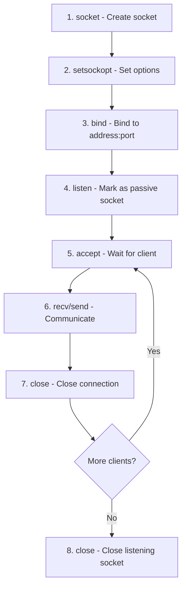
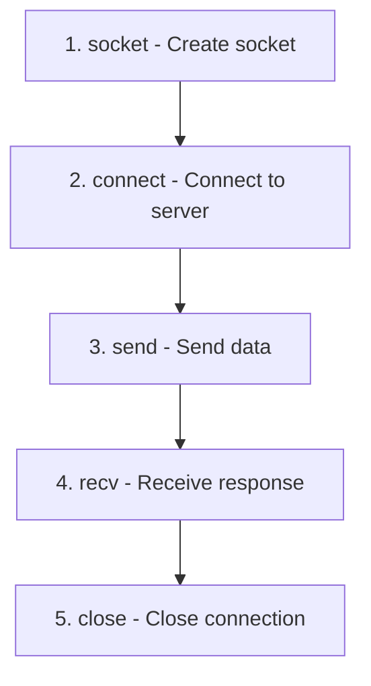

# 🔌 Socket Programming Reference

## Explanation

### 1. What Is a Socket?

- A socket is an endpoint of a bidirectional communication channel between two programs running on a network. It abstracts away the transport layer details so applications can send and receive data.
- Each endpoint is defined by an IP address, a transport protocol (TCP/UDP), and a port number. Together they form a socket address.
- Sockets are created by the operating system kernel and exposed through APIs (Winsock on Windows, BSD sockets on Unix-like systems).

### 2. IPv4 vs IPv6

- **IPv4** uses 32-bit addresses (e.g., `192.168.0.1`) and is still the most common addressing scheme; however, it offers a limited address space.
- **IPv6** uses 128-bit addresses (e.g., `2001:db8::1`), enabling vastly more unique hosts and built-in features like mandatory IPsec support and stateless address autoconfiguration.
- Dual-stack applications should be prepared to handle both families by using address-agnostic APIs (`getaddrinfo`/`getnameinfo`) and `AF_UNSPEC` queries.

### 3. Network Byte Order

- Network protocols transmit multi-byte integers in big-endian (network byte order). Many hosts (x86/x64) use little-endian, so values must be converted before transmission.
- Use `htons`/`htonl` to convert host to network order and `ntohs`/`ntohl` to convert back. Skipping conversion leads to mismatched ports or corrupted payloads across different architectures.

### 4. Blocking vs Non-Blocking Sockets

- **Blocking sockets** keep the calling thread waiting until an operation completes (e.g., `recv` waits for data). They simplify control flow but can stall a thread indefinitely.
- **Non-blocking sockets** return immediately with `EWOULDBLOCK` (`WSAEWOULDBLOCK` on Windows) when an operation would block. They require polling or readiness notification (select/poll/epoll/IOCP) but enable responsive or single-threaded multiplexing.
- **Best practices**: use blocking sockets for straightforward, single-client interactions or when each connection has a dedicated thread. Use non-blocking sockets (often with `select`, `poll`, `epoll`, or completion ports) for scalable servers handling many connections without large thread pools.

### 5. Connection-Oriented vs Connectionless

- **Connection-oriented** transports like TCP establish a reliable stream before data exchange. They guarantee in-order delivery and retransmit lost segments at the cost of more overhead and latency.
- **Connectionless** transports like UDP send discrete datagrams without establishing a session. They are faster and support broadcast/multicast but do not guarantee delivery, ordering, or duplicate suppression. Applications must add their own reliability if needed.

### 6. Additional Concepts Worth Knowing

- **Socket Lifecycle**: create → configure options → bind → listen (for servers) → accept → communicate → shutdown/close. Mishandling shutdown can cause TIME_WAIT storms or reset packets.
- **Address Reuse**: enabling `SO_REUSEADDR`/`SO_REUSEPORT` helps restart servers quickly or share receiving duties across sockets.
- **Error Handling**: always inspect return values and retrieve extended errors (`WSAGetLastError` on Windows, `errno` on Linux). Many networking issues manifest as transient errors that need retries.
- **Security**: validate all incoming data, consider TLS for confidentiality/integrity, harden against SYN floods (use backlog tuning, SYN cookies), and avoid exposing unnecessary ports.
- **Diagnostics**: tools like `netstat`, `ss`, `lsof`, `tcpdump`, and `Wireshark` are invaluable for observing socket states and traffic during debugging.

## </> Code

### A. 🪟 Windows Examples (Winsock2)

> All Windows samples assume the program links against `Ws2_32.lib` and calls `WSAStartup` before using sockets. Error handling is trimmed for clarity; add production-grade checks in real projects.

#### A-1. TCP Single-Client Server

##### A-1-1. Opening a Socket

```cpp
#include <winsock2.h>
#include <ws2tcpip.h>

SOCKET create_listen_socket(void) {
    SOCKET listen_sock = INVALID_SOCKET;

    listen_sock = socket(AF_INET, SOCK_STREAM, IPPROTO_TCP);
    if (listen_sock == INVALID_SOCKET) {
        // handle error, e.g., log WSAGetLastError()
    }
    return listen_sock;
}
```

##### A-1-2. Setting Socket Options

```cpp
int set_reuseaddr(SOCKET sock) {
    BOOL enable = TRUE;
    return setsockopt(sock, SOL_SOCKET, SO_REUSEADDR, (const char *)&enable, sizeof(enable));
}
```

##### A-1-3. Set Blocking and Non-Blocking

```cpp
int set_nonblocking(SOCKET sock, bool make_nonblocking) {
    u_long mode = make_nonblocking ? 1UL : 0UL;
    return ioctlsocket(sock, FIONBIO, &mode);
}
```

##### A-1-4. Binding Socket to Local Port

```cpp
int bind_listen_socket(SOCKET sock, unsigned short port) {
    sockaddr_in addr = {0};
    addr.sin_family = AF_INET;
    addr.sin_port = htons(port);
    addr.sin_addr.s_addr = htonl(INADDR_ANY);

    if (bind(sock, (SOCKADDR *)&addr, sizeof(addr)) == SOCKET_ERROR) {
        return SOCKET_ERROR;
    }
    return listen(sock, SOMAXCONN);
}
```

##### A-1-5. Accept a New Connection from a Client

```cpp
SOCKET accept_client(SOCKET listen_sock, sockaddr_in *client_addr) {
    int len = sizeof(*client_addr);
    SOCKET client_sock = accept(listen_sock, (SOCKADDR *)client_addr, &len);
    if (client_sock == INVALID_SOCKET) {
        // handle error
    }
    return client_sock;
}
```

##### A-1-6. Communication with the Client

```cpp
void echo_session(SOCKET client_sock) {
    const char welcome[] = "Hello from Windows TCP server\n";
    send(client_sock, welcome, (int)strlen(welcome), 0);

    char buffer[1024];
    int received = recv(client_sock, buffer, sizeof(buffer), 0);
    if (received > 0) {
        send(client_sock, buffer, received, 0);
    }

    shutdown(client_sock, SD_BOTH);
    closesocket(client_sock);
}
```

##### A-1-7. Client Socket Code

```cpp
void run_client(const char *host, const char *port) {
    addrinfo hints = {0};
    hints.ai_family = AF_UNSPEC;
    hints.ai_socktype = SOCK_STREAM;

    addrinfo *result = NULL;
    if (getaddrinfo(host, port, &hints, &result) != 0) {
        return;
    }

    SOCKET client = socket(result->ai_family, result->ai_socktype, result->ai_protocol);
    if (client == INVALID_SOCKET) {
        freeaddrinfo(result);
        return;
    }

    if (connect(client, result->ai_addr, (int)result->ai_addrlen) == SOCKET_ERROR) {
        closesocket(client);
        freeaddrinfo(result);
        return;
    }

    const char payload[] = "ping";
    send(client, payload, (int)strlen(payload), 0);

    char buffer[256];
    int received = recv(client, buffer, sizeof(buffer) - 1, 0);
    if (received > 0) {
        buffer[received] = '\0';
        // process buffer
    }

    shutdown(client, SD_BOTH);
    closesocket(client);
    freeaddrinfo(result);
}
```

#### A-2. TCP Multi-Client Server with `select`

##### A-2-1. Open a New Socket as Listener

```cpp
SOCKET setup_listener(unsigned short port) {
    SOCKET listen_sock = create_listen_socket();
    if (listen_sock == INVALID_SOCKET) {
        return INVALID_SOCKET;
    }
    set_reuseaddr(listen_sock);
    if (bind_listen_socket(listen_sock, port) == SOCKET_ERROR) {
        closesocket(listen_sock);
        return INVALID_SOCKET;
    }
    set_nonblocking(listen_sock, true);
    return listen_sock;
}
```

##### A-2-2. Introduction to `FD_SET` and Preparing the Select List

```cpp
typedef struct {
    fd_set master;
    SOCKET sockets[FD_SETSIZE];
    size_t count;
} socket_pool;

void pool_init(socket_pool *pool) {
    FD_ZERO(&pool->master);
    pool->count = 0;
}

void pool_add(socket_pool *pool, SOCKET sock) {
    if (pool->count < FD_SETSIZE) {
        pool->sockets[pool->count++] = sock;
        FD_SET(sock, &pool->master);
    }
}
```

##### A-2-3. `select` Waiting for New Clients or Data

```c
void service_loop(SOCKET listen_sock) {
    socket_pool pool;
    pool_init(&pool);
    pool_add(&pool, listen_sock);

    while (true) {
        fd_set read_set = pool.master;
        int ready = select(0, &read_set, NULL, NULL, NULL);
        if (ready == SOCKET_ERROR) {
            break;
        }

        for (size_t i = 0; i < pool.count && ready > 0; ++i) {
            SOCKET sock = pool.sockets[i];
            if (FD_ISSET(sock, &read_set)) {
                --ready;
                if (sock == listen_sock) {
                    // ready to accept
                } else {
                    // ready to receive data
                }
            }
        }
    }
}
```

##### A-2-4. Accepting a New Client Connection

```c
void handle_new_client(socket_pool *pool, SOCKET listen_sock) {
    sockaddr_in addr;
    int len = sizeof(addr);
    SOCKET client = accept(listen_sock, (SOCKADDR *)&addr, &len);
    if (client == INVALID_SOCKET) {
        return;
    }
    set_nonblocking(client, true);
    pool_add(pool, client);
}
```

##### A-2-5. Start Communication with New Clients

```c
void handle_client_data(socket_pool *pool, size_t index) {
    SOCKET client = pool->sockets[index];
    char buffer[1024];
    int received = recv(client, buffer, sizeof(buffer), 0);
    if (received <= 0) {
        closesocket(client);
        FD_CLR(client, &pool->master);
        pool->sockets[index] = pool->sockets[--pool->count];
        return;
    }
    send(client, buffer, received, 0);
}
```

#### A-3. UDP Examples

##### A-3-1. UDP Server

```c
void run_udp_server(unsigned short port) {
    SOCKET sock = socket(AF_INET, SOCK_DGRAM, IPPROTO_UDP);
    sockaddr_in addr = {0};
    addr.sin_family = AF_INET;
    addr.sin_port = htons(port);
    addr.sin_addr.s_addr = htonl(INADDR_ANY);

    bind(sock, (SOCKADDR *)&addr, sizeof(addr));

    while (true) {
        char buffer[1024];
        sockaddr_in client;
        int len = sizeof(client);
        int received = recvfrom(sock, buffer, sizeof(buffer), 0, (SOCKADDR *)&client, &len);
        if (received > 0) {
            sendto(sock, buffer, received, 0, (SOCKADDR *)&client, len);
        }
    }
}
```

##### A-3-2. UDP Client

```c
void run_udp_client(const char *host, const char *port) {
    addrinfo hints = {0};
    hints.ai_family = AF_UNSPEC;
    hints.ai_socktype = SOCK_DGRAM;

    addrinfo *result = NULL;
    if (getaddrinfo(host, port, &hints, &result) != 0) {
        return;
    }

    SOCKET sock = socket(result->ai_family, result->ai_socktype, result->ai_protocol);
    if (sock == INVALID_SOCKET) {
        freeaddrinfo(result);
        return;
    }

    const char payload[] = "udp ping";
    sendto(sock, payload, (int)strlen(payload), 0, result->ai_addr, (int)result->ai_addrlen);

    char buffer[256];
    int received = recv(sock, buffer, sizeof(buffer), 0);
    if (received > 0) {
        buffer[received] = '\0';
        // process buffer
    }

    closesocket(sock);
    freeaddrinfo(result);
}
```

### B. 🐧 Linux Examples (POSIX/BSD Sockets)

#### B-0. Linux Socket Programming Fundamentals

##### B-0-1. Required Header Files

Linux socket programming uses the POSIX/BSD socket API. Understanding which headers to include is essential:

```cpp
#include <sys/types.h>    // Basic system data types (size_t, ssize_t)
#include <sys/socket.h>   // Core socket functions: socket(), bind(), listen(), accept(), connect()
#include <netinet/in.h>   // Internet address structures: sockaddr_in, sockaddr_in6, INADDR_ANY
#include <arpa/inet.h>    // Internet operations: inet_pton(), inet_ntop(), htons(), ntohs()
#include <unistd.h>       // UNIX standard: close(), read(), write()
#include <fcntl.h>        // File control: fcntl() for setting non-blocking mode
#include <netdb.h>        // Network database: getaddrinfo(), getnameinfo() for DNS resolution
#include <errno.h>        // Error codes: errno, EWOULDBLOCK, EAGAIN, EINPROGRESS
#include <string.h>       // String operations: memset(), strlen()
#include <stdio.h>        // Standard I/O: printf(), perror()
```

**Header Usage Summary:**

| Header | Primary Functions | When to Use |
|--------|------------------|-------------|
| `<sys/socket.h>` | `socket()`, `bind()`, `listen()`, `accept()`, `connect()`, `send()`, `recv()` | **Always** - Core socket operations |
| `<netinet/in.h>` | `sockaddr_in`, `sockaddr_in6`, `INADDR_ANY`, `in_addr` | **Always** - Internet addressing |
| `<arpa/inet.h>` | `inet_pton()`, `inet_ntop()`, `htons()`, `ntohs()`, `htonl()`, `ntohl()` | **Always** - Address conversion and byte order |
| `<unistd.h>` | `close()`, `read()`, `write()` | **Always** - Closing sockets and I/O |
| `<fcntl.h>` | `fcntl()`, `O_NONBLOCK` | When setting non-blocking mode |
| `<netdb.h>` | `getaddrinfo()`, `freeaddrinfo()`, `getnameinfo()` | For DNS resolution and protocol-agnostic code |
| `<errno.h>` | `errno`, error constants | For detailed error handling |

##### B-0-2. Setting Blocking and Non-Blocking Modes

**Blocking Mode (Default):**

- Socket operations **wait** until they complete
- `recv()` blocks until data arrives
- `accept()` blocks until a client connects
- `connect()` blocks until connection established or timeout
- Simple programming model but can stall threads

**Non-Blocking Mode:**

- Socket operations **return immediately**
- Returns `-1` with `errno` set to `EAGAIN` or `EWOULDBLOCK` if operation would block
- Requires polling mechanisms (`select()`, `poll()`, `epoll()`)
- Enables handling multiple connections in single thread

**How to Set Non-Blocking Mode:**

```cpp
#include <fcntl.h>

// Method 1: Using fcntl() - Most portable
int set_nonblocking(int sockfd) {
    int flags = fcntl(sockfd, F_GETFL, 0);  // Get current flags
    if (flags == -1) {
        perror("fcntl F_GETFL");
        return -1;
    }
    
    flags |= O_NONBLOCK;  // Add non-blocking flag
    
    if (fcntl(sockfd, F_SETFL, flags) == -1) {  // Set new flags
        perror("fcntl F_SETFL");
        return -1;
    }
    
    return 0;
}

// Method 2: Using socket() flags (Linux-specific)
int sock = socket(AF_INET, SOCK_STREAM | SOCK_NONBLOCK, 0);

// Method 3: Using accept4() for non-blocking client sockets (Linux-specific)
int client_fd = accept4(listen_sock, (struct sockaddr *)&client, &len, SOCK_NONBLOCK);
```

**Reverting to Blocking Mode:**

```cpp
int set_blocking(int sockfd) {
    int flags = fcntl(sockfd, F_GETFL, 0);
    if (flags == -1) {
        return -1;
    }
    
    flags &= ~O_NONBLOCK;  // Remove non-blocking flag
    
    if (fcntl(sockfd, F_SETFL, flags) == -1) {
        return -1;
    }
    
    return 0;
}
```

**Non-Blocking Behavior Examples:**

```cpp
// Non-blocking recv() behavior
char buffer[1024];
ssize_t bytes = recv(sockfd, buffer, sizeof(buffer), 0);

if (bytes > 0) {
    // Data received successfully
    process_data(buffer, bytes);
} else if (bytes == 0) {
    // Connection closed by peer
    close(sockfd);
} else {  // bytes == -1
    if (errno == EAGAIN || errno == EWOULDBLOCK) {
        // No data available right now - not an error
        // Try again later (use select/poll/epoll)
    } else {
        // Real error occurred
        perror("recv");
    }
}

// Non-blocking connect() behavior
if (connect(sockfd, (struct sockaddr *)&server, sizeof(server)) == -1) {
    if (errno == EINPROGRESS) {
        // Connection in progress - not an error
        // Use select() with writefds to wait for completion
    } else {
        // Real error
        perror("connect");
    }
}
```

##### B-0-3. Understanding TCP Server Operation

A TCP server follows a specific sequence of operations to accept and handle client connections:

**Server Lifecycle:**



**Step-by-Step Server Explanation:**

1. **`socket()`** - Create a socket endpoint

   ```cpp
   int listen_sock = socket(AF_INET,      // IPv4
                             SOCK_STREAM,  // TCP (connection-oriented)
                             0);           // Default protocol
   // Returns: file descriptor (>= 0) on success, -1 on error
   ```

2. **`setsockopt()`** - Configure socket options (optional but recommended)

   ```cpp
   int opt = 1;
   setsockopt(listen_sock, SOL_SOCKET, SO_REUSEADDR, &opt, sizeof(opt));
   // SO_REUSEADDR: Allows reusing address immediately after server restart
   // Prevents "Address already in use" errors
   ```

3. **`bind()`** - Assign address and port to socket

   ```cpp
   struct sockaddr_in addr = {0};
   addr.sin_family = AF_INET;              // IPv4
   addr.sin_port = htons(8080);            // Port 8080 (network byte order)
   addr.sin_addr.s_addr = htonl(INADDR_ANY);  // Accept on any interface
   
   bind(listen_sock, (struct sockaddr *)&addr, sizeof(addr));
   // Binds socket to 0.0.0.0:8080 (all interfaces)
   ```

4. **`listen()`** - Mark socket as passive (accepting connections)

   ```cpp
   listen(listen_sock, SOMAXCONN);
   // SOMAXCONN: Maximum backlog queue size
   // Socket is now ready to accept client connections
   ```

5. **`accept()`** - Accept incoming client connection (blocks until client arrives)

   ```cpp
   struct sockaddr_in client;
   socklen_t len = sizeof(client);
   int client_sock = accept(listen_sock, (struct sockaddr *)&client, &len);
   // Returns: new socket for this client, original listen_sock remains open
   // client structure now contains client's IP and port
   ```

6. **`recv()`/`send()`** - Communicate with client

   ```cpp
   char buffer[1024];
   ssize_t bytes = recv(client_sock, buffer, sizeof(buffer), 0);  // Receive data
   send(client_sock, buffer, bytes, 0);                           // Echo back
   ```

7. **`close()`** - Close connection

   ```cpp
   shutdown(client_sock, SHUT_RDWR);  // Graceful shutdown (optional)
   close(client_sock);                 // Free resources
   ```

##### B-0-4. Understanding TCP Client Operation

A TCP client connects to a server and exchanges data:

**Client Lifecycle:**



**Step-by-Step Client Explanation:**

1. **`socket()`** - Create a socket

   ```cpp
   int sock = socket(AF_INET, SOCK_STREAM, 0);
   ```

2. **`connect()`** - Establish connection to server

   ```cpp
   struct sockaddr_in server = {0};
   server.sin_family = AF_INET;
   server.sin_port = htons(8080);
   inet_pton(AF_INET, "127.0.0.1", &server.sin_addr);  // Server IP
   
   connect(sock, (struct sockaddr *)&server, sizeof(server));
   // Blocks until connected or error
   // Three-way handshake (SYN, SYN-ACK, ACK) happens here
   ```

3. **`send()`/`recv()`** - Exchange data

   ```cpp
   const char *msg = "Hello Server";
   send(sock, msg, strlen(msg), 0);
   
   char buffer[1024];
   ssize_t bytes = recv(sock, buffer, sizeof(buffer), 0);
   ```

4. **`close()`** - Terminate connection

   ```cpp
   close(sock);  // Sends FIN packet, closes connection
   ```

##### B-0-5. Error Handling on Linux

Proper error handling is critical for robust socket applications:

```cpp
#include <errno.h>
#include <string.h>

// Check socket creation
int sock = socket(AF_INET, SOCK_STREAM, 0);
if (sock < 0) {
    perror("socket");  // Prints: "socket: <error message>"
    // Or manually:
    fprintf(stderr, "socket failed: %s\n", strerror(errno));
    return -1;
}

// Check recv/send operations
ssize_t bytes = recv(sock, buffer, size, 0);
if (bytes < 0) {
    if (errno == EAGAIN || errno == EWOULDBLOCK) {
        // Non-blocking socket, no data available
    } else if (errno == EINTR) {
        // Interrupted by signal, retry
    } else if (errno == ECONNRESET) {
        // Connection reset by peer
        close(sock);
    } else {
        perror("recv");
    }
} else if (bytes == 0) {
    // Connection closed gracefully by peer
    close(sock);
}
```

**Common Error Codes:**

| Error | Constant | Meaning |
|-------|----------|---------|
| **EWOULDBLOCK / EAGAIN** | 11 | Non-blocking operation would block |
| **EINTR** | 4 | System call interrupted by signal |
| **ECONNRESET** | 104 | Connection reset by peer |
| **EPIPE** | 32 | Broken pipe (write to closed socket) |
| **ETIMEDOUT** | 110 | Connection timed out |
| **ECONNREFUSED** | 111 | Connection refused (no server listening) |
| **EADDRINUSE** | 98 | Address already in use |

##### B-0-6. Compiling Linux Socket Programs

```bash
# Basic compilation
gcc server.c -o server

# With warnings enabled (recommended)
gcc -Wall -Wextra -O2 server.c -o server

# With debugging symbols
gcc -g -Wall server.c -o server

# Link with pthread for multi-threaded servers
gcc -Wall server.c -o server -lpthread

# C++ compilation
g++ -Wall -Wextra -std=c++11 server.cpp -o server
```

#### B-1. TCP Single-Client Server

```cpp
int create_listen_socket(uint16_t port) {
    int sock = socket(AF_INET, SOCK_STREAM, 0);
    if (sock < 0) {
        return -1;
    }

    int opt = 1;
    setsockopt(sock, SOL_SOCKET, SO_REUSEADDR, &opt, sizeof(opt));

    struct sockaddr_in addr = {0};
    addr.sin_family = AF_INET;
    addr.sin_port = htons(port);
    addr.sin_addr.s_addr = htonl(INADDR_ANY);

    if (bind(sock, (struct sockaddr *)&addr, sizeof(addr)) < 0) {
        close(sock);
        return -1;
    }

    if (listen(sock, SOMAXCONN) < 0) {
        close(sock);
        return -1;
    }

    return sock;
}

void run_single_server(uint16_t port) {
    int listen_sock = create_listen_socket(port);
    if (listen_sock < 0) {
        return;
    }

    struct sockaddr_in client;
    socklen_t len = sizeof(client);
    int client_sock = accept(listen_sock, (struct sockaddr *)&client, &len);
    if (client_sock >= 0) {
        const char msg[] = "Hello from Linux TCP server\n";
        send(client_sock, msg, sizeof(msg) - 1, 0);

        char buffer[1024];
        ssize_t received = recv(client_sock, buffer, sizeof(buffer), 0);
        if (received > 0) {
            send(client_sock, buffer, (size_t)received, 0);
        }

        shutdown(client_sock, SHUT_RDWR);
        close(client_sock);
    }

    close(listen_sock);
}
```

#### B-2. TCP Multi-Client Server with `select`

```cpp
static void set_nonblocking(int fd) {
    int flags = fcntl(fd, F_GETFL, 0);
    fcntl(fd, F_SETFL, flags | O_NONBLOCK);
}

void run_select_server(uint16_t port) {
    int listen_sock = create_listen_socket(port);
    if (listen_sock < 0) {
        return;
    }
    set_nonblocking(listen_sock);

    fd_set master;
    FD_ZERO(&master);
    FD_SET(listen_sock, &master);
    int fd_max = listen_sock;

    while (1) {
        fd_set read_set = master;
        int ready = select(fd_max + 1, &read_set, NULL, NULL, NULL);
        if (ready < 0) {
            break;
        }

        for (int fd = 0; fd <= fd_max && ready > 0; ++fd) {
            if (!FD_ISSET(fd, &read_set)) {
                continue;
            }
            --ready;

            if (fd == listen_sock) {
                struct sockaddr_in client;
                socklen_t len = sizeof(client);
                int client_fd = accept(listen_sock, (struct sockaddr *)&client, &len);
                if (client_fd >= 0) {
                    set_nonblocking(client_fd);
                    FD_SET(client_fd, &master);
                    if (client_fd > fd_max) {
                        fd_max = client_fd;
                    }
                }
            } else {
                char buffer[1024];
                ssize_t bytes = recv(fd, buffer, sizeof(buffer), 0);
                if (bytes <= 0) {
                    close(fd);
                    FD_CLR(fd, &master);
                } else {
                    send(fd, buffer, (size_t)bytes, 0);
                }
            }
        }
    }

    close(listen_sock);
}
```

#### B-3. UDP Server and Client

```cpp
void run_udp_server(uint16_t port) {
    int sock = socket(AF_INET, SOCK_DGRAM, 0);
    struct sockaddr_in addr = {0};
    addr.sin_family = AF_INET;
    addr.sin_port = htons(port);
    addr.sin_addr.s_addr = htonl(INADDR_ANY);

    bind(sock, (struct sockaddr *)&addr, sizeof(addr));

    while (1) {
        char buffer[1024];
        struct sockaddr_in client;
        socklen_t len = sizeof(client);
        ssize_t received = recvfrom(sock, buffer, sizeof(buffer), 0, (struct sockaddr *)&client, &len);
        if (received > 0) {
            sendto(sock, buffer, (size_t)received, 0, (struct sockaddr *)&client, len);
        }
    }
}

void run_udp_client(const char *host, uint16_t port) {
    int sock = socket(AF_INET, SOCK_DGRAM, 0);

    struct sockaddr_in server = {0};
    server.sin_family = AF_INET;
    server.sin_port = htons(port);
    inet_pton(AF_INET, host, &server.sin_addr);

    const char payload[] = "udp ping";
    sendto(sock, payload, sizeof(payload) - 1, 0, (struct sockaddr *)&server, sizeof(server));

    char buffer[256];
    ssize_t received = recv(sock, buffer, sizeof(buffer), 0);
    if (received > 0) {
        buffer[received] = '\0';
        // process buffer
    }

    close(sock);
}
```
