# C++ Threading Tutorial

A comprehensive guide to understanding and implementing multithreading in C++ using `std::thread` from C++11.

<!-- ## Table of Contents

- [C++ Threading Tutorial](#c-threading-tutorial)
  - [Table of Contents](#table-of-contents)
  - [Thread Basics](#thread-basics)
  - [Thread Structure](#thread-structure)
  - [Creating Threads](#creating-threads)
    - [1. Using Function Objects (Functors)](#1-using-function-objects-functors)
    - [2. Using Lambda Functions](#2-using-lambda-functions)
    - [3. Using Member Functions](#3-using-member-functions)
  - [Passing Arguments](#passing-arguments)
    - [1. Pass by Value (Copy)](#1-pass-by-value-copy)
    - [2. Pass by Reference](#2-pass-by-reference)
    - [3. Pass by Pointer](#3-pass-by-pointer)
  - [Thread Lifecycle](#thread-lifecycle)
    - [The `join()` Method](#the-join-method)
  - [Important Considerations](#important-considerations)
    - [1. Argument Lifetime ⚠️](#1-argument-lifetime-️)
    - [2. Cache Coherence](#2-cache-coherence)
    - [3. Functor Overloading Limitation](#3-functor-overloading-limitation)
  - [Complete Example](#complete-example)
  - [Quick Reference](#quick-reference)
  - [Best Practices](#best-practices)
  - [Advanced Thread Concepts](#advanced-thread-concepts)
    - [Thread Handle and Thread ID](#thread-handle-and-thread-id)
      - [Native Handle](#native-handle)
      - [Thread ID](#thread-id)
      - [Pausing Threads](#pausing-threads)
    - [Thread Priority and Affinity](#thread-priority-and-affinity)
  - [Thread Class and Move Semantics](#thread-class-and-move-semantics)
    - [RAII Principle with Threads](#raii-principle-with-threads)
    - [Move-Only Semantics](#move-only-semantics)
    - [Transferring Thread Ownership](#transferring-thread-ownership)
      - [1. Pass as Temporary Object](#1-pass-as-temporary-object)
      - [2. Using std::move()](#2-using-stdmove)
      - [3. Return from Functions](#3-return-from-functions)
    - [Move Semantics Diagram](#move-semantics-diagram)
    - [Important Rules](#important-rules)
    - [Thread Ownership Example](#thread-ownership-example)
    - [Quick Reference: Thread Ownership](#quick-reference-thread-ownership)
  - [Thread Management and Exception Safety](#thread-management-and-exception-safety)
    - [Join vs Detach](#join-vs-detach)
      - [join() - Wait for Completion](#join---wait-for-completion)
      - [detach() - Run Independently](#detach---run-independently)
    - [The Joinability Problem](#the-joinability-problem)
    - [Solution 1: Manual Exception Handling](#solution-1-manual-exception-handling)
    - [Solution 2: RAII Thread Guard (Recommended)](#solution-2-raii-thread-guard-recommended)
    - [The joinable() Function](#the-joinable-function)
    - [Destructor Order and RAII](#destructor-order-and-raii)
    - [Complete Thread Management Example](#complete-thread-management-example)
    - [Comparison: Join vs Detach vs RAII Guard](#comparison-join-vs-detach-vs-raii-guard)
    - [Best Practices for Thread Management](#best-practices-for-thread-management)
  - [Working with Multiple Threads](#working-with-multiple-threads)
    - [Creating Multiple Threads](#creating-multiple-threads)
    - [C++20 Alternative: std::jthread](#c20-alternative-stdjthread)
    - [Shared Memory and Data Visibility](#shared-memory-and-data-visibility)
    - [Thread Interleaving and Interference](#thread-interleaving-and-interference)
    - [Data Races](#data-races)
    - [Synchronization Requirement](#synchronization-requirement)
    - [Multiple Threads Example](#multiple-threads-example)
    - [Key Takeaways](#key-takeaways)
    - [Best Practices for Multiple Threads](#best-practices-for-multiple-threads)
  - [Mutex and Synchronization](#mutex-and-synchronization)
    - [What is a Mutex?](#what-is-a-mutex)
    - [Critical Section](#critical-section)
    - [Mutex States and Operations](#mutex-states-and-operations)
    - [Deadlock](#deadlock)
    - [Using std::mutex](#using-stdmutex)
    - [Mutex Example](#mutex-example)
    - [Mutex Best Practices](#mutex-best-practices)
  - [Lock Guards and RAII](#lock-guards-and-raii)
    - [The Problem with Manual Locking](#the-problem-with-manual-locking)
    - [Drawbacks of std::mutex](#drawbacks-of-stdmutex)
    - [RAII Solution: std::lock\_guard](#raii-solution-stdlock_guard)
    - [How lock\_guard Works](#how-lock_guard-works)
    - [Lock Guard Example](#lock-guard-example)
    - [Comparison: Manual vs RAII Lock](#comparison-manual-vs-raii-lock)
    - [Lock Guard Best Practices](#lock-guard-best-practices)
    - [When to Use What](#when-to-use-what)
  - [Unique Lock - Flexible RAII Locking](#unique-lock---flexible-raii-locking)
    - [What is std::unique\_lock?](#what-is-stdunique_lock)
    - [unique\_lock vs lock\_guard](#unique_lock-vs-lock_guard)
    - [Manual Unlocking with unique\_lock](#manual-unlocking-with-unique_lock)
    - [Unique Lock Example](#unique-lock-example)
      - [Comparison: lock\_guard vs unique\_lock](#comparison-lock_guard-vs-unique_lock)
    - [Advanced unique\_lock Features](#advanced-unique_lock-features)
      - [1. Deferred Locking](#1-deferred-locking)
      - [2. Try Locking](#2-try-locking)
      - [3. Timed Locking](#3-timed-locking)
      - [4. Move Semantics](#4-move-semantics)
    - [Unique Lock Best Practices](#unique-lock-best-practices)
    - [When to Use unique\_lock](#when-to-use-unique_lock)
    - [Complete unique\_lock Example](#complete-unique_lock-example)
  - [Recursive Mutex](#recursive-mutex)
    - [The Problem with Regular Mutex](#the-problem-with-regular-mutex)
    - [What is std::recursive\_mutex?](#what-is-stdrecursive_mutex)
    - [How Recursive Mutex Works](#how-recursive-mutex-works)
    - [Factorial Example](#factorial-example)
    - [Another Example: Nested Function Calls](#another-example-nested-function-calls)
    - [Comparison: mutex vs recursive\_mutex](#comparison-mutex-vs-recursive_mutex)
    - [Recursive Mutex Best Practices](#recursive-mutex-best-practices)
    - [When to Use Recursive Mutex](#when-to-use-recursive-mutex)
  - [Timed Mutex](#timed-mutex)
    - [What is std::timed\_mutex?](#what-is-stdtimed_mutex)
    - [Timed Locking Methods](#timed-locking-methods)
    - [Understanding Chrono Clocks](#understanding-chrono-clocks)
      - [std::chrono::system\_clock](#stdchronosystem_clock)
      - [std::chrono::steady\_clock](#stdchronosteady_clock)
      - [Clock Comparison](#clock-comparison)
      - [When to Use Which Clock](#when-to-use-which-clock)
      - [Timing Accuracy and Scheduling](#timing-accuracy-and-scheduling)
    - [try\_lock\_for Example](#try_lock_for-example)
    - [try\_lock\_until Example](#try_lock_until-example)
    - [Recursive Timed Mutex](#recursive-timed-mutex)
    - [Mutex Type Comparison](#mutex-type-comparison)
    - [Timed Mutex Best Practices](#timed-mutex-best-practices)
    - [Using Timed Mutexes with unique\_lock](#using-timed-mutexes-with-unique_lock)
    - [Complete Timed Mutex Example](#complete-timed-mutex-example)
    - [When to Use Timed Mutexes](#when-to-use-timed-mutexes)
  - [Shared Mutex - Reader-Writer Locks](#shared-mutex---reader-writer-locks)
    - [The Read-Write Problem](#the-read-write-problem)
    - [What is std::shared\_mutex?](#what-is-stdshared_mutex)
      - [Two Locking Modes](#two-locking-modes)
      - [Understanding Exclusivity](#understanding-exclusivity)
      - [Exclusivity in Action](#exclusivity-in-action)
    - [Selective Locking](#selective-locking)
    - [Shared Lock vs Exclusive Lock](#shared-lock-vs-exclusive-lock)
    - [Reader-Writer Example](#reader-writer-example)
      - [Complete Example: Shared Database](#complete-example-shared-database)
    - [Performance Comparison](#performance-comparison)
      - [Scenario: 10 readers, 1 writer, read-heavy workload (90% reads)](#scenario-10-readers-1-writer-read-heavy-workload-90-reads)
    - [Shared Mutex Variants](#shared-mutex-variants)
    - [Shared Mutex Best Practices](#shared-mutex-best-practices)
    - [Decision Tree: Which Mutex to Use?](#decision-tree-which-mutex-to-use)
  - [Thread-Safe Initialization](#thread-safe-initialization)
    - [The Initialization Problem](#the-initialization-problem)
    - [Shared Data Initialization](#shared-data-initialization)
      - [1. Global Variables](#1-global-variables)
      - [2. Static Variables](#2-static-variables)
      - [3. Static Class Members](#3-static-class-members)
      - [4. Heap-Allocated Data](#4-heap-allocated-data)
    - [Static Initialization Race](#static-initialization-race)
    - [Solutions for Thread-Safe Initialization](#solutions-for-thread-safe-initialization)
      - [Solution 1: Double-Checked Locking (Broken!)](#solution-1-double-checked-locking-broken)
      - [Solution 2: Static Local Variables (C++11+) ✅](#solution-2-static-local-variables-c11-)
      - [Solution 3: std::call\_once and std::once\_flag ✅](#solution-3-stdcall_once-and-stdonce_flag-)
      - [Solution 4: Eager Initialization](#solution-4-eager-initialization)
    - [Thread-Safe Singleton Pattern](#thread-safe-singleton-pattern)
      - [❌ Naive Singleton (Not Thread-Safe)](#-naive-singleton-not-thread-safe)
      - [✅ Thread-Safe Singleton (Meyers' Singleton)](#-thread-safe-singleton-meyers-singleton)
      - [✅ Thread-Safe Singleton with std::call\_once](#-thread-safe-singleton-with-stdcall_once)
      - [Complete Singleton Example with Thread Safety](#complete-singleton-example-with-thread-safety)
    - [Initialization Comparison](#initialization-comparison)
    - [Initialization Best Practices](#initialization-best-practices)
  - [Thread-Local Storage](#thread-local-storage)
    - [What is thread\_local?](#what-is-thread_local)
    - [Thread-Local Variable Types](#thread-local-variable-types)
      - [1. Global and Namespace Scope](#1-global-and-namespace-scope)
      - [2. Class Data Members](#2-class-data-members)
      - [3. Local Variables (Function Scope)](#3-local-variables-function-scope)
    - [Initialization and Destruction](#initialization-and-destruction)
    - [Thread-Local vs Global Variables](#thread-local-vs-global-variables)
    - [Use Cases for Thread-Local Storage](#use-cases-for-thread-local-storage)
      - [1. Performance Counters and Statistics](#1-performance-counters-and-statistics)
      - [2. Thread-Specific Context/State](#2-thread-specific-contextstate)
      - [3. Thread-Local Caching](#3-thread-local-caching)
      - [4. Random Number Generators](#4-random-number-generators)
      - [5. Error Handling (errno-style)](#5-error-handling-errno-style)
    - [Complete Thread-Local Example](#complete-thread-local-example)
    - [Thread-Local Best Practices](#thread-local-best-practices)
  - [Lazy Initialization](#lazy-initialization)
    - [What is Lazy Initialization?](#what-is-lazy-initialization)
    - [Single-Threaded Lazy Initialization](#single-threaded-lazy-initialization)
    - [The Multi-Threading Problem](#the-multi-threading-problem)
    - [Thread-Safe Lazy Initialization Solutions](#thread-safe-lazy-initialization-solutions)
      - [Solution 1: Static Local Variables (C++11+) ✅ Best](#solution-1-static-local-variables-c11--best)
      - [Solution 2: std::call\_once ✅ Explicit Control](#solution-2-stdcall_once--explicit-control)
      - [Solution 3: Mutex-Protected Lazy Initialization ✅ Manual Control](#solution-3-mutex-protected-lazy-initialization--manual-control)
      - [Solution 4: Atomic Flag with Double-Checked Locking ⚠️ Advanced](#solution-4-atomic-flag-with-double-checked-locking-️-advanced)
    - [Comparison of Solutions](#comparison-of-solutions)
    - [Lazy Initialization Performance](#lazy-initialization-performance)
    - [Real-World Examples](#real-world-examples)
      - [Example 1: Lazy Database Connection Pool](#example-1-lazy-database-connection-pool)
      - [Example 2: Lazy Logger Initialization](#example-2-lazy-logger-initialization)
      - [Example 3: Configuration with call\_once](#example-3-configuration-with-call_once)
    - [Lazy Initialization Best Practices](#lazy-initialization-best-practices)
  - [Double-Checked Locking Pattern](#double-checked-locking-pattern)
    - [The Pattern Explained](#the-pattern-explained)
    - [Why Double-Checked Locking is Broken](#why-double-checked-locking-is-broken)
      - [The Problem: Memory Reordering](#the-problem-memory-reordering)
      - [Why This Happens](#why-this-happens)
    - [The Correct Implementation with Atomics](#the-correct-implementation-with-atomics)
    - [Memory Ordering Explained](#memory-ordering-explained)
      - [memory\_order\_acquire](#memory_order_acquire)
      - [memory\_order\_release](#memory_order_release)
      - [memory\_order\_relaxed](#memory_order_relaxed)
    - [Complete Example with std::shared\_ptr](#complete-example-with-stdshared_ptr)
    - [Performance Analysis](#performance-analysis)
    - [Double-Checked Locking Best Practices](#double-checked-locking-best-practices)
  - [Deadlock and Prevention](#deadlock-and-prevention)
    - [What is Deadlock?](#what-is-deadlock)
      - [Most Common Form: Mutual Deadlock](#most-common-form-mutual-deadlock)
    - [Types of Deadlock](#types-of-deadlock)
      - [1. Mutexes (Most Common)](#1-mutexes-most-common)
      - [2. Computation Results](#2-computation-results)
      - [3. Messages/Events](#3-messagesevents)
      - [4. GUI Events](#4-gui-events)
    - [Classic Deadlock Example](#classic-deadlock-example)
    - [Deadlock Conditions](#deadlock-conditions)
    - [Preventing Deadlock](#preventing-deadlock)
      - [Solution 1: Lock Ordering (Manual) ⚠️ Error-Prone](#solution-1-lock-ordering-manual-️-error-prone)
      - [Solution 2: std::scoped\_lock (C++17) ✅ Best](#solution-2-stdscoped_lock-c17--best)
      - [Solution 3: std::lock() with std::unique\_lock (C++11) ✅ Alternative](#solution-3-stdlock-with-stdunique_lock-c11--alternative)
      - [Solution 4: Single Lock (Simplest)](#solution-4-single-lock-simplest)
    - [Deadlock Prevention Comparison](#deadlock-prevention-comparison)
    - [Deadlock Detection and Recovery](#deadlock-detection-and-recovery)
      - [Using try\_lock with Backoff](#using-try_lock-with-backoff)
      - [Using Timeouts](#using-timeouts)
    - [Real-World Deadlock Example](#real-world-deadlock-example)
    - [Deadlock Best Practices](#deadlock-best-practices)
  - [Livelock](#livelock)
    - [What is Livelock?](#what-is-livelock)
    - [Livelock vs Deadlock](#livelock-vs-deadlock)
    - [Preventing Livelock](#preventing-livelock)
      - [Solution 1: Random Backoff ✅](#solution-1-random-backoff-)
      - [Solution 2: Use std::scoped\_lock ✅ Best](#solution-2-use-stdscoped_lock--best)
      - [Solution 3: Exponential Backoff ✅](#solution-3-exponential-backoff-)
  - [Thread Coordination with Boolean Flags](#thread-coordination-with-boolean-flags)
    - [The Coordination Problem](#the-coordination-problem)
    - [Coordination Using Boolean Flags](#coordination-using-boolean-flags)
    - [Download Simulation Architecture](#download-simulation-architecture)
    - [Implementation](#implementation)
    - [Thread State Diagram](#thread-state-diagram)
    - [The Polling Pattern Explained](#the-polling-pattern-explained)
    - [Expected Output](#expected-output)
    - [Advantages of Boolean Flag Coordination](#advantages-of-boolean-flag-coordination)
    - [Disadvantages of Boolean Flag Coordination](#disadvantages-of-boolean-flag-coordination)
    - [Comparison: Polling vs Better Alternatives](#comparison-polling-vs-better-alternatives)
    - [When to Use Boolean Flag Coordination](#when-to-use-boolean-flag-coordination)
    - [Complete Example: coordination.cpp](#complete-example-coordinationcpp)
    - [Key Takeaways (coordination)](#key-takeaways-coordination)
    - [Best Practices for Boolean Flag Coordination](#best-practices-for-boolean-flag-coordination)
  - [Condition Variables - Efficient Thread Coordination](#condition-variables---efficient-thread-coordination)
    - [The Problem with Boolean Flags](#the-problem-with-boolean-flags)
    - [What are Condition Variables?](#what-are-condition-variables)
    - [How Condition Variables Work](#how-condition-variables-work)
    - [Condition Variable Methods](#condition-variable-methods)
    - [Basic Reader-Writer Example](#basic-reader-writer-example)
    - [Expected Output ()](#expected-output-)
    - [Execution Flow Diagram](#execution-flow-diagram)
    - [Why unique\_lock is Required](#why-unique_lock-is-required)
    - [Spurious Wakeups](#spurious-wakeups)
    - [Comparison: Polling vs Condition Variables](#comparison-polling-vs-condition-variables)
    - [notify\_one() vs notify\_all()](#notify_one-vs-notify_all)
    - [Timed Waits](#timed-waits)
    - [Complete Example: condition\_variable.cpp](#complete-example-condition_variablecpp)
    - [Real-World Use Cases](#real-world-use-cases)
    - [Advantages of Condition Variables](#advantages-of-condition-variables)
    - [Disadvantages of Condition Variables](#disadvantages-of-condition-variables)
    - [Common Pitfalls](#common-pitfalls)
    - [Best Practices for Condition Variables](#best-practices-for-condition-variables)
    - [Condition Variable Pattern Template](#condition-variable-pattern-template)
    - [Key Takeaways (condition\_variable)](#key-takeaways-condition_variable)
  - [Predicate-Based Waiting - Solving Critical Problems](#predicate-based-waiting---solving-critical-problems)
    - [The Critical Problems](#the-critical-problems)
    - [What is a Predicate?](#what-is-a-predicate)
    - [How Predicates Work](#how-predicates-work)
    - [Predicate Versions of wait()](#predicate-versions-of-wait)
    - [Complete Predicate Example](#complete-predicate-example)
    - [Execution Flow with Predicate](#execution-flow-with-predicate)
    - [Predicate Benefits Summary](#predicate-benefits-summary)
    - [Common Predicate Patterns](#common-predicate-patterns)
    - [Predicate Best Practices](#predicate-best-practices)
    - [Predicate Performance Considerations](#predicate-performance-considerations)
    - [Predicate with Multiple Waiters](#predicate-with-multiple-waiters)
    - [Advanced: Predicate with Timeout Return Value](#advanced-predicate-with-timeout-return-value)
    - [Complete Example: predicate.cpp](#complete-example-predicatecpp)
    - [Key Takeaways (predicates)](#key-takeaways-predicates)
  - [Futures and Promises - High-Level Async Programming](#futures-and-promises---high-level-async-programming)
    - [The Communication Problem](#the-communication-problem)
    - [What are Futures and Promises?](#what-are-futures-and-promises)
    - [Basic Promise and Future Example](#basic-promise-and-future-example)
    - [Key Characteristics](#key-characteristics)
    - [Promise and Future Workflow](#promise-and-future-workflow)
    - [Moving Promises](#moving-promises)
    - [Exception Handling with Futures](#exception-handling-with-futures)
    - [Future States](#future-states)
    - [std::async - Simplified Async Execution](#stdasync---simplified-async-execution)
    - [Comparison: Promise/Future vs async](#comparison-promisefuture-vs-async)
    - [Multiple Futures - Parallel Tasks](#multiple-futures---parallel-tasks)
    - [std::shared\_future - Multiple Waiters](#stdshared_future---multiple-waiters)
    - [std::packaged\_task - Deferred Execution](#stdpackaged_task---deferred-execution)
    - [Real-World Use Cases\_](#real-world-use-cases_)
    - [Advantages of Futures and Promises](#advantages-of-futures-and-promises)
    - [Disadvantages of Futures and Promises](#disadvantages-of-futures-and-promises)
    - [Common Pitfalls\_](#common-pitfalls_)
    - [Best Practices for Futures and Promises](#best-practices-for-futures-and-promises)
    - [Futures vs Other Synchronization Methods](#futures-vs-other-synchronization-methods)
    - [Quick Decision Guide](#quick-decision-guide)
    - [Complete Pattern Examples](#complete-pattern-examples)
    - [Key Takeaways (futures and promises)](#key-takeaways-futures-and-promises)
  - [Atomic Types and Lock-Free Programming](#atomic-types-and-lock-free-programming)
    - [The Integer Operations Problem](#the-integer-operations-problem)
    - [Why counter++ is Not Atomic](#why-counter-is-not-atomic)
    - [Solution 1: Mutex (Locking)](#solution-1-mutex-locking)
    - [Solution 2: Atomic Types (Lock-Free)](#solution-2-atomic-types-lock-free)
    - [What are Atomic Types?](#what-are-atomic-types)
    - [Available Atomic Types](#available-atomic-types)
    - [Atomic Operations](#atomic-operations)
    - [Atomic Operations Comparison Table](#atomic-operations-comparison-table)
    - [Compare and Exchange (CAS) - The Foundation](#compare-and-exchange-cas---the-foundation)
    - [Strong vs Weak Compare-Exchange](#strong-vs-weak-compare-exchange)
    - [Memory Ordering](#memory-ordering)
    - [Lock-Free Programming](#lock-free-programming)
    - [Lock-Free Stack](#lock-free-stack)
    - [Atomic Flags - The Simplest Atomic Type](#atomic-flags---the-simplest-atomic-type)
    - [Atomic Smart Pointers (C++20)](#atomic-smart-pointers-c20)
    - [Performance Comparison\_](#performance-comparison_)
    - [When to Use Atomics](#when-to-use-atomics)
    - [Common Use Cases](#common-use-cases)
    - [Advantages of Atomic Types](#advantages-of-atomic-types)
    - [Disadvantages of Atomic Types](#disadvantages-of-atomic-types)
    - [Best Practices for Atomic Types](#best-practices-for-atomic-types)
    - [Atomic Types vs Mutexes - Quick Comparison](#atomic-types-vs-mutexes---quick-comparison)
    - [Complete Example: Atomic Counter vs Mutex](#complete-example-atomic-counter-vs-mutex)
    - [Key Takeaways (atomic types)](#key-takeaways-atomic-types)
  - [Asynchronous Programming](#asynchronous-programming)
    - [What is Asynchronous Programming?](#what-is-asynchronous-programming)
    - [Synchronous vs Asynchronous Comparison](#synchronous-vs-asynchronous-comparison)
    - [Benefits of Async Programming](#benefits-of-async-programming)
    - [Packaged Task](#packaged-task)
    - [The async Function](#the-async-function)
    - [The async Function and Launch Options](#the-async-function-and-launch-options)
      - [std::launch::async - Force Asynchronous Execution](#stdlaunchasync---force-asynchronous-execution)
      - [std::launch::deferred - Lazy Evaluation](#stdlaunchdeferred---lazy-evaluation)
      - [Default Policy - Implementation Chooses](#default-policy---implementation-chooses)
    - [Choosing a Thread Object](#choosing-a-thread-object)
      - [Decision Tree](#decision-tree)
      - [When to Use std::async](#when-to-use-stdasync)
      - [When to Use std::thread](#when-to-use-stdthread)
      - [When to Use std::packaged\_task](#when-to-use-stdpackaged_task)
      - [When to Use std::promise](#when-to-use-stdpromise)
      - [Comparison Example: Same Task, Different Tools](#comparison-example-same-task-different-tools)
      - [Real-World Scenarios](#real-world-scenarios)
    - [Quick Decision Guide (Async programming)](#quick-decision-guide-async-programming)
    - [Advantages of Async Programming](#advantages-of-async-programming)
    - [Disadvantages of Async Programming](#disadvantages-of-async-programming)
    - [Best Practices for Async Programming](#best-practices-for-async-programming)
    - [Complete Async Example](#complete-async-example)
    - [Key Takeaways (async programming)](#key-takeaways-async-programming)
  - [Parallelism and Parallel Algorithms](#parallelism-and-parallel-algorithms)
    - [Parallelism Overview](#parallelism-overview)
    - [Data Parallelism](#data-parallelism)
    - [Standard Algorithms Overview](#standard-algorithms-overview)
    - [Execution Policies](#execution-policies)
      - [std::execution::seq - Sequential Policy](#stdexecutionseq---sequential-policy)
      - [std::execution::par - Parallel Policy](#stdexecutionpar---parallel-policy)
      - [std::execution::par\_unseq - Parallel + Vectorized](#stdexecutionpar_unseq---parallel--vectorized)
      - [std::execution::unseq - Vectorized Only (C++20)](#stdexecutionunseq---vectorized-only-c20)
    - [Algorithms and Execution Policies](#algorithms-and-execution-policies)
      - [Sorting with Policies](#sorting-with-policies)
      - [Finding Elements](#finding-elements)
      - [Reduction Operations](#reduction-operations)
      - [Transform-Reduce Pattern](#transform-reduce-pattern)
      - [For Each with Side Effects](#for-each-with-side-effects)
    - [New Parallel Algorithms (C++17)](#new-parallel-algorithms-c17)
      - [std::reduce](#stdreduce)
      - [std::transform\_reduce](#stdtransform_reduce)
      - [std::inclusive\_scan](#stdinclusive_scan)
      - [std::exclusive\_scan](#stdexclusive_scan)
      - [std::transform\_inclusive\_scan](#stdtransform_inclusive_scan)
      - [std::transform\_exclusive\_scan](#stdtransform_exclusive_scan)
    - [Parallel Algorithms Practical Examples](#parallel-algorithms-practical-examples)
      - [Example 1: Image Processing](#example-1-image-processing)
      - [Example 2: Financial Analysis](#example-2-financial-analysis)
      - [Example 3: Text Processing](#example-3-text-processing)
      - [Example 4: Monte Carlo Simulation](#example-4-monte-carlo-simulation)
    - [Best Practices for Parallel Algorithms](#best-practices-for-parallel-algorithms)
    - [Performance Considerations](#performance-considerations)
    - [Key Takeaways (parallelism)](#key-takeaways-parallelism)
  - [Practical Data Structures for Concurrent Programming](#practical-data-structures-for-concurrent-programming)
    - [Data Structures and Concurrency](#data-structures-and-concurrency)
      - [The Concurrency Challenge](#the-concurrency-challenge)
      - [Key Concurrency Issues](#key-concurrency-issues)
      - [Concurrency Strategies](#concurrency-strategies)
      - [Design Principles for Concurrent Data Structures](#design-principles-for-concurrent-data-structures)
      - [Concurrent Data Structure Categories](#concurrent-data-structure-categories)
      - [Performance Comparison\_\_](#performance-comparison__)
      - [Common Patterns](#common-patterns)
      - [Best Practices\_](#best-practices_)
    - [Shared Pointer and Thread Safety](#shared-pointer-and-thread-safety)
      - [Thread Safety Guarantees](#thread-safety-guarantees)
      - [Basic Usage Example](#basic-usage-example)
      - [Unsafe Patterns](#unsafe-patterns)
      - [Safe Patterns with Atomic shared\_ptr (C++20)](#safe-patterns-with-atomic-shared_ptr-c20)
      - [Safe Patterns with Mutex (Pre-C++20)](#safe-patterns-with-mutex-pre-c20)
      - [Performance Considerations\_](#performance-considerations_)
      - [Complete Thread-Safe Shared Resource Example](#complete-thread-safe-shared-resource-example)
      - [make\_shared vs new with shared\_ptr](#make_shared-vs-new-with-shared_ptr)
      - [Comparison: Smart Pointer Thread Safety](#comparison-smart-pointer-thread-safety)
      - [Best Practices\_\_](#best-practices__)
    - [Monitor Class Pattern](#monitor-class-pattern)
      - [Monitor Pattern Principles](#monitor-pattern-principles)
      - [Basic Monitor Example: Thread-Safe Counter](#basic-monitor-example-thread-safe-counter)
      - [Advanced Monitor: Bounded Buffer](#advanced-monitor-bounded-buffer)
      - [Monitor State Diagram](#monitor-state-diagram)
      - [Monitor vs Manual Locking](#monitor-vs-manual-locking)
      - [Real-World Monitor: Thread-Safe Logger](#real-world-monitor-thread-safe-logger)
      - [Advantages of Monitor Pattern](#advantages-of-monitor-pattern)
      - [Disadvantages of Monitor Pattern](#disadvantages-of-monitor-pattern)
      - [Best Practices for Monitors](#best-practices-for-monitors)
      - [Monitor Pattern Template](#monitor-pattern-template)
    - [Semaphore](#semaphore)
      - [Types of Semaphores](#types-of-semaphores)
      - [C++20 Standard Semaphore](#c20-standard-semaphore)
      - [Pre-C++20 Implementation](#pre-c20-implementation)
      - [Use Case 1: Database Connection Pool](#use-case-1-database-connection-pool)
      - [Use Case 2: Producer-Consumer with Semaphores](#use-case-2-producer-consumer-with-semaphores)
      - [Semaphore vs Mutex](#semaphore-vs-mutex)
      - [Binary Semaphore for Signaling](#binary-semaphore-for-signaling)
      - [Best Practices for Semaphores](#best-practices-for-semaphores)
    - [Concurrent Queue](#concurrent-queue)
      - [Basic Thread-Safe Queue with Mutex](#basic-thread-safe-queue-with-mutex)
    - [Concurrent Queue with Condition Variable](#concurrent-queue-with-condition-variable)
      - [Concurrent Queue Comparison](#concurrent-queue-comparison)
      - [Performance Patterns](#performance-patterns)
      - [Best Practices for Concurrent Queues](#best-practices-for-concurrent-queues)
    - [Thread Pool](#thread-pool)
    - [Thread Pool Basic Implementation](#thread-pool-basic-implementation)
      - [Thread Pool with Future Support](#thread-pool-with-future-support)
    - [Thread Pool with Multiple Queues](#thread-pool-with-multiple-queues)
    - [Thread Pool with Work Stealing](#thread-pool-with-work-stealing)
      - [Thread Pool Comparison](#thread-pool-comparison)
      - [Thread Pool Best Practices](#thread-pool-best-practices)
      - [Thread Pool Key Takeaways](#thread-pool-key-takeaways)
    - [Key Takeaways (Data Structures for Concurrent Programming)](#key-takeaways-data-structures-for-concurrent-programming) -->

## Thread Basics

In C++11 and later, the `std::thread` class provides a simple and efficient way to create and manage threads. When a thread is created, it starts executing immediately and runs concurrently with other threads.

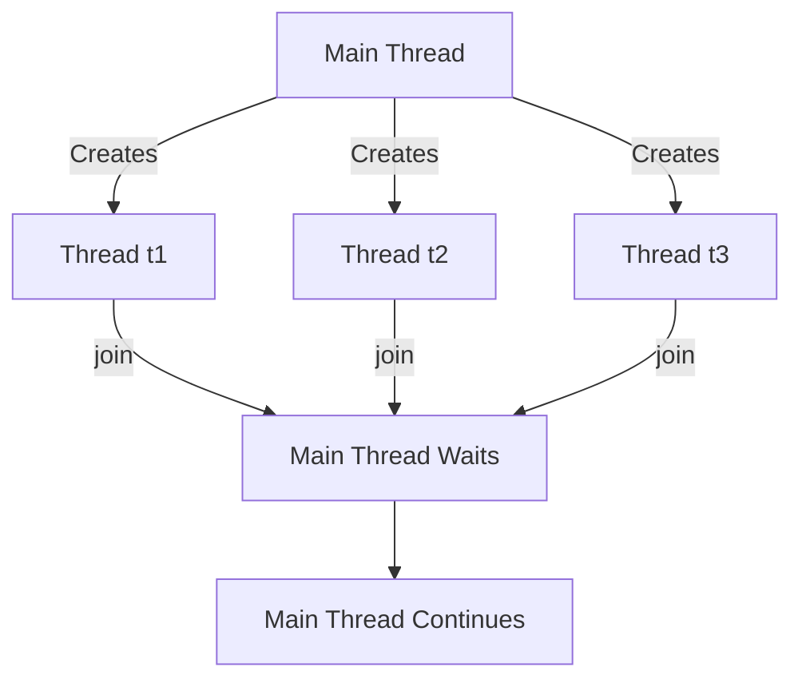
```mermaid
graph TD
    A[Main Thread] -->|Creates| B[Thread t1]
    A -->|Creates| C[Thread t2]
    A -->|Creates| D[Thread t3]
    B -->|join| E[Main Thread Waits]
    C -->|join| E
    D -->|join| E
    E --> F[Main Thread Continues]
```

---

## Thread Structure

Every thread in a multithreaded application consists of:

| Component | Description |
|-----------|-------------|
| **Thread ID** | Unique identifier for the thread |
| **Thread Function** | Entry point where the thread starts execution |
| **Thread Attributes** | Stack size, scheduling policy, etc. |
| **Thread Arguments** | Parameters passed to the thread function |
| **Thread Return Value** | Value returned upon completion |

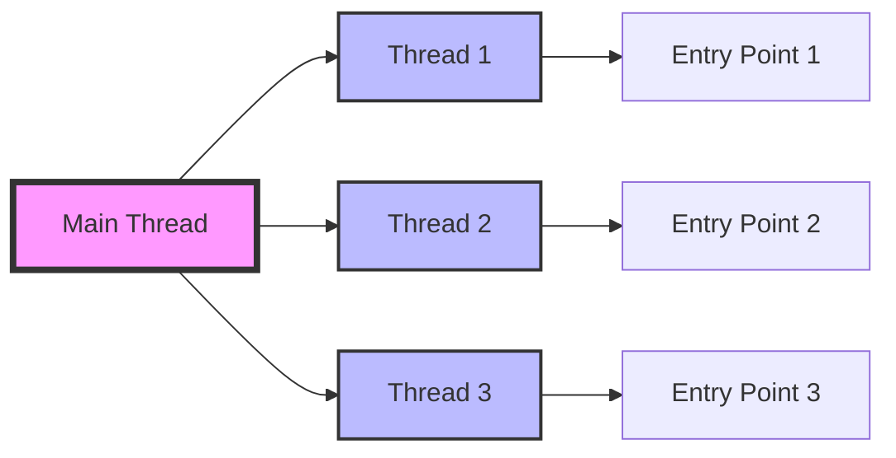
```mermaid
graph LR
    A[Main Thread] --> B[Thread 1]
    A --> C[Thread 2]
    A --> D[Thread 3]
    B --> E[Entry Point 1]
    C --> F[Entry Point 2]
    D --> G[Entry Point 3]
    
    style A fill:#f9f,stroke:#333,stroke-width:4px
    style B fill:#bbf,stroke:#333,stroke-width:2px
    style C fill:#bbf,stroke:#333,stroke-width:2px
    style D fill:#bbf,stroke:#333,stroke-width:2px
```

---

## Creating Threads

There are three main ways to create threads in C++:

### 1. Using Function Objects (Functors)

A functor is a class that overloads the `operator()`, making objects callable like functions.

```cpp
class Hello
{
    public:
        void operator()() const
        {
            std::cout << "Hello, from thread class" << std::endl;
        }
};

// Usage
Hello hello;
std::thread t1(hello);  // Thread executes operator()
t1.join();
```

**Key Points:**

- The class overloads `operator()` to make it callable
- Objects become "function-like" and can be passed directly to `std::thread`
- ⚠️ **Important:** Functors used with threads cannot be overloaded

### 2. Using Lambda Functions

Lambdas provide a concise way to create inline thread functions.

```cpp
std::thread t2([](){
    std::cout << "Hello, from lambda thread" << std::endl;
});
t2.join();
```

### 3. Using Member Functions

To call a member function in a thread, you must provide:

1. Pointer to the member function
2. Pointer/reference to the object instance
3. Any arguments the function requires

```cpp
class Greating
{
    public:
        void h1(std::string name) const
        {
            std::cout << "Hello, " << name << std::endl;
        }
};

Greating greating;
std::thread t3(&Greating::h1, &greating, "Hamed");
t3.join();
```

**Syntax Breakdown:**

```cpp
std::thread t3(&Greating::h1, &greating, "Hamed");
                ^^^^^^^^^^^^^^^  ^^^^^^^^^  ^^^^^^^
                |                |          |
                Pointer to       Object     Arguments to
                member function  instance   the function
```

---

## Passing Arguments

Arguments can be passed to thread functions in three ways:

### 1. Pass by Value (Copy)

Arguments are **copied** into the thread.

```cpp
std::thread t3(&Greating::h1, &greating, "Hamed");  // "Hamed" is copied
std::thread t4(&Greating::h2, &greating, 10);        // 10 is copied
```

### 2. Pass by Reference

Use `std::ref()` to pass arguments by reference.

```cpp
class HelloAll
{
    public:
        void operator()(std::string &name) const
        {
            std::cout << "Hello, " << name << std::endl;
        }
};

std::string name = "Hamed";
std::thread t5(helloAll, std::ref(name));  // Pass by reference
t5.join();
```

### 3. Pass by Pointer

```cpp
std::thread t6(functionName, &arg1, &arg2);  // Pass pointers
```

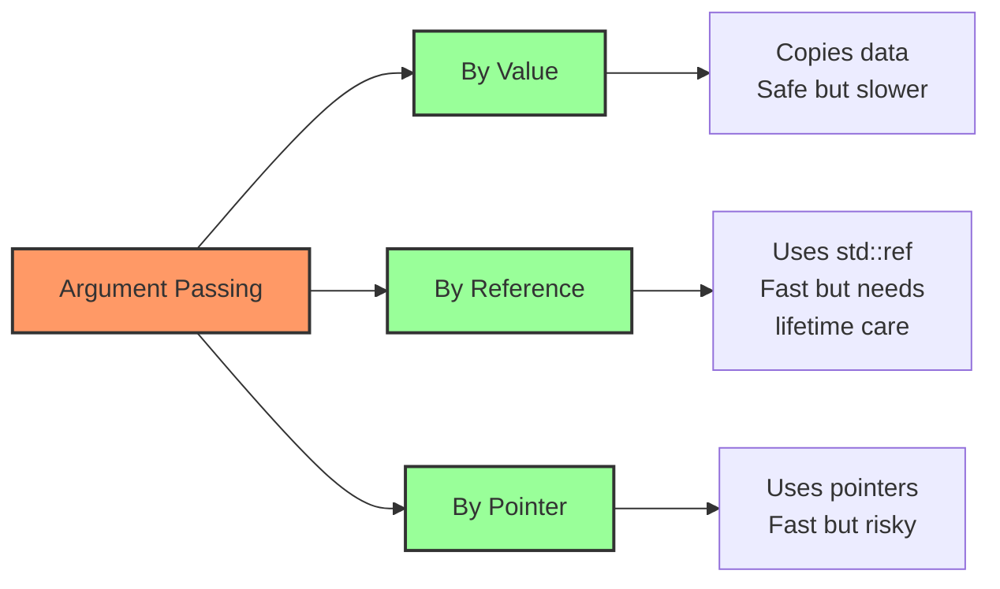
```mermaid
flowchart LR
    A[Argument Passing] --> B[By Value]
    A --> C[By Reference]
    A --> D[By Pointer]
    
    B --> E[Copies data<br/>Safe but slower]
    C --> F[Uses std::ref<br/>Fast but needs<br/>lifetime care]
    D --> G[Uses pointers<br/>Fast but risky]
    
    style A fill:#f96,stroke:#333,stroke-width:2px
    style B fill:#9f9,stroke:#333,stroke-width:2px
    style C fill:#9f9,stroke:#333,stroke-width:2px
    style D fill:#9f9,stroke:#333,stroke-width:2px
```

---

## Thread Lifecycle

```mermaid
stateDiagram-v2
    [*] --> Created: std::thread t(func)
    Created --> Running: Automatic
    Running --> Joined: t.join()
    Running --> Detached: t.detach()
    Joined --> [*]: Thread completes
    Detached --> [*]: Thread runs independently
    
    note right of Created
        Thread starts
        executing immediately
    end note
    
    note right of Joined
        Main thread waits
        for completion
    end note
```

### The `join()` Method

**Critical:** Always call `join()` on threads before the main thread exits.

```cpp
std::thread t1(hello);
t1.join();  // Main thread waits for t1 to complete
```

**What happens without `join()`?**

- If the main thread finishes before child threads, those threads are **terminated abruptly**
- This causes **resource leaks** and **undefined behavior**
- Always ensure all threads are properly joined or detached

---

## Important Considerations

### 1. Argument Lifetime ⚠️

When passing arguments to threads, ensure they remain valid for the thread's entire lifetime.

```cpp
// ❌ WRONG - Local variable may go out of scope
void badExample() {
    int x = 42;
    std::thread t(func, &x);  // x might be destroyed before thread finishes!
    t.detach();
}  // x destroyed here

// ✅ CORRECT - Use heap allocation or global variables
void goodExample() {
    int* x = new int(42);
    std::thread t([x]() {
        // Use x
        delete x;  // Clean up when done
    });
    t.detach();
}
```

### 2. Cache Coherence

In multi-core systems, threads run on different cores with separate caches. Shared data can cause cache coherence issues.

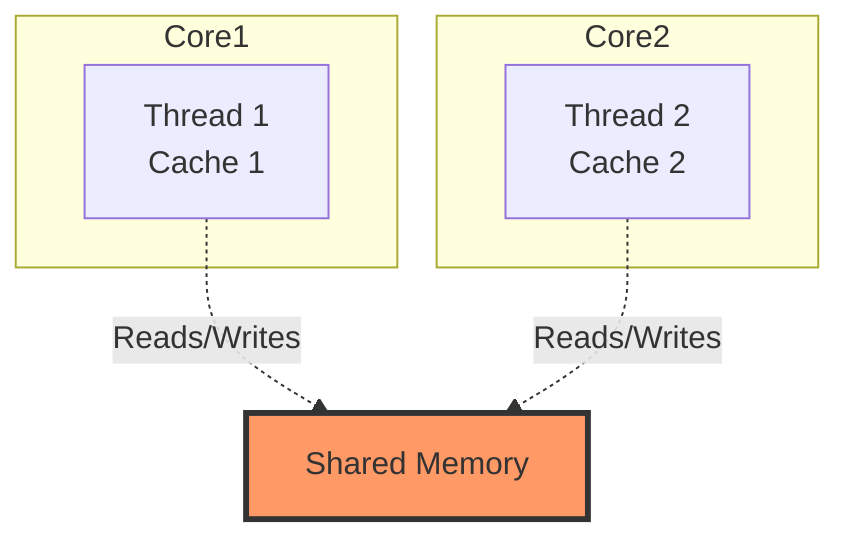
```mermaid
graph TB
    subgraph Core1
        T1[Thread 1<br/>Cache 1]
    end
    
    subgraph Core2
        T2[Thread 2<br/>Cache 2]
    end
    
    T1 -.Reads/Writes.-> SM[Shared Memory]
    T2 -.Reads/Writes.-> SM
    
    style SM fill:#f96,stroke:#333,stroke-width:3px
```

**Solutions:**

- Pass arguments **by value** (each thread gets its own copy)
- Use **mutexes** for synchronized access
- Use **atomic operations** for lock-free synchronization

### 3. Functor Overloading Limitation

⚠️ If a thread is created with a class object (functor), the `operator()` **cannot be overloaded**.

```cpp
class MyFunctor {
    void operator()() { }        // ✅ OK
    void operator()(int x) { }   // ❌ Won't work with std::thread
};
```

---

## Complete Example

```cpp
#include <iostream>
#include <thread>

class Hello {
public:
    void operator()() const {
        std::cout << "Hello, from thread class" << std::endl;
    }
};

class Greating {
public:
    void h1(std::string name) const {
        std::cout << "Hello, " << name << std::endl;
    }
    
    void h2(int id) const {
        std::cout << "Hello, thread id: " << id << std::endl;
    }
};

int main() {
    std::cout << "Hello, from main" << std::endl;
    
    // Method 1: Functor
    Hello hello;
    std::thread t1(hello);
    
    // Method 2: Lambda
    std::thread t2([]() {
        std::cout << "Hello, from lambda thread" << std::endl;
    });
    
    // Method 3: Member function with arguments
    Greating greating;
    std::thread t3(&Greating::h1, &greating, "Hamed");
    std::thread t4(&Greating::h2, &greating, 10);
    
    // Wait for all threads to complete
    t1.join();
    t2.join();
    t3.join();
    t4.join();
    
    return 0;
}
```

---

## Quick Reference

| Operation | Syntax | Description |
|-----------|--------|-------------|
| Create with functor | `std::thread t(functor)` | Pass callable object |
| Create with lambda | `std::thread t([](){...})` | Inline function |
| Create with member function | `std::thread t(&Class::func, &obj, args...)` | Call method on object |
| Pass by value | `std::thread t(func, arg)` | Argument is copied |
| Pass by reference | `std::thread t(func, std::ref(arg))` | Use reference wrapper |
| Wait for completion | `t.join()` | Blocks until thread finishes |
| Run independently | `t.detach()` | Thread runs in background |

---

## Best Practices

✅ **DO:**

- Always `join()` or `detach()` threads
- Ensure argument lifetime exceeds thread lifetime
- Use `std::ref()` for passing by reference
- Consider thread safety for shared data

❌ **DON'T:**

- Let main thread exit before child threads complete
- Pass pointers to local variables
- Share data without synchronization
- Forget to join threads

---

## Advanced Thread Concepts

### Thread Handle and Thread ID

Understanding thread handles and IDs is essential for advanced thread management and debugging.

#### Native Handle

The `native_handle()` method returns the underlying platform-specific thread handle. This can be used for platform-specific operations like setting thread priority or affinity.

```cpp
std::thread t1(threadFunction);
std::cout << "Thread handle: " << t1.native_handle() << std::endl;
```

**Important:** After a thread completes (after `join()`), the native handle becomes invalid (returns 0 or nullptr).

#### Thread ID

Each thread has a unique identifier that can be retrieved using `get_id()`. This is useful for:

- Debugging and logging
- Thread identification in multi-threaded systems
- Comparing thread objects

```cpp
std::thread t1(threadFunction);
std::cout << "Thread ID: " << t1.get_id() << std::endl;
t1.join();
std::cout << "Thread ID after join: " << t1.get_id() << std::endl;  // Invalid ID
```

#### Pausing Threads

Use `std::this_thread::sleep_for()` to pause the current thread for a specific duration.

```cpp
// Using chrono library
std::this_thread::sleep_for(std::chrono::seconds(2));

// Using literals (requires: using namespace std::literals;)
std::this_thread::sleep_for(500ms);
std::this_thread::sleep_for(2s);
```

### Thread Priority and Affinity

- **Thread Priority:** Specifies the importance of a thread relative to others. Higher priority threads receive more CPU time.
- **Thread Affinity:** Binds a thread to specific CPU core(s) to improve performance by reducing cache misses and improving memory locality.

⚠️ **Note:** These are platform-dependent features and may not be supported on all systems. Access them through the native handle.

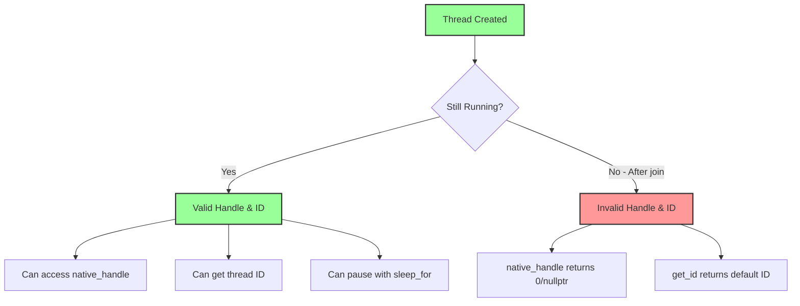
```mermaid
graph TB
    A[Thread Created] --> B{Still Running?}
    B -->|Yes| C[Valid Handle & ID]
    B -->|No - After join| D[Invalid Handle & ID]
    
    C --> E[Can access native_handle]
    C --> F[Can get thread ID]
    C --> G[Can pause with sleep_for]
    
    D --> H[native_handle returns 0/nullptr]
    D --> I[get_id returns default ID]
    
    style A fill:#9f9,stroke:#333,stroke-width:2px
    style C fill:#9f9,stroke:#333,stroke-width:2px
    style D fill:#f99,stroke:#333,stroke-width:2px
```

---

## Thread Class and Move Semantics

### RAII Principle with Threads

Threads should follow the **Resource Acquisition Is Initialization (RAII)** principle to ensure proper resource management. This means:

- The constructor acquires the thread resource
- The destructor releases it (by joining or detaching)

This pattern prevents resource leaks and ensures threads are properly cleaned up when objects go out of scope.

### Move-Only Semantics

`std::thread` is a **move-only class**, which means:

- Thread objects **cannot be copied**
- Thread objects **can only be moved**
- Only **one object can be bound** to an execution thread at a time

This design ensures exclusive ownership of thread resources and prevents multiple objects from managing the same thread.

### Transferring Thread Ownership

There are three ways to transfer ownership of a thread object:

#### 1. Pass as Temporary Object

Create the thread directly in the function call:

```cpp
void func1(std::thread t) {
    std::cout << "Thread id: " << t.get_id() << std::endl;
    t.join();
}

// Usage
func1(std::thread(threadFunction));  // Temporary object
```

#### 2. Using std::move()

Explicitly move an existing thread object:

```cpp
std::thread t1(threadFunction);
func1(std::move(t1));  // Transfer ownership with std::move()
// t1 is now in a "moved-from" state and should not be used
```

#### 3. Return from Functions

Threads can be returned from functions (automatic move):

```cpp
std::thread createThread() {
    return std::thread(threadFunction);  // Automatic move on return
}

std::thread t = createThread();  // Ownership transferred
t.join();
```

### Move Semantics Diagram

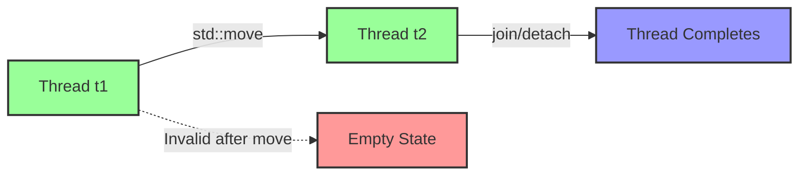
```mermaid
graph LR
    A[Thread t1] -->|std::move| B[Thread t2]
    A -.->|Invalid after move| C[Empty State]
    B -->|join/detach| D[Thread Completes]
    
    style A fill:#9f9,stroke:#333,stroke-width:2px
    style B fill:#9f9,stroke:#333,stroke-width:2px
    style C fill:#f99,stroke:#333,stroke-width:2px
    style D fill:#99f,stroke:#333,stroke-width:2px
```

### Important Rules

⚠️ **Critical Points:**

1. **After moving a thread**, the source thread object is in a "moved-from" state and should not be used
2. **Only one object** can manage a thread at any given time
3. **Always join or detach** threads before they are destroyed
4. **Temporary thread objects** are automatically moved (no explicit `std::move()` needed)

### Thread Ownership Example

```cpp
#include <thread>
#include <iostream>

void threadFunction() {
    std::cout << "Thread function executed." << std::endl;
}

void func1(std::thread t) {
    std::cout << "In func1, thread id: " << t.get_id() << std::endl;
    t.join();
}

int main() {
    // Method 1: Pass temporary object
    func1(std::thread(threadFunction));
    
    // Method 2: Use std::move()
    std::thread t1(threadFunction);
    func1(std::move(t1));  // t1 is now empty
    
    // Method 3: Direct creation and join
    std::thread t2(threadFunction);
    std::cout << "In main, thread id: " << t2.get_id() << std::endl;
    t2.join();
    
    return 0;
}
```

### Quick Reference: Thread Ownership

| Operation | Syntax | Result |
|-----------|--------|--------|
| Create thread | `std::thread t(func)` | `t` owns the thread |
| Move ownership | `std::thread t2 = std::move(t1)` | `t2` owns, `t1` is empty |
| Pass temporary | `func(std::thread(func2))` | Function receives ownership |
| Return thread | `return std::thread(func)` | Caller receives ownership |
| Check if valid | `t.joinable()` | Returns true if thread is active |

---

## Thread Management and Exception Safety

### Join vs Detach

When working with threads, you have two options for managing their lifecycle:

#### join() - Wait for Completion

Blocks the calling thread until the target thread completes execution.

```cpp
std::thread t(threadFunction);
t.join();  // Main thread waits here until t finishes
```

#### detach() - Run Independently

Allows the thread to run independently in the background (daemon thread). The parent thread continues execution without waiting.

```cpp
std::thread t(threadFunction);
t.detach();  // Thread runs independently
// t is no longer associated with the execution thread
```

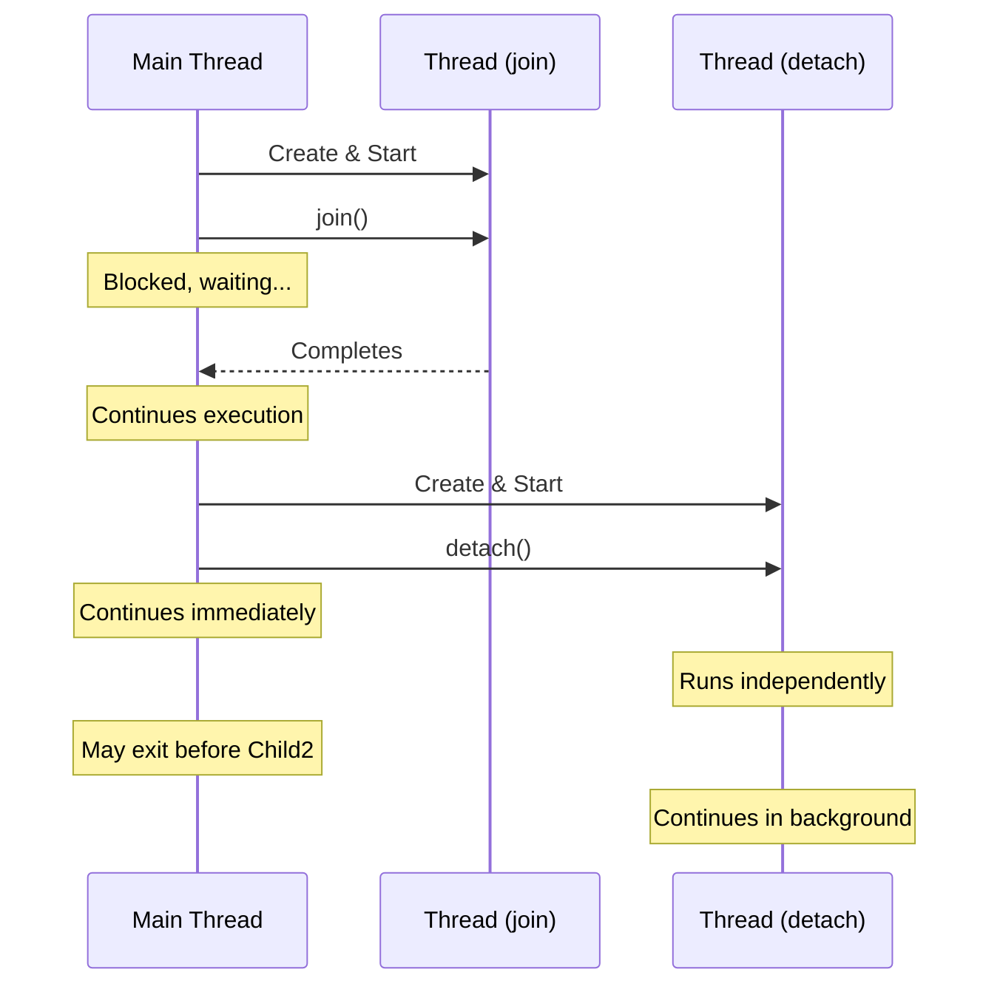
```mermaid
sequenceDiagram
    participant Main as Main Thread
    participant Child1 as Thread (join)
    participant Child2 as Thread (detach)
    
    Main->>Child1: Create & Start
    Main->>Child1: join()
    Note over Main: Blocked, waiting...
    Child1-->>Main: Completes
    Note over Main: Continues execution
    
    Main->>Child2: Create & Start
    Main->>Child2: detach()
    Note over Main: Continues immediately
    Note over Child2: Runs independently
    
    Note over Main: May exit before Child2
    Note over Child2: Continues in background
```

### The Joinability Problem

**Critical:** A thread's destructor will call `std::terminate()` if:

- The thread is still **joinable** (neither `join()` nor `detach()` has been called)
- The destructor is invoked

This commonly happens with exceptions:

```cpp
void exampleFailure() {
    try {
        std::thread t1(threadFunction);
        throw std::exception();  // Exception thrown!
        t1.join();  // Never reached!
    }
    catch(const std::exception& e) {
        std::cerr << "Exception caught: " << e.what() << '\n';
    }
    // t1's destructor called here - std::terminate() invoked!
}
```

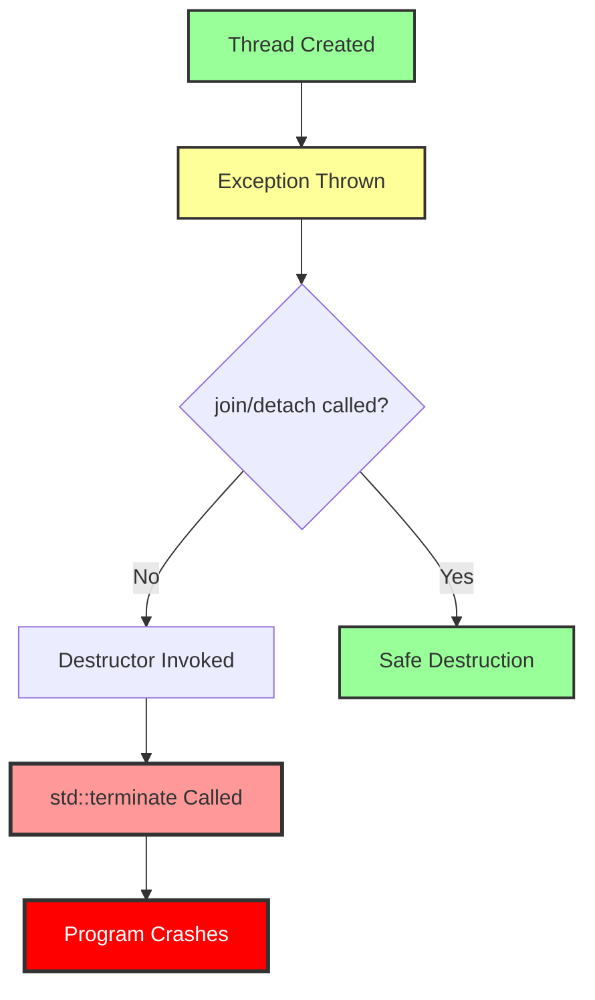
```mermaid
graph TD
    A[Thread Created] --> B[Exception Thrown]
    B --> C{join/detach called?}
    C -->|No| D[Destructor Invoked]
    D --> E[std::terminate Called]
    E --> F[Program Crashes]
    C -->|Yes| G[Safe Destruction]
    
    style A fill:#9f9,stroke:#333,stroke-width:2px
    style B fill:#ff9,stroke:#333,stroke-width:2px
    style E fill:#f99,stroke:#333,stroke-width:3px
    style F fill:#f00,stroke:#333,stroke-width:3px,color:#fff
    style G fill:#9f9,stroke:#333,stroke-width:2px
```

### Solution 1: Manual Exception Handling

Ensure `join()` is called in both the try and catch blocks:

```cpp
void exampleSuccess() {
    std::thread t1(threadFunction);
    try {
        throw std::exception();
        t1.join();  // Normal path
    }
    catch(const std::exception& e) {
        std::cerr << "Exception caught: " << e.what() << '\n';
        t1.join();  // Exception path - thread is joined!
    }
}
```

**Drawbacks:**

- Duplicated code
- Easy to forget in complex functions
- Not maintainable for multiple threads

### Solution 2: RAII Thread Guard (Recommended)

Create a wrapper class that automatically manages thread lifecycle using RAII principles:

```cpp
class thread_guard {
    std::thread t;
public:
    explicit thread_guard(std::thread&& t_) : t(std::move(t_)) {}
    
    ~thread_guard() {
        if (t.joinable()) {  // Check if join/detach needed
            t.join();
        }
    }
    
    // Prevent copying to maintain unique ownership
    thread_guard(const thread_guard&) = delete;
    thread_guard& operator=(const thread_guard&) = delete;
};
```

**Usage:**

```cpp
void exampleRAII() {
    try {
        std::thread t1(threadFunction);
        thread_guard guard{std::move(t1)};  // Transfer ownership
        throw std::exception();  // Exception thrown
    }
    catch(const std::exception& e) {
        std::cerr << "Exception caught: " << e.what() << '\n';
    }
    // guard's destructor automatically calls join() - Safe!
}
```

### The joinable() Function

The `joinable()` member function returns:

- **`false`** if:
  - `join()` or `detach()` have already been called
  - The thread object is not associated with an execution thread
- **`true`** if the thread needs `join()` or `detach()` to be called

### Destructor Order and RAII

Understanding destructor order is crucial for RAII:

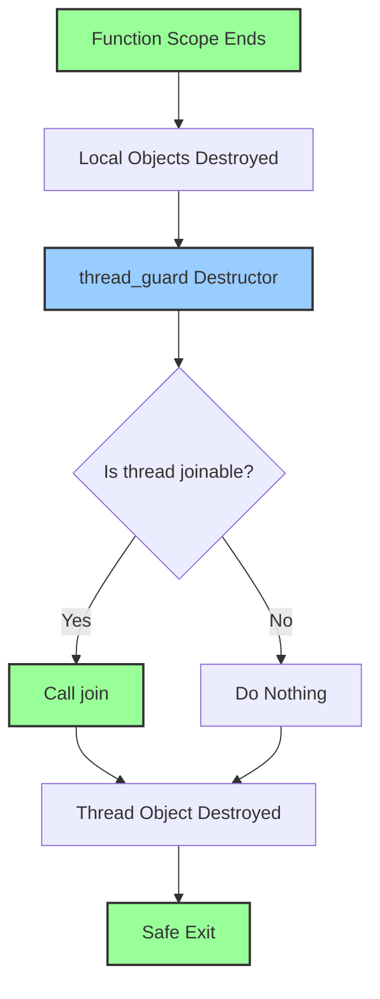
```mermaid
graph TD
    A[Function Scope Ends] --> B[Local Objects Destroyed]
    B --> C[thread_guard Destructor]
    C --> D{Is thread joinable?}
    D -->|Yes| E[Call join]
    D -->|No| F[Do Nothing]
    E --> G[Thread Object Destroyed]
    F --> G
    G --> H[Safe Exit]
    
    style A fill:#9f9,stroke:#333,stroke-width:2px
    style C fill:#9cf,stroke:#333,stroke-width:2px
    style E fill:#9f9,stroke:#333,stroke-width:2px
    style H fill:#9f9,stroke:#333,stroke-width:2px
```

**Destruction Order:**

1. Local objects destroyed in **reverse order of construction**
2. `thread_guard` destructor checks `joinable()`
3. Calls `join()` if necessary
4. Thread object destroyed (now safe - no longer joinable)

### Complete Thread Management Example

```cpp
#include <thread>
#include <iostream>

void threadFunction() {
    std::cout << "Hello from thread function!" << std::endl;
}

class thread_guard {
    std::thread t;
public:
    explicit thread_guard(std::thread&& t_) : t(std::move(t_)) {}
    
    ~thread_guard() {
        if (t.joinable()) {
            t.join();
        }
    }
    
    thread_guard(const thread_guard&) = delete;
    thread_guard& operator=(const thread_guard&) = delete;
};

void exampleRAII() {
    try {
        std::thread t1(threadFunction);
        thread_guard guard{std::move(t1)};
        throw std::exception();  // Safe - guard will clean up
    }
    catch(const std::exception& e) {
        std::cerr << "Exception caught: " << e.what() << '\n';
    }
}

int main() {
    exampleRAII();
    return 0;
}
```

### Comparison: Join vs Detach vs RAII Guard

| Aspect | join() | detach() | RAII Guard |
|--------|--------|----------|------------|
| **Parent waits** | ✅ Yes | ❌ No | ✅ Yes |
| **Exception safe** | ❌ Manual handling | ✅ If detached early | ✅ Automatic |
| **Resource cleanup** | Manual | Automatic | Automatic |
| **Use case** | Need results | Fire-and-forget | Exception-prone code |
| **Thread association** | Maintained | Removed | Maintained |
| **Best practice** | ❌ Risky alone | ✅ For daemons | ✅ Recommended |

### Best Practices for Thread Management

✅ **DO:**

- Use RAII wrapper classes (like `thread_guard`) for exception safety
- Always ensure threads are joined or detached before destruction
- Use `joinable()` to check thread state before join/detach
- Delete copy constructors for thread wrapper classes
- Consider using `std::jthread` (C++20) which auto-joins

❌ **DON'T:**

- Rely on manual join() in exception-prone code
- Let thread objects go out of scope without join/detach
- Copy thread wrapper objects
- Assume threads will clean themselves up
- Ignore the joinable state

---

## Working with Multiple Threads

### Creating Multiple Threads

You can create multiple `std::thread` objects to run concurrent tasks. Each thread can execute the same or different functions with different arguments.

```cpp
void threadFunction(int id) {
    std::this_thread::sleep_for(std::chrono::seconds(id));
    std::cout << "Hello from thread " << id << std::endl;
}

int main() {
    std::thread t1(threadFunction, 1);
    std::thread t2(threadFunction, 2);
    std::thread t3(threadFunction, 3);
    
    t1.join();
    t2.join();
    t3.join();
    
    return 0;
}
```

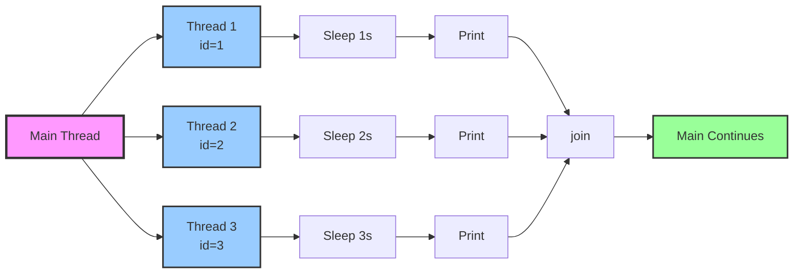
```mermaid
graph LR
    A[Main Thread] --> B[Thread 1<br/>id=1]
    A --> C[Thread 2<br/>id=2]
    A --> D[Thread 3<br/>id=3]
    
    B --> E[Sleep 1s]
    C --> F[Sleep 2s]
    D --> G[Sleep 3s]
    
    E --> H[Print]
    F --> I[Print]
    G --> J[Print]
    
    H --> K[join]
    I --> K
    J --> K
    
    K --> L[Main Continues]
    
    style A fill:#f9f,stroke:#333,stroke-width:3px
    style B fill:#9cf,stroke:#333,stroke-width:2px
    style C fill:#9cf,stroke:#333,stroke-width:2px
    style D fill:#9cf,stroke:#333,stroke-width:2px
    style L fill:#9f9,stroke:#333,stroke-width:2px
```

### C++20 Alternative: std::jthread

In C++20 and later, `std::jthread` (joining thread) automatically joins when it goes out of scope, eliminating manual join management:

```cpp
// C++20 and later
{
    std::jthread t1(helloFunction);
    std::jthread t2(helloFunction);
    // Automatic join when scope ends - no manual join() needed!
}
```

**Comparison:**

| Feature | std::thread (C++11) | std::jthread (C++20) |
|---------|---------------------|----------------------|
| Manual join/detach | ✅ Required | ❌ Automatic |
| Exception safety | ❌ Manual handling | ✅ Built-in |
| Cooperative cancellation | ❌ Not supported | ✅ Supported |
| RAII compliant | ❌ Needs wrapper | ✅ Yes |

### Shared Memory and Data Visibility

Threads in a program **share the same memory space**, making data sharing easy but also dangerous. Data is visible to threads when it's:

**Visible to All Threads:**

- ✅ Global variables
- ✅ Static variables
- ✅ Static class members
- ✅ Lambda captures by reference
- ✅ Heap-allocated data (via pointers)

**NOT Visible:**

- ❌ Local variables in other threads' functions

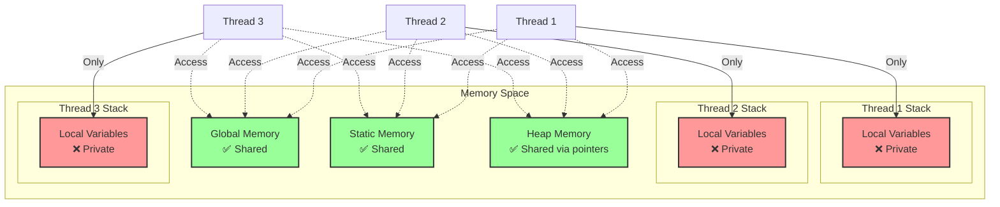
```mermaid
graph TB
    subgraph Memory Space
        GM[Global Memory<br/>✅ Shared]
        SM[Static Memory<br/>✅ Shared]
        HM[Heap Memory<br/>✅ Shared via pointers]
        
        subgraph Thread 1 Stack
            L1[Local Variables<br/>❌ Private]
        end
        
        subgraph Thread 2 Stack
            L2[Local Variables<br/>❌ Private]
        end
        
        subgraph Thread 3 Stack
            L3[Local Variables<br/>❌ Private]
        end
    end
    
    T1[Thread 1] -.Access.-> GM
    T1 -.Access.-> SM
    T1 -.Access.-> HM
    T1 -->|Only| L1
    
    T2[Thread 2] -.Access.-> GM
    T2 -.Access.-> SM
    T2 -.Access.-> HM
    T2 -->|Only| L2
    
    T3[Thread 3] -.Access.-> GM
    T3 -.Access.-> SM
    T3 -.Access.-> HM
    T3 -->|Only| L3
    
    style GM fill:#9f9,stroke:#333,stroke-width:2px
    style SM fill:#9f9,stroke:#333,stroke-width:2px
    style HM fill:#9f9,stroke:#333,stroke-width:2px
    style L1 fill:#f99,stroke:#333,stroke-width:2px
    style L2 fill:#f99,stroke:#333,stroke-width:2px
    style L3 fill:#f99,stroke:#333,stroke-width:2px
```

### Thread Interleaving and Interference

Threads can **interleave** their execution, meaning their operations can happen in any order. This can cause **interference** when accessing shared resources.

```cpp
void threadFunctionPrint(std::string s) {
    for (int i = 0; i < 5; ++i) {
        std::cout << s[0] << s[1] << s[2] << std::endl;
    }
}

int main() {
    std::thread t1(threadFunctionPrint, "ABC");
    std::thread t2(threadFunctionPrint, "123");
    std::thread t3(threadFunctionPrint, "dhf");
    
    t1.join();
    t2.join();
    t3.join();
    
    return 0;
}
```

**Expected Output (Sequential):**

```text
ABC
ABC
ABC
ABC
ABC
123
123
123
123
123
dhf
dhf
dhf
dhf
dhf
```

**Actual Output (Interleaved):**

```text
ABC
123
dhf
ABC
123
ABC
dhf
123
dhf
ABC
123
ABC
dhf
dhf
123
```

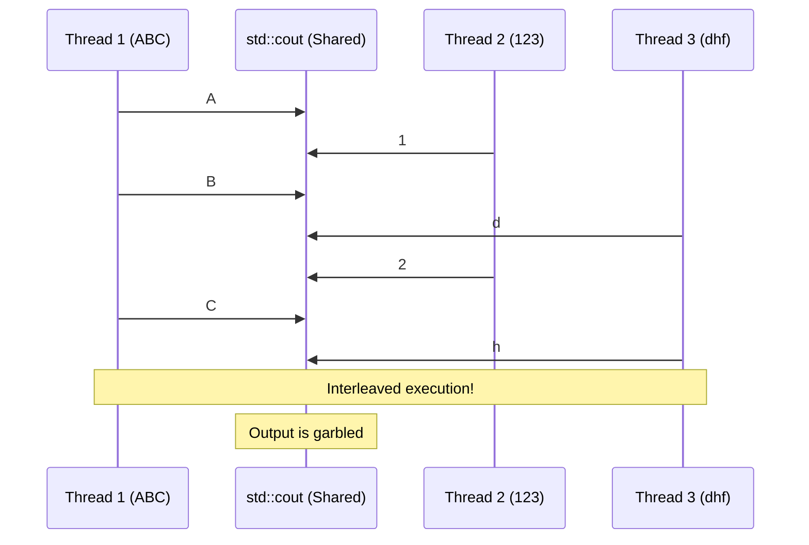
```mermaid
sequenceDiagram
    participant T1 as Thread 1 (ABC)
    participant cout as std::cout (Shared)
    participant T2 as Thread 2 (123)
    participant T3 as Thread 3 (dhf)
    
    T1->>cout: A
    T2->>cout: 1
    T1->>cout: B
    T3->>cout: d
    T2->>cout: 2
    T1->>cout: C
    T3->>cout: h
    
    Note over T1,T3: Interleaved execution!
    Note over cout: Output is garbled
```

### Data Races

A **data race** occurs when:

1. Two or more threads access the same memory location **concurrently**
2. At least one access is a **write operation**
3. The accesses are **not synchronized**

**Consequences:**

- ⚠️ **Undefined behavior** - program may crash, hang, or produce incorrect results
- 🐛 **Data corruption** - shared data becomes inconsistent
- 🔀 **Non-deterministic bugs** - hard to reproduce and debug

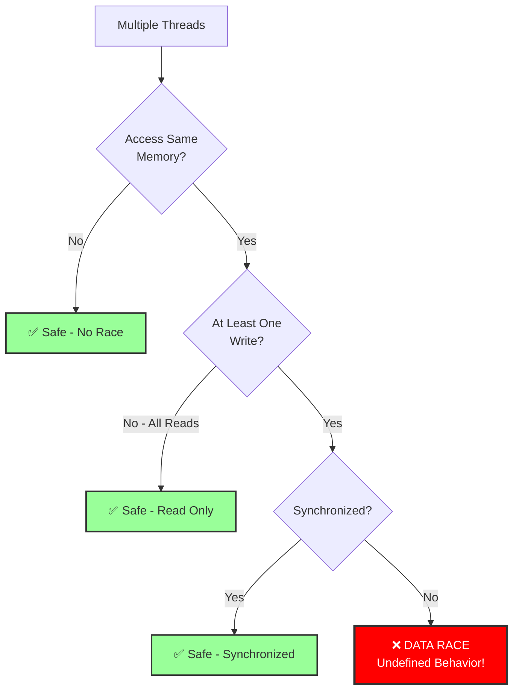
```mermaid
graph TB
    A[Multiple Threads] --> B{Access Same<br/>Memory?}
    B -->|No| C[✅ Safe - No Race]
    B -->|Yes| D{At Least One<br/>Write?}
    D -->|No - All Reads| E[✅ Safe - Read Only]
    D -->|Yes| F{Synchronized?}
    F -->|Yes| G[✅ Safe - Synchronized]
    F -->|No| H[❌ DATA RACE<br/>Undefined Behavior!]
    
    style C fill:#9f9,stroke:#333,stroke-width:2px
    style E fill:#9f9,stroke:#333,stroke-width:2px
    style G fill:#9f9,stroke:#333,stroke-width:2px
    style H fill:#f00,stroke:#333,stroke-width:3px,color:#fff
```

### Synchronization Requirement

To avoid data races, threads must be **synchronized** when accessing shared data:

- Only **one thread** should access the shared resource at a time
- Other threads must **wait** until it's safe to access
- This often means threads execute **sequentially** during shared data access

**Synchronization Mechanisms** (covered in later sections):

- 🔒 **Mutexes** - Mutual exclusion locks
- 🔐 **Locks** - RAII wrappers for mutexes
- 📡 **Condition Variables** - Thread signaling
- ⚛️ **Atomic Operations** - Lock-free synchronization

### Multiple Threads Example

```cpp
#include <thread>
#include <iostream>
#include <chrono>
#include <string>

void threadFunction(int id) {
    std::this_thread::sleep_for(std::chrono::seconds(id));
    std::cout << "Hello from thread " << id << std::endl;
}

void threadFunctionPrint(std::string s) {
    for (int i = 0; i < 5; ++i) {
        std::cout << s[0] << s[1] << s[2] << std::endl;
    }
}

void exampleMultiThread() {
    std::cout << "Starting 3 threads..." << std::endl;
    std::thread t1(threadFunction, 1);
    std::thread t2(threadFunction, 2);
    std::thread t3(threadFunction, 3);

    t1.join();
    t2.join();
    t3.join();
    std::cout << "All threads completed." << std::endl;
}

void exampleThreadWithArgs() {
    std::cout << "Starting threads with arguments..." << std::endl;
    std::thread t1(threadFunctionPrint, "ABC");
    std::thread t2(threadFunctionPrint, "123");
    std::thread t3(threadFunctionPrint, "dhf");

    t1.join();
    t2.join();
    t3.join();
    
    // std::cout is the shared resource here
    // Without synchronization, output may interleave!
    std::cout << "Threads completed." << std::endl;
}

int main() {
    exampleMultiThread();
    exampleThreadWithArgs();
    return 0;
}
```

### Key Takeaways

| Concept | Description | Risk Level |
|---------|-------------|------------|
| **Multiple Threads** | Create multiple `std::thread` objects | 🟢 Safe |
| **Shared Memory** | Threads share global/static/heap data | 🟡 Caution |
| **Thread Interleaving** | Threads execute in unpredictable order | 🟡 Caution |
| **Data Races** | Unsynchronized concurrent access with writes | 🔴 Dangerous |
| **Synchronization** | Control access to shared resources | 🟢 Required |

### Best Practices for Multiple Threads

✅ **DO:**

- Minimize shared data between threads
- Use synchronization for all shared mutable data
- Prefer message passing over shared memory when possible
- Use `std::jthread` in C++20 for automatic cleanup
- Keep critical sections (synchronized code) as short as possible

❌ **DON'T:**

- Access shared data without synchronization
- Assume threads will execute in any particular order
- Share more data than necessary
- Ignore data race warnings from thread sanitizers
- Use global variables without protection

---

## Mutex and Synchronization

### What is a Mutex?

**MUTEX** = **MUT**ual **EX**clusion object

A mutex is a synchronization primitive used to protect shared resources from concurrent access. It ensures that only one thread can access a critical section at a time.

**Key Concepts:**

- **Mutual**: Threads agree to respect the mutex
- **Exclusion**: The mutex excludes threads from the critical section
- **Two States**: A mutex can be either **locked** or **unlocked**

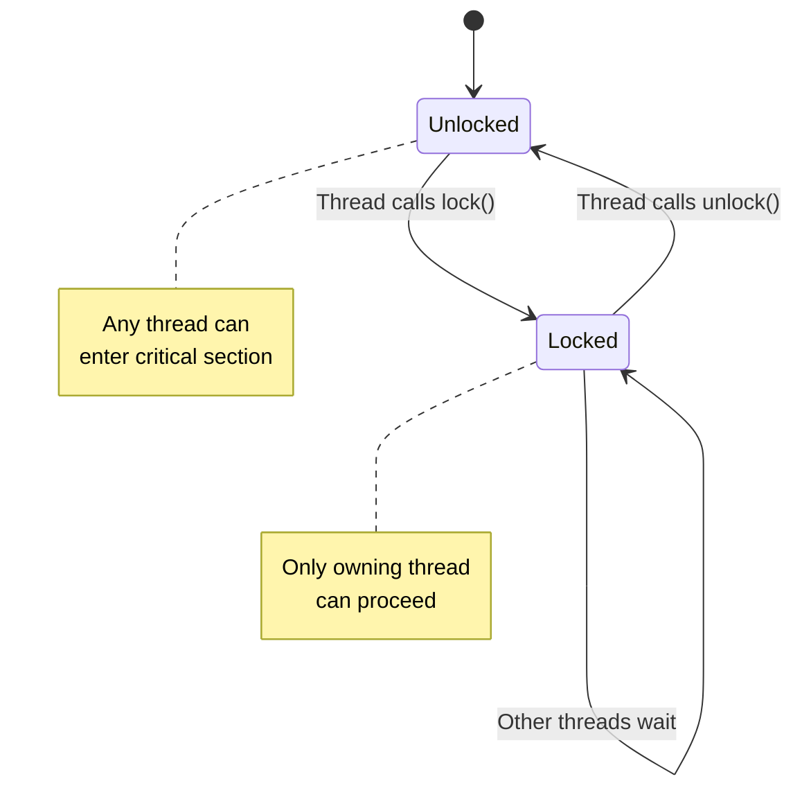
```mermaid
stateDiagram-v2
    [*] --> Unlocked
    Unlocked --> Locked: Thread calls lock()
    Locked --> Unlocked: Thread calls unlock()
    Locked --> Locked: Other threads wait
    
    note right of Unlocked
        Any thread can
        enter critical section
    end note
    
    note right of Locked
        Only owning thread
        can proceed
    end note
```

### Critical Section

A **critical section** is a section of code that accesses a shared resource. Only one thread should execute the critical section at a time to prevent data races.

```cpp
// Critical section example
mtx.lock();           // Begin critical section
std::cout << "Data";  // Access shared resource
mtx.unlock();         // End critical section
```

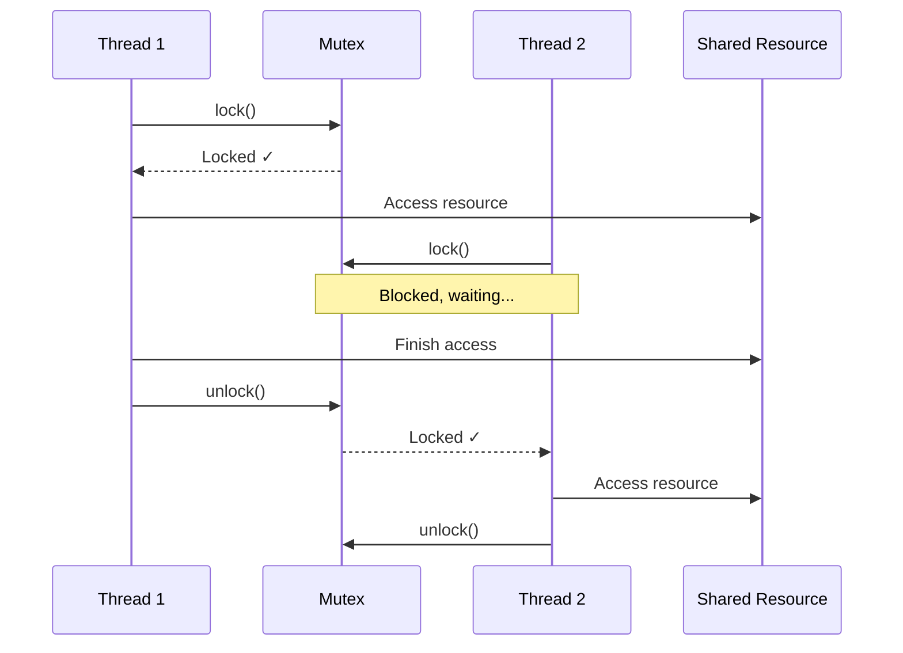
```mermaid
sequenceDiagram
    participant T1 as Thread 1
    participant Mtx as Mutex
    participant T2 as Thread 2
    participant Res as Shared Resource
    
    T1->>Mtx: lock()
    Mtx-->>T1: Locked ✓
    T1->>Res: Access resource
    
    T2->>Mtx: lock()
    Note over T2,Mtx: Blocked, waiting...
    
    T1->>Res: Finish access
    T1->>Mtx: unlock()
    Mtx-->>T2: Locked ✓
    T2->>Res: Access resource
    T2->>Mtx: unlock()
```

### Mutex States and Operations

**Locking Behavior:**

- If the mutex is **unlocked**, a thread can lock it and enter the critical section
- If the mutex is **locked**, other threads are blocked until it becomes unlocked
- A thread **locks** the mutex when entering the critical section
- A thread **unlocks** the mutex when leaving the critical section

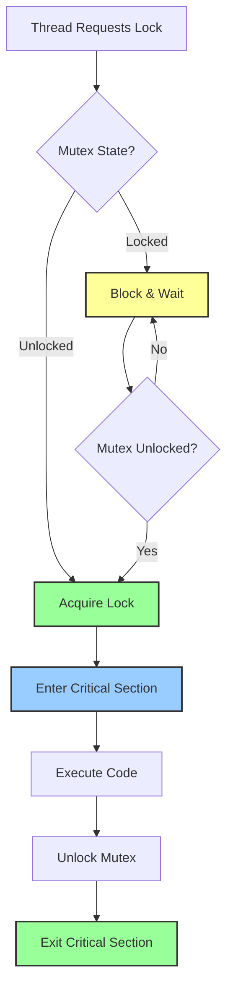
```mermaid
graph TB
    A[Thread Requests Lock] --> B{Mutex State?}
    B -->|Unlocked| C[Acquire Lock]
    B -->|Locked| D[Block & Wait]
    C --> E[Enter Critical Section]
    D --> F{Mutex Unlocked?}
    F -->|No| D
    F -->|Yes| C
    E --> G[Execute Code]
    G --> H[Unlock Mutex]
    H --> I[Exit Critical Section]
    
    style C fill:#9f9,stroke:#333,stroke-width:2px
    style D fill:#ff9,stroke:#333,stroke-width:2px
    style E fill:#9cf,stroke:#333,stroke-width:2px
    style I fill:#9f9,stroke:#333,stroke-width:2px
```

### Deadlock

A **deadlock** occurs when two or more threads are blocked forever, each waiting for the other to release a resource.

**Classic Deadlock Example:**

```cpp
// Thread 1
mutex_A.lock();
mutex_B.lock();  // Waits for Thread 2 to release mutex_B
mutex_B.unlock();
mutex_A.unlock();

// Thread 2
mutex_B.lock();
mutex_A.lock();  // Waits for Thread 1 to release mutex_A
mutex_A.unlock();
mutex_B.unlock();

// Both threads are blocked forever!
```

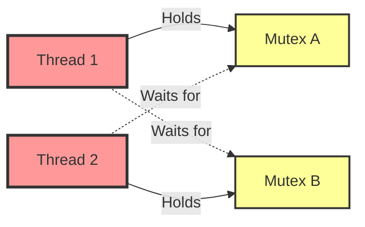
```mermaid
graph LR
    T1[Thread 1] -->|Holds| MA[Mutex A]
    T1 -.->|Waits for| MB[Mutex B]
    T2[Thread 2] -->|Holds| MB
    T2 -.->|Waits for| MA
    
    style T1 fill:#f99,stroke:#333,stroke-width:3px
    style T2 fill:#f99,stroke:#333,stroke-width:3px
    style MA fill:#ff9,stroke:#333,stroke-width:2px
    style MB fill:#ff9,stroke:#333,stroke-width:2px
```

**Avoiding Deadlock:**

1. **Lock Order**: Always lock multiple mutexes in the same order
2. **std::lock()**: Lock multiple mutexes atomically
3. **std::try_lock()**: Attempt to lock without blocking
4. **Timeouts**: Use timed lock attempts
5. **Lock Hierarchy**: Assign priorities to mutexes

### Using std::mutex

C++ provides `std::mutex` in the `<mutex>` header for mutex implementation.

**Visibility Requirements:**

A mutex object must be visible to all threads that use it:

- ✅ Global or static variable (for global functions)
- ✅ Class data member (for member functions)
- ✅ Variable captured by reference (for lambda expressions)

**Three Key Member Functions:**

| Function | Description | Behavior |
|----------|-------------|----------|
| **`lock()`** | Locks the mutex | Blocks if already locked |
| **`unlock()`** | Unlocks the mutex | Unblocks waiting threads |
| **`try_lock()`** | Attempts to lock | Returns `true` if successful, `false` if locked |

```cpp
#include <mutex>

std::mutex mtx;

// lock() - Blocking
mtx.lock();     // Waits if necessary
// Critical section
mtx.unlock();

// try_lock() - Non-blocking
if (mtx.try_lock()) {
    // Critical section
    mtx.unlock();
} else {
    // Mutex was locked, do something else
}
```

### Mutex Example

Here's a complete example demonstrating mutex usage to synchronize output:

**Without Mutex (Data Race):**

```cpp
void print_block(int n, char c) {
    for (int i = 0; i < n; ++i) {
        std::cout << c;  // Race condition!
    }
    std::cout << std::endl;
}

int main() {
    std::thread t1(print_block, 50, '*');
    std::thread t2(print_block, 50, '$');
    t1.join();
    t2.join();
    // Output: *$*$**$$***$$$... (interleaved!)
}
```

**With Mutex (Synchronized):**

```cpp
#include <thread>
#include <mutex>
#include <iostream>

std::mutex mtx;  // Global mutex

void print_block(int n, char c) {
    mtx.lock();  // Lock before critical section
    
    // Critical section - only one thread at a time
    for (int i = 0; i < n; ++i) {
        std::cout << c;
    }
    std::cout << std::endl;
    
    mtx.unlock();  // Unlock after critical section
}

int main() {
    std::thread t1(print_block, 50, '*');
    std::thread t2(print_block, 50, '$');
    
    t1.join();
    t2.join();
    
    return 0;
}
// Output: **************************************************
//         $$$$$$$$$$$$$$$$$$$$$$$$$$$$$$$$$$$$$$$$$$$$$$$$$$
// (Clean, sequential output!)
```

**Execution Flow:**

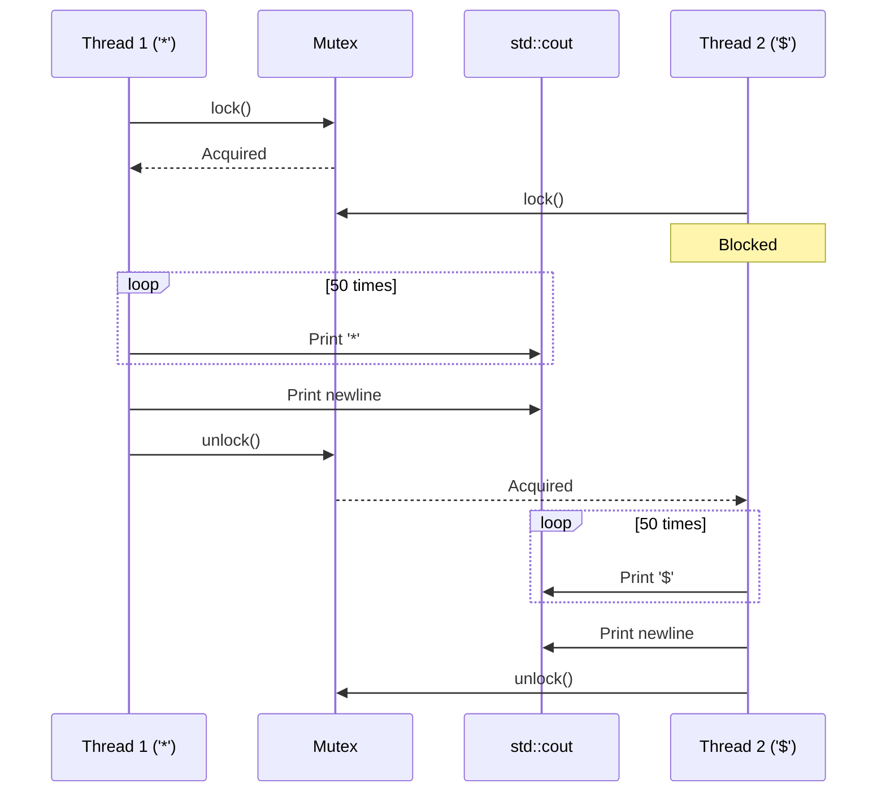
```mermaid
sequenceDiagram
    participant T1 as Thread 1 ('*')
    participant M as Mutex
    participant Out as std::cout
    participant T2 as Thread 2 ('$')
    
    T1->>M: lock()
    M-->>T1: Acquired
    
    T2->>M: lock()
    Note over T2: Blocked
    
    loop 50 times
        T1->>Out: Print '*'
    end
    T1->>Out: Print newline
    
    T1->>M: unlock()
    M-->>T2: Acquired
    
    loop 50 times
        T2->>Out: Print '$'
    end
    T2->>Out: Print newline
    
    T2->>M: unlock()
```

### Mutex Best Practices

✅ **DO:**

- Always unlock a mutex in the same function that locked it
- Keep critical sections as short as possible
- Use RAII lock guards (covered in next section) for exception safety
- Lock mutexes in consistent order to avoid deadlock
- Use `try_lock()` when you can do useful work without the lock

❌ **DON'T:**

- Forget to unlock a mutex (causes deadlock)
- Lock the same mutex twice in the same thread (undefined behavior)
- Access shared data without locking
- Hold locks longer than necessary (reduces concurrency)
- Use mutexes for read-only data (consider `shared_mutex` instead)

⚠️ **Warning:** Manual `lock()` and `unlock()` calls are error-prone, especially with exceptions. Always prefer RAII wrappers like `std::lock_guard` or `std::unique_lock` (covered in upcoming sections).

---

## Lock Guards and RAII

### The Problem with Manual Locking

When using `std::mutex` directly with manual `lock()` and `unlock()` calls, exceptions can cause serious problems:

```cpp
std::mutex mtx;

void dangerousFunction() {
    try {
        mtx.lock();              // Lock acquired
        std::cout << "Printing..." << std::endl;
        throw std::exception();  // Exception thrown!
        mtx.unlock();            // Never reached!
    }
    catch(const std::exception& e) {
        std::cerr << "Error: " << e.what() << '\n';
    }
    // Mutex is still LOCKED - DEADLOCK!
}
```

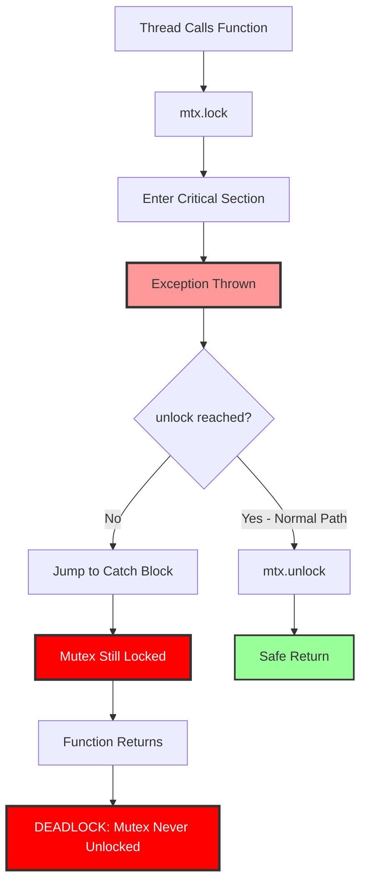
```mermaid
graph TD
    A[Thread Calls Function] --> B[mtx.lock]
    B --> C[Enter Critical Section]
    C --> D[Exception Thrown]
    D --> E{unlock reached?}
    E -->|No| F[Jump to Catch Block]
    F --> G[Mutex Still Locked]
    G --> H[Function Returns]
    H --> I[DEADLOCK: Mutex Never Unlocked]
    
    E -->|Yes - Normal Path| J[mtx.unlock]
    J --> K[Safe Return]
    
    style D fill:#f99,stroke:#333,stroke-width:3px
    style G fill:#f00,stroke:#333,stroke-width:3px,color:#fff
    style I fill:#f00,stroke:#333,stroke-width:3px,color:#fff
    style K fill:#9f9,stroke:#333,stroke-width:2px
```

**What Happens:**

1. Thread 1 locks the mutex
2. Exception is thrown inside critical section
3. Execution jumps to catch block
4. `unlock()` is never called
5. Mutex remains locked forever
6. Any other thread trying to lock this mutex will block indefinitely

### Drawbacks of std::mutex

Using `std::mutex` directly has several issues:

**Problems:**

- ❌ Every `lock()` requires a corresponding `unlock()` call
- ❌ `unlock()` must be called on **all code paths** (including exceptions)
- ❌ Multiple return statements require multiple `unlock()` calls
- ❌ Exception handling becomes complex and error-prone
- ❌ Relies on programmer discipline - easy to make mistakes

```cpp
// Example with multiple paths - error-prone!
void complexFunction(int value) {
    mtx.lock();
    
    if (value < 0) {
        // Must unlock here!
        mtx.unlock();
        return;
    }
    
    if (value > 100) {
        // Must unlock here too!
        mtx.unlock();
        throw std::runtime_error("Value too large");
    }
    
    // Process value...
    
    // And unlock here!
    mtx.unlock();
}
// Easy to forget unlock() on one of the paths!
```

### RAII Solution: std::lock_guard

C++ provides **mutex wrapper classes** that use RAII (Resource Acquisition Is Initialization) to automatically manage mutex locking:

**How RAII Works:**

- 🔒 **Constructor** locks the mutex
- 🔓 **Destructor** unlocks the mutex
- ✅ Mutex is **always** unlocked when the object goes out of scope
- ✅ Works correctly even when exceptions are thrown

`std::lock_guard` is defined in `<mutex>` and is the simplest RAII wrapper:

```cpp
template<class Mutex>
class lock_guard {
    Mutex& mtx;
public:
    explicit lock_guard(Mutex& m) : mtx(m) {
        mtx.lock();  // Lock in constructor
    }
    
    ~lock_guard() {
        mtx.unlock();  // Unlock in destructor
    }
    
    // Prevent copying
    lock_guard(const lock_guard&) = delete;
    lock_guard& operator=(const lock_guard&) = delete;
};
```

**Key Features:**

- ✅ Constructor and destructor only (no other methods)
- ✅ Cannot be copied or moved
- ✅ Automatic lifetime management
- ✅ Exception-safe by design

### How lock_guard Works

```mermaid
sequenceDiagram
    participant Func as Function
    participant LG as lock_guard
    participant Mtx as Mutex
    
    Func->>LG: Create lock_guard(mtx)
    LG->>Mtx: lock()
    Note over LG,Mtx: Constructor locks mutex
    
    Func->>Func: Execute critical section
    
    alt Exception Thrown
        Func->>Func: throw exception
        Note over Func: Stack unwinding begins
    else Normal Execution
        Func->>Func: Reach end of scope
    end
    
    LG->>Mtx: unlock()
    Note over LG,Mtx: Destructor unlocks mutex
    LG->>Func: Object destroyed
    
    Note over Func: Mutex always unlocked!
```

**Scope-Based Locking:**

```cpp
void safeFunction() {
    std::mutex mtx;
    
    {  // Begin scope
        std::lock_guard<std::mutex> guard(mtx);  // Lock acquired
        
        // Critical section
        std::cout << "Safe printing" << std::endl;
        
    }  // End scope - guard destroyed, mutex unlocked automatically!
    
    // Mutex is now unlocked
}
```

### Lock Guard Example

**Before (Manual - Unsafe):**

```cpp
std::mutex mtx;

void unsafeFunction() {
    try {
        mtx.lock();
        std::cout << "Processing..." << std::endl;
        
        // What if exception is thrown here?
        processData();  // Might throw!
        
        mtx.unlock();  // Might never be reached!
    }
    catch(...) {
        // Mutex still locked - DEADLOCK!
    }
}
```

**After (lock_guard - Safe):**

```cpp
#include <mutex>
#include <iostream>

std::mutex mtx;

void safeFunction() {
    try {
        std::lock_guard<std::mutex> guard(mtx);  // Automatic lock
        
        std::cout << "Processing..." << std::endl;
        
        // Even if exception is thrown here...
        processData();  // Might throw!
        
        // No manual unlock needed!
        
    }  // guard destructor automatically unlocks!
    catch(...) {
        // Mutex is already unlocked - SAFE!
    }
}
```

**Complete Working Example:**

```cpp
#include <thread>
#include <mutex>
#include <iostream>

std::mutex mtx;

void print_block(int n, char c) {
    // Create lock_guard - mutex locked automatically
    std::lock_guard<std::mutex> guard(mtx);
    
    // Critical section
    for (int i = 0; i < n; ++i) {
        std::cout << c;
    }
    std::cout << std::endl;
    
    // guard goes out of scope - mutex unlocked automatically
}

void riskyFunction(int id) {
    std::lock_guard<std::mutex> guard(mtx);
    
    std::cout << "Thread " << id << " started" << std::endl;
    
    if (id == 2) {
        throw std::runtime_error("Error in thread 2!");
    }
    
    std::cout << "Thread " << id << " completed" << std::endl;
    
    // Even if exception thrown, guard destructor unlocks mutex!
}

int main() {
    // Example 1: Safe printing
    std::thread t1(print_block, 50, '*');
    std::thread t2(print_block, 50, '$');
    t1.join();
    t2.join();
    
    // Example 2: Exception safety
    try {
        std::thread t3(riskyFunction, 1);
        std::thread t4(riskyFunction, 2);  // Will throw!
        t3.join();
        t4.join();
    }
    catch(const std::exception& e) {
        std::cerr << "Caught: " << e.what() << std::endl;
    }
    
    return 0;
}
```

### Comparison: Manual vs RAII Lock

```mermaid
graph TB
    subgraph Manual Locking
        A1[Call lock] --> B1[Critical Section]
        B1 --> C1{Exception?}
        C1 -->|No| D1[Call unlock]
        C1 -->|Yes| E1[Skip unlock]
        E1 --> F1[DEADLOCK!]
        D1 --> G1[Safe]
    end
    
    subgraph RAII lock_guard
        A2[Create guard] --> B2[Auto lock]
        B2 --> C2[Critical Section]
        C2 --> D2{Exception?}
        D2 -->|No| E2[Scope ends]
        D2 -->|Yes| E2
        E2 --> F2[Destructor runs]
        F2 --> G2[Auto unlock]
        G2 --> H2[SAFE!]
    end
    
    style F1 fill:#f00,stroke:#333,stroke-width:3px,color:#fff
    style H2 fill:#9f9,stroke:#333,stroke-width:3px
```

| Aspect | Manual lock/unlock | std::lock_guard |
|--------|-------------------|------------------|
| **Lock acquisition** | Manual `lock()` | Automatic (constructor) |
| **Unlock** | Manual `unlock()` | Automatic (destructor) |
| **Exception safety** | ❌ Not safe | ✅ Always safe |
| **Multiple returns** | ❌ Must unlock each path | ✅ Automatic |
| **Complexity** | 🔴 High | 🟢 Low |
| **Error-prone** | ⚠️ Yes | ✅ No |
| **Best practice** | ❌ Avoid | ✅ Recommended |

### Lock Guard Best Practices

✅ **DO:**

- Always use `std::lock_guard` instead of manual `lock()`/`unlock()`
- Create lock_guard at the beginning of the critical section
- Use braces `{}` to explicitly control lock_guard scope
- Let the lock_guard be destroyed naturally (don't try to unlock early)
- Use `std::unique_lock` if you need more flexibility

❌ **DON'T:**

- Use manual locking when lock_guard is available
- Try to store lock_guard in a variable you might forget to destroy
- Copy or assign lock_guard objects (they're non-copyable)
- Unlock the mutex manually when using lock_guard (it's managed)
- Create lock_guard without storing it in a variable

```cpp
// ❌ WRONG - Temporary lock_guard destroyed immediately!
std::lock_guard<std::mutex>(mtx);
std::cout << "Not protected!" << std::endl;

// ✅ CORRECT - Named variable lives until end of scope
std::lock_guard<std::mutex> guard(mtx);
std::cout << "Protected!" << std::endl;
```

### When to Use What

| Scenario | Recommended Tool | Reason |
|----------|-----------------|--------|
| Simple critical section | `std::lock_guard` | Simplest, safest |
| Need to unlock early | `std::unique_lock` | Provides `unlock()` method |
| Conditional locking | `std::unique_lock` | Supports deferred locking |
| Lock multiple mutexes | `std::scoped_lock` (C++17) | Deadlock-free |
| Manual control needed | `std::mutex` directly | Last resort only |

---

## Unique Lock - Flexible RAII Locking

### What is std::unique_lock?

`std::unique_lock` is a more flexible RAII mutex wrapper than `std::lock_guard`. Like `lock_guard`, it automatically manages mutex locking and unlocking, but it provides additional functionality:

**Key Features:**

- ✅ Automatic locking in constructor (like `lock_guard`)
- ✅ Automatic unlocking in destructor (like `lock_guard`)
- ✅ **Manual `unlock()` method** for early release
- ✅ **`lock()` method** to re-acquire the lock
- ✅ Deferred locking (lock later, not in constructor)
- ✅ Timed locking attempts
- ✅ Can be moved (but not copied)

```cpp
template<class Mutex>
class unique_lock {
    Mutex* mtx;
    bool owns;
public:
    explicit unique_lock(Mutex& m) : mtx(&m), owns(true) {
        mtx->lock();  // Lock in constructor
    }
    
    ~unique_lock() {
        if (owns && mtx) {
            mtx->unlock();  // Unlock in destructor if still owned
        }
    }
    
    void unlock() {
        if (owns) {
            mtx->unlock();
            owns = false;
        }
    }
    
    void lock() {
        mtx->lock();
        owns = true;
    }
    
    // Move semantics supported
    unique_lock(unique_lock&& other) noexcept;
    unique_lock& operator=(unique_lock&& other) noexcept;
};
```

### unique_lock vs lock_guard

```mermaid
graph TB
    subgraph lock_guard
        A1[Constructor] --> B1[Lock Mutex]
        B1 --> C1[Critical Section]
        C1 --> D1[Destructor]
        D1 --> E1[Unlock Mutex]
        
        Note1["No manual unlock()\nNo flexibility\nSimpler & Faster"]
    end
    
    subgraph unique_lock
        A2[Constructor] --> B2[Lock Mutex]
        B2 --> C2[Critical Section]
        C2 --> D2{Manual unlock?}
        D2 -->|Yes| E2[unlock method]
        E2 --> F2[Non-Critical Code]
        F2 --> G2{Re-lock needed?}
        G2 -->|Yes| H2[lock method]
        G2 -->|No| I2[Destructor]
        D2 -->|No| I2
        H2 --> C2
        I2 --> J2[Unlock if still locked]
        
        Note2["Manual unlock() available\nMore flexibility\nSlightly slower"]
    end
    
    style E2 fill:#9cf,stroke:#333,stroke-width:2px
    style H2 fill:#9cf,stroke:#333,stroke-width:2px
```

| Feature | std::lock_guard | std::unique_lock |
|---------|----------------|------------------|
| **Auto lock in constructor** | ✅ Yes | ✅ Yes |
| **Auto unlock in destructor** | ✅ Yes | ✅ Yes |
| **Manual `unlock()` method** | ❌ No | ✅ Yes |
| **Manual `lock()` method** | ❌ No | ✅ Yes |
| **Deferred locking** | ❌ No | ✅ Yes |
| **Timed locking** | ❌ No | ✅ Yes |
| **Can be moved** | ❌ No | ✅ Yes |
| **Ownership transfer** | ❌ No | ✅ Yes |
| **Performance** | 🟢 Faster | 🟡 Slightly slower |
| **Memory overhead** | 🟢 Less | 🟡 More (tracks state) |
| **Complexity** | 🟢 Simple | 🟡 More complex |
| **Use case** | Simple locking | Flexible locking |

### Manual Unlocking with unique_lock

The key advantage of `unique_lock` is the ability to unlock the mutex **before** the destructor runs, allowing other threads to proceed while you execute non-critical code.

```cpp
#include <mutex>
#include <thread>
#include <iostream>

std::mutex mtx;

void processData(int id) {
    std::unique_lock<std::mutex> lock(mtx);  // Lock acquired
    
    // Critical section - accessing shared resource
    std::cout << "Thread " << id << ": Reading shared data" << std::endl;
    
    lock.unlock();  // Manually unlock - other threads can proceed!
    
    // Non-critical section - long computation, no shared data
    std::cout << "Thread " << id << ": Processing (unlocked)..." << std::endl;
    std::this_thread::sleep_for(std::chrono::milliseconds(100));
    
    // If we need the lock again, we can re-lock
    lock.lock();
    std::cout << "Thread " << id << ": Writing result" << std::endl;
    lock.unlock();
    
    // More non-critical work
    std::cout << "Thread " << id << ": Cleanup (unlocked)" << std::endl;
    
}  // Destructor checks - if still locked, unlocks automatically
```

```mermaid
sequenceDiagram
    participant T1 as Thread 1
    participant UL as unique_lock
    participant M as Mutex
    participant T2 as Thread 2
    
    T1->>UL: Create unique_lock
    UL->>M: lock()
    Note over T1,M: Critical section
    
    T2->>M: Try to lock
    Note over T2: Blocked
    
    T1->>UL: unlock()
    UL->>M: unlock()
    Note over T1: Non-critical work
    
    M->>T2: Lock acquired
    Note over T2: Critical section
    
    T1->>UL: lock()
    Note over T1: Waiting for T2
    
    T2->>M: unlock()
    M->>T1: Lock acquired
    
    T1->>UL: unlock()
    Note over T1: More work
    
    T1->>UL: Destructor
    Note over UL: Already unlocked, nothing to do
```

**Benefits:**

- 🚀 **Better concurrency** - other threads don't wait during non-critical code
- ⏱️ **Reduced lock contention** - mutex held for shorter time
- 🔄 **Flexibility** - can lock/unlock multiple times
- ✅ **Still safe** - destructor ensures unlock even if you forget

### Unique Lock Example

#### Comparison: lock_guard vs unique_lock

```cpp
#include <mutex>
#include <thread>
#include <iostream>
#include <chrono>

std::mutex mtx;

// Using lock_guard - mutex held entire time
void processWithLockGuard(int id) {
    std::lock_guard<std::mutex> guard(mtx);  // Lock acquired
    
    std::cout << "[LG] Thread " << id << ": Critical section" << std::endl;
    
    // Mutex still locked during this long operation!
    std::this_thread::sleep_for(std::chrono::milliseconds(100));
    std::cout << "[LG] Thread " << id << ": Still locked..." << std::endl;
    
}  // Unlock only when destructor runs

// Using unique_lock - early unlock
void processWithUniqueLock(int id) {
    std::unique_lock<std::mutex> lock(mtx);  // Lock acquired
    
    std::cout << "[UL] Thread " << id << ": Critical section" << std::endl;
    
    lock.unlock();  // Unlock early!
    
    // Mutex unlocked - other threads can proceed
    std::this_thread::sleep_for(std::chrono::milliseconds(100));
    std::cout << "[UL] Thread " << id << ": Unlocked!" << std::endl;
    
}  // Destructor does nothing (already unlocked)

int main() {
    auto start = std::chrono::high_resolution_clock::now();
    
    // lock_guard version - threads wait longer
    std::cout << "\n=== Using lock_guard ===" << std::endl;
    std::thread t1(processWithLockGuard, 1);
    std::thread t2(processWithLockGuard, 2);
    t1.join();
    t2.join();
    
    auto mid = std::chrono::high_resolution_clock::now();
    
    // unique_lock version - threads proceed faster
    std::cout << "\n=== Using unique_lock ===" << std::endl;
    std::thread t3(processWithUniqueLock, 3);
    std::thread t4(processWithUniqueLock, 4);
    t3.join();
    t4.join();
    
    auto end = std::chrono::high_resolution_clock::now();
    
    std::cout << "\nlock_guard time: " 
              << std::chrono::duration_cast<std::chrono::milliseconds>(mid - start).count() 
              << "ms" << std::endl;
    std::cout << "unique_lock time: " 
              << std::chrono::duration_cast<std::chrono::milliseconds>(end - mid).count() 
              << "ms" << std::endl;
    
    return 0;
}
```

**Output:**

```text
=== Using lock_guard ===
[LG] Thread 1: Critical section
[LG] Thread 1: Still locked...
[LG] Thread 2: Critical section
[LG] Thread 2: Still locked...

=== Using unique_lock ===
[UL] Thread 3: Critical section
[UL] Thread 3: Unlocked!
[UL] Thread 4: Critical section
[UL] Thread 4: Unlocked!

lock_guard time: 200ms   (sequential execution)
unique_lock time: 100ms  (overlapping execution)
```

### Advanced unique_lock Features

#### 1. Deferred Locking

Lock the mutex later, not in the constructor:

```cpp
std::mutex mtx;
std::unique_lock<std::mutex> lock(mtx, std::defer_lock);  // Don't lock yet

// Do some work without the lock
prepareSomeData();

// Now lock when needed
lock.lock();
modifySharedData();
lock.unlock();
```

#### 2. Try Locking

Attempt to lock without blocking:

```cpp
std::unique_lock<std::mutex> lock(mtx, std::defer_lock);

if (lock.try_lock()) {
    // Got the lock!
    accessSharedData();
} else {
    // Couldn't get lock, do something else
    doAlternativeWork();
}
```

#### 3. Timed Locking

Wait for a lock with a timeout:

```cpp
std::unique_lock<std::mutex> lock(mtx, std::defer_lock);

if (lock.try_lock_for(std::chrono::milliseconds(100))) {
    // Got the lock within 100ms
    accessSharedData();
} else {
    // Timeout - couldn't get lock
    handleTimeout();
}
```

#### 4. Move Semantics

Transfer ownership of the lock:

```cpp
std::unique_lock<std::mutex> createLock() {
    std::unique_lock<std::mutex> lock(mtx);
    // Lock is acquired
    return lock;  // Ownership transferred
}

std::unique_lock<std::mutex> myLock = createLock();
// myLock now owns the lock
```

### Unique Lock Best Practices

✅ **DO:**

- Use `unique_lock` when you need to unlock before destructor
- Unlock as soon as the critical section ends
- Use deferred locking when lock timing is conditional
- Prefer `lock_guard` if you don't need the extra features (simpler/faster)
- Use `try_lock()` or `try_lock_for()` to avoid blocking indefinitely

❌ **DON'T:**

- Use `unique_lock` when `lock_guard` would suffice (unnecessary overhead)
- Forget that manual `unlock()` is optional (destructor still works)
- Unlock and then access shared data (defeats the purpose)
- Hold locks longer than necessary (hurts concurrency)
- Unlock and forget to re-lock when accessing shared data again

### When to Use unique_lock

**Use `unique_lock` when you need:**

1. ✅ **Early unlocking** - Release lock before destructor
2. ✅ **Deferred locking** - Lock later, not in constructor
3. ✅ **Try locking** - Non-blocking lock attempts
4. ✅ **Timed locking** - Lock with timeout
5. ✅ **Condition variables** - Required by `std::condition_variable`
6. ✅ **Move semantics** - Transfer lock ownership
7. ✅ **Multiple lock/unlock cycles** - Lock, unlock, re-lock

**Use `lock_guard` when:**

- ✅ Lock entire scope (from construction to destruction)
- ✅ Simplest code with best performance
- ✅ No need for manual unlock

```mermaid
graph TD
    A[Need Mutex Wrapper?] --> B{Need manual unlock?}
    B -->|No| C[Use lock_guard]
    B -->|Yes| D{Need try_lock?}
    D -->|No| E{Need deferred lock?}
    D -->|Yes| F[Use unique_lock]
    E -->|No| G{Need condition variable?}
    E -->|Yes| F
    G -->|No| H[Consider lock_guard]
    G -->|Yes| F
    H --> I{Really need flexibility?}
    I -->|No| C
    I -->|Yes| F
    
    style C fill:#9f9,stroke:#333,stroke-width:2px
    style F fill:#9cf,stroke:#333,stroke-width:2px
```

### Complete unique_lock Example

```cpp
#include <thread>
#include <mutex>
#include <iostream>
#include <vector>
#include <chrono>

std::mutex mtx;
int sharedCounter = 0;

void worker(int id) {
    for (int i = 0; i < 3; ++i) {
        // Lock for reading shared data
        std::unique_lock<std::mutex> lock(mtx);
        int localCopy = sharedCounter;
        std::cout << "Thread " << id << " read: " << localCopy << std::endl;
        lock.unlock();  // Unlock early!
        
        // Process without holding lock (simulating computation)
        std::this_thread::sleep_for(std::chrono::milliseconds(50));
        int result = localCopy + 1;
        
        // Re-lock for writing
        lock.lock();
        sharedCounter = result;
        std::cout << "Thread " << id << " wrote: " << result << std::endl;
        lock.unlock();
        
        // More work without lock
        std::this_thread::sleep_for(std::chrono::milliseconds(10));
    }
}  // Destructor ensures unlock if still locked

int main() {
    std::vector<std::thread> threads;
    
    for (int i = 1; i <= 3; ++i) {
        threads.emplace_back(worker, i);
    }
    
    for (auto& t : threads) {
        t.join();
    }
    
    std::cout << "\nFinal counter: " << sharedCounter << std::endl;
    
    return 0;
}
```

**Key Points:**

- Lock is acquired automatically in constructor
- `unlock()` releases lock for non-critical computation
- `lock()` re-acquires lock for writing
- Destructor ensures cleanup even if we forget to unlock
- Better concurrency than holding lock entire time

---

## Recursive Mutex

### The Problem with Regular Mutex

A regular `std::mutex` cannot be locked multiple times by the same thread. If a thread tries to lock a mutex it already owns, it causes **undefined behavior** (usually a deadlock):

```cpp
std::mutex mtx;

void function() {
    mtx.lock();
    std::cout << "Locked once" << std::endl;
    mtx.lock();  // ❌ DEADLOCK! Same thread trying to lock again
    std::cout << "This will never print" << std::endl;
    mtx.unlock();
    mtx.unlock();
}
```

**Problem Scenario:**

This is especially problematic with **recursive functions** or when a locked function calls another locked function:

```cpp
std::mutex mtx;

void helperFunction() {
    std::lock_guard<std::mutex> lock(mtx);  // Lock acquired
    std::cout << "Helper function" << std::endl;
}

void mainFunction() {
    std::lock_guard<std::mutex> lock(mtx);  // Lock acquired
    std::cout << "Main function" << std::endl;
    helperFunction();  // ❌ DEADLOCK! Tries to lock again
}
```

```mermaid
sequenceDiagram
    participant Thread
    participant Mtx as std::mutex
    participant Func as Function
    
    Thread->>Mtx: lock() - First time
    Mtx-->>Thread: Acquired ✓
    
    Thread->>Func: Execute function
    Func->>Func: Recursive call
    
    Thread->>Mtx: lock() - Second time
    Note over Thread,Mtx: Same thread tries to lock again
    Mtx-->>Thread: BLOCKED!
    Note over Thread: DEADLOCK ❌
    Note over Thread: Thread waits for itself!
```

### What is std::recursive_mutex?

`std::recursive_mutex` is a special mutex that allows the **same thread** to lock it **multiple times** without causing a deadlock.

**Key Features:**

- ✅ Same thread can lock multiple times
- ✅ Tracks the number of times it's been locked (lock count)
- ✅ Must be unlocked the same number of times as it was locked
- ✅ Other threads still blocked (mutual exclusion maintained)
- ⚠️ Slightly slower than regular mutex (due to ownership tracking)

```cpp
std::recursive_mutex rec_mtx;

void function() {
    rec_mtx.lock();  // Lock count: 1
    std::cout << "Locked once" << std::endl;
    
    rec_mtx.lock();  // Lock count: 2 - Same thread, OK!
    std::cout << "Locked twice" << std::endl;
    
    rec_mtx.unlock();  // Lock count: 1
    rec_mtx.unlock();  // Lock count: 0 - Now fully unlocked
}
```

### How Recursive Mutex Works

```mermaid
stateDiagram-v2
    [*] --> Unlocked: Initial state
    Unlocked --> Locked_1: Thread A locks (count=1)
    Locked_1 --> Locked_2: Thread A locks again (count=2)
    Locked_2 --> Locked_3: Thread A locks again (count=3)
    Locked_3 --> Locked_2: Thread A unlocks (count=2)
    Locked_2 --> Locked_1: Thread A unlocks (count=1)
    Locked_1 --> Unlocked: Thread A unlocks (count=0)
    
    Locked_1 --> Blocked: Thread B tries to lock
    Locked_2 --> Blocked: Thread B tries to lock
    Locked_3 --> Blocked: Thread B tries to lock
    Blocked --> Locked_1: Thread A fully unlocks
    
    note right of Unlocked
        Lock count = 0
        No owner
    end note
    
    note right of Locked_1
        Lock count = 1
        Owned by Thread A
    end note
    
    note right of Blocked
        Different thread
        must wait
    end note
```

**Internal Mechanism:**

1. **Ownership Tracking**: Recursive mutex remembers which thread owns it
2. **Lock Counter**: Tracks how many times the owner has locked it
3. **Recursive Locking**: If owner locks again, increment counter (don't block)
4. **Unlock Requirement**: Must call `unlock()` equal number of times
5. **Full Unlock**: Counter reaches 0, mutex becomes available to other threads

```mermaid
graph TB
    A[Thread Calls lock] --> B{Is mutex locked?}
    B -->|No| C[Acquire lock]
    C --> D[Set owner = current thread]
    D --> E[Set count = 1]
    
    B -->|Yes| F{Owner == current thread?}
    F -->|Yes| G[Increment count]
    F -->|No| H[Block until available]
    
    I[Thread Calls unlock] --> J[Decrement count]
    J --> K{Count == 0?}
    K -->|Yes| L[Release lock]
    K -->|No| M[Keep lock, count > 0]
    
    style C fill:#9f9,stroke:#333,stroke-width:2px
    style G fill:#9f9,stroke:#333,stroke-width:2px
    style H fill:#f99,stroke:#333,stroke-width:2px
    style L fill:#9f9,stroke:#333,stroke-width:2px
```

### Factorial Example

A classic use case for recursive mutex is a **recursive function** that needs to protect shared data:

```cpp
#include <iostream>
#include <thread>
#include <mutex>
#include <vector>

std::recursive_mutex rec_mtx;
std::vector<std::string> callLog;

// Recursive factorial function with thread safety
int factorial(int n) {
    std::lock_guard<std::recursive_mutex> lock(rec_mtx);
    
    // Log the call (shared resource)
    callLog.push_back("factorial(" + std::to_string(n) + ") called");
    std::cout << "Computing factorial(" << n << ")" << std::endl;
    
    // Base case
    if (n <= 1) {
        return 1;
    }
    
    // Recursive case - lock is acquired again!
    int result = n * factorial(n - 1);
    
    std::cout << "factorial(" << n << ") = " << result << std::endl;
    return result;
    
}  // Lock released (count decremented)

int main() {
    std::cout << "=== Single Thread Example ===" << std::endl;
    int result = factorial(5);
    std::cout << "\nResult: 5! = " << result << std::endl;
    
    std::cout << "\n=== Multi-threaded Example ===" << std::endl;
    callLog.clear();
    
    std::thread t1([](){ 
        std::cout << "Thread 1: " << factorial(4) << std::endl; 
    });
    
    std::thread t2([](){ 
        std::cout << "Thread 2: " << factorial(3) << std::endl; 
    });
    
    t1.join();
    t2.join();
    
    std::cout << "\nCall log size: " << callLog.size() << std::endl;
    
    return 0;
}
```

**Output:**

```text
=== Single Thread Example ===
Computing factorial(5)
Computing factorial(4)
Computing factorial(3)
Computing factorial(2)
Computing factorial(1)
factorial(1) = 1
factorial(2) = 2
factorial(3) = 6
factorial(4) = 24
factorial(5) = 120

Result: 5! = 120

=== Multi-threaded Example ===
Thread 1: Computing factorial(4)
Thread 1: Computing factorial(3)
Thread 1: Computing factorial(2)
Thread 1: Computing factorial(1)
Thread 1: factorial(1) = 1
Thread 1: factorial(2) = 2
Thread 1: factorial(3) = 6
Thread 1: factorial(4) = 24
Thread 1: 24
Thread 2: Computing factorial(3)
Thread 2: Computing factorial(2)
Thread 2: Computing factorial(1)
Thread 2: factorial(1) = 1
Thread 2: factorial(2) = 2
Thread 2: factorial(3) = 6
Thread 2: 6

Call log size: 15
```

**How It Works:**

```mermaid
sequenceDiagram
    participant Main
    participant RecMtx as recursive_mutex
    participant Fact as factorial function
    
    Main->>Fact: factorial(5)
    Fact->>RecMtx: lock() - count=1
    Note over Fact: Process n=5
    
    Fact->>Fact: factorial(4)
    Fact->>RecMtx: lock() - count=2 ✓
    Note over Fact: Process n=4
    
    Fact->>Fact: factorial(3)
    Fact->>RecMtx: lock() - count=3 ✓
    Note over Fact: Process n=3
    
    Fact->>Fact: factorial(2)
    Fact->>RecMtx: lock() - count=4 ✓
    Note over Fact: Process n=2
    
    Fact->>Fact: factorial(1)
    Fact->>RecMtx: lock() - count=5 ✓
    Note over Fact: Base case, return 1
    Fact->>RecMtx: unlock() - count=4
    
    Note over Fact: Return 2
    Fact->>RecMtx: unlock() - count=3
    
    Note over Fact: Return 6
    Fact->>RecMtx: unlock() - count=2
    
    Note over Fact: Return 24
    Fact->>RecMtx: unlock() - count=1
    
    Note over Fact: Return 120
    Fact->>RecMtx: unlock() - count=0
    
    Fact-->>Main: 120
```

**Why Recursive Mutex is Needed:**

1. **Recursive Calls**: `factorial(5)` calls `factorial(4)`, which calls `factorial(3)`, etc.
2. **Each Call Locks**: Each recursive call tries to acquire the lock
3. **Same Thread**: All calls happen in the same thread
4. **Regular Mutex Would Deadlock**: Second lock attempt would block forever
5. **Recursive Mutex Allows It**: Tracks ownership and lock count

### Another Example: Nested Function Calls

```cpp
#include <iostream>
#include <mutex>
#include <thread>

std::recursive_mutex rec_mtx;

class Account {
    int balance;
    std::recursive_mutex& mtx;
    
public:
    Account(int initial, std::recursive_mutex& m) 
        : balance(initial), mtx(m) {}
    
    void deposit(int amount) {
        std::lock_guard<std::recursive_mutex> lock(mtx);
        balance += amount;
        std::cout << "Deposited " << amount 
                  << ", new balance: " << balance << std::endl;
    }
    
    void withdraw(int amount) {
        std::lock_guard<std::recursive_mutex> lock(mtx);
        balance -= amount;
        std::cout << "Withdrew " << amount 
                  << ", new balance: " << balance << std::endl;
    }
    
    // Transfer calls both deposit and withdraw - needs recursive mutex!
    void transfer(Account& other, int amount) {
        std::lock_guard<std::recursive_mutex> lock(mtx);
        std::cout << "\nTransferring " << amount << "..." << std::endl;
        
        this->withdraw(amount);  // Locks mtx again!
        other.deposit(amount);   // Locks other.mtx
        
        std::cout << "Transfer complete\n" << std::endl;
    }
    
    int getBalance() {
        std::lock_guard<std::recursive_mutex> lock(mtx);
        return balance;
    }
};

int main() {
    Account acc1(1000, rec_mtx);
    Account acc2(500, rec_mtx);
    
    std::cout << "Initial balances:" << std::endl;
    std::cout << "Account 1: " << acc1.getBalance() << std::endl;
    std::cout << "Account 2: " << acc2.getBalance() << std::endl;
    
    // Transfer requires recursive locking
    acc1.transfer(acc2, 200);
    
    std::cout << "Final balances:" << std::endl;
    std::cout << "Account 1: " << acc1.getBalance() << std::endl;
    std::cout << "Account 2: " << acc2.getBalance() << std::endl;
    
    return 0;
}
```

### Comparison: mutex vs recursive_mutex

| Feature | std::mutex | std::recursive_mutex |
|---------|-----------|----------------------|
| **Same thread re-lock** | ❌ Deadlock | ✅ Allowed |
| **Lock count tracking** | ❌ No | ✅ Yes |
| **Ownership tracking** | ❌ No | ✅ Yes |
| **Performance** | 🟢 Faster | 🟡 Slower (overhead) |
| **Memory** | 🟢 Less | 🟡 More |
| **Use case** | Simple locking | Recursive functions |
| **Complexity** | 🟢 Simple | 🟡 Complex |
| **Best practice** | ✅ Prefer when possible | ⚠️ Use only when needed |

### Recursive Mutex Best Practices

✅ **DO:**

- Use recursive_mutex for genuinely recursive functions
- Use when a locked function must call another locked function
- Ensure unlock count matches lock count
- Use with RAII wrappers (`lock_guard`, `unique_lock`)
- Document why recursive locking is necessary

❌ **DON'T:**

- Use recursive_mutex as default (prefer regular mutex)
- Use it to work around poor design (consider refactoring)
- Mix recursive and non-recursive mutexes carelessly
- Forget that it's slower than regular mutex
- Rely on manual lock/unlock (use RAII)

⚠️ **Warning:** Using recursive_mutex is often a sign of design issues. Consider if you can refactor to avoid recursive locking:

```cpp
// ❌ Using recursive_mutex to patch design issue
class BadDesign {
    std::recursive_mutex mtx;
    
    void publicMethod() {
        std::lock_guard<std::recursive_mutex> lock(mtx);
        privateHelper();  // Locks again
    }
    
    void privateHelper() {
        std::lock_guard<std::recursive_mutex> lock(mtx);
        // Do work
    }
};

// ✅ Better design - separate locked and unlocked helpers
class GoodDesign {
    std::mutex mtx;
    
    void publicMethod() {
        std::lock_guard<std::mutex> lock(mtx);
        privateHelperUnlocked();  // No lock needed
    }
    
    void privateHelperUnlocked() {
        // Do work - assumes lock is already held
    }
};
```

### When to Use Recursive Mutex

**Good Use Cases:**

1. ✅ Truly recursive algorithms (factorial, tree traversal)
2. ✅ Legacy code that's hard to refactor
3. ✅ Callback mechanisms with unknown call chains
4. ✅ Complex class hierarchies with virtual functions

**Avoid If Possible:**

1. ❌ Simple sequential code
2. ❌ Code that can be refactored to avoid recursion
3. ❌ High-performance critical sections
4. ❌ When regular mutex would work

```mermaid
graph TD
    A[Need Mutex?] --> B{Recursive function?}
    B -->|No| C{Locked function calls locked function?}
    C -->|No| D[Use std::mutex]
    C -->|Yes| E{Can refactor?}
    E -->|Yes| F[Refactor & use std::mutex]
    E -->|No| G[Use recursive_mutex]
    B -->|Yes| H{Can avoid recursion?}
    H -->|Yes| I[Refactor & use std::mutex]
    H -->|No| G
    
    style D fill:#9f9,stroke:#333,stroke-width:2px
    style F fill:#9f9,stroke:#333,stroke-width:2px
    style G fill:#ff9,stroke:#333,stroke-width:2px
```

---

## Timed Mutex

### What is std::timed_mutex?

`std::timed_mutex` is a mutex that supports **timeout-based locking**. Unlike regular `std::mutex`, it allows you to attempt to acquire a lock for a specific duration or until a specific time point, rather than blocking indefinitely.

**Key Features:**

- ✅ All features of `std::mutex` (`lock()`, `unlock()`, `try_lock()`)
- ✅ **`try_lock_for(duration)`** - Try to lock for a specified time duration
- ✅ **`try_lock_until(time_point)`** - Try to lock until a specific time point
- ✅ Returns `true` if lock acquired, `false` if timeout expired
- ✅ Prevents indefinite blocking in contended scenarios

```cpp
#include <mutex>
#include <chrono>

std::timed_mutex tmtx;

// Try to lock for 100 milliseconds
if (tmtx.try_lock_for(std::chrono::milliseconds(100))) {
    // Lock acquired within 100ms
    // Critical section
    tmtx.unlock();
} else {
    // Timeout - couldn't get lock in time
    // Handle timeout
}
```

### Timed Locking Methods

`std::timed_mutex` provides four member functions:

| Method | Description | Behavior | Return |
|--------|-------------|----------|--------|
| **`lock()`** | Block until lock acquired | Waits indefinitely | void |
| **`try_lock()`** | Attempt to lock immediately | Returns immediately | bool |
| **`try_lock_for(duration)`** | Try to lock for time duration | Waits up to duration | bool |
| **`try_lock_until(time_point)`** | Try to lock until time point | Waits until deadline | bool |

```mermaid
graph TB
    A[Thread Attempts Lock] --> B{Method?}
    
    B -->|lock| C[Block Forever]
    C --> D[Eventually Acquire]
    
    B -->|try_lock| E[Try Immediately]
    E --> F{Success?}
    F -->|Yes| G[Return true]
    F -->|No| H[Return false]
    
    B -->|try_lock_for| I[Wait for Duration]
    I --> J{Acquired before timeout?}
    J -->|Yes| K[Return true]
    J -->|No| L[Return false]
    
    B -->|try_lock_until| M[Wait Until Time Point]
    M --> N{Acquired before deadline?}
    N -->|Yes| O[Return true]
    N -->|No| P[Return false]
    
    style D fill:#9f9,stroke:#333,stroke-width:2px
    style G fill:#9f9,stroke:#333,stroke-width:2px
    style H fill:#f99,stroke:#333,stroke-width:2px
    style K fill:#9f9,stroke:#333,stroke-width:2px
    style L fill:#f99,stroke:#333,stroke-width:2px
    style O fill:#9f9,stroke:#333,stroke-width:2px
    style P fill:#f99,stroke:#333,stroke-width:2px
```

### Understanding Chrono Clocks

Before using timed mutexes, it's important to understand the different clock types provided by `<chrono>`:

#### std::chrono::system_clock

- **Source**: Gets time from the operating system
- **Characteristics**: Represents wall-clock time (real-world time)
- **Stability**: ⚠️ **May change erratically** due to:
  - System time adjustments
  - Daylight saving time changes
  - Manual user changes
  - NTP (Network Time Protocol) synchronization
- **Best Use**: **Time points** - When you need actual calendar dates/times
- **Not Recommended**: Measuring time intervals (can go backwards!)

```cpp
using namespace std::chrono;

// Get current wall-clock time
auto now = system_clock::now();

// Convert to time_t for display
time_t tt = system_clock::to_time_t(now);
std::cout << "Current time: " << std::ctime(&tt);

// Use for absolute deadlines (e.g., "lock until 3:00 PM")
auto deadline = now + hours(2);
if (mtx.try_lock_until(deadline)) {
    // Got lock before 3:00 PM
}
```

#### std::chrono::steady_clock

- **Source**: Monotonic clock (never adjusted)
- **Characteristics**: **Always increases steadily** at a uniform rate
- **Stability**: ✅ **Guaranteed never to go backwards**
- **Best Use**: **Measuring intervals** - Duration measurements and timeouts
- **Recommended**: For `try_lock_for()` operations

```cpp
using namespace std::chrono;

// Measure time interval
auto start = steady_clock::now();

// Do some work
performTask();

auto end = steady_clock::now();
auto duration = duration_cast<milliseconds>(end - start);
std::cout << "Task took: " << duration.count() << "ms" << std::endl;

// Use for relative timeouts (e.g., "try for 100ms")
if (mtx.try_lock_for(milliseconds(100))) {
    // Got lock within 100ms
}
```

#### Clock Comparison

```mermaid
graph TB
    subgraph system_clock
        A1[Wall Clock Time]
        A2[Can Jump Forward/Backward]
        A3[Affected by System Changes]
        A4[Example: 2:30 PM]
    end
    
    subgraph steady_clock
        B1[Monotonic Time]
        B2[Always Increases]
        B3[Never Goes Backward]
        B4[Example: 1,234,567ms since start]
    end
    
    style A2 fill:#f99,stroke:#333,stroke-width:2px
    style A3 fill:#f99,stroke:#333,stroke-width:2px
    style B2 fill:#9f9,stroke:#333,stroke-width:2px
    style B3 fill:#9f9,stroke:#333,stroke-width:2px
```

| Feature | system_clock | steady_clock |
|---------|--------------|--------------|
| **Time source** | OS/wall-clock | Monotonic counter |
| **Can go backwards** | ✅ Yes | ❌ No |
| **Affected by adjustments** | ✅ Yes | ❌ No |
| **Use for time points** | ✅ Recommended | ❌ Not suitable |
| **Use for intervals** | ❌ Dangerous | ✅ Recommended |
| **Example use** | Absolute deadlines | Timeouts & durations |

#### When to Use Which Clock

```cpp
// ✅ CORRECT: Use steady_clock for try_lock_for (duration)
if (mtx.try_lock_for(std::chrono::milliseconds(100))) {
    // Guaranteed to wait ~100ms regardless of system time changes
}

// ✅ CORRECT: Use system_clock for try_lock_until (absolute time)
auto deadline = std::chrono::system_clock::now() + std::chrono::seconds(5);
if (mtx.try_lock_until(deadline)) {
    // Lock until specific wall-clock time
}

// ❌ WRONG: Using system_clock for interval measurement
auto start = std::chrono::system_clock::now();
performTask();
auto end = std::chrono::system_clock::now();
// If system time changed during task, duration will be wrong!

// ✅ CORRECT: Use steady_clock for interval measurement
auto start = std::chrono::steady_clock::now();
performTask();
auto end = std::chrono::steady_clock::now();
// Accurate duration even if system time changed
```

#### Timing Accuracy and Scheduling

⚠️ **Important Caveat**: The actual return time of `try_lock_for()` and `try_lock_until()` may be **later than requested** due to:

1. **Thread Scheduling**: OS scheduler may not run your thread immediately
2. **System Load**: Heavy CPU usage can delay execution
3. **Context Switching**: Time spent switching between threads
4. **Timer Resolution**: System timer granularity limitations
5. **Priority Inversion**: Lower-priority thread delays higher-priority thread

```cpp
using namespace std::chrono;

auto start = steady_clock::now();

// Request 100ms timeout
bool acquired = mtx.try_lock_for(milliseconds(100));

auto end = steady_clock::now();
auto actual_duration = duration_cast<milliseconds>(end - start);

std::cout << "Requested: 100ms" << std::endl;
std::cout << "Actual: " << actual_duration.count() << "ms" << std::endl;
// Might print "Actual: 105ms" or "Actual: 115ms"
```

```mermaid
sequenceDiagram
    participant App as Application
    participant Mtx as timed_mutex
    participant OS as OS Scheduler
    
    App->>Mtx: try_lock_for(100ms)
    Note over Mtx: Start timer: 100ms
    
    Note over OS: Time passes: 100ms
    Note over Mtx: Timeout!
    
    Note over OS: Thread not scheduled yet...
    Note over OS: 5ms scheduling delay
    
    OS->>App: Thread scheduled
    Mtx-->>App: Return false (timeout)
    
    Note over App: Actual time: 105ms<br/>(requested 100ms)
```

**Best Practices for Timing:**

```cpp
// ✅ DO: Add buffer time for critical deadlines
auto timeout = milliseconds(100);
auto buffer = milliseconds(10);
if (mtx.try_lock_for(timeout + buffer)) {
    // Account for scheduling delays
}

// ✅ DO: Use steady_clock for duration measurements
auto start = steady_clock::now();
// ... work ...
auto elapsed = steady_clock::now() - start;

// ✅ DO: Use system_clock for absolute time points
auto wakeup_time = system_clock::now() + hours(1);
if (mtx.try_lock_until(wakeup_time)) {
    // Lock until specific time
}

// ❌ DON'T: Expect microsecond precision
// Typical scheduling quantum is 1-10ms on most systems
if (mtx.try_lock_for(microseconds(1))) {  // Unrealistic!
    // Actual wait will be much longer
}

// ❌ DON'T: Use system_clock for performance timing
auto start = system_clock::now();  // ❌ Can be adjusted
// Use steady_clock instead
```

### try_lock_for Example

**`try_lock_for()`** attempts to lock for a specified **duration**:

```cpp
#include <iostream>
#include <thread>
#include <mutex>
#include <chrono>

std::timed_mutex tmtx;

void worker(int id, int wait_ms) {
    std::cout << "Thread " << id << " attempting to lock..." << std::endl;
    
    // Try to acquire lock for 200 milliseconds
    if (tmtx.try_lock_for(std::chrono::milliseconds(200))) {
        std::cout << "Thread " << id << " acquired lock!" << std::endl;
        
        // Simulate work
        std::this_thread::sleep_for(std::chrono::milliseconds(wait_ms));
        
        std::cout << "Thread " << id << " releasing lock" << std::endl;
        tmtx.unlock();
    } else {
        std::cout << "Thread " << id << " TIMEOUT - couldn't acquire lock" << std::endl;
        // Handle timeout - do alternative work
        std::cout << "Thread " << id << " doing alternative work" << std::endl;
    }
}

int main() {
    std::thread t1(worker, 1, 500);  // Holds lock for 500ms
    std::this_thread::sleep_for(std::chrono::milliseconds(50));
    std::thread t2(worker, 2, 100);  // Tries to acquire (will timeout)
    
    t1.join();
    t2.join();
    
    return 0;
}
```

**Output:**

```text
Thread 1 attempting to lock...
Thread 1 acquired lock!
Thread 2 attempting to lock...
Thread 2 TIMEOUT - couldn't acquire lock
Thread 2 doing alternative work
Thread 1 releasing lock
```

```mermaid
sequenceDiagram
    participant T1 as Thread 1
    participant TMtx as timed_mutex
    participant T2 as Thread 2
    
    T1->>TMtx: try_lock_for(200ms)
    TMtx-->>T1: Success ✓
    Note over T1: Working for 500ms
    
    T2->>TMtx: try_lock_for(200ms)
    Note over T2: Waiting...
    Note over TMtx: 200ms timeout
    TMtx-->>T2: Timeout ✗ (false)
    Note over T2: Alternative work
    
    T1->>TMtx: unlock()
    Note over TMtx: Available
```

### try_lock_until Example

**`try_lock_until()`** attempts to lock until a specific **time point**:

```cpp
#include <iostream>
#include <thread>
#include <mutex>
#include <chrono>

std::timed_mutex tmtx;

void timedWorker(int id) {
    using namespace std::chrono;
    
    // Set deadline: 300ms from now
    auto deadline = steady_clock::now() + milliseconds(300);
    
    std::cout << "Thread " << id << " trying until deadline..." << std::endl;
    
    if (tmtx.try_lock_until(deadline)) {
        std::cout << "Thread " << id << " acquired lock before deadline!" << std::endl;
        
        // Work
        std::this_thread::sleep_for(milliseconds(100));
        
        std::cout << "Thread " << id << " done" << std::endl;
        tmtx.unlock();
    } else {
        std::cout << "Thread " << id << " DEADLINE EXPIRED" << std::endl;
    }
}

void absoluteTimeExample() {
    using namespace std::chrono;
    
    std::cout << "\n=== Absolute Time Example ===" << std::endl;
    
    // Lock until specific time: 9:30 AM tomorrow
    auto now = system_clock::now();
    auto tomorrow = now + hours(24);
    
    // Calculate 9:30 AM
    time_t tt = system_clock::to_time_t(tomorrow);
    tm* timeinfo = std::localtime(&tt);
    timeinfo->tm_hour = 9;
    timeinfo->tm_min = 30;
    timeinfo->tm_sec = 0;
    auto target_time = system_clock::from_time_t(std::mktime(timeinfo));
    
    std::cout << "Trying to lock until 9:30 AM tomorrow..." << std::endl;
    
    if (tmtx.try_lock_until(target_time)) {
        std::cout << "Lock acquired!" << std::endl;
        tmtx.unlock();
    } else {
        std::cout << "Could not acquire lock by deadline" << std::endl;
    }
}

int main() {
    std::thread t1(timedWorker, 1);
    std::thread t2(timedWorker, 2);
    
    t1.join();
    t2.join();
    
    absoluteTimeExample();
    
    return 0;
}
```

**Practical Use Cases:**

```cpp
// Use case 1: Network timeout
void sendData(const std::string& data) {
    // Try to get lock for 5 seconds (network timeout)
    if (network_mtx.try_lock_for(std::chrono::seconds(5))) {
        // Send data
        transmit(data);
        network_mtx.unlock();
    } else {
        // Network congested, queue for later
        queue.push(data);
    }
}

// Use case 2: Real-time deadline
void processFrame(const Frame& frame) {
    // Must process before next frame (16ms for 60fps)
    auto deadline = std::chrono::steady_clock::now() + std::chrono::milliseconds(16);
    
    if (frame_mtx.try_lock_until(deadline)) {
        renderFrame(frame);
        frame_mtx.unlock();
    } else {
        // Skip this frame to maintain framerate
        skipFrame(frame);
    }
}

// Use case 3: User-responsive GUI
void updateUI() {
    // Don't freeze UI for more than 100ms
    if (ui_mtx.try_lock_for(std::chrono::milliseconds(100))) {
        refreshDisplay();
        ui_mtx.unlock();
    } else {
        // Show "busy" indicator instead of freezing
        showBusyIndicator();
    }
}
```

### Recursive Timed Mutex

**`std::recursive_timed_mutex`** combines the features of both `recursive_mutex` and `timed_mutex`:

**Features:**

- ✅ Same thread can lock multiple times (recursive)
- ✅ Supports timed locking operations
- ✅ All methods: `lock()`, `unlock()`, `try_lock()`, `try_lock_for()`, `try_lock_until()`
- ⚠️ Most overhead (tracking ownership + lock count + timing)

```cpp
#include <iostream>
#include <mutex>
#include <chrono>

std::recursive_timed_mutex rec_tmtx;

int recursiveCompute(int n, int depth = 0) {
    using namespace std::chrono;
    
    // Try to lock for 500ms
    if (rec_tmtx.try_lock_for(milliseconds(500))) {
        std::cout << std::string(depth * 2, ' ')
                  << "Level " << depth << ": locked (n=" << n << ")" << std::endl;
        
        int result;
        if (n <= 1) {
            result = 1;
        } else {
            // Recursive call - locks again (allowed!)
            result = n * recursiveCompute(n - 1, depth + 1);
        }
        
        std::cout << std::string(depth * 2, ' ')
                  << "Level " << depth << ": unlocking (result=" << result << ")" << std::endl;
        rec_tmtx.unlock();
        return result;
    } else {
        std::cout << "Timeout at level " << depth << std::endl;
        return -1;  // Error indicator
    }
}

int main() {
    std::cout << "Computing 5! with recursive timed mutex:\n" << std::endl;
    int result = recursiveCompute(5);
    std::cout << "\nResult: " << result << std::endl;
    return 0;
}
```

**Output:**

```text
Computing 5! with recursive timed mutex:

Level 0: locked (n=5)
  Level 1: locked (n=4)
    Level 2: locked (n=3)
      Level 3: locked (n=2)
        Level 4: locked (n=1)
        Level 4: unlocking (result=1)
      Level 3: unlocking (result=2)
    Level 2: unlocking (result=6)
  Level 1: unlocking (result=24)
Level 0: unlocking (result=120)

Result: 120
```

### Mutex Type Comparison

| Mutex Type | Recursive | Timed | Use Case | Overhead |
|------------|-----------|-------|----------|----------|
| **`std::mutex`** | ❌ | ❌ | Simple locking | 🟢 Lowest |
| **`std::timed_mutex`** | ❌ | ✅ | Timeouts needed | 🟡 Low |
| **`std::recursive_mutex`** | ✅ | ❌ | Recursive functions | 🟡 Medium |
| **`std::recursive_timed_mutex`** | ✅ | ✅ | Recursive + timeouts | 🔴 Highest |

```mermaid
graph TB
    A[Choose Mutex Type] --> B{Need recursion?}
    B -->|No| C{Need timeouts?}
    B -->|Yes| D{Need timeouts?}
    
    C -->|No| E[std::mutex]
    C -->|Yes| F[std::timed_mutex]
    
    D -->|No| G[std::recursive_mutex]
    D -->|Yes| H[std::recursive_timed_mutex]
    
    style E fill:#9f9,stroke:#333,stroke-width:2px
    style F fill:#9cf,stroke:#333,stroke-width:2px
    style G fill:#ff9,stroke:#333,stroke-width:2px
    style H fill:#f99,stroke:#333,stroke-width:2px
    
    Note1[Fastest]:::note
    Note2[Slowest]:::note
    E -.-> Note1
    H -.-> Note2
    
    classDef note fill:#fff,stroke:#333,stroke-width:1px,stroke-dasharray: 5 5
```

### Timed Mutex Best Practices

✅ **DO:**

- Use timed mutexes when you cannot afford to block indefinitely
- Choose appropriate timeout values based on expected contention
- Handle timeout cases gracefully (alternative actions)
- Use `try_lock_for()` for relative timeouts (duration-based)
- Use `try_lock_until()` for absolute deadlines (time-point-based)
- Prefer `std::unique_lock` with timed mutexes (easier syntax)

❌ **DON'T:**

- Use timed mutex when regular mutex suffices (unnecessary overhead)
- Set timeouts too short (false timeouts under normal load)
- Set timeouts too long (defeats the purpose)
- Ignore timeout return values (always check the boolean result)
- Use recursive_timed_mutex unless absolutely necessary (highest overhead)
- Block indefinitely after a timeout (defeats the purpose)

### Using Timed Mutexes with unique_lock

`std::unique_lock` provides convenient wrappers for timed locking:

```cpp
#include <mutex>
#include <chrono>

std::timed_mutex tmtx;

void convenientTimedLocking() {
    using namespace std::chrono;
    
    // Method 1: try_lock_for with unique_lock
    std::unique_lock<std::timed_mutex> lock1(tmtx, std::defer_lock);
    if (lock1.try_lock_for(milliseconds(100))) {
        // Lock acquired
        // Automatic unlock when lock1 goes out of scope
    }
    
    // Method 2: try_lock_until with unique_lock
    auto deadline = steady_clock::now() + milliseconds(200);
    std::unique_lock<std::timed_mutex> lock2(tmtx, std::defer_lock);
    if (lock2.try_lock_until(deadline)) {
        // Lock acquired before deadline
        // Automatic unlock
    }
    
    // Method 3: Direct construction with timeout
    std::unique_lock<std::timed_mutex> lock3(tmtx, milliseconds(150));
    if (lock3.owns_lock()) {
        // Lock acquired within 150ms
    } else {
        // Timeout
    }
}
```

### Complete Timed Mutex Example

```cpp
#include <iostream>
#include <thread>
#include <mutex>
#include <chrono>
#include <vector>

std::timed_mutex resource_mtx;
int sharedResource = 0;

void timedAccess(int id, int work_duration) {
    using namespace std::chrono;
    
    std::cout << "Thread " << id << ": Attempting to access resource..." << std::endl;
    
    // Try to get lock for 100ms
    if (resource_mtx.try_lock_for(milliseconds(100))) {
        std::cout << "Thread " << id << ": Lock acquired!" << std::endl;
        
        // Simulate work
        sharedResource += id;
        std::this_thread::sleep_for(milliseconds(work_duration));
        
        std::cout << "Thread " << id << ": Work complete, resource = " 
                  << sharedResource << std::endl;
        
        resource_mtx.unlock();
    } else {
        std::cout << "Thread " << id << ": TIMEOUT! Doing alternative work..." << std::endl;
        // Do something else instead of waiting
        std::cout << "Thread " << id << ": Alternative work completed" << std::endl;
    }
}

int main() {
    std::vector<std::thread> threads;
    
    // Create threads with different work durations
    threads.emplace_back(timedAccess, 1, 50);   // Quick
    threads.emplace_back(timedAccess, 2, 200);  // Slow (others will timeout)
    std::this_thread::sleep_for(std::chrono::milliseconds(10));
    threads.emplace_back(timedAccess, 3, 50);   // Will likely timeout
    threads.emplace_back(timedAccess, 4, 50);   // Will likely timeout
    
    for (auto& t : threads) {
        t.join();
    }
    
    std::cout << "\nFinal resource value: " << sharedResource << std::endl;
    
    return 0;
}
```

**Output:**

```text
Thread 1: Attempting to access resource...
Thread 1: Lock acquired!
Thread 2: Attempting to access resource...
Thread 3: Attempting to access resource...
Thread 1: Work complete, resource = 1
Thread 2: Lock acquired!
Thread 3: TIMEOUT! Doing alternative work...
Thread 3: Alternative work completed
Thread 4: Attempting to access resource...
Thread 4: TIMEOUT! Doing alternative work...
Thread 4: Alternative work completed
Thread 2: Work complete, resource = 3

Final resource value: 3
```

### When to Use Timed Mutexes

**Good Use Cases:**

1. ✅ **Real-time systems** - Strict timing deadlines
2. ✅ **Responsive UIs** - Don't freeze the interface
3. ✅ **Network operations** - Connection/request timeouts
4. ✅ **Graceful degradation** - Fall back to alternative actions
5. ✅ **Deadlock prevention** - Timeout and retry with different order
6. ✅ **Resource prioritization** - Let high-priority tasks timeout low-priority ones

**Avoid When:**

1. ❌ Simple sequential locking suffices
2. ❌ Performance is critical (use regular mutex)
3. ❌ Timeout can't be handled meaningfully
4. ❌ Lock contention is rare

---

## Shared Mutex - Reader-Writer Locks

### The Read-Write Problem

In many applications, data is **read much more frequently than it is written**. Using a regular mutex for such scenarios is inefficient because:

**Problem with Regular Mutex:**

- ❌ Only **one thread** can access data at a time (even for reading)
- ❌ Multiple readers could safely read simultaneously, but mutex prevents it
- ❌ **Poor concurrency** for read-heavy workloads
- ❌ Readers block each other unnecessarily

```cpp
std::mutex mtx;
int sharedData = 0;

// Reader threads (could run simultaneously, but don't!)
void reader(int id) {
    std::lock_guard<std::mutex> lock(mtx);  // ❌ Blocks other readers
    std::cout << "Reader " << id << ": " << sharedData << std::endl;
}  // Only one reader at a time!

// Multiple readers wait for each other even though they don't modify data
```

```mermaid
sequenceDiagram
    participant R1 as Reader 1
    participant R2 as Reader 2
    participant R3 as Reader 3
    participant M as Regular Mutex
    participant Data
    
    R1->>M: lock()
    M-->>R1: Acquired
    R1->>Data: Read (safe)
    
    R2->>M: lock()
    Note over R2: BLOCKED ❌
    
    R3->>M: lock()
    Note over R3: BLOCKED ❌
    
    R1->>M: unlock()
    M-->>R2: Acquired
    R2->>Data: Read (safe)
    
    Note over R3: Still waiting...
    
    R2->>M: unlock()
    M-->>R3: Acquired
    R3->>Data: Read (safe)
    R3->>M: unlock()
    
    Note over R1,R3: Sequential reading (inefficient!)
```

**What We Actually Need:**

- ✅ **Multiple readers** can read simultaneously (read is safe)
- ✅ **Only one writer** can write at a time (write needs exclusivity)
- ✅ **Writers block everyone** (readers and other writers)
- ✅ **Better concurrency** for read-heavy scenarios

### What is std::shared_mutex?

**`std::shared_mutex`** (C++17) is defined in the `<shared_mutex>` header and implements a **reader-writer lock** that supports two distinct locking modes:

#### Two Locking Modes

`std::shared_mutex` can be locked in two different ways:

**1. Exclusive Lock** 🔒

- **Behavior**: No other thread may acquire the lock (neither exclusive nor shared)
- **Access**: Only ONE thread can enter the critical section
- **Blocks**: ALL other threads (readers and writers) are blocked
- **Use Case**: Writing or modifying shared data
- **Methods**: `lock()`, `unlock()`, `try_lock()`
- **RAII Wrapper**: `std::unique_lock<std::shared_mutex>`

**2. Shared Lock** 📖

- **Behavior**: Other threads may also acquire a shared lock
- **Access**: MULTIPLE threads can enter critical sections concurrently
- **Blocks**: Only threads requesting exclusive lock
- **Use Case**: Reading shared data (read-only operations)
- **Methods**: `lock_shared()`, `unlock_shared()`, `try_lock_shared()`
- **RAII Wrapper**: `std::shared_lock<std::shared_mutex>`

#### Understanding Exclusivity

**Exclusivity** determines how many threads can hold the lock simultaneously:

```mermaid
graph TB
    subgraph Exclusive Lock - ONE thread only
        E1[Thread requests<br/>EXCLUSIVE lock]
        E2[Mutex State:<br/>EXCLUSIVE]
        E3[✅ Lock holder:<br/>Can read & write]
        E4[❌ All others:<br/>BLOCKED]
        
        E1 --> E2
        E2 --> E3
        E2 --> E4
    end
    
    subgraph Shared Lock - MANY threads
        S1[Threads request<br/>SHARED locks]
        S2[Mutex State:<br/>SHARED]
        S3[✅ All holders:<br/>Can read only]
        S4[❌ Exclusive waiters:<br/>BLOCKED]
        
        S1 --> S2
        S2 --> S3
        S2 --> S4
    end
    
    style E2 fill:#f99,stroke:#333,stroke-width:3px
    style E3 fill:#9f9,stroke:#333,stroke-width:2px
    style E4 fill:#f99,stroke:#333,stroke-width:2px
    style S2 fill:#9cf,stroke:#333,stroke-width:3px
    style S3 fill:#9f9,stroke:#333,stroke-width:2px
    style S4 fill:#f99,stroke:#333,stroke-width:2px
```

**Exclusivity Rules:**

| Current State | Can Acquire Shared? | Can Acquire Exclusive? |
|---------------|---------------------|------------------------|
| **Unlocked** | ✅ Yes (becomes shared) | ✅ Yes (becomes exclusive) |
| **Shared** (N readers) | ✅ Yes (N+1 readers) | ❌ No (must wait) |
| **Exclusive** (1 writer) | ❌ No (must wait) | ❌ No (must wait) |

```cpp
#include <shared_mutex>
#include <iostream>

std::shared_mutex sh_mtx;
int sharedData = 0;

// EXCLUSIVE LOCK: No other thread can acquire the lock
void writer(int value) {
    std::unique_lock<std::shared_mutex> lock(sh_mtx);  // 🔒 Exclusive
    
    // Critical section - EXCLUSIVE ACCESS
    // - No other thread can enter (readers or writers)
    // - Only THIS thread can access the data
    // - Safe to read AND write
    
    sharedData = value;
    std::cout << "Writer: EXCLUSIVE access, set to " << value << std::endl;
    
}  // Lock released - others can now acquire

// SHARED LOCK: Other threads may also acquire shared locks
void reader(int id) {
    std::shared_lock<std::shared_mutex> lock(sh_mtx);  // 📖 Shared
    
    // Critical section - SHARED ACCESS
    // - Multiple readers can be here simultaneously
    // - They execute concurrently
    // - Safe to read only (no writing!)
    
    std::cout << "Reader " << id << ": SHARED access, value = " 
              << sharedData << std::endl;
    
}  // Multiple readers can execute concurrently

int main() {
    // Scenario 1: Multiple readers (concurrent)
    std::thread r1(reader, 1);
    std::thread r2(reader, 2);
    std::thread r3(reader, 3);
    // All three readers can execute simultaneously!
    
    // Scenario 2: One writer (exclusive)
    std::thread w1(writer, 42);
    // Writer blocks all readers and other writers
    
    r1.join(); r2.join(); r3.join();
    w1.join();
    
    return 0;
}
```

#### Exclusivity in Action

```mermaid
sequenceDiagram
    participant R1 as Reader 1
    participant R2 as Reader 2
    participant W as Writer
    participant SM as shared_mutex
    
    Note over SM: State: UNLOCKED
    
    R1->>SM: lock_shared()
    SM-->>R1: Acquired ✅
    Note over SM: State: SHARED (1 reader)
    
    R2->>SM: lock_shared()
    SM-->>R2: Acquired ✅
    Note over SM: State: SHARED (2 readers)
    Note over R1,R2: Both reading concurrently!
    
    W->>SM: lock() [exclusive]
    Note over W: BLOCKED ❌
    Note over SM: Exclusive waits for shared to finish
    
    R1->>SM: unlock_shared()
    Note over SM: State: SHARED (1 reader)
    Note over W: Still waiting...
    
    R2->>SM: unlock_shared()
    Note over SM: State: UNLOCKED
    
    SM-->>W: Acquired ✅
    Note over SM: State: EXCLUSIVE (1 writer)
    Note over W: Writer has exclusive access
    
    rect rgb(255, 200, 200)
        Note over R1,R2: All threads BLOCKED
        Note over W: Only writer can proceed
    end
    
    W->>SM: unlock()
    Note over SM: State: UNLOCKED
    Note over R1,R2,W: Lock available again
```

**Key Concepts:**

1. **Exclusive = Solo**: When locked exclusively, NO other thread can acquire the lock
2. **Shared = Collaborative**: When locked shared, other threads can ALSO acquire shared locks
3. **Mutual Exclusion**: Exclusive and shared locks are mutually exclusive
4. **Writer Priority**: Writers need complete isolation (no readers, no other writers)
5. **Reader Concurrency**: Readers can share access (safe since they only read)

```mermaid
stateDiagram-v2
    [*] --> Unlocked
    Unlocked --> SharedLocked: Reader locks (shared)
    SharedLocked --> SharedLocked: More readers lock (shared)
    SharedLocked --> Unlocked: All readers unlock
    
    Unlocked --> ExclusiveLocked: Writer locks (exclusive)
    ExclusiveLocked --> Unlocked: Writer unlocks
    
    SharedLocked --> WaitingForExclusive: Writer waits
    WaitingForExclusive --> ExclusiveLocked: All readers done
    
    ExclusiveLocked --> WaitingForShared: Readers wait
    WaitingForShared --> SharedLocked: Writer done
    
    note right of SharedLocked
        Multiple readers OK
        Writers must wait
    end note
    
    note right of ExclusiveLocked
        One writer only
        All others blocked
    end note
```

### Selective Locking

**Selective locking** means choosing the appropriate lock type based on the operation:

- **Shared lock** for read-only operations
- **Exclusive lock** for write/modify operations

```cpp
std::shared_mutex sh_mtx;
std::vector<int> data = {1, 2, 3, 4, 5};

// Read operation - use SHARED lock
int readElement(size_t index) {
    std::shared_lock<std::shared_mutex> lock(sh_mtx);  // Shared
    return data[index];  // Multiple readers OK
}

// Read operation - use SHARED lock
size_t getSize() {
    std::shared_lock<std::shared_mutex> lock(sh_mtx);  // Shared
    return data.size();  // Multiple readers OK
}

// Write operation - use EXCLUSIVE lock
void addElement(int value) {
    std::unique_lock<std::shared_mutex> lock(sh_mtx);  // Exclusive
    data.push_back(value);  // Only one writer
}

// Write operation - use EXCLUSIVE lock
void clear() {
    std::unique_lock<std::shared_mutex> lock(sh_mtx);  // Exclusive
    data.clear();  // Only one writer
}
```

```mermaid
graph TB
    A[Operation Needed] --> B{Modifying Data?}
    B -->|No - Read Only| C[Use SHARED Lock]
    B -->|Yes - Write/Modify| D[Use EXCLUSIVE Lock]
    
    C --> E[std::shared_lock]
    D --> F[std::unique_lock]
    
    E --> G[Multiple threads can execute]
    F --> H[Only one thread executes]
    
    style C fill:#9f9,stroke:#333,stroke-width:2px
    style D fill:#f99,stroke:#333,stroke-width:2px
    style G fill:#9f9,stroke:#333,stroke-width:2px
    style H fill:#ff9,stroke:#333,stroke-width:2px
```

### Shared Lock vs Exclusive Lock

| Aspect | Shared Lock (Read) | Exclusive Lock (Write) |
|--------|-------------------|------------------------|
| **Lock wrapper** | `std::shared_lock` | `std::unique_lock` |
| **Purpose** | Reading data | Writing/modifying data |
| **Concurrency** | Multiple threads | Single thread only |
| **Blocks** | Only writers | Everyone (readers + writers) |
| **Method** | `lock_shared()` | `lock()` |
| **Unlock** | `unlock_shared()` | `unlock()` |
| **Use when** | Read-only operation | Mutation required |
| **Symbol** | 📖 Read | ✏️ Write |

```mermaid
sequenceDiagram
    participant R1 as Reader 1
    participant R2 as Reader 2
    participant W as Writer
    participant SM as shared_mutex
    participant Data
    
    R1->>SM: lock_shared()
    SM-->>R1: Shared lock ✅
    R1->>Data: Read
    
    R2->>SM: lock_shared()
    SM-->>R2: Shared lock ✅
    Note over R1,R2: Both reading simultaneously!
    R2->>Data: Read
    
    W->>SM: lock() [exclusive]
    Note over W: BLOCKED - readers active
    
    R1->>SM: unlock_shared()
    R2->>Data: Still reading...
    R2->>SM: unlock_shared()
    
    SM-->>W: Exclusive lock ✅
    W->>Data: Write
    Note over R1,R2,W: All readers & writers blocked
    
    W->>SM: unlock()
    Note over SM: Available for readers/writers
```

### Reader-Writer Example

#### Complete Example: Shared Database

```cpp
#include <iostream>
#include <thread>
#include <shared_mutex>
#include <vector>
#include <chrono>
#include <string>

class Database {
    mutable std::shared_mutex mtx;  // mutable: can be locked in const methods
    std::vector<std::string> data;
    
public:
    Database() {
        data = {"Record 1", "Record 2", "Record 3"};
    }
    
    // Read operation - multiple readers allowed
    std::string read(size_t index) const {
        std::shared_lock<std::shared_mutex> lock(mtx);  // 📖 Shared
        std::this_thread::sleep_for(std::chrono::milliseconds(100));  // Simulate read time
        
        if (index < data.size()) {
            return data[index];
        }
        return "Invalid index";
    }
    
    // Read operation - multiple readers allowed
    size_t size() const {
        std::shared_lock<std::shared_mutex> lock(mtx);  // 📖 Shared
        return data.size();
    }
    
    // Write operation - exclusive access required
    void write(const std::string& record) {
        std::unique_lock<std::shared_mutex> lock(mtx);  // ✏️ Exclusive
        std::this_thread::sleep_for(std::chrono::milliseconds(200));  // Simulate write time
        data.push_back(record);
        std::cout << "Writer added: " << record << std::endl;
    }
    
    // Write operation - exclusive access required
    void update(size_t index, const std::string& newValue) {
        std::unique_lock<std::shared_mutex> lock(mtx);  // ✏️ Exclusive
        if (index < data.size()) {
            data[index] = newValue;
            std::cout << "Writer updated index " << index << std::endl;
        }
    }
};

void reader(Database& db, int id) {
    for (int i = 0; i < 3; ++i) {
        std::string record = db.read(i % 3);
        std::cout << "Reader " << id << " read: " << record << std::endl;
        std::this_thread::sleep_for(std::chrono::milliseconds(50));
    }
}

void writer(Database& db, int id) {
    for (int i = 0; i < 2; ++i) {
        std::string record = "Record from Writer " + std::to_string(id);
        db.write(record);
        std::this_thread::sleep_for(std::chrono::milliseconds(100));
    }
}

int main() {
    Database db;
    
    std::cout << "Starting readers and writers...\n" << std::endl;
    
    // Multiple readers (can run concurrently)
    std::thread r1(reader, std::ref(db), 1);
    std::thread r2(reader, std::ref(db), 2);
    std::thread r3(reader, std::ref(db), 3);
    
    // Single writer (blocks all others)
    std::thread w1(writer, std::ref(db), 1);
    
    r1.join();
    r2.join();
    r3.join();
    w1.join();
    
    std::cout << "\nFinal database size: " << db.size() << std::endl;
    
    return 0;
}
```

**Expected Behavior:**

- Multiple readers can read simultaneously (parallel execution)
- When a writer runs, all readers and writers wait
- Readers resume once writer completes

### Performance Comparison

#### Scenario: 10 readers, 1 writer, read-heavy workload (90% reads)

```mermaid
graph LR
    subgraph Regular Mutex
        A1[Reader 1] --> A2[Reader 2]
        A2 --> A3[Reader 3]
        A3 --> A4[Writer]
        A4 --> A5[Reader 4]
        A5 --> A6[...]
        Note1[Sequential: ~1100ms]
    end
    
    subgraph Shared Mutex
        B1[Readers 1-10<br/>Parallel]
        B2[Writer<br/>Exclusive]
        B3[Readers resume]
        B1 --> B2
        B2 --> B3
        Note2[Concurrent: ~300ms]
    end
    
    style Note1 fill:#f99,stroke:#333,stroke-width:2px
    style Note2 fill:#9f9,stroke:#333,stroke-width:2px
```

**Performance Characteristics:**

| Workload Pattern | Regular Mutex | Shared Mutex | Winner |
|------------------|---------------|--------------|--------|
| **100% reads** | Serial | Parallel | 🏆 Shared (10x faster) |
| **90% reads, 10% writes** | Serial | Mostly parallel | 🏆 Shared (5-7x faster) |
| **50% reads, 50% writes** | Serial | Mixed | 🏆 Shared (2-3x faster) |
| **10% reads, 90% writes** | Serial | Mostly serial | ⚖️ Similar |
| **100% writes** | Serial | Serial | ⚖️ Same (slight overhead) |

**When to Use Shared Mutex:**

✅ **Use `shared_mutex` when:**

- Read operations significantly outnumber writes (read-heavy)
- Multiple threads frequently read the same data
- Read operations are relatively slow (worth parallelizing)
- Data is large and copying would be expensive

❌ **Don't use `shared_mutex` when:**

- Write operations are frequent (write-heavy)
- Lock is held for very short time (overhead not worth it)
- Single-threaded access is sufficient
- Memory/performance overhead is a concern

### Shared Mutex Variants

C++ provides several shared mutex types:

| Type | Features | C++ Version |
|------|----------|-------------|
| **`std::shared_mutex`** | Basic reader-writer lock | C++17 |
| **`std::shared_timed_mutex`** | Shared + timed locking | C++14 |

```cpp
// shared_timed_mutex: adds timeout support
std::shared_timed_mutex sh_tmtx;

void timedReader() {
    std::shared_lock<std::shared_timed_mutex> lock(sh_tmtx, std::defer_lock);
    
    if (lock.try_lock_for(std::chrono::milliseconds(100))) {
        // Got shared lock within 100ms
        readData();
    } else {
        // Timeout
    }
}

void timedWriter() {
    std::unique_lock<std::shared_timed_mutex> lock(sh_tmtx, std::defer_lock);
    
    if (lock.try_lock_for(std::chrono::seconds(1))) {
        // Got exclusive lock within 1 second
        writeData();
    } else {
        // Timeout
    }
}
```

### Shared Mutex Best Practices

✅ **DO:**

- Use `std::shared_lock` for read-only operations
- Use `std::unique_lock` for write/modify operations
- Mark read methods as `const` and mutex as `mutable`
- Use shared_mutex for read-heavy workloads (>70% reads)
- Keep critical sections short
- Prefer `shared_mutex` over manual reader counters

❌ **DON'T:**

- Use exclusive lock for read operations (defeats the purpose)
- Use shared lock for write operations (data race!)
- Use shared_mutex for write-heavy workloads
- Upgrade shared lock to exclusive lock (can deadlock)
- Hold locks while doing I/O or expensive operations
- Use shared_mutex when regular mutex would suffice

⚠️ **Warning: Lock Upgrade Deadlock**

```cpp
// ❌ DANGEROUS: Cannot upgrade shared lock to exclusive lock
void dangerousUpgrade() {
    std::shared_lock<std::shared_mutex> read_lock(sh_mtx);
    int value = readData();
    
    if (value > 100) {
        read_lock.unlock();
        // GAP: Another writer might change data here!
        std::unique_lock<std::shared_mutex> write_lock(sh_mtx);
        writeData(value);
        // Data might have changed during the gap!
    }
}

// ✅ CORRECT: Use exclusive lock from the start if write is possible
void safeConditionalWrite() {
    std::unique_lock<std::shared_mutex> lock(sh_mtx);
    int value = readData();
    
    if (value > 100) {
        writeData(value);  // Already have exclusive lock
    }
}
```

### Decision Tree: Which Mutex to Use?

```mermaid
graph TD
    A[Need Synchronization?] --> B{Multiple readers<br/>at same time?}
    B -->|No| C{Need recursion?}
    B -->|Yes| D{Read-heavy<br/>workload?}
    
    C -->|No| E{Need timeout?}
    C -->|Yes| F{Need timeout?}
    
    E -->|No| G[std::mutex]
    E -->|Yes| H[std::timed_mutex]
    
    F -->|No| I[std::recursive_mutex]
    F -->|Yes| J[std::recursive_timed_mutex]
    
    D -->|Yes >70%| K{Need timeout?}
    D -->|No <50%| C
    
    K -->|No| L[std::shared_mutex]
    K -->|Yes| M[std::shared_timed_mutex]
    
    style G fill:#9f9,stroke:#333,stroke-width:2px
    style H fill:#9cf,stroke:#333,stroke-width:2px
    style I fill:#ff9,stroke:#333,stroke-width:2px
    style J fill:#f99,stroke:#333,stroke-width:2px
    style L fill:#9f9,stroke:#333,stroke-width:3px
    style M fill:#9cf,stroke:#333,stroke-width:2px
```

---

## Thread-Safe Initialization

### The Initialization Problem

When multiple threads access shared data, **initialization** can be particularly tricky. If multiple threads try to initialize the same data simultaneously, it can lead to:

- **Race conditions** during initialization
- **Multiple initializations** of the same object
- **Undefined behavior** if one thread uses partially initialized data
- **Resource leaks** from duplicate initialization

```cpp
// ❌ UNSAFE: Multiple threads might initialize simultaneously
std::vector<int>* globalData = nullptr;
std::mutex mtx;

void unsafeInit() {
    if (globalData == nullptr) {  // Thread 1 checks: nullptr
                                   // Thread 2 checks: nullptr (before Thread 1 initializes)
        globalData = new std::vector<int>{1, 2, 3};  // Both threads initialize!
        // Memory leak + potential crash
    }
}
```

```mermaid
sequenceDiagram
    participant T1 as Thread 1
    participant T2 as Thread 2
    participant Data as globalData
    
    T1->>Data: Check if nullptr
    Data-->>T1: Yes, nullptr
    
    T2->>Data: Check if nullptr
    Data-->>T2: Yes, nullptr
    
    T1->>Data: new vector (allocation 1)
    T2->>Data: new vector (allocation 2)
    
    Note over Data: Memory leak!<br/>Allocation 1 lost
    Note over Data: Data corrupted!<br/>Race condition
```

### Shared Data Initialization

When declaring shared data that needs initialization, consider these types:

#### 1. Global Variables

```cpp
// ❌ PROBLEM: Not thread-safe if initialized at runtime
std::vector<int> globalVector;  // Default constructed
std::mutex globalMutex;          // OK - trivial constructor

void initGlobal() {
    // Multiple threads might try to initialize
    if (globalVector.empty()) {
        globalVector = {1, 2, 3, 4, 5};  // Race condition!
    }
}
```

#### 2. Static Variables

```cpp
// ❌ PROBLEM (C++03): Static initialization not thread-safe
void function() {
    static std::vector<int> data;  // Initialization race in C++03
    // Two threads might initialize simultaneously
}

// ✅ SAFE (C++11+): Static local variables are thread-safe
void safeFunction() {
    static std::vector<int> data = {1, 2, 3};  // Thread-safe in C++11+
    // Guaranteed: only one thread initializes
}
```

#### 3. Static Class Members

```cpp
class Config {
    static std::map<std::string, int> settings;  // Declared
    
public:
    static void init() {
        // ❌ PROBLEM: Multiple threads might call init()
        if (settings.empty()) {
            settings["timeout"] = 30;  // Race condition!
        }
    }
};

// Must be defined outside class
std::map<std::string, int> Config::settings;  // Default constructed
```

#### 4. Heap-Allocated Data

```cpp
// ❌ PROBLEM: Pointer check and initialization not atomic
std::vector<int>* heapData = nullptr;

void dangerousInit() {
    if (heapData == nullptr) {
        heapData = new std::vector<int>();  // Race condition!
    }
}
```

### Static Initialization Race

The **static initialization order fiasco** and race conditions:

```cpp
// File1.cpp
std::mutex mtx1;
std::vector<int> data1;  // Depends on mtx1?

// File2.cpp  
std::mutex mtx2;
std::vector<int> data2;  // Depends on mtx2?

// ❌ PROBLEM: Initialization order between translation units is undefined!
// If data1's constructor uses mtx2, but mtx2 isn't initialized yet → crash
```

```mermaid
graph TB
    A[Program Start] --> B{Static Initialization}
    
    B --> C[File1.cpp globals]
    B --> D[File2.cpp globals]
    
    C -.Depends on?.-> D
    D -.Depends on?.-> C
    
    Note1[Order is UNDEFINED]:::problem
    
    C --> Note1
    D --> Note1
    
    Note1 --> E[Race Condition<br/>or<br/>Use Before Init]
    
    style Note1 fill:#f99,stroke:#333,stroke-width:3px
    style E fill:#f00,stroke:#333,stroke-width:3px,color:#fff
    
    classDef problem fill:#f99,stroke:#333,stroke-width:2px
```

### Solutions for Thread-Safe Initialization

#### Solution 1: Double-Checked Locking (Broken!)

```cpp
// ❌ BROKEN: Don't use this pattern!
std::vector<int>* data = nullptr;
std::mutex mtx;

void brokenDoubleCheck() {
    if (data == nullptr) {  // First check (unlocked)
        std::lock_guard<std::mutex> lock(mtx);
        if (data == nullptr) {  // Second check (locked)
            data = new std::vector<int>();
            // ❌ PROBLEM: Compiler reordering can cause partially constructed object
        }
    }
}
// This pattern is BROKEN in C++ without additional memory barriers!
```

#### Solution 2: Static Local Variables (C++11+) ✅

```cpp
// ✅ SAFE: C++11 guarantees thread-safe initialization
std::vector<int>& getData() {
    static std::vector<int> data = {1, 2, 3, 4, 5};
    // Guaranteed: Only one thread initializes
    // Other threads wait until initialization completes
    return data;
}

// Multiple threads can safely call this
void useData() {
    auto& data = getData();  // Thread-safe access to initialized data
    // Use data...
}
```

**How it works:**

```mermaid
sequenceDiagram
    participant T1 as Thread 1
    participant T2 as Thread 2
    participant T3 as Thread 3
    participant Init as Static Initialization
    participant Data as Static Variable
    
    T1->>Init: Enter function
    Init->>Init: Check if initialized
    Note over Init: Not initialized
    Init->>Init: Set "initializing" flag
    
    T2->>Init: Enter function
    Note over T2: BLOCKED (wait)
    
    T3->>Init: Enter function  
    Note over T3: BLOCKED (wait)
    
    Init->>Data: Construct object
    Init->>Init: Mark as initialized
    Init-->>T1: Return reference
    
    Init-->>T2: Initialization done
    T2->>Data: Access initialized data
    
    Init-->>T3: Initialization done
    T3->>Data: Access initialized data
```

#### Solution 3: std::call_once and std::once_flag ✅

```cpp
#include <mutex>

std::vector<int>* data = nullptr;
std::once_flag initFlag;

void initData() {
    // This will only be called once, even if multiple threads call it
    data = new std::vector<int>{1, 2, 3, 4, 5};
    std::cout << "Data initialized!" << std::endl;
}

void useData() {
    // ✅ SAFE: std::call_once ensures initData is called exactly once
    std::call_once(initFlag, initData);
    
    // Now safe to use data
    std::cout << "Data size: " << data->size() << std::endl;
}

int main() {
    std::thread t1(useData);
    std::thread t2(useData);
    std::thread t3(useData);
    
    t1.join();
    t2.join();
    t3.join();
    
    delete data;
    return 0;
}
// Output: "Data initialized!" printed ONCE
```

**Key Features of `std::call_once`:**

- ✅ Guarantees the callable is invoked **exactly once**
- ✅ Thread-safe by design
- ✅ Other threads block until initialization completes
- ✅ If initialization throws, another thread can retry

```mermaid
graph LR
    T1[Thread 1] --> CO[std::call_once]
    T2[Thread 2] --> CO
    T3[Thread 3] --> CO
    
    CO --> Check{Already called?}
    Check -->|No| Init[Call init function]
    Check -->|Yes| Skip[Skip - return immediately]
    
    Init --> Mark[Mark as called]
    Mark --> Done
    Skip --> Done[Continue execution]
    
    style Init fill:#9f9,stroke:#333,stroke-width:2px
    style Skip fill:#9cf,stroke:#333,stroke-width:2px
    style Done fill:#9f9,stroke:#333,stroke-width:2px
```

#### Solution 4: Eager Initialization

```cpp
// ✅ SAFE: Initialize at program startup (single-threaded)
std::vector<int> data = {1, 2, 3, 4, 5};  // Initialized before main()

int main() {
    // Threads can safely access data
    // No initialization race because it's already done
}
```

### Thread-Safe Singleton Pattern

The **Singleton pattern** ensures only one instance of a class exists. Thread-safe implementation is crucial:

#### ❌ Naive Singleton (Not Thread-Safe)

```cpp
class NaiveSingleton {
    static NaiveSingleton* instance;
    
    NaiveSingleton() {}  // Private constructor
    
public:
    static NaiveSingleton* getInstance() {
        if (instance == nullptr) {  // ❌ Race condition!
            instance = new NaiveSingleton();
        }
        return instance;
    }
};

NaiveSingleton* NaiveSingleton::instance = nullptr;
// Multiple threads might create multiple instances!
```

#### ✅ Thread-Safe Singleton (Meyers' Singleton)

```cpp
class Singleton {
    Singleton() {
        std::cout << "Singleton constructed" << std::endl;
    }
    
    // Prevent copying
    Singleton(const Singleton&) = delete;
    Singleton& operator=(const Singleton&) = delete;
    
public:
    static Singleton& getInstance() {
        // ✅ Thread-safe in C++11+
        static Singleton instance;
        return instance;
    }
    
    void doSomething() {
        std::cout << "Doing something..." << std::endl;
    }
};

// Usage
void useThreadSafeSingleton() {
    Singleton& s = Singleton::getInstance();
    s.doSomething();
}

int main() {
    std::thread t1(useThreadSafeSingleton);
    std::thread t2(useThreadSafeSingleton);
    std::thread t3(useThreadSafeSingleton);
    
    t1.join();
    t2.join();
    t3.join();
    
    return 0;
}
// "Singleton constructed" printed exactly ONCE
```

**Why Meyers' Singleton is Thread-Safe:**

- Uses static local variable (thread-safe since C++11)
- Compiler generates initialization guard
- Lazy initialization (created on first use)
- Automatic cleanup at program termination

#### ✅ Thread-Safe Singleton with std::call_once

```cpp
#include <mutex>

class CallOnceSingleton {
    static CallOnceSingleton* instance;
    static std::once_flag initFlag;
    
    CallOnceSingleton() {
        std::cout << "CallOnceSingleton constructed" << std::endl;
    }
    
    static void initSingleton() {
        instance = new CallOnceSingleton();
    }
    
public:
    // Prevent copying
    CallOnceSingleton(const CallOnceSingleton&) = delete;
    CallOnceSingleton& operator=(const CallOnceSingleton&) = delete;
    
    static CallOnceSingleton& getInstance() {
        std::call_once(initFlag, initSingleton);
        return *instance;
    }
    
    void doSomething() {
        std::cout << "Doing something..." << std::endl;
    }
    
    // Clean up
    static void destroy() {
        delete instance;
        instance = nullptr;
    }
};

CallOnceSingleton* CallOnceSingleton::instance = nullptr;
std::once_flag CallOnceSingleton::initFlag;

// Usage remains the same
```

#### Complete Singleton Example with Thread Safety

```cpp
#include <iostream>
#include <thread>
#include <mutex>
#include <vector>

class Configuration {
    std::map<std::string, std::string> settings;
    mutable std::mutex mtx;  // For thread-safe access to settings
    
    Configuration() {
        // Load configuration
        settings["app_name"] = "MyApp";
        settings["version"] = "1.0";
        settings["timeout"] = "30";
        std::cout << "Configuration loaded" << std::endl;
    }
    
public:
    // Prevent copying and moving
    Configuration(const Configuration&) = delete;
    Configuration& operator=(const Configuration&) = delete;
    Configuration(Configuration&&) = delete;
    Configuration& operator=(Configuration&&) = delete;
    
    // Thread-safe singleton access
    static Configuration& getInstance() {
        static Configuration instance;  // Thread-safe in C++11+
        return instance;
    }
    
    // Thread-safe getter
    std::string get(const std::string& key) const {
        std::lock_guard<std::mutex> lock(mtx);
        auto it = settings.find(key);
        return (it != settings.end()) ? it->second : "";
    }
    
    // Thread-safe setter
    void set(const std::string& key, const std::string& value) {
        std::lock_guard<std::mutex> lock(mtx);
        settings[key] = value;
    }
};

void worker(int id) {
    // Each thread safely accesses the singleton
    Configuration& config = Configuration::getInstance();
    
    std::string appName = config.get("app_name");
    std::cout << "Thread " << id << ": " << appName << std::endl;
    
    // Modify configuration
    config.set("thread_" + std::to_string(id), "active");
}

int main() {
    std::vector<std::thread> threads;
    
    // Create multiple threads
    for (int i = 1; i <= 5; ++i) {
        threads.emplace_back(worker, i);
    }
    
    for (auto& t : threads) {
        t.join();
    }
    
    // Verify singleton
    Configuration& config = Configuration::getInstance();
    std::cout << "\nFinal config values:" << std::endl;
    std::cout << "App: " << config.get("app_name") << std::endl;
    std::cout << "Thread 3: " << config.get("thread_3") << std::endl;
    
    return 0;
}
// "Configuration loaded" printed exactly ONCE
```

### Initialization Comparison

| Method | Thread-Safe? | C++ Version | Lazy Init? | Complexity |
|--------|--------------|-------------|------------|------------|
| **Global variable** | ❌ No (runtime init) | All | ❌ No | 🟢 Low |
| **Static local (C++11+)** | ✅ Yes | C++11+ | ✅ Yes | 🟢 Low |
| **std::call_once** | ✅ Yes | C++11+ | ✅ Yes | 🟡 Medium |
| **Double-checked locking** | ❌ Broken | - | ✅ Yes | 🔴 High |
| **Mutex-protected** | ✅ Yes | All | ✅ Yes | 🟡 Medium |
| **Eager initialization** | ✅ Yes | All | ❌ No | 🟢 Low |

### Initialization Best Practices

✅ **DO:**

- Use **static local variables** for thread-safe singletons (C++11+)
- Use **std::call_once** when static locals aren't suitable
- Initialize data **before starting threads** when possible
- Use **const** for data that won't change after initialization
- Document initialization requirements clearly
- Prefer **Meyers' Singleton** pattern

❌ **DON'T:**

- Use double-checked locking without proper memory barriers
- Initialize shared data in multiple threads without synchronization
- Rely on static initialization order across translation units
- Forget to delete copy/move constructors in singletons
- Use naive singleton pattern in multi-threaded code
- Initialize heavy objects eagerly if not always needed

```mermaid
graph TD
    A[Need Singleton?] --> B{C++11+ available?}
    B -->|Yes| C[Use Meyers' Singleton<br/>static local variable]
    B -->|No| D[Use std::call_once]
    
    E[Need lazy init?] --> F{Shared data?}
    F -->|Yes| G{Simple case?}
    F -->|No| H[Local variable]
    
    G -->|Yes| I[Static local variable]
    G -->|No| J[std::call_once]
    
    style C fill:#9f9,stroke:#333,stroke-width:3px
    style I fill:#9f9,stroke:#333,stroke-width:2px
    style J fill:#9cf,stroke:#333,stroke-width:2px
```

**Key Takeaways:**

1. **Static local variables** (C++11+) provide thread-safe lazy initialization
2. **std::call_once** offers explicit one-time initialization control
3. **Meyers' Singleton** is the preferred thread-safe singleton pattern
4. **Never use naive singleton** or double-checked locking without memory barriers
5. **Initialize before threading** when possible to avoid complexity

---

## Thread-Local Storage

### What is thread_local?

The **`thread_local`** storage specifier (C++11) declares a variable that has **thread storage duration**. Each thread gets its own independent copy of the variable, eliminating the need for synchronization when accessing it.

```cpp
// Each thread has its own copy
thread_local int counter = 0;

void function() {
    counter++;  // No race condition - each thread modifies its own copy
    std::cout << "Thread " << std::this_thread::get_id() 
              << ": counter = " << counter << std::endl;
}
```

```mermaid
graph TB
    subgraph Global Memory
        G[thread_local int counter]
    end
    
    subgraph Thread 1
        T1C[counter = 5]
    end
    
    subgraph Thread 2
        T2C[counter = 3]
    end
    
    subgraph Thread 3
        T3C[counter = 7]
    end
    
    G -.Each thread has<br/>its own copy.-> T1C
    G -.-> T2C
    G -.-> T3C
    
    style T1C fill:#9cf,stroke:#333,stroke-width:2px
    style T2C fill:#9cf,stroke:#333,stroke-width:2px
    style T3C fill:#9cf,stroke:#333,stroke-width:2px
    style G fill:#f9f,stroke:#333,stroke-width:3px
```

### Thread-Local Variable Types

Thread-local variables can be declared in different scopes:

#### 1. Global and Namespace Scope

```cpp
#include <iostream>
#include <thread>
#include <vector>

// Global thread-local variable
thread_local int globalThreadCounter = 0;

namespace MyNamespace {
    // Namespace-level thread-local variable
    thread_local std::string threadName = "unnamed";
}

void worker(int id) {
    // Each thread has its own copy
    globalThreadCounter = id * 10;
    MyNamespace::threadName = "Thread-" + std::to_string(id);
    
    std::cout << MyNamespace::threadName 
              << ": counter = " << globalThreadCounter << std::endl;
}

int main() {
    std::vector<std::thread> threads;
    
    for (int i = 1; i <= 3; ++i) {
        threads.emplace_back(worker, i);
    }
    
    for (auto& t : threads) {
        t.join();
    }
    
    // Main thread's copy is still 0
    std::cout << "Main thread: counter = " << globalThreadCounter << std::endl;
    
    return 0;
}
/* Output (order may vary):
Thread-1: counter = 10
Thread-2: counter = 20
Thread-3: counter = 30
Main thread: counter = 0
*/
```

**Key Points:**

- ✅ **Constructed at or before first use** in each thread
- ✅ **Safe to use in dynamic libraries (DLLs)**
- ✅ Each thread gets its own initialized copy
- ✅ No synchronization needed

#### 2. Class Data Members

```cpp
class ThreadContext {
public:
    // Static thread-local member
    static thread_local int requestCount;
    static thread_local std::string currentUser;
    
    static void processRequest(const std::string& user) {
        currentUser = user;
        requestCount++;
        
        std::cout << "Thread " << std::this_thread::get_id()
                  << ": User=" << currentUser
                  << ", Requests=" << requestCount << std::endl;
    }
};

// Must define static thread_local members outside class
thread_local int ThreadContext::requestCount = 0;
thread_local std::string ThreadContext::currentUser = "guest";

void handleRequests(int threadId) {
    for (int i = 0; i < 3; ++i) {
        ThreadContext::processRequest("User" + std::to_string(threadId));
    }
}

int main() {
    std::thread t1(handleRequests, 1);
    std::thread t2(handleRequests, 2);
    
    t1.join();
    t2.join();
    
    return 0;
}
/* Output (order may vary):
Thread 139...: User=User1, Requests=1
Thread 139...: User=User1, Requests=2
Thread 139...: User=User1, Requests=3
Thread 140...: User=User2, Requests=1
Thread 140...: User=User2, Requests=2
Thread 140...: User=User2, Requests=3
*/
```

**Important:**

- Must be `static` class members
- Must be defined outside the class
- Each thread maintains separate state

#### 3. Local Variables (Function Scope)

```cpp
#include <iostream>
#include <thread>

void function() {
    // Initialized like static local variable (thread-safe)
    // But each thread gets its own copy
    thread_local int localCounter = 0;
    
    localCounter++;
    std::cout << "Thread " << std::this_thread::get_id()
              << ": localCounter = " << localCounter << std::endl;
    
    // Persists across multiple calls within same thread
}

void worker() {
    function();  // First call: localCounter = 1
    function();  // Second call: localCounter = 2
    function();  // Third call: localCounter = 3
}

int main() {
    std::thread t1(worker);
    std::thread t2(worker);
    
    t1.join();
    t2.join();
    
    return 0;
}
/* Output (order may vary):
Thread 139...: localCounter = 1
Thread 139...: localCounter = 2
Thread 139...: localCounter = 3
Thread 140...: localCounter = 1
Thread 140...: localCounter = 2
Thread 140...: localCounter = 3
*/
```

**Behavior:**

- ✅ **Initialized like static local variables** (thread-safe, lazy initialization)
- ✅ **Persists across function calls** within the same thread
- ✅ Each thread starts with its own fresh copy
- ✅ Destroyed when thread terminates

### Initialization and Destruction

```mermaid
sequenceDiagram
    participant Main as Main Thread
    participant T1 as Thread 1
    participant T2 as Thread 2
    participant TLS as thread_local variable
    
    Note over Main: Program starts
    Main->>Main: thread_local declared<br/>(not yet constructed)
    
    Main->>T1: Create & start
    Main->>T2: Create & start
    
    T1->>TLS: First access
    TLS->>T1: Construct copy for T1
    Note over T1,TLS: T1's copy = initialized
    
    T2->>TLS: First access
    TLS->>T2: Construct copy for T2
    Note over T2,TLS: T2's copy = initialized
    
    T1->>T1: Work with T1's copy
    T2->>T2: Work with T2's copy
    
    Note over T1: Thread 1 completes
    T1->>TLS: Destroy T1's copy
    
    Note over T2: Thread 2 completes
    T2->>TLS: Destroy T2's copy
    
    Note over Main: Program ends
```

**Lifecycle Rules:**

1. **Global/Namespace scope:** Constructed at or before first use in the translation unit
2. **Local variables:** Initialized like static locals (on first execution)
3. **All cases:** Destroyed when the thread completes execution

```cpp
#include <iostream>
#include <thread>

class Resource {
    int id;
public:
    Resource(int i) : id(i) {
        std::cout << "Thread " << std::this_thread::get_id()
                  << ": Resource " << id << " constructed" << std::endl;
    }
    
    ~Resource() {
        std::cout << "Thread " << std::this_thread::get_id()
                  << ": Resource " << id << " destroyed" << std::endl;
    }
    
    void use() {
        std::cout << "Thread " << std::this_thread::get_id()
                  << ": Using resource " << id << std::endl;
    }
};

thread_local Resource globalResource(100);

void worker(int id) {
    thread_local Resource localResource(id);
    
    globalResource.use();
    localResource.use();
}

int main() {
    std::cout << "=== Main thread starts ===" << std::endl;
    
    std::thread t1(worker, 1);
    std::thread t2(worker, 2);
    
    t1.join();
    t2.join();
    
    std::cout << "=== All threads joined ===" << std::endl;
    
    return 0;
}
/* Output:
=== Main thread starts ===
Thread 139...: Resource 100 constructed
Thread 139...: Resource 1 constructed
Thread 139...: Using resource 100
Thread 139...: Using resource 1
Thread 140...: Resource 100 constructed
Thread 140...: Resource 2 constructed
Thread 140...: Using resource 100
Thread 140...: Using resource 2
Thread 139...: Resource 1 destroyed
Thread 139...: Resource 100 destroyed
Thread 140...: Resource 2 destroyed
Thread 140...: Resource 100 destroyed
=== All threads joined ===
*/
```

### Thread-Local vs Global Variables

| Feature | Global Variable | thread_local Variable |
|---------|----------------|----------------------|
| **Copies** | One shared copy | One per thread |
| **Synchronization** | Required (mutex) | Not required |
| **Race Conditions** | Yes ⚠️ | No ✅ |
| **Memory Usage** | Low | Higher (N threads = N copies) |
| **Access Speed** | Fast (but needs locks) | Fast (no locks) |
| **Use Case** | Truly shared data | Thread-specific data |
| **Initialization** | Once at startup | Once per thread |
| **Destruction** | At program end | When thread ends |

**Example Comparison:**

```cpp
// ❌ Global variable - needs synchronization
int globalCounter = 0;
std::mutex mtx;

void unsafeIncrement() {
    std::lock_guard<std::mutex> lock(mtx);  // Required!
    globalCounter++;
}

// ✅ Thread-local variable - no synchronization needed
thread_local int threadCounter = 0;

void safeIncrement() {
    threadCounter++;  // No lock needed - each thread has its own
}
```

### Use Cases for Thread-Local Storage

#### 1. Performance Counters and Statistics

```cpp
thread_local struct ThreadStats {
    size_t tasksProcessed = 0;
    size_t bytesRead = 0;
    size_t errorsEncountered = 0;
} stats;

void processTask() {
    stats.tasksProcessed++;
    // Process...
    stats.bytesRead += 1024;
    // No mutex needed!
}
```

#### 2. Thread-Specific Context/State

```cpp
thread_local struct RequestContext {
    std::string userId;
    std::string sessionId;
    std::chrono::time_point<std::chrono::steady_clock> startTime;
} context;

void handleRequest(const std::string& user, const std::string& session) {
    context.userId = user;
    context.sessionId = session;
    context.startTime = std::chrono::steady_clock::now();
    
    // All functions in this thread can access context
    processData();
    saveResults();
    logCompletion();
}
```

#### 3. Thread-Local Caching

```cpp
thread_local std::unordered_map<std::string, int> localCache;

int getExpensiveValue(const std::string& key) {
    // Check thread-local cache first
    auto it = localCache.find(key);
    if (it != localCache.end()) {
        return it->second;  // Cache hit - no lock needed!
    }
    
    // Cache miss - compute and store
    int value = computeExpensiveValue(key);
    localCache[key] = value;
    return value;
}
```

#### 4. Random Number Generators

```cpp
#include <random>

// Each thread has its own RNG - no contention!
thread_local std::mt19937 rng(std::random_device{}());

int getRandomNumber(int min, int max) {
    std::uniform_int_distribution<int> dist(min, max);
    return dist(rng);  // Thread-safe, no locks
}
```

#### 5. Error Handling (errno-style)

```cpp
thread_local int lastError = 0;
thread_local std::string lastErrorMessage;

bool performOperation() {
    if (/* error condition */) {
        lastError = 42;
        lastErrorMessage = "Operation failed";
        return false;
    }
    return true;
}

int getLastError() {
    return lastError;
}

std::string getLastErrorMessage() {
    return lastErrorMessage;
}
```

### Complete Thread-Local Example

```cpp
#include <iostream>
#include <thread>
#include <vector>
#include <random>
#include <chrono>

// Thread-local statistics
thread_local struct WorkerStats {
    int workerId = 0;
    size_t tasksCompleted = 0;
    double totalProcessingTime = 0.0;
    
    void printStats() const {
        std::cout << "Worker " << workerId << " Stats:\n"
                  << "  Tasks: " << tasksCompleted << "\n"
                  << "  Total time: " << totalProcessingTime << "s\n";
    }
} workerStats;

// Thread-local random number generator
thread_local std::mt19937 rng(std::random_device{}());

void simulateWork() {
    std::uniform_real_distribution<double> dist(0.1, 0.5);
    double workTime = dist(rng);
    
    std::this_thread::sleep_for(
        std::chrono::milliseconds(static_cast<int>(workTime * 1000))
    );
    
    workerStats.tasksCompleted++;
    workerStats.totalProcessingTime += workTime;
}

void worker(int id, int numTasks) {
    // Initialize thread-local data
    workerStats.workerId = id;
    
    std::cout << "Worker " << id << " started\n";
    
    for (int i = 0; i < numTasks; ++i) {
        simulateWork();
    }
    
    // Print thread-local statistics
    workerStats.printStats();
}

int main() {
    const int NUM_WORKERS = 4;
    const int TASKS_PER_WORKER = 5;
    
    std::vector<std::thread> workers;
    
    for (int i = 1; i <= NUM_WORKERS; ++i) {
        workers.emplace_back(worker, i, TASKS_PER_WORKER);
    }
    
    for (auto& t : workers) {
        t.join();
    }
    
    std::cout << "\nAll workers completed!\n";
    
    return 0;
}
/* Output:
Worker 1 started
Worker 2 started
Worker 3 started
Worker 4 started
Worker 1 Stats:
  Tasks: 5
  Total time: 1.543s
Worker 3 Stats:
  Tasks: 5
  Total time: 1.678s
Worker 2 Stats:
  Tasks: 5
  Total time: 1.821s
Worker 4 Stats:
  Tasks: 5
  Total time: 1.432s

All workers completed!
*/
```

### Thread-Local Best Practices

✅ **DO:**

- Use `thread_local` for **thread-specific state** that doesn't need sharing
- Use for **performance counters** and per-thread statistics
- Use for **thread-local caches** to avoid lock contention
- Use for **random number generators** (avoid global RNG contention)
- Initialize expensive `thread_local` objects **lazily** when possible
- Remember that `thread_local` increases **memory usage** (one copy per thread)

❌ **DON'T:**

- Use `thread_local` for data that **must be shared** between threads
- Forget that each thread allocates its **own copy** (memory overhead)
- Use for **very large objects** if you have many threads
- Store **pointers to thread-local data** and access from other threads
- Rely on destruction order between `thread_local` variables
- Use in dynamically loaded libraries (DLLs) without careful consideration

```mermaid
graph TD
    A[Need per-thread data?] --> B{Data shared<br/>between threads?}
    B -->|Yes| C[Use global + mutex]
    B -->|No| D{Small data?}
    
    D -->|Yes| E[Use thread_local ✅]
    D -->|No| F{Many threads?}
    
    F -->|Yes| G[Consider alternatives<br/>or reduce data size]
    F -->|No| E
    
    style E fill:#9f9,stroke:#333,stroke-width:3px
    style C fill:#9cf,stroke:#333,stroke-width:2px
    style G fill:#fc9,stroke:#333,stroke-width:2px
```

**Key Takeaways:**

1. **`thread_local`** gives each thread its own copy - no synchronization needed
2. **Global/namespace scope:** Constructed before first use, safe for DLLs
3. **Local variables:** Initialized like static locals (thread-safe, lazy)
4. **All cases:** Destroyed when thread completes
5. **Perfect for:** Statistics, caching, RNGs, thread-specific context
6. **Memory cost:** N threads = N copies (consider object size)

---

## Lazy Initialization

### What is Lazy Initialization?

**Lazy initialization** is a design pattern where a variable is **only initialized when it is first used**, rather than at program startup. This is a common pattern in functional programming and is particularly useful when:

- The variable is **expensive to construct** (network connections, large data structures)
- The variable **might not be needed** in every program execution
- You want to **defer initialization costs** until necessary
- Initialization depends on **runtime information**

```mermaid
graph LR
    A[Program Start] --> B{Variable accessed?}
    B -->|No| C[Skip initialization]
    B -->|Yes| D{Already initialized?}
    D -->|No| E[Initialize NOW]
    D -->|Yes| F[Use existing instance]
    E --> F
    C --> G[Continue execution]
    F --> G
    
    style E fill:#f99,stroke:#333,stroke-width:2px
    style F fill:#9f9,stroke:#333,stroke-width:2px
    style C fill:#9cf,stroke:#333,stroke-width:2px
```

**Benefits:**

- ⚡ **Faster startup time** - expensive initialization deferred
- 💾 **Lower memory usage** - resources allocated only if needed
- 🎯 **Better performance** - avoid unnecessary initialization
- 🔄 **Flexibility** - initialization can use runtime data

### Single-Threaded Lazy Initialization

In single-threaded code, lazy initialization is straightforward:

```cpp
#include <iostream>
#include <memory>

class ExpensiveResource {
public:
    ExpensiveResource() {
        std::cout << "ExpensiveResource constructed (expensive!)" << std::endl;
        // Simulate expensive initialization
        // - Open database connection
        // - Load configuration files
        // - Allocate large memory buffers
    }
    
    void use() {
        std::cout << "Using ExpensiveResource" << std::endl;
    }
};

class Service {
    std::unique_ptr<ExpensiveResource> resource;  // Not initialized yet
    
public:
    // Lazy initialization - create on first use
    ExpensiveResource& getResource() {
        if (!resource) {
            std::cout << "Initializing resource..." << std::endl;
            resource = std::make_unique<ExpensiveResource>();
        }
        return *resource;
    }
};

int main() {
    std::cout << "Program started" << std::endl;
    
    Service service;
    std::cout << "Service created (resource not initialized yet)" << std::endl;
    
    // Resource is only initialized when first accessed
    std::cout << "\nAccessing resource for first time:" << std::endl;
    service.getResource().use();
    
    std::cout << "\nAccessing resource again:" << std::endl;
    service.getResource().use();  // Already initialized - no overhead
    
    return 0;
}
/* Output:
Program started
Service created (resource not initialized yet)

Accessing resource for first time:
Initializing resource...
ExpensiveResource constructed (expensive!)
Using ExpensiveResource

Accessing resource again:
Using ExpensiveResource
*/
```

**Traditional Eager Initialization (for comparison):**

```cpp
class Service {
    ExpensiveResource resource;  // ❌ Constructed immediately
    
public:
    Service() : resource() {  // Expensive initialization at construction
        // Might never be used!
    }
};
```

### The Multi-Threading Problem

Lazy initialization in multi-threaded code requires **careful synchronization** to avoid data races:

```cpp
// ❌ UNSAFE: Race condition in multi-threaded code!
class UnsafeService {
    ExpensiveResource* resource = nullptr;
    
public:
    ExpensiveResource& getResource() {
        if (resource == nullptr) {  // Thread 1 checks: null
                                     // Thread 2 checks: null (before Thread 1 initializes)
            resource = new ExpensiveResource();  // Both threads initialize!
            // Memory leak + potential crash
        }
        return *resource;
    }
};
```

```mermaid
sequenceDiagram
    participant T1 as Thread 1
    participant T2 as Thread 2
    participant R as resource
    
    T1->>R: Check if nullptr
    R-->>T1: Yes, nullptr
    
    T2->>R: Check if nullptr
    R-->>T2: Yes, nullptr
    
    Note over T1,T2: Both threads think<br/>they need to initialize!
    
    T1->>R: new ExpensiveResource() → 0x1000
    T2->>R: new ExpensiveResource() → 0x2000
    
    Note over R: Memory leak!<br/>Lost pointer 0x1000<br/>Data race!
    
    style R fill:#f99,stroke:#333,stroke-width:3px
```

### Thread-Safe Lazy Initialization Solutions

#### Solution 1: Static Local Variables (C++11+) ✅ Best

```cpp
#include <iostream>
#include <thread>
#include <vector>

class ExpensiveResource {
public:
    ExpensiveResource() {
        std::cout << "ExpensiveResource constructed on thread "
                  << std::this_thread::get_id() << std::endl;
    }
    
    void use() {
        std::cout << "Thread " << std::this_thread::get_id()
                  << " using resource" << std::endl;
    }
};

// ✅ Thread-safe lazy initialization using static local
ExpensiveResource& getResource() {
    static ExpensiveResource instance;  // Thread-safe in C++11+
    return instance;
}

void worker(int id) {
    std::cout << "Worker " << id << " requesting resource" << std::endl;
    getResource().use();
}

int main() {
    std::cout << "Program started\n" << std::endl;
    
    std::vector<std::thread> threads;
    for (int i = 1; i <= 5; ++i) {
        threads.emplace_back(worker, i);
    }
    
    for (auto& t : threads) {
        t.join();
    }
    
    return 0;
}
/* Output:
Program started

Worker 1 requesting resource
Worker 2 requesting resource
Worker 3 requesting resource
Worker 4 requesting resource
Worker 5 requesting resource
ExpensiveResource constructed on thread 139... (only ONCE!)
Thread 139... using resource
Thread 140... using resource
Thread 141... using resource
Thread 142... using resource
Thread 143... using resource
*/
```

**How it works:**

- C++11+ **guarantees thread-safe initialization** of static local variables
- First thread initializes, others **wait** until initialization completes
- **Zero overhead** after initialization
- **No explicit locks** required

```mermaid
sequenceDiagram
    participant T1 as Thread 1
    participant T2 as Thread 2
    participant T3 as Thread 3
    participant Init as Static Init Guard
    participant Res as static instance
    
    T1->>Init: Enter getResource()
    Init->>Init: Check: not initialized
    Init->>Init: Set "initializing" flag
    
    T2->>Init: Enter getResource()
    Note over T2: BLOCKED (wait)
    
    T3->>Init: Enter getResource()
    Note over T3: BLOCKED (wait)
    
    Init->>Res: Construct ExpensiveResource
    Init->>Init: Mark as initialized
    Init-->>T1: Return reference
    
    Init-->>T2: Initialization done
    T2->>Res: Access initialized resource
    
    Init-->>T3: Initialization done
    T3->>Res: Access initialized resource
    
    style Res fill:#9f9,stroke:#333,stroke-width:2px
```

#### Solution 2: std::call_once ✅ Explicit Control

```cpp
#include <iostream>
#include <thread>
#include <mutex>
#include <memory>

class DatabaseConnection {
public:
    DatabaseConnection() {
        std::cout << "Opening database connection..." << std::endl;
        // Simulate expensive connection
        std::this_thread::sleep_for(std::chrono::milliseconds(100));
        std::cout << "Database connected!" << std::endl;
    }
    
    void query(const std::string& sql) {
        std::cout << "Thread " << std::this_thread::get_id()
                  << ": Executing " << sql << std::endl;
    }
};

class Database {
    std::unique_ptr<DatabaseConnection> connection;
    std::once_flag initFlag;
    
    void initialize() {
        std::cout << "Initializing connection..." << std::endl;
        connection = std::make_unique<DatabaseConnection>();
    }
    
public:
    DatabaseConnection& getConnection() {
        // ✅ Thread-safe: initialize() called exactly once
        std::call_once(initFlag, &Database::initialize, this);
        return *connection;
    }
};

void worker(Database& db, int id) {
    std::cout << "Worker " << id << " starting" << std::endl;
    db.getConnection().query("SELECT * FROM users");
}

int main() {
    Database db;
    
    std::vector<std::thread> threads;
    for (int i = 1; i <= 3; ++i) {
        threads.emplace_back(worker, std::ref(db), i);
    }
    
    for (auto& t : threads) {
        t.join();
    }
    
    return 0;
}
/* Output:
Worker 1 starting
Worker 2 starting
Worker 3 starting
Initializing connection...
Opening database connection...
Database connected!
Thread 139...: Executing SELECT * FROM users
Thread 140...: Executing SELECT * FROM users
Thread 141...: Executing SELECT * FROM users
*/
```

#### Solution 3: Mutex-Protected Lazy Initialization ✅ Manual Control

```cpp
#include <iostream>
#include <thread>
#include <mutex>
#include <memory>

class ConfigLoader {
public:
    ConfigLoader() {
        std::cout << "Loading configuration files..." << std::endl;
        std::this_thread::sleep_for(std::chrono::milliseconds(100));
        std::cout << "Configuration loaded!" << std::endl;
    }
    
    std::string get(const std::string& key) {
        return "value_for_" + key;
    }
};

class Config {
    std::unique_ptr<ConfigLoader> loader;
    std::mutex mtx;
    
public:
    ConfigLoader& getLoader() {
        std::lock_guard<std::mutex> lock(mtx);
        
        if (!loader) {
            std::cout << "First access - initializing..." << std::endl;
            loader = std::make_unique<ConfigLoader>();
        }
        
        return *loader;
    }
};

void worker(Config& config, int id) {
    std::cout << "Worker " << id << ": " 
              << config.getLoader().get("timeout") << std::endl;
}

int main() {
    Config config;
    
    std::vector<std::thread> threads;
    for (int i = 1; i <= 3; ++i) {
        threads.emplace_back(worker, std::ref(config), i);
    }
    
    for (auto& t : threads) {
        t.join();
    }
    
    return 0;
}
/* Output:
Worker 1: First access - initializing...
Loading configuration files...
Configuration loaded!
value_for_timeout
Worker 2: value_for_timeout
Worker 3: value_for_timeout
*/
```

**⚠️ Note:** This acquires the mutex on **every access**, which can be a performance bottleneck.

#### Solution 4: Atomic Flag with Double-Checked Locking ⚠️ Advanced

```cpp
#include <iostream>
#include <thread>
#include <mutex>
#include <atomic>
#include <memory>

class Resource {
public:
    Resource() {
        std::cout << "Resource constructed" << std::endl;
    }
    
    void use() {
        std::cout << "Thread " << std::this_thread::get_id() 
                  << " using resource" << std::endl;
    }
};

class LazyResource {
    std::atomic<Resource*> resource{nullptr};
    std::mutex mtx;
    
public:
    ~LazyResource() {
        delete resource.load();
    }
    
    Resource& get() {
        // First check (no lock) - fast path
        Resource* ptr = resource.load(std::memory_order_acquire);
        
        if (ptr == nullptr) {
            // Slow path: need to initialize
            std::lock_guard<std::mutex> lock(mtx);
            
            // Second check (with lock) - avoid race
            ptr = resource.load(std::memory_order_relaxed);
            if (ptr == nullptr) {
                ptr = new Resource();
                resource.store(ptr, std::memory_order_release);
            }
        }
        
        return *ptr;
    }
};

void worker(LazyResource& lr, int id) {
    lr.get().use();
}

int main() {
    LazyResource lr;
    
    std::vector<std::thread> threads;
    for (int i = 1; i <= 5; ++i) {
        threads.emplace_back(worker, std::ref(lr), i);
    }
    
    for (auto& t : threads) {
        t.join();
    }
    
    return 0;
}
/* Output:
Resource constructed
Thread 139... using resource
Thread 140... using resource
Thread 141... using resource
Thread 142... using resource
Thread 143... using resource
*/
```

**⚠️ Caution:** Requires careful use of memory ordering. Prefer static locals or `std::call_once` unless you need this level of control.

### Comparison of Solutions

| Method | Thread-Safe? | Performance | Complexity | When to Use |
|--------|--------------|-------------|------------|-------------|
| **Static local variable** | ✅ Yes (C++11+) | ⚡⚡⚡ Best | 🟢 Simple | **Recommended** default choice |
| **std::call_once** | ✅ Yes | ⚡⚡ Good | 🟡 Medium | When you need explicit control |
| **Mutex (always locked)** | ✅ Yes | ⚡ Slower | 🟡 Medium | When initialization is rare |
| **Atomic double-check** | ✅ Yes | ⚡⚡⚡ Best | 🔴 Complex | Advanced use cases only |
| **No synchronization** | ❌ No | ⚡⚡⚡ Best | 🟢 Simple | Single-threaded only |

### Lazy Initialization Performance

```cpp
#include <iostream>
#include <thread>
#include <chrono>
#include <vector>
#include <mutex>

class Resource {
public:
    void use() { /* do work */ }
};

// Method 1: Static local (fast)
Resource& method1() {
    static Resource instance;
    return instance;
}

// Method 2: Mutex on every access (slow)
std::unique_ptr<Resource> resource2;
std::mutex mtx2;

Resource& method2() {
    std::lock_guard<std::mutex> lock(mtx2);  // Lock EVERY time
    if (!resource2) {
        resource2 = std::make_unique<Resource>();
    }
    return *resource2;
}

template<typename Func>
void benchmark(const std::string& name, Func func) {
    auto start = std::chrono::high_resolution_clock::now();
    
    std::vector<std::thread> threads;
    for (int t = 0; t < 10; ++t) {
        threads.emplace_back([&]() {
            for (int i = 0; i < 100000; ++i) {
                func().use();
            }
        });
    }
    
    for (auto& t : threads) {
        t.join();
    }
    
    auto end = std::chrono::high_resolution_clock::now();
    auto duration = std::chrono::duration_cast<std::chrono::milliseconds>(end - start);
    
    std::cout << name << ": " << duration.count() << " ms" << std::endl;
}

int main() {
    benchmark("Static local (no lock after init)", method1);
    benchmark("Mutex on every access", method2);
    
    return 0;
}
/* Typical Output:
Static local (no lock after init): 45 ms
Mutex on every access: 823 ms
*/
```

**Performance Analysis:**

- **Static local:** ⚡ No overhead after first initialization
- **std::call_once:** ⚡ Very low overhead after initialization
- **Mutex (always locked):** 🐌 Locks on every access (10-20x slower!)
- **Atomic double-check:** ⚡ Fast, but complex and error-prone

### Real-World Examples

#### Example 1: Lazy Database Connection Pool

```cpp
class ConnectionPool {
public:
    ConnectionPool() {
        std::cout << "Creating connection pool..." << std::endl;
        // Initialize 10 database connections
        for (int i = 0; i < 10; ++i) {
            // connections.push_back(createConnection());
        }
    }
    
    void executeQuery(const std::string& sql) {
        // Get connection from pool and execute
    }
};

// ✅ Lazy initialization - only created if database is accessed
ConnectionPool& getConnectionPool() {
    static ConnectionPool pool;  // Thread-safe, lazy
    return pool;
}

void performDatabaseOperation() {
    getConnectionPool().executeQuery("SELECT * FROM users");
}
```

#### Example 2: Lazy Logger Initialization

```cpp
class Logger {
public:
    Logger() {
        std::cout << "Opening log file..." << std::endl;
        // Open log file, set up formatting, etc.
    }
    
    void log(const std::string& message) {
        // Write to log file
    }
};

// ✅ Logger only created if logging is used
Logger& getLogger() {
    static Logger logger;
    return logger;
}

void someFunction() {
    getLogger().log("Function called");
}
```

#### Example 3: Configuration with call_once

```cpp
class AppConfig {
    std::map<std::string, std::string> settings;
    std::once_flag loadFlag;
    
    void loadFromFile() {
        std::cout << "Loading config from file..." << std::endl;
        // Read configuration file
        settings["api_url"] = "https://api.example.com";
        settings["timeout"] = "30";
    }
    
public:
    std::string get(const std::string& key) {
        std::call_once(loadFlag, &AppConfig::loadFromFile, this);
        return settings[key];
    }
};
```

### Lazy Initialization Best Practices

✅ **DO:**

- Use **static local variables** for simple lazy initialization (C++11+)
- Use **std::call_once** when you need more control or complex initialization
- Use lazy initialization for **expensive resources** (network, files, large objects)
- Lazy-initialize resources that **might not be needed** every run
- Consider lazy initialization for **better startup performance**
- Document that initialization is lazy and thread-safe

❌ **DON'T:**

- Use lazy initialization for **cheap-to-construct** objects (unnecessary complexity)
- Use naive lazy initialization in **multi-threaded code** (data races!)
- Use mutex-protected lazy init if accessed **frequently** (performance cost)
- Implement double-checked locking **without proper memory barriers**
- Lazy-initialize if **initialization order matters** for correctness
- Forget about **exception safety** during initialization

```mermaid
graph TD
    A[Need lazy initialization?] --> B{Expensive to construct?}
    B -->|No| C[Use eager initialization]
    B -->|Yes| D{Multi-threaded?}
    
    D -->|No| E[Simple lazy init<br/>no synchronization]
    D -->|Yes| F{Simple case?}
    
    F -->|Yes| G[Static local variable ✅]
    F -->|No| H[std::call_once ✅]
    
    I{Accessed frequently?} --> J{Yes}
    J --> K[Avoid mutex on every access!]
    K --> G
    
    style G fill:#9f9,stroke:#333,stroke-width:3px
    style H fill:#9cf,stroke:#333,stroke-width:2px
    style C fill:#fc9,stroke:#333,stroke-width:2px
    style K fill:#f99,stroke:#333,stroke-width:2px
```

**Key Takeaways:**

1. **Lazy initialization** defers construction until first use - great for expensive resources
2. **C++11 static locals** provide thread-safe lazy initialization automatically
3. **std::call_once** offers explicit control for complex initialization
4. **Avoid data races** - never use naive lazy init in multi-threaded code
5. **Performance matters** - don't lock on every access after initialization
6. **Use when:** Resource is expensive AND might not be needed every run

---

## Double-Checked Locking Pattern

### The Pattern Explained

**Double-Checked Locking (DCL)** is an optimization pattern that attempts to reduce the overhead of acquiring a lock by first testing the locking criterion (the "first check") without actually acquiring the lock. Only if that first check indicates that locking is required does the actual locking logic proceed.

**The Intent:**

- **First check (unlocked):** Fast path - if already initialized, skip the expensive lock
- **Lock acquisition:** Only if first check fails (not initialized)
- **Second check (locked):** Verify still not initialized (another thread might have initialized it)
- **Initialize:** Perform the initialization while holding the lock

```cpp
// The classic (BROKEN) pattern
if (pointer == nullptr) {          // First check (no lock) ⚡ fast
    lock.acquire();                 // Acquire lock (slow)
    if (pointer == nullptr) {       // Second check (with lock)
        pointer = new Object();     // Initialize
    }
    lock.release();
}
// Use pointer
```

```mermaid
flowchart TD
    A[Access pointer] --> B{First Check:<br/>pointer == nullptr?}
    B -->|No - Already initialized| C[Use pointer immediately ⚡]
    B -->|Yes - Not initialized| D[Acquire mutex lock 🔒]
    D --> E{Second Check:<br/>pointer == nullptr?}
    E -->|No - Another thread<br/>initialized it| F[Release lock]
    E -->|Yes - Still nullptr| G[Initialize pointer]
    G --> F
    F --> H[Use pointer]
    C --> End[Continue]
    H --> End
    
    style C fill:#9f9,stroke:#333,stroke-width:2px
    style G fill:#fc9,stroke:#333,stroke-width:2px
    style D fill:#f99,stroke:#333,stroke-width:2px
```

**Why the second check?**

Between the first check and acquiring the lock, another thread might have:

1. Passed the first check
2. Acquired the lock
3. Initialized the pointer
4. Released the lock

Without the second check, multiple threads could initialize the same pointer!

### Why Double-Checked Locking is Broken

**The classic DCL pattern is broken in C++ without proper memory barriers!**

```cpp
// ❌ BROKEN CODE - DO NOT USE!
std::vector<int>* data = nullptr;
std::mutex mtx;

void brokenDCL() {
    if (data == nullptr) {                    // First check (no lock)
        std::lock_guard<std::mutex> lock(mtx);
        if (data == nullptr) {                // Second check (with lock)
            data = new std::vector<int>();    // ❌ PROBLEM!
        }
    }
    // Use data... ❌ Might see partially constructed object!
}
```

#### The Problem: Memory Reordering

The line `data = new std::vector<int>()` actually involves three operations:

1. Allocate memory for the vector
2. Construct the vector in that memory (call constructor)
3. Assign the address to `data`

**The compiler or CPU can reorder these operations!**

```cpp
// What you write:
data = new std::vector<int>();

// What might actually happen:
// 1. Allocate memory → temp = malloc(sizeof(std::vector<int>))
// 3. Assign pointer → data = temp  ❌ HAPPENS BEFORE CONSTRUCTION!
// 2. Construct object → new(temp) std::vector<int>()
```

```mermaid
sequenceDiagram
    participant T1 as Thread 1
    participant T2 as Thread 2
    participant Ptr as data pointer
    participant Obj as Object
    
    Note over T1: First check: data == nullptr
    T1->>T1: Acquire lock
    Note over T1: Second check: data == nullptr
    
    T1->>Obj: 1. Allocate memory (0x1000)
    T1->>Ptr: 3. data = 0x1000 ❌ REORDERED!
    
    Note over T2: First check: data == 0x1000
    Note over T2: Pointer is not null!<br/>Skip locking
    T2->>Obj: Use object at 0x1000
    Note over T2: ❌ CRASH!<br/>Object not constructed yet!
    
    T1->>Obj: 2. Construct object at 0x1000
    T1->>T1: Release lock
    
    style T2 fill:#f99,stroke:#333,stroke-width:3px
```

**Thread 2 sees the pointer is non-null, skips the lock, and tries to use a partially constructed object!**

#### Why This Happens

**Compiler optimizations:**

- The compiler is free to reorder operations for performance
- It assumes single-threaded execution
- The lock only synchronizes *inside* the locked region

**CPU out-of-order execution:**

- Modern CPUs execute instructions out of order
- Store buffers can delay when writes become visible to other threads
- Different CPU cores have different views of memory

**Memory visibility:**

- One thread's writes might not be immediately visible to other threads
- Caches need to be synchronized
- Without memory barriers, no guarantees!

### The Correct Implementation with Atomics

To fix DCL, we need **atomic operations with proper memory ordering**:

```cpp
#include <atomic>
#include <mutex>
#include <memory>

class Resource {
public:
    Resource() {
        std::cout << "Resource constructed" << std::endl;
    }
    void use() {
        std::cout << "Using resource" << std::endl;
    }
};

class SafeLazyResource {
    std::atomic<Resource*> resource{nullptr};  // ✅ Atomic pointer
    std::mutex mtx;
    
public:
    ~SafeLazyResource() {
        delete resource.load();
    }
    
    Resource& get() {
        // First check with acquire semantics
        Resource* ptr = resource.load(std::memory_order_acquire);
        
        if (ptr == nullptr) {
            // Slow path: acquire lock
            std::lock_guard<std::mutex> lock(mtx);
            
            // Second check with relaxed semantics (we have the lock)
            ptr = resource.load(std::memory_order_relaxed);
            
            if (ptr == nullptr) {
                // Initialize
                ptr = new Resource();
                
                // Store with release semantics
                resource.store(ptr, std::memory_order_release);
            }
        }
        
        return *ptr;
    }
};

int main() {
    SafeLazyResource lr;
    
    std::vector<std::thread> threads;
    for (int i = 0; i < 5; ++i) {
        threads.emplace_back([&]() {
            lr.get().use();
        });
    }
    
    for (auto& t : threads) {
        t.join();
    }
    
    return 0;
}
/* Output:
Resource constructed
Using resource
Using resource
Using resource
Using resource
Using resource
*/
```

**Key differences from the broken version:**

1. **`std::atomic<Resource*>`** instead of raw pointer
2. **`memory_order_acquire`** on the first check
3. **`memory_order_release`** on the store
4. **`memory_order_relaxed`** on second check (protected by mutex)

### Memory Ordering Explained

#### memory_order_acquire

```cpp
Resource* ptr = resource.load(std::memory_order_acquire);
```

**Guarantees:**

- No reads or writes in the current thread can be reordered **before** this load
- Synchronizes with a `memory_order_release` store from another thread
- Ensures we see all writes that happened before the release store

**Effect:** If we read a non-null pointer, we're guaranteed to see the fully constructed object.

#### memory_order_release

```cpp
resource.store(ptr, std::memory_order_release);
```

**Guarantees:**

- No reads or writes in the current thread can be reordered **after** this store
- All previous writes are visible to threads that acquire this value
- Establishes a happens-before relationship

**Effect:** By the time the pointer is visible to other threads, the object is fully constructed.

#### memory_order_relaxed

```cpp
ptr = resource.load(std::memory_order_relaxed);
```

**Guarantees:**

- Only atomicity (no tearing)
- No ordering guarantees
- Can be reordered freely

**Why safe here:** We're already holding the mutex, which provides synchronization.

```mermaid
sequenceDiagram
    participant T1 as Thread 1 (Writer)
    participant Mem as Memory
    participant T2 as Thread 2 (Reader)
    
    Note over T1: Acquire mutex
    T1->>T1: Construct object
    T1->>Mem: store(ptr, release) 🔒
    Note over Mem: Release ensures all<br/>prior writes are visible
    
    T2->>Mem: load(acquire) 🔓
    Note over T2: Acquire ensures we see<br/>all writes before release
    T2->>T2: Use fully constructed object ✅
    
    style T1 fill:#9cf,stroke:#333,stroke-width:2px
    style T2 fill:#9f9,stroke:#333,stroke-width:2px
```

### Complete Example with std::shared_ptr

Using `std::shared_ptr` provides exception safety:

```cpp
#include <atomic>
#include <memory>
#include <mutex>
#include <thread>
#include <vector>
#include <iostream>

class DatabaseConnection {
public:
    DatabaseConnection() {
        std::cout << "Opening database connection..." << std::endl;
        // Simulate expensive connection
        std::this_thread::sleep_for(std::chrono::milliseconds(100));
    }
    
    void query(const std::string& sql) {
        std::cout << "Executing: " << sql << std::endl;
    }
};

class ConnectionPool {
    std::atomic<std::shared_ptr<DatabaseConnection>*> connection{nullptr};
    std::mutex mtx;
    
public:
    ~ConnectionPool() {
        auto* ptr = connection.load();
        delete ptr;
    }
    
    std::shared_ptr<DatabaseConnection> getConnection() {
        // First check (acquire)
        auto* ptr = connection.load(std::memory_order_acquire);
        
        if (ptr == nullptr) {
            std::lock_guard<std::mutex> lock(mtx);
            
            // Second check (relaxed - we have the lock)
            ptr = connection.load(std::memory_order_relaxed);
            
            if (ptr == nullptr) {
                // Create shared_ptr
                auto newConnection = std::make_shared<DatabaseConnection>();
                
                // Store pointer to shared_ptr (release)
                ptr = new std::shared_ptr<DatabaseConnection>(newConnection);
                connection.store(ptr, std::memory_order_release);
            }
        }
        
        return *ptr;
    }
};

void worker(ConnectionPool& pool, int id) {
    auto conn = pool.getConnection();
    conn->query("SELECT * FROM users WHERE id = " + std::to_string(id));
}

int main() {
    ConnectionPool pool;
    
    std::vector<std::thread> threads;
    for (int i = 1; i <= 5; ++i) {
        threads.emplace_back(worker, std::ref(pool), i);
    }
    
    for (auto& t : threads) {
        t.join();
    }
    
    return 0;
}
/* Output:
Opening database connection...
Executing: SELECT * FROM users WHERE id = 1
Executing: SELECT * FROM users WHERE id = 2
Executing: SELECT * FROM users WHERE id = 3
Executing: SELECT * FROM users WHERE id = 4
Executing: SELECT * FROM users WHERE id = 5
*/
```

### Performance Analysis

```cpp
#include <atomic>
#include <mutex>
#include <chrono>
#include <thread>
#include <vector>
#include <iostream>

class Resource {
public:
    void use() { /* work */ }
};

// Method 1: Mutex every time (slow)
std::unique_ptr<Resource> res1;
std::mutex mtx1;

Resource& method1() {
    std::lock_guard<std::mutex> lock(mtx1);  // Lock EVERY access
    if (!res1) res1 = std::make_unique<Resource>();
    return *res1;
}

// Method 2: Correct DCL with atomics (fast)
std::atomic<Resource*> res2{nullptr};
std::mutex mtx2;

Resource& method2() {
    Resource* ptr = res2.load(std::memory_order_acquire);
    if (ptr == nullptr) {
        std::lock_guard<std::mutex> lock(mtx2);
        ptr = res2.load(std::memory_order_relaxed);
        if (ptr == nullptr) {
            ptr = new Resource();
            res2.store(ptr, std::memory_order_release);
        }
    }
    return *ptr;
}

// Method 3: Static local (C++11 magic)
Resource& method3() {
    static Resource res;  // Thread-safe, compiler-generated DCL
    return res;
}

template<typename Func>
void benchmark(const std::string& name, Func func) {
    auto start = std::chrono::high_resolution_clock::now();
    
    std::vector<std::thread> threads;
    for (int t = 0; t < 10; ++t) {
        threads.emplace_back([&]() {
            for (int i = 0; i < 1000000; ++i) {
                func().use();
            }
        });
    }
    
    for (auto& t : threads) {
        t.join();
    }
    
    auto end = std::chrono::high_resolution_clock::now();
    auto ms = std::chrono::duration_cast<std::chrono::milliseconds>(end - start);
    std::cout << name << ": " << ms.count() << " ms" << std::endl;
}

int main() {
    benchmark("Mutex every access", method1);
    benchmark("DCL with atomics", method2);
    benchmark("Static local (C++11)", method3);
    
    delete res2.load();
    return 0;
}
/* Typical Output:
Mutex every access: 2847 ms
DCL with atomics: 156 ms
Static local (C++11): 145 ms
*/
```

**Performance Comparison:**

- **Mutex every time:** ~2850 ms (baseline)
- **DCL with atomics:** ~156 ms (**18x faster!**)
- **Static local:** ~145 ms (**19x faster!**)

### Double-Checked Locking Best Practices

✅ **DO:**

- **Prefer C++11 static locals** - compiler handles DCL correctly for you
- **Use `std::call_once`** if static locals aren't suitable
- If you **must** implement DCL manually:
  - Use `std::atomic` for the pointer
  - Use `memory_order_acquire` on loads
  - Use `memory_order_release` on stores
  - Use `memory_order_relaxed` inside the locked region
- Understand **memory ordering** before implementing DCL
- Test thoroughly on **different CPU architectures**
- Use `std::shared_ptr` for **exception safety**

❌ **DON'T:**

- **Never use classic DCL** with raw pointers and regular checks
- Don't implement DCL **without atomics and memory ordering**
- Don't use DCL if you don't fully understand **memory models**
- Don't use `memory_order_relaxed` on the first check (breaks synchronization)
- Don't forget the **destructor** (clean up the atomic pointer)
- Don't optimize prematurely - **static locals are simpler and equally fast**

```mermaid
graph TD
    A[Need lazy init?] --> B{C++11 available?}
    B -->|Yes| C{Simple case?}
    B -->|No| D[Consider C++11 upgrade]
    
    C -->|Yes| E[Use static local ✅<br/>Compiler handles DCL]
    C -->|No| F[Use std::call_once ✅]
    
    G[Really need manual DCL?] --> H{Understand memory<br/>ordering?}
    H -->|Yes| I[Use atomic + acquire/release ⚠️]
    H -->|No| J[DON'T implement DCL!<br/>Use static local instead]
    
    K[Never use classic DCL ❌] --> L[Data races<br/>Undefined behavior<br/>Crashes]
    
    style E fill:#9f9,stroke:#333,stroke-width:3px
    style F fill:#9cf,stroke:#333,stroke-width:2px
    style I fill:#fc9,stroke:#333,stroke-width:2px
    style J fill:#f99,stroke:#333,stroke-width:2px
    style L fill:#f00,stroke:#333,stroke-width:3px,color:#fff
```

**Why Classic DCL is Broken:**

| Issue | Classic DCL | Atomic DCL | Static Local |
|-------|-------------|------------|-------------|
| **Memory reordering** | ❌ Broken | ✅ Prevented | ✅ Prevented |
| **Partial construction visible** | ❌ Yes | ✅ No | ✅ No |
| **CPU cache coherence** | ❌ No guarantee | ✅ Guaranteed | ✅ Guaranteed |
| **Compiler optimization safe** | ❌ No | ✅ Yes | ✅ Yes |
| **Portability** | ❌ Undefined | ✅ C++11+ | ✅ C++11+ |
| **Ease of implementation** | 🟡 Seems simple | 🔴 Complex | 🟢 Trivial |
| **Performance after init** | ⚡⚡⚡ | ⚡⚡⚡ | ⚡⚡⚡ |
| **Recommendation** | ❌ Never use | ⚠️ Only if needed | ✅ Use this |

**Key Takeaways:**

1. **Classic DCL is broken** - causes data races and undefined behavior
2. **Memory reordering** can expose partially constructed objects
3. **Use static locals (C++11+)** - compiler generates correct DCL for you
4. **If manual DCL needed:** Use `std::atomic` with acquire/release semantics
5. **Acquire-release** establishes happens-before relationship
6. **Performance:** Correct DCL is as fast as static locals (~18-19x faster than mutex-every-time)
7. **Best practice:** Avoid implementing DCL yourself - use language features instead

---

## Deadlock and Prevention

### What is Deadlock?

**Deadlock** occurs when a thread **cannot run** because it is waiting for a resource or event that will never become available. The thread is permanently blocked and cannot make progress.

#### Most Common Form: Mutual Deadlock

- Two or more threads are **waiting for each other**
- Thread A waits for Thread B to do something
- Thread B is waiting for Thread A to do something
- Both threads are waiting for an event that **can never happen**

```mermaid
graph LR
    A[Thread A] -->|Waiting for| B[Thread B]
    B -->|Waiting for| A
    
    style A fill:#f99,stroke:#333,stroke-width:3px
    style B fill:#f99,stroke:#333,stroke-width:3px
```

**Deadlock is the second most common problem in multi-threaded code** (after data races).

### Types of Deadlock

Deadlock can occur when threads are waiting for:

#### 1. Mutexes (Most Common)

```cpp
std::mutex mtx1, mtx2;

// Thread A
void threadA() {
    mtx1.lock();    // Lock mutex 1
    // ... work ...
    mtx2.lock();    // Wait for mutex 2 (held by Thread B)
    // Deadlock!
}

// Thread B  
void threadB() {
    mtx2.lock();    // Lock mutex 2
    // ... work ...
    mtx1.lock();    // Wait for mutex 1 (held by Thread A)
    // Deadlock!
}
```

#### 2. Computation Results

```cpp
// Thread A waits for result from Thread B
auto futureB = std::async(threadB);
auto result = futureB.get();  // Blocks until Thread B completes

// Thread B waits for result from Thread A
auto futureA = std::async(threadA);
auto result = futureA.get();  // Deadlock!
```

#### 3. Messages/Events

```cpp
// Thread A waits for message from Thread B
messageQueue.waitForMessage();  // Blocks

// Thread B waits for message from Thread A  
messageQueue.waitForMessage();  // Deadlock!
```

#### 4. GUI Events

```cpp
// Worker thread waits for GUI event
while (!guiEventReceived) {
    std::this_thread::sleep_for(std::chrono::milliseconds(10));
}

// GUI thread waits for worker to finish
workerThread.join();  // Deadlock!
```

### Classic Deadlock Example

The **dining philosophers problem** is a classic deadlock scenario. Here's a simpler bank transfer example:

```cpp
#include <iostream>
#include <thread>
#include <mutex>

struct BankAccount {
    int balance;
    std::mutex mtx;
    
    BankAccount(int b) : balance(b) {}
};

// ❌ DEADLOCK: Locks acquired in different orders!
void transfer(BankAccount& from, BankAccount& to, int amount) {
    std::lock_guard<std::mutex> lock1(from.mtx);   // Thread A locks Account 1
    std::cout << "Locked from account" << std::endl;
    
    std::this_thread::sleep_for(std::chrono::milliseconds(10));  // Simulate work
    
    std::lock_guard<std::mutex> lock2(to.mtx);     // Thread A waits for Account 2
    std::cout << "Locked to account" << std::endl;
    
    from.balance -= amount;
    to.balance += amount;
    
    std::cout << "Transfer complete" << std::endl;
}

int main() {
    BankAccount account1(1000);
    BankAccount account2(2000);
    
    // Thread 1: Transfer from account1 to account2
    std::thread t1(transfer, std::ref(account1), std::ref(account2), 100);
    
    // Thread 2: Transfer from account2 to account1 (opposite direction!)
    std::thread t2(transfer, std::ref(account2), std::ref(account1), 50);
    
    t1.join();
    t2.join();
    
    // Program hangs forever!
    std::cout << "Account 1: $" << account1.balance << std::endl;
    std::cout << "Account 2: $" << account2.balance << std::endl;
    
    return 0;
}
// Output: Program HANGS - deadlock!
// Locked from account
// Locked from account
// (then nothing...)
```

**What happens:**

```mermaid
sequenceDiagram
    participant T1 as Thread 1
    participant A1 as Account 1 Mutex
    participant A2 as Account 2 Mutex
    participant T2 as Thread 2
    
    Note over T1: transfer(account1 → account2)
    Note over T2: transfer(account2 → account1)
    
    T1->>A1: Lock account1.mtx ✅
    T2->>A2: Lock account2.mtx ✅
    
    Note over T1,T2: Both threads hold one lock
    
    T1->>A2: Try to lock account2.mtx
    Note over T1: BLOCKED! (T2 holds it)
    
    T2->>A1: Try to lock account1.mtx
    Note over T2: BLOCKED! (T1 holds it)
    
    Note over T1,T2: ☠️ DEADLOCK!<br/>Both waiting forever
    
    style T1 fill:#f99,stroke:#333,stroke-width:3px
    style T2 fill:#f99,stroke:#333,stroke-width:3px
```

### Deadlock Conditions

Deadlock occurs when **all four** of these conditions are met simultaneously:

1. **Mutual Exclusion** - Resources cannot be shared (e.g., mutexes)
2. **Hold and Wait** - Threads hold resources while waiting for others
3. **No Preemption** - Resources cannot be forcibly taken from threads
4. **Circular Wait** - Chain of threads, each waiting for the next

```mermaid
graph TB
    subgraph Deadlock Conditions - ALL must be true
        A[1. Mutual Exclusion<br/>Resources cannot be shared]
        B[2. Hold and Wait<br/>Hold lock while waiting for another]
        C[3. No Preemption<br/>Cannot force release]
        D[4. Circular Wait<br/>T1→T2→T3→T1]
    end
    
    A --> E{All 4<br/>conditions?}
    B --> E
    C --> E
    D --> E
    
    E -->|Yes| F[💀 DEADLOCK]
    E -->|No| G[✅ No Deadlock]
    
    style F fill:#f00,stroke:#333,stroke-width:3px,color:#fff
    style G fill:#9f9,stroke:#333,stroke-width:2px
```

**To prevent deadlock, we only need to break ONE of these conditions!**

### Preventing Deadlock

#### Solution 1: Lock Ordering (Manual) ⚠️ Error-Prone

**Principle:** All threads acquire locks in the **same order**.

```cpp
// ✅ FIXED: Always lock in the same order
void transfer(BankAccount& from, BankAccount& to, int amount) {
    // Determine lock order based on memory address (arbitrary but consistent)
    BankAccount* first = &from < &to ? &from : &to;
    BankAccount* second = &from < &to ? &to : &from;
    
    std::lock_guard<std::mutex> lock1(first->mtx);
    std::lock_guard<std::mutex> lock2(second->mtx);
    
    from.balance -= amount;
    to.balance += amount;
    
    std::cout << "Transfer complete" << std::endl;
}

int main() {
    BankAccount account1(1000);
    BankAccount account2(2000);
    
    std::thread t1(transfer, std::ref(account1), std::ref(account2), 100);
    std::thread t2(transfer, std::ref(account2), std::ref(account1), 50);
    
    t1.join();
    t2.join();
    
    std::cout << "Account 1: $" << account1.balance << std::endl;
    std::cout << "Account 2: $" << account2.balance << std::endl;
    
    return 0;
}
// Output:
// Transfer complete
// Transfer complete
// Account 1: $950
// Account 2: $2050
```

**Problems with this approach:**

- ⚠️ Relies on programmer discipline
- ⚠️ Not feasible in large programs
- ⚠️ Hard to maintain as code evolves
- ⚠️ Easy to make mistakes

#### Solution 2: std::scoped_lock (C++17) ✅ Best

**`std::scoped_lock`** locks multiple mutexes **atomically** without deadlock.

```cpp
#include <mutex>

// ✅ DEADLOCK-FREE: scoped_lock handles lock ordering automatically
void transfer(BankAccount& from, BankAccount& to, int amount) {
    // Locks both mutexes atomically - no deadlock possible!
    std::scoped_lock lock(from.mtx, to.mtx);
    
    from.balance -= amount;
    to.balance += amount;
    
    std::cout << "Transfer complete" << std::endl;
}

int main() {
    BankAccount account1(1000);
    BankAccount account2(2000);
    
    std::thread t1(transfer, std::ref(account1), std::ref(account2), 100);
    std::thread t2(transfer, std::ref(account2), std::ref(account1), 50);
    
    t1.join();
    t2.join();
    
    std::cout << "Account 1: $" << account1.balance << std::endl;
    std::cout << "Account 2: $" << account2.balance << std::endl;
    
    return 0;
}
// Output:
// Transfer complete
// Transfer complete
// Account 1: $950
// Account 2: $2050
```

**Benefits:**

- ✅ **Automatic deadlock avoidance** - uses internal lock ordering algorithm
- ✅ **RAII** - automatically unlocks on scope exit
- ✅ **Type-safe** - works with any number of mutexes
- ✅ **Simple to use** - just list all mutexes

```cpp
// Lock 3 mutexes atomically
std::scoped_lock lock(mtx1, mtx2, mtx3);
```

#### Solution 3: std::lock() with std::unique_lock (C++11) ✅ Alternative

**`std::lock()`** locks multiple mutexes atomically, avoiding deadlock.

```cpp
#include <mutex>

// ✅ C++11 alternative to scoped_lock
void transfer(BankAccount& from, BankAccount& to, int amount) {
    // Create unique_locks in deferred mode (don't lock yet)
    std::unique_lock<std::mutex> lock1(from.mtx, std::defer_lock);
    std::unique_lock<std::mutex> lock2(to.mtx, std::defer_lock);
    
    // Lock both atomically - no deadlock!
    std::lock(lock1, lock2);
    
    from.balance -= amount;
    to.balance += amount;
    
    std::cout << "Transfer complete" << std::endl;
    
    // Locks automatically released (RAII)
}
```

**How `std::defer_lock` works:**

```cpp
// std::defer_lock tells unique_lock: "Create the lock object but don't lock yet"
std::unique_lock<std::mutex> lock(mtx, std::defer_lock);
// lock.owns_lock() == false

// Later, lock manually
lock.lock();
// lock.owns_lock() == true

// Or use std::lock() to lock multiple together
std::lock(lock1, lock2, lock3);  // Atomic multi-lock
```

**Complete example with defer_lock:**

```cpp
#include <iostream>
#include <thread>
#include <mutex>
#include <vector>

std::mutex mtx1, mtx2;
int counter1 = 0, counter2 = 0;

void incrementBoth() {
    // Create locks without locking
    std::unique_lock<std::mutex> lock1(mtx1, std::defer_lock);
    std::unique_lock<std::mutex> lock2(mtx2, std::defer_lock);
    
    // Lock both atomically
    std::lock(lock1, lock2);
    
    ++counter1;
    ++counter2;
    
    std::cout << "Thread " << std::this_thread::get_id() 
              << ": counters = " << counter1 << ", " << counter2 << std::endl;
    
    // Automatically unlocked when lock1 and lock2 go out of scope
}

int main() {
    std::vector<std::thread> threads;
    
    for (int i = 0; i < 5; ++i) {
        threads.emplace_back(incrementBoth);
    }
    
    for (auto& t : threads) {
        t.join();
    }
    
    std::cout << "Final: counter1 = " << counter1 
              << ", counter2 = " << counter2 << std::endl;
    
    return 0;
}
// Output:
// Thread 139...: counters = 1, 1
// Thread 140...: counters = 2, 2
// Thread 141...: counters = 3, 3
// Thread 142...: counters = 4, 4
// Thread 143...: counters = 5, 5
// Final: counter1 = 5, counter2 = 5
```

#### Solution 4: Single Lock (Simplest)

```cpp
// ✅ Use a single lock for related resources
std::mutex bankMutex;  // One lock for all accounts

void transfer(BankAccount& from, BankAccount& to, int amount) {
    std::lock_guard<std::mutex> lock(bankMutex);  // Single lock - no deadlock
    
    from.balance -= amount;
    to.balance += amount;
}
```

**Trade-off:** Less parallelism but simpler and deadlock-free.

### Deadlock Prevention Comparison

| Solution | Deadlock Risk | C++ Version | Complexity | Parallelism |
|----------|---------------|-------------|------------|-------------|
| **Manual lock ordering** | ⚠️ Medium | All | 🟡 Medium | ✅ Good |
| **std::scoped_lock** | ✅ None | C++17 | 🟢 Low | ✅ Good |
| **std::lock() + unique_lock** | ✅ None | C++11 | 🟡 Medium | ✅ Good |
| **Single mutex** | ✅ None | All | 🟢 Low | ⚠️ Limited |
| **No solution (naive)** | ❌ High | - | 🟢 Low | ✅ Good |

### Deadlock Detection and Recovery

In some systems, you can detect and recover from deadlock:

#### Using try_lock with Backoff

```cpp
#include <mutex>
#include <chrono>
#include <thread>

void transferWithRetry(BankAccount& from, BankAccount& to, int amount) {
    while (true) {
        // Try to lock first mutex
        std::unique_lock<std::mutex> lock1(from.mtx, std::try_to_lock);
        
        if (!lock1.owns_lock()) {
            // Failed to acquire first lock, retry later
            std::this_thread::sleep_for(std::chrono::milliseconds(1));
            continue;
        }
        
        // Try to lock second mutex
        std::unique_lock<std::mutex> lock2(to.mtx, std::try_to_lock);
        
        if (!lock2.owns_lock()) {
            // Failed to acquire second lock
            // Release first lock and retry
            lock1.unlock();
            std::this_thread::sleep_for(std::chrono::milliseconds(1));
            continue;
        }
        
        // Both locks acquired - perform transfer
        from.balance -= amount;
        to.balance += amount;
        
        std::cout << "Transfer complete" << std::endl;
        break;  // Success!
    }
}
```

**Problems:**

- 🐌 Slower - retry overhead
- ⚠️ Livelock risk - threads keep retrying simultaneously
- 🔄 Busy waiting - wastes CPU

#### Using Timeouts

```cpp
void transferWithTimeout(BankAccount& from, BankAccount& to, int amount) {
    auto timeout = std::chrono::milliseconds(100);
    
    std::unique_lock<std::mutex> lock1(from.mtx, std::defer_lock);
    std::unique_lock<std::mutex> lock2(to.mtx, std::defer_lock);
    
    // Try to lock both with timeout
    if (std::try_lock(lock1, lock2) != -1) {
        // Failed to acquire locks
        std::cout << "Timeout - possible deadlock detected" << std::endl;
        throw std::runtime_error("Transfer timeout");
    }
    
    // Locks acquired - perform transfer
    from.balance -= amount;
    to.balance += amount;
}
```

### Real-World Deadlock Example

```cpp
#include <iostream>
#include <thread>
#include <mutex>
#include <string>

class Logger {
    std::mutex mtx;
    
public:
    void log(const std::string& message) {
        std::lock_guard<std::mutex> lock(mtx);
        std::cout << message << std::endl;
    }
};

class DataStore {
    std::mutex mtx;
    Logger& logger;
    int data;
    
public:
    DataStore(Logger& log) : logger(log), data(0) {}
    
    void update(int value) {
        std::lock_guard<std::mutex> lock(mtx);  // Lock DataStore
        data = value;
        logger.log("Data updated");  // Try to lock Logger (holds DataStore lock)
    }
};

void threadFunc(DataStore& store, Logger& logger) {
    // ❌ DEADLOCK RISK:
    // This thread: Logger lock → DataStore lock
    // update(): DataStore lock → Logger lock
    logger.log("Starting update");  // Lock Logger
    store.update(42);  // Try to lock DataStore
}

// ✅ SOLUTION: Never call external functions while holding a lock
class SafeDataStore {
    std::mutex mtx;
    Logger& logger;
    int data;
    
public:
    SafeDataStore(Logger& log) : logger(log), data(0) {}
    
    void update(int value) {
        {
            std::lock_guard<std::mutex> lock(mtx);
            data = value;
        }  // Release lock before calling logger
        
        logger.log("Data updated");  // Safe - no lock held
    }
};
```

### Deadlock Best Practices

✅ **DO:**

- **Use `std::scoped_lock`** (C++17) or `std::lock()` (C++11) for multiple mutexes
- **Lock mutexes in consistent order** if you can't use `scoped_lock`
- **Release locks before calling external functions**
- **Keep lock scope minimal** - lock only what you need
- **Use lock-free data structures** when appropriate
- **Avoid nested locks** when possible
- **Document lock ordering** requirements
- **Use timeouts** to detect potential deadlocks
- **Test with thread sanitizers** (TSan)

❌ **DON'T:**

- **Never acquire locks in different orders** in different threads
- Don't call **unknown/external code** while holding locks
- Don't **hold multiple locks** longer than necessary
- Don't ignore **deadlock warnings** from analysis tools
- Don't use **busy-waiting** for deadlock recovery
- Don't **nest too many locks** (complexity increases)
- Don't assume **lock ordering will work** in large codebases

```mermaid
graph TD
    A[Need multiple locks?] --> B{C++17 available?}
    B -->|Yes| C[Use std::scoped_lock ✅]
    B -->|No| D[Use std::lock + unique_lock ✅]
    
    E[Lock ordering feasible?] --> F{Small codebase?}
    F -->|Yes| G[Manual ordering ⚠️]
    F -->|No| H[Redesign to avoid<br/>multiple locks]
    
    I[Can use single lock?] --> J[Use single mutex ✅<br/>Simpler but less parallel]
    
    K[Using naive locking?] --> L[❌ DEADLOCK RISK<br/>Use one of the safe methods!]
    
    style C fill:#9f9,stroke:#333,stroke-width:3px
    style D fill:#9cf,stroke:#333,stroke-width:2px
    style J fill:#9cf,stroke:#333,stroke-width:2px
    style G fill:#fc9,stroke:#333,stroke-width:2px
    style L fill:#f00,stroke:#333,stroke-width:3px,color:#fff
```

**Key Takeaways:**

1. **Deadlock** = threads waiting for each other forever
2. **Most common cause:** Locking mutexes in different orders
3. **Best solution:** `std::scoped_lock` (C++17) or `std::lock()` (C++11)
4. **Manual ordering** works but is error-prone in large programs
5. **Break circular wait** - lock in consistent order
6. **Release locks** before calling external functions
7. **Second most common problem** in multi-threading (after data races)
8. **Prevention is easier than detection** - use the right tools!

---

## Livelock

### What is Livelock?

**Livelock** is similar to deadlock, but instead of threads being blocked, they are **actively responding** to each other in a way that prevents progress. Threads are running and changing state, but they're stuck in a cycle where they keep **repeating the same actions** without making useful progress.

**Analogy:** Two people trying to pass each other in a narrow hallway:

- Person A steps left, Person B steps right
- Person A steps right, Person B steps left
- Both keep moving but never get past each other

```cpp
// ❌ LIVELOCK: Both threads keep retrying and failing
std::mutex mtx1, mtx2;

void threadA() {
    while (true) {
        std::unique_lock<std::mutex> lock1(mtx1, std::try_to_lock);
        if (!lock1.owns_lock()) {
            continue;  // Retry immediately
        }
        
        std::unique_lock<std::mutex> lock2(mtx2, std::try_to_lock);
        if (!lock2.owns_lock()) {
            lock1.unlock();  // Release and retry
            continue;        // Both threads do this at the same time!
        }
        
        // Do work
        break;
    }
}

void threadB() {
    while (true) {
        std::unique_lock<std::mutex> lock2(mtx2, std::try_to_lock);
        if (!lock2.owns_lock()) {
            continue;
        }
        
        std::unique_lock<std::mutex> lock1(mtx1, std::try_to_lock);
        if (!lock1.owns_lock()) {
            lock2.unlock();  // Release and retry
            continue;        // Synchronized failure!
        }
        
        // Do work
        break;
    }
}
```

```mermaid
sequenceDiagram
    participant T1 as Thread A
    participant M1 as Mutex 1
    participant M2 as Mutex 2
    participant T2 as Thread B
    
    loop Livelock Cycle
        T1->>M1: try_lock() ✅
        T2->>M2: try_lock() ✅
        
        T1->>M2: try_lock() ❌ (T2 holds it)
        T2->>M1: try_lock() ❌ (T1 holds it)
        
        T1->>M1: unlock() and retry
        T2->>M2: unlock() and retry
        
        Note over T1,T2: Both threads active<br/>but no progress!
    end
    
    style T1 fill:#fc9,stroke:#333,stroke-width:2px
    style T2 fill:#fc9,stroke:#333,stroke-width:2px
```

### Livelock vs Deadlock

| Aspect | Deadlock | Livelock |
|--------|----------|----------|
| **State** | Blocked/Waiting | Active/Running |
| **CPU Usage** | None (blocked) | High (busy loop) |
| **Progress** | None | None |
| **Detection** | Easier (threads not running) | Harder (threads appear busy) |
| **Threads respond** | No | Yes (but ineffectively) |
| **Example** | Waiting for locks | Retry loops failing together |

### Preventing Livelock

#### Solution 1: Random Backoff ✅

```cpp
#include <random>
#include <chrono>

void threadWithBackoff() {
    std::random_device rd;
    std::mt19937 gen(rd());
    std::uniform_int_distribution<> dist(1, 10);
    
    while (true) {
        std::unique_lock<std::mutex> lock1(mtx1, std::try_to_lock);
        if (!lock1.owns_lock()) {
            // Random backoff breaks synchronization
            std::this_thread::sleep_for(
                std::chrono::milliseconds(dist(gen))
            );
            continue;
        }
        
        std::unique_lock<std::mutex> lock2(mtx2, std::try_to_lock);
        if (!lock2.owns_lock()) {
            lock1.unlock();
            // Random backoff
            std::this_thread::sleep_for(
                std::chrono::milliseconds(dist(gen))
            );
            continue;
        }
        
        // Do work
        break;
    }
}
```

#### Solution 2: Use std::scoped_lock ✅ Best

```cpp
// ✅ No livelock - atomic locking
void safeThread() {
    std::scoped_lock lock(mtx1, mtx2);  // Locks both atomically
    // Do work
}
```

#### Solution 3: Exponential Backoff ✅

```cpp
void threadWithExponentialBackoff() {
    int backoff = 1;
    const int maxBackoff = 1000;
    
    while (true) {
        std::unique_lock<std::mutex> lock1(mtx1, std::try_to_lock);
        if (!lock1.owns_lock()) {
            std::this_thread::sleep_for(std::chrono::milliseconds(backoff));
            backoff = std::min(backoff * 2, maxBackoff);
            continue;
        }
        
        std::unique_lock<std::mutex> lock2(mtx2, std::try_to_lock);
        if (!lock2.owns_lock()) {
            lock1.unlock();
            std::this_thread::sleep_for(std::chrono::milliseconds(backoff));
            backoff = std::min(backoff * 2, maxBackoff);
            continue;
        }
        
        // Success - do work
        break;
    }
}
```

**Key Points:**

- **Livelock** = threads are active but make no progress
- **Caused by** synchronized retry patterns without backoff
- **Solution:** Add random delays to break synchronization
- **Best solution:** Use `std::scoped_lock` or `std::lock()` to avoid the problem entirely
- **Detection:** Monitor CPU usage with no progress

---

## Thread Coordination with Boolean Flags

### The Coordination Problem

In many multithreaded applications, threads need to **coordinate their activities** - one thread may need to wait for another thread to complete a task before it can proceed. Consider these real-world scenarios:

**Scenario 1: Document Processing:**

- Worker A is working on a document
- Worker B is working on an image
- Worker A needs that image to complete the document
- A manager coordinates: Worker A notifies the manager when it needs the image, and the manager notifies Worker B to send the image to Worker A

**Scenario 2: Download with Progress:**

- **Data Fetcher Thread:** Downloads data from the cloud
- **Progress Bar Thread:** Shows bytes received as data arrives
- **Processing Thread:** Processes the data once download is complete

```mermaid
graph TB
    A[Fetcher Thread] -->|Updates data| B[Shared Data]
    A -->|Sets flag| C[update_progress]
    B --> D[Progress Thread]
    C -.->|Signals| D
    
    A -->|Sets flag when done| E[completed]
    E -.->|Signals| D
    E -.->|Signals| F[Processor Thread]
    F -->|Reads| B
    
    style A fill:#9cf,stroke:#333,stroke-width:2px
    style D fill:#9cf,stroke:#333,stroke-width:2px
    style F fill:#9cf,stroke:#333,stroke-width:2px
    style C fill:#ff9,stroke:#333,stroke-width:2px
    style E fill:#ff9,stroke:#333,stroke-width:2px
```

### Coordination Using Boolean Flags

The simplest approach to thread coordination is using **boolean flags** as signals between threads. This technique involves:

1. **Shared boolean variables** that indicate state or events
2. **Mutexes** to protect access to these flags
3. **Polling loops** where threads check flag status
4. **Sleep intervals** to avoid busy-waiting

**Components Needed:**

| Component | Purpose | Type |
|-----------|---------|------|
| **Shared data** | The actual data being worked on | `std::string`, etc. |
| **Boolean flags** | Communication signals between threads | `bool` |
| **Data mutex** | Protects shared data access | `std::mutex` |
| **Flag mutex** | Protects flag access | `std::mutex` |
| **Polling loop** | Checks flag status periodically | `while` loop with sleep |

### Download Simulation Architecture

Let's implement a download simulation with three coordinating threads:

**Thread Roles:**

```mermaid
sequenceDiagram
    participant F as Fetcher Thread
    participant P as Progress Thread
    participant Proc as Processor Thread
    participant D as Shared Data
    
    Note over F: Fetch Block 1
    F->>D: Write "Block1"
    F->>F: Set update_progress = true
    
    Note over P: Wake up, check flag
    P->>D: Read size (6 bytes)
    P->>P: Display progress
    P->>P: Set update_progress = false
    
    Note over F: Fetch Block 2
    F->>D: Write "Block2"
    F->>F: Set update_progress = true
    
    Note over P: Wake up, check flag
    P->>D: Read size (12 bytes)
    P->>P: Display progress
    
    Note over F: Fetch complete
    F->>F: Set completed = true
    
    Note over P: Check completed flag
    P->>P: Exit loop
    
    Note over Proc: Wake up, check completed
    Proc->>D: Read all data
    Proc->>Proc: Process data
```

### Implementation

**Shared Variables and Flags:**

```cpp
#include <iostream>
#include <mutex>
#include <thread>
#include <chrono>
#include <string>

using namespace std::literals;

// Shared variable for the data being fetched
std::string sdata;

// Flags for thread communication
bool update_progress = false;  // Signals progress thread
bool completed = false;         // Signals completion

// Mutexes to protect the shared variables
std::mutex data_mutex;
std::mutex completed_mutex;
```

**Thread 1: Data Fetcher:**

This thread simulates downloading data in blocks:

```cpp
void fetch_data()
{
    for (int i = 0; i < 5; ++i) {
        std::cout << "Fetcher thread waiting for data..." << std::endl;
        std::this_thread::sleep_for(2s);  // Simulate network delay

        // Update sdata, then notify the progress bar thread
        std::lock_guard<std::mutex> data_lck(data_mutex);
        sdata += "Block" + std::to_string(i+1);
        std::cout << "sdata: " << sdata << std::endl;
        update_progress = true;  // Signal: new data available!
    }

    std::cout << "Fetch sdata has ended\n";

    // Tell the progress bar thread to exit
    // and wake up the processing thread
    std::lock_guard<std::mutex> completed_lck(completed_mutex);
    completed = true;  // Signal: download complete!
}
```

**Key Points:**

- Downloads 5 blocks with 2-second intervals
- Sets `update_progress = true` after each block
- Sets `completed = true` when all blocks are downloaded
- Uses `lock_guard` for automatic mutex management

**Thread 2: Progress Bar:**

This thread displays download progress:

```cpp
void progress_bar()
{
    size_t len = 0;

    while (true) {
        std::cout << "Progress bar thread waiting for data..." << std::endl;

        // Wait until there is some new data to display
        std::unique_lock<std::mutex> data_lck(data_mutex);
        while (!update_progress) {
            data_lck.unlock();  // Release lock while waiting
            std::this_thread::sleep_for(10ms);  // Avoid busy-waiting
            data_lck.lock();    // Re-acquire lock to check flag
        }

        // Wake up and use the new value
        len = sdata.size();

        // Set the flag back to false
        update_progress = false;
        data_lck.unlock();

        std::cout << "Received " << len << " bytes so far" << std::endl;

        // Terminate when the download has finished
        std::lock_guard<std::mutex> completed_lck(completed_mutex);
        if (completed) {
            std::cout << "Progress bar thread has ended" << std::endl;
            break;
        }
    }
}
```

**Key Points:**

- Uses `unique_lock` for manual lock/unlock control
- **Polling loop:** Repeatedly checks `update_progress` flag
- **Unlock during sleep:** Releases lock to let other threads access data
- Resets `update_progress` to `false` after reading
- Exits when `completed` flag is set

**Thread 3: Data Processor:**

This thread waits for the complete download before processing:

```cpp
void process_data()
{
    std::cout << "Processing thread waiting for data..." << std::endl;

    // Wait until the download is complete
    std::unique_lock<std::mutex> completed_lck(completed_mutex);

    while (!completed) {
        completed_lck.unlock();  // Release lock while waiting
        std::this_thread::sleep_for(10ms);  // Avoid busy-waiting
        completed_lck.lock();    // Re-acquire to check flag
    }

    completed_lck.unlock();

    // Now safe to access the complete data
    std::lock_guard<std::mutex> data_lck(data_mutex);
    std::cout << "Processing sdata: " << sdata << std::endl;

    // Process the data...
}
```

**Key Points:**

- Waits for `completed` flag before proceeding
- Uses the same unlock-sleep-lock pattern
- Accesses complete data only after coordination
- Uses separate locks for `completed` and `data`

**Main Function:**

```cpp
int main()
{
    // Start the threads
    std::thread fetcher(fetch_data);
    std::thread prog(progress_bar);
    std::thread processor(process_data);

    // Wait for all threads to complete
    fetcher.join();
    prog.join();
    processor.join();
}
```

### Thread State Diagram

```mermaid
stateDiagram-v2
    [*] --> Fetching: Fetcher starts
    [*] --> WaitingProgress: Progress starts
    [*] --> WaitingComplete: Processor starts
    
    Fetching --> DataReady: Block downloaded
    DataReady --> Fetching: update_progress = true
    
    WaitingProgress --> CheckFlag: Wake up
    CheckFlag --> WaitingProgress: update_progress = false
    CheckFlag --> DisplayProgress: update_progress = true
    DisplayProgress --> CheckComplete: Display size
    CheckComplete --> WaitingProgress: completed = false
    CheckComplete --> [*]: completed = true
    
    Fetching --> AllComplete: 5 blocks done
    AllComplete --> SignalComplete: completed = true
    SignalComplete --> [*]: Fetcher exits
    
    WaitingComplete --> CheckDone: Wake up
    CheckDone --> WaitingComplete: completed = false
    CheckDone --> ProcessData: completed = true
    ProcessData --> [*]: Processing done
```

### The Polling Pattern Explained

The key pattern used in this coordination technique is the **unlock-sleep-lock polling loop**:

```cpp
std::unique_lock<std::mutex> lck(mtx);
while (!flag) {
    lck.unlock();              // 1. Release the lock
    std::this_thread::sleep_for(10ms);  // 2. Sleep to avoid busy-waiting
    lck.lock();                // 3. Re-acquire the lock
}
// Flag is now true, proceed with work
lck.unlock();
```

**Why This Pattern?**

| Step | Reason | Problem if Skipped |
|------|--------|-------------------|
| **Unlock before sleep** | Let other threads access the mutex | Fetcher can't update flag - deadlock! |
| **Sleep** | Avoid consuming 100% CPU | Busy-waiting wastes CPU cycles |
| **Re-lock before check** | Safely read the flag | Data race on flag access |

```mermaid
graph TB
    A[Acquire Lock] --> B{Check Flag}
    B -->|False| C[Unlock Mutex]
    C --> D[Sleep 10ms]
    D --> E[Re-lock Mutex]
    E --> B
    B -->|True| F[Flag is Set!]
    F --> G[Do Work]
    G --> H[Unlock Mutex]
    
    style A fill:#9cf,stroke:#333,stroke-width:2px
    style C fill:#ff9,stroke:#333,stroke-width:2px
    style D fill:#9f9,stroke:#333,stroke-width:2px
    style F fill:#9f9,stroke:#333,stroke-width:2px
    style H fill:#9cf,stroke:#333,stroke-width:2px
```

### Expected Output

```text
Fetcher thread waiting for data...
Progress bar thread waiting for data...
Processing thread waiting for data...
Progress bar thread waiting for data...
sdata: Block1
Received 6 bytes so far
Progress bar thread waiting for data...
Fetcher thread waiting for data...
sdata: Block1Block2
Received 12 bytes so far
Progress bar thread waiting for data...
Fetcher thread waiting for data...
sdata: Block1Block2Block3
Received 18 bytes so far
Progress bar thread waiting for data...
Fetcher thread waiting for data...
sdata: Block1Block2Block3Block4
Received 24 bytes so far
Progress bar thread waiting for data...
Fetcher thread waiting for data...
sdata: Block1Block2Block3Block4Block5
Received 30 bytes so far
Fetch sdata has ended
Progress bar thread has ended
Processing sdata: Block1Block2Block3Block4Block5
```

### Advantages of Boolean Flag Coordination

✅ **Pros:**

- Simple to understand and implement
- No additional library dependencies
- Works with any C++11 compiler
- Easy to debug with print statements
- Flexible - can add more flags as needed

### Disadvantages of Boolean Flag Coordination

❌ **Cons:**

- **CPU overhead:** Polling loops consume CPU even while waiting
- **Latency:** Response time depends on sleep interval (10ms delay)
- **Not scalable:** Becomes complex with many threads
- **Inefficient:** Threads wake up to check flags even when nothing changed
- **Manual management:** Easy to forget to reset flags

**Trade-off:** Sleep time affects responsiveness vs CPU usage

- Shorter sleep (1ms): More responsive, higher CPU usage
- Longer sleep (100ms): Lower CPU usage, higher latency

### Comparison: Polling vs Better Alternatives

| Aspect | Boolean Flags (Polling) | Condition Variables | Atomic Flags |
|--------|------------------------|---------------------|--------------|
| **Complexity** | 🟢 Simple | 🟡 Moderate | 🟢 Simple |
| **CPU Efficiency** | 🔴 Poor (polling) | 🟢 Excellent (blocking) | 🟡 Good |
| **Responsiveness** | 🟡 Depends on sleep | 🟢 Immediate | 🟢 Immediate |
| **Scalability** | 🔴 Poor | 🟢 Good | 🟡 Moderate |
| **Use Case** | Learning, simple apps | Production, complex | Lock-free algorithms |

### When to Use Boolean Flag Coordination

**✅ Good For:**

- Learning thread coordination concepts
- Simple applications with 2-3 threads
- Prototypes and proof-of-concepts
- When simplicity is more important than efficiency

**❌ Avoid For:**

- Performance-critical applications
- Applications with many threads (>5)
- Real-time systems requiring low latency
- Battery-powered devices (polling wastes power)

**Better Alternatives:**

- **Condition Variables** (covered later) - block threads instead of polling
- **Atomic Flags** with `std::atomic<bool>` - lock-free coordination
- **Futures and Promises** - higher-level abstractions
- **Message Queues** - decoupled communication

### Complete Example: coordination.cpp

```cpp
#include <iostream>
#include <mutex>
#include <thread>
#include <chrono>
#include <string>

using namespace std::literals;

// Shared variable for the data being fetched
std::string sdata;

// Flags for thread communication
bool update_progress = false;
bool completed = false;

// Mutexes to protect the shared variables
std::mutex data_mutex;
std::mutex completed_mutex;

// Data fetching thread
void fetch_data()
{
    for (int i = 0; i < 5; ++i) {
        std::cout << "Fetcher thread waiting for data..." << std::endl;
        std::this_thread::sleep_for(2s);

        // Update sdata, then notify the progress bar thread
        std::lock_guard<std::mutex> data_lck(data_mutex);
        sdata += "Block" + std::to_string(i+1);
        std::cout << "sdata: " << sdata << std::endl;
        update_progress = true;
    }

    std::cout << "Fetch sdata has ended\n";

    // Tell the progress bar thread to exit
    // and wake up the processing thread
    std::lock_guard<std::mutex> completed_lck(completed_mutex);
    completed = true;
}

// Progress bar thread
void progress_bar()
{
    size_t len = 0;

    while (true) {
        std::cout << "Progress bar thread waiting for data..." << std::endl;

        // Wait until there is some new data to display
        std::unique_lock<std::mutex> data_lck(data_mutex);
        while (!update_progress) {
            data_lck.unlock();
            std::this_thread::sleep_for(10ms);
            data_lck.lock();
        }

        // Wake up and use the new value
        len = sdata.size();

        // Set the flag back to false
        update_progress = false;
        data_lck.unlock();

        std::cout << "Received " << len << " bytes so far" << std::endl;

        // Terminate when the download has finished
        std::lock_guard<std::mutex> completed_lck(completed_mutex);
        if (completed) {
            std::cout << "Progress bar thread has ended" << std::endl;
            break;
        }
    }
}

void process_data()
{
    std::cout << "Processing thread waiting for data..." << std::endl;

    // Wait until the download is complete
    std::unique_lock<std::mutex> completed_lck(completed_mutex);

    while (!completed) {
        completed_lck.unlock();
        std::this_thread::sleep_for(10ms);
        completed_lck.lock();
    }

    completed_lck.unlock();

    std::lock_guard<std::mutex> data_lck(data_mutex);
    std::cout << "Processing sdata: " << sdata << std::endl;

    // Process the data...
}

int main()
{
    // Start the threads
    std::thread fetcher(fetch_data);
    std::thread prog(progress_bar);
    std::thread processor(process_data);

    fetcher.join();
    prog.join();
    processor.join();
}
```

### Key Takeaways (coordination)

- **Thread coordination** allows threads to synchronize their activities
- **Boolean flags** are the simplest coordination mechanism
- **Polling loops** repeatedly check flag status with sleep intervals
- **unique_lock** allows manual unlock during sleep to avoid deadlock
- **Trade-off:** Simplicity vs efficiency (polling wastes CPU)
- **Better alternatives exist:** Condition variables (covered next) provide efficient blocking

### Best Practices for Boolean Flag Coordination

✅ **DO:**

- Use `unique_lock` for manual lock/unlock control
- Always unlock before sleeping in polling loops
- Use appropriate sleep intervals (10-50ms typical)
- Reset flags after reading them (if reusable)
- Use separate mutexes for different concerns

❌ **DON'T:**

- Hold a lock while sleeping (causes deadlock)
- Use zero sleep (busy-waiting wastes 100% CPU)
- Forget to reset flags in multi-iteration scenarios
- Use for performance-critical applications
- Share one mutex for all flags (reduces concurrency)

---

## Condition Variables - Efficient Thread Coordination

### The Problem with Boolean Flags

As we saw in the previous section, using boolean flags for thread coordination has significant drawbacks:

❌ **Issues with Polling:**

- **CPU waste:** Threads continuously wake up to check flags even when nothing has changed
- **Latency:** Response time depends on sleep interval (trade-off between CPU usage and responsiveness)
- **Inefficient:** Consumes CPU cycles unnecessarily
- **Not scalable:** Multiple threads polling creates excessive overhead
- **Power consumption:** Polling drains battery on mobile devices

```cpp
// ❌ Inefficient polling with boolean flags
while (!flag) {
    lck.unlock();
    std::this_thread::sleep_for(10ms);  // Wasting CPU every 10ms!
    lck.lock();
}
```

### What are Condition Variables?

**Condition variables** provide a more efficient and cleaner way to handle synchronization between threads. Instead of polling, threads can **block** (sleep) until they receive a notification.

**Key Concept:**

- Threads **wait** for a condition to be met before proceeding
- Other threads **notify** waiting threads when conditions change
- No CPU waste - threads are truly blocked, not polling
- Immediate response - notification wakes threads instantly

**Header:** `#include <condition_variable>`

**Class:** `std::condition_variable`

```mermaid
graph TB
    A[Reader Thread] -->|wait| B[Condition Variable]
    B -->|Blocks Thread| C[Thread Sleeps]
    C -.->|No CPU Usage| C
    
    D[Writer Thread] -->|Modifies Data| E[Shared Data]
    D -->|notify_one/notify_all| B
    B -->|Wakes Up| F[Reader Thread]
    F -->|Resumes| G[Use New Data]
    
    style C fill:#9cf,stroke:#333,stroke-width:2px
    style E fill:#ff9,stroke:#333,stroke-width:2px
    style G fill:#9f9,stroke:#333,stroke-width:2px
```

### How Condition Variables Work

**Basic Flow:**

1. **Waiting Thread:**
   - Acquires a `unique_lock` on a mutex
   - Calls `wait()` on the condition variable
   - `wait()` **atomically** unlocks the mutex and blocks the thread
   - Thread sleeps (no CPU usage) until notified
   - When notified, `wait()` **atomically** re-locks the mutex
   - Thread continues execution

2. **Notifying Thread:**
   - Modifies shared data (protected by mutex)
   - Releases the mutex
   - Calls `notify_one()` or `notify_all()` on condition variable
   - Waiting threads wake up

```mermaid
sequenceDiagram
    participant Reader as Reader Thread
    participant CV as Condition Variable
    participant Mtx as Mutex
    participant Writer as Writer Thread
    
    Reader->>Mtx: Lock mutex
    Reader->>CV: wait()
    Note over CV: Atomically unlock & block
    Mtx-->>Writer: Mutex available
    
    Writer->>Mtx: Lock mutex
    Writer->>Writer: Modify shared data
    Writer->>Mtx: Unlock mutex
    Writer->>CV: notify_one()
    
    CV->>Reader: Wake up!
    Reader->>Mtx: Re-lock mutex (automatic)
    Reader->>Reader: Use shared data
    Reader->>Mtx: Unlock mutex
```

### Condition Variable Methods

| Method | Description | Use Case |
|--------|-------------|----------|
| **`wait(lock)`** | Block until notified | Wait for a single condition |
| **`wait(lock, predicate)`** | Block until predicate is true | Wait with spurious wake protection |
| **`wait_for(lock, duration)`** | Block with timeout | Wait with time limit |
| **`wait_until(lock, time_point)`** | Block until specific time | Wait until deadline |
| **`notify_one()`** | Wake up one waiting thread | Signal single waiter |
| **`notify_all()`** | Wake up all waiting threads | Signal multiple waiters |

### Basic Reader-Writer Example

Let's implement a simple producer-consumer pattern where:

- **Reader thread** waits for data to be ready
- **Writer thread** modifies data and notifies the reader

**Shared Components:**

```cpp
#include <iostream>
#include <thread>
#include <condition_variable>
#include <string>
#include <chrono>

using namespace std::literals;

// The shared data
std::string sdata;

// Mutex to protect critical sections
std::mutex mut;

// The condition variable
std::condition_variable cond_var;
```

**Reader Thread (Consumer):**

```cpp
void reader()
{
    // Lock the mutex
    std::cout << "Reader thread locking mutex\n";
    std::unique_lock<std::mutex> uniq_lck(mut);
    std::cout << "Reader thread has locked the mutex\n";

    // Call wait()
    // This will unlock the mutex and make this thread
    // sleep until the condition variable wakes us up
    std::cout << "Reader thread sleeping...\n";
    cond_var.wait(uniq_lck);

    // The condition variable has woken this thread up
    // and locked the mutex
    std::cout << "Reader thread wakes up\n";

    // Display the new value of the string
    std::cout << "Data is \"" << sdata << "\"\n";
}
```

**What Happens in `wait()`:**

1. Thread holds the lock when `wait()` is called
2. `wait()` **atomically** unlocks the mutex
3. Thread blocks (sleeps) - **no CPU usage**
4. When notified, thread wakes up
5. `wait()` **atomically** re-locks the mutex
6. Execution continues

**Writer Thread (Producer):**

```cpp
void writer()
{
    {
        // Lock the mutex
        std::cout << "Writer thread locking mutex\n";
        std::lock_guard<std::mutex> lck_guard(mut);
        std::cout << "Writer thread has locked the mutex\n";

        // Pretend to be busy...
        std::this_thread::sleep_for(2s);

        // Modify the string
        std::cout << "Writer thread modifying data...\n";
        sdata = "Populated";
    }  // Mutex automatically unlocked here

    // Notify the condition variable
    std::cout << "Writer thread sends notification\n";
    cond_var.notify_one();
}
```

**Important:** Notification should typically be sent **after** unlocking the mutex to avoid blocking the woken thread.

**Main Function:**

```cpp
int main()
{
    // Initialize the shared string
    sdata = "Empty";
    std::cout << "Data is \"" << sdata << "\"\n";

    // Start the threads
    std::thread read(reader);
    std::thread write(writer);

    write.join();
    read.join();
}
```

### Expected Output ()

```text
Data is "Empty"
Reader thread locking mutex
Reader thread has locked the mutex
Reader thread sleeping...
Writer thread locking mutex
Writer thread has locked the mutex
Writer thread modifying data...
Writer thread sends notification
Reader thread wakes up
Data is "Populated"
```

### Execution Flow Diagram

```mermaid
stateDiagram-v2
    [*] --> ReaderLocks: Reader starts
    ReaderLocks --> ReaderWaits: Calls wait()
    ReaderWaits --> ReaderBlocked: Unlocks & sleeps
    
    [*] --> WriterWaits: Writer starts
    WriterWaits --> WriterLocks: Mutex available
    WriterLocks --> WriterModifies: Got lock
    WriterModifies --> WriterUnlocks: Data updated
    WriterUnlocks --> WriterNotifies: Send notification
    
    ReaderBlocked --> ReaderWoken: Receives notification
    ReaderWoken --> ReaderHasLock: Re-locks mutex
    ReaderHasLock --> ReaderReads: Access data
    ReaderReads --> [*]: Done
    
    WriterNotifies --> [*]: Done
    
    note right of ReaderBlocked
        No CPU usage
        Thread is truly blocked
    end note
    
    note right of WriterNotifies
        Must notify AFTER
        unlocking mutex
    end note
```

### Why unique_lock is Required

**Q:** Why must we use `std::unique_lock` and not `std::lock_guard`?

**A:** Condition variables need to **unlock and re-lock** the mutex:

- `wait()` must unlock the mutex while blocking
- `wait()` must re-lock the mutex when waking up
- `std::lock_guard` doesn't support manual unlock/lock operations
- `std::unique_lock` provides the flexibility required

```cpp
// ✅ CORRECT - unique_lock supports unlock/lock
std::unique_lock<std::mutex> lck(mut);
cond_var.wait(lck);  // Can unlock and re-lock

// ❌ WRONG - lock_guard doesn't work with condition variables
std::lock_guard<std::mutex> lck(mut);
cond_var.wait(lck);  // Compilation error!
```

### Spurious Wakeups

**Critical Issue:** Condition variable `wait()` can experience **spurious wakeups** - the thread may wake up even without a notification!

**Why?**

- Implementation detail of some operating systems
- Optimization technique in thread libraries
- Can happen randomly and unpredictably

**Problem:**

```cpp
// ❌ UNSAFE - Assumes data is ready after wakeup
cond_var.wait(lck);
std::cout << sdata << std::endl;  // May be empty!
```

**Solution 1: Manual Loop with Boolean Flag:**

```cpp
bool data_ready = false;

// Writer
{
    std::lock_guard<std::mutex> lck(mut);
    sdata = "Populated";
    data_ready = true;
}
cond_var.notify_one();

// Reader
std::unique_lock<std::mutex> lck(mut);
while (!data_ready) {  // Loop protects against spurious wakeups
    cond_var.wait(lck);
}
std::cout << sdata << std::endl;  // Safe!
```

**Solution 2: Predicate Version (Recommended):**

```cpp
// ✅ BEST - Built-in spurious wakeup protection
std::unique_lock<std::mutex> lck(mut);
cond_var.wait(lck, []{ return data_ready; });
std::cout << sdata << std::endl;  // Safe!
```

The predicate version is equivalent to:

```cpp
while (!predicate()) {
    wait(lck);
}
```

### Comparison: Polling vs Condition Variables

| Aspect | Boolean Flags (Polling) | Condition Variables |
|--------|------------------------|---------------------|
| **CPU Usage** | 🔴 High (constant waking) | 🟢 Zero (true blocking) |
| **Responsiveness** | 🟡 Delayed by sleep interval | 🟢 Immediate |
| **Complexity** | 🟢 Simple | 🟡 Moderate |
| **Scalability** | 🔴 Poor | 🟢 Excellent |
| **Power Efficiency** | 🔴 Poor (battery drain) | 🟢 Excellent |
| **Spurious Wakeups** | ❌ N/A | ⚠️ Must handle |
| **Lock Type** | `unique_lock` or `lock_guard` | `unique_lock` only |
| **Best For** | Learning, simple cases | Production code |

### notify_one() vs notify_all()

**`notify_one()`:**

- Wakes up **one** waiting thread (if any)
- More efficient when only one thread needs to wake
- Order of waking is unspecified

**`notify_all()`:**

- Wakes up **all** waiting threads
- Necessary when multiple threads wait on the same condition
- All threads compete for the mutex after waking

```cpp
// One producer, one consumer
cond_var.notify_one();  // ✅ Efficient

// One producer, multiple consumers
cond_var.notify_all();  // ✅ Wake everyone
```

```mermaid
graph TB
    subgraph notify_one
        A1[Writer] -->|notify_one| B1[Condition Variable]
        B1 -->|Wakes| C1[Thread 1]
        B1 -.->|Still sleeping| D1[Thread 2]
        B1 -.->|Still sleeping| E1[Thread 3]
    end
    
    subgraph notify_all
        A2[Writer] -->|notify_all| B2[Condition Variable]
        B2 -->|Wakes| C2[Thread 1]
        B2 -->|Wakes| D2[Thread 2]
        B2 -->|Wakes| E2[Thread 3]
    end
    
    style C1 fill:#9f9,stroke:#333,stroke-width:2px
    style D1 fill:#9cf,stroke:#333,stroke-width:2px
    style E1 fill:#9cf,stroke:#333,stroke-width:2px
    style C2 fill:#9f9,stroke:#333,stroke-width:2px
    style D2 fill:#9f9,stroke:#333,stroke-width:2px
    style E2 fill:#9f9,stroke:#333,stroke-width:2px
```

### Timed Waits

Condition variables support waiting with timeouts:

**`wait_for()` - Duration-based:**

```cpp
auto status = cond_var.wait_for(lck, 500ms);

if (status == std::cv_status::timeout) {
    std::cout << "Timed out waiting for notification\n";
} else {
    std::cout << "Received notification\n";
}
```

**`wait_until()` - Time-point-based:**

```cpp
auto deadline = std::chrono::steady_clock::now() + 5s;
auto status = cond_var.wait_until(lck, deadline);

if (status == std::cv_status::timeout) {
    std::cout << "Deadline exceeded\n";
}
```

**With Predicates:**

```cpp
// Wait up to 500ms for data_ready to be true
bool success = cond_var.wait_for(lck, 500ms, []{ return data_ready; });

if (success) {
    std::cout << "Data is ready!\n";
} else {
    std::cout << "Timeout - data not ready\n";
}
```

### Complete Example: condition_variable.cpp

```cpp
#include <iostream>
#include <thread>
#include <condition_variable>
#include <string>
#include <chrono>

using namespace std::literals;

// The shared data
std::string sdata;

// Mutex to protect critical sections
std::mutex mut;

// The condition variable
std::condition_variable cond_var;

// Waiting thread
void reader()
{
    // Lock the mutex
    std::cout << "Reader thread locking mutex\n";
    std::unique_lock<std::mutex> uniq_lck(mut);
    std::cout << "Reader thread has locked the mutex\n";

    // Call wait()
    // This will unlock the mutex and make this thread
    // sleep until the condition variable wakes us up
    std::cout << "Reader thread sleeping...\n";
    cond_var.wait(uniq_lck);

    // The condition variable has woken this thread up
    // and locked the mutex
    std::cout << "Reader thread wakes up\n";

    // Display the new value of the string
    std::cout << "Data is \"" << sdata << "\"\n";
}

// Notifying thread
void writer()
{
    {
        // Lock the mutex
        std::cout << "Writer thread locking mutex\n";
        std::lock_guard<std::mutex> lck_guard(mut);
        std::cout << "Writer thread has locked the mutex\n";

        // Pretend to be busy...
        std::this_thread::sleep_for(2s);

        // Modify the string
        std::cout << "Writer thread modifying data...\n";
        sdata = "Populated";
    }  // Mutex unlocked here

    // Notify the condition variable
    std::cout << "Writer thread sends notification\n";
    cond_var.notify_one();
}

int main()
{
    // Initialize the shared string
    sdata = "Empty";
    std::cout << "Data is \"" << sdata << "\"\n";

    // Start the threads
    std::thread read(reader);
    std::thread write(writer);

    write.join();
    read.join();
}
```

### Real-World Use Cases

**1. Producer-Consumer Queue:**

- Producers add items to a queue
- Consumers wait for items to become available
- Condition variable signals when queue is not empty

**2. Thread Pool:**

- Worker threads wait for tasks
- Main thread adds tasks and notifies workers
- Efficient resource utilization

**3. Event-Driven Systems:**

- Threads wait for specific events
- Event generators notify waiting threads
- No polling overhead

**4. Barrier Synchronization:**

- Multiple threads wait at a barrier
- All threads released when barrier count is reached
- `notify_all()` wakes all waiting threads

### Advantages of Condition Variables

✅ **Pros:**

- **Zero CPU usage** while waiting - true blocking, not polling
- **Immediate response** when notified - no sleep interval delay
- **Scalable** - efficient with many threads
- **Power efficient** - no unnecessary wake-ups
- **Standard library** - portable and well-tested
- **Flexible** - supports timeouts and predicates

### Disadvantages of Condition Variables

❌ **Cons:**

- **More complex** than boolean flags
- **Spurious wakeups** must be handled
- **Requires unique_lock** - can't use lock_guard
- **Easy to misuse** - must follow proper patterns
- **Deadlock risk** if notifications sent before wait
- **Lost notifications** if not careful with ordering

### Common Pitfalls

**❌ Pitfall 1: Notifying Before Wait:**

```cpp
// Thread 1
cond_var.notify_one();  // Sent notification

// Thread 2 (starts later)
cond_var.wait(lck);  // Missed the notification - blocks forever!
```

**Solution:** Use boolean flag with predicate wait.

**❌ Pitfall 2: Forgetting Spurious Wakeup Protection:**

```cpp
// ❌ WRONG
cond_var.wait(lck);
// Might wake up without notification!
```

**Solution:** Always use predicate or manual loop.

**❌ Pitfall 3: Notifying While Holding Lock:**

```cpp
// ❌ INEFFICIENT
std::lock_guard<std::mutex> lck(mut);
sdata = "Ready";
cond_var.notify_one();  // Still holding lock!
// Woken thread immediately blocks on mutex
```

**Solution:** Notify after releasing lock.

### Best Practices for Condition Variables

✅ **DO:**

- Always use `unique_lock` with condition variables
- Use predicate version of `wait()` for spurious wakeup protection
- Notify **after** unlocking the mutex (in most cases)
- Use boolean flags to track actual state
- Use `notify_one()` when possible (more efficient)
- Handle timeouts in production code

❌ **DON'T:**

- Use `lock_guard` with condition variables (won't compile)
- Assume `wait()` only wakes on notification (spurious wakeups!)
- Notify before the waiting thread calls `wait()`
- Forget to protect shared data with the same mutex
- Use condition variables without a boolean predicate
- Ignore the return value of timed waits

### Condition Variable Pattern Template

**Standard Pattern:**

```cpp
// Shared components
std::mutex mtx;
std::condition_variable cv;
bool ready = false;  // Predicate flag

// Waiting thread
void consumer() {
    std::unique_lock<std::mutex> lck(mtx);
    cv.wait(lck, []{ return ready; });  // Spurious wakeup protection
    // Use shared data here
}

// Notifying thread
void producer() {
    {
        std::lock_guard<std::mutex> lck(mtx);
        // Modify shared data
        ready = true;  // Update predicate
    }  // Unlock before notifying
    cv.notify_one();
}
```

### Key Takeaways (condition_variable)

- **Condition variables** provide efficient thread coordination without polling
- **`wait()`** atomically unlocks mutex and blocks thread
- **`notify_one()/notify_all()`** wakes waiting threads
- **Spurious wakeups** require predicate-based waiting
- **`unique_lock`** is required (not `lock_guard`)
- **Notify after unlock** for better performance
- **Boolean flags** should still be used as predicates
- **Zero CPU usage** while waiting - major advantage over polling

---

## Predicate-Based Waiting - Solving Critical Problems

### The Critical Problems

When using condition variables without predicates, two critical issues can occur that lead to program failures:

**Problem 1: Lost Wakeup** ⚠️

If the writer calls `notify()` **before** the reader calls `wait()`, the notification is lost. The condition variable is notified when there are no threads waiting, so the reader will never wake up and could be blocked forever.

```cpp
// ❌ LOST WAKEUP SCENARIO
// Writer thread (runs first)
{
    std::lock_guard<std::mutex> lck(mut);
    sdata = "Ready";
}
cond_var.notify_one();  // Nobody is waiting yet!

// Reader thread (runs later)
std::unique_lock<std::mutex> lck(mut);
cond_var.wait(lck);  // Blocks forever - missed the notification!
```

```mermaid
sequenceDiagram
    participant W as Writer Thread
    participant CV as Condition Variable
    participant R as Reader Thread
    
    W->>W: Modify data
    W->>CV: notify_one()
    Note over CV: No threads waiting!
    Note over CV: Notification lost
    
    R->>R: Start later
    R->>CV: wait()
    Note over R: Blocks forever
    Note over R: Will never wake up
    
    rect rgb(255, 200, 200)
        Note over R: DEADLOCK
    end
```

**Problem 2: Spurious Wakeup** ⚠️

A **spurious wakeup** occurs when a thread wakes up from `wait()` without being notified. This can happen due to:

- System interrupts
- Internal OS mechanisms
- Thread scheduling optimizations
- Signal handling

If a thread wakes up spuriously and proceeds without checking the actual condition, it may lead to incorrect behavior.

```cpp
// ❌ SPURIOUS WAKEUP PROBLEM
std::unique_lock<std::mutex> lck(mut);
cond_var.wait(lck);  // May wake up randomly!
// Assumes data is ready - but it might not be!
std::cout << sdata << std::endl;  // Could be empty!
```

```mermaid
graph TB
    A[Thread Calls wait] --> B[Thread Blocks]
    B --> C{Wake Up Event}
    C -->|notify_one/all| D[Legitimate Wakeup]
    C -->|System Interrupt| E[Spurious Wakeup]
    C -->|OS Optimization| E
    C -->|Signal| E
    
    D --> F{Check Condition?}
    E --> F
    
    F -->|No Check| G[Proceed Incorrectly]
    F -->|With Predicate| H[Re-check Condition]
    
    H --> I{Condition True?}
    I -->|Yes| J[Safe to Proceed]
    I -->|No| B
    
    style G fill:#f99,stroke:#333,stroke-width:3px
    style J fill:#9f9,stroke:#333,stroke-width:2px
    style E fill:#ff9,stroke:#333,stroke-width:2px
```

### What is a Predicate?

A **predicate** is a callable that returns a boolean value indicating whether a condition is met. With condition variables, predicates solve both lost wakeups and spurious wakeups.

**Predicate Types:**

| Type | Syntax | Example |
|------|--------|---------|
| **Lambda** | `[]{ return condition; }` | Most common |
| **Function** | `bool check() { return ready; }` | Named function |
| **Functor** | Class with `operator()` | Object-oriented |
| **Function Pointer** | `bool (*pred)()` | C-style |
| **std::function** | `std::function<bool()>` | Wrapper |

### How Predicates Work

When you use `wait()` with a predicate, it's equivalent to:

```cpp
// What this does:
cond_var.wait(lck, []{ return condition; });

// Is equivalent to:
while (!condition) {
    cond_var.wait(lck);
}
```

**Execution Flow:**

1. Check predicate **before** waiting
   - If `true`: Don't wait, continue immediately
   - If `false`: Call `wait()` and block
2. When woken up (notification or spurious):
   - Check predicate again
   - If `true`: Exit wait and continue
   - If `false`: Go back to sleep

```mermaid
flowchart TD
    A[Call wait with predicate] --> B{Check Predicate}
    B -->|True| C[Continue Immediately]
    B -->|False| D[Unlock Mutex & Block]
    
    D --> E[Wake Up Event]
    E --> F[Re-lock Mutex]
    F --> G{Check Predicate Again}
    
    G -->|True| H[Exit wait]
    G -->|False| D
    
    H --> I[Execute Code]
    
    style C fill:#9f9,stroke:#333,stroke-width:2px
    style D fill:#9cf,stroke:#333,stroke-width:2px
    style H fill:#9f9,stroke:#333,stroke-width:2px
    style I fill:#9f9,stroke:#333,stroke-width:2px
```

### Predicate Versions of wait()

**1. Basic wait with Lambda Predicate:**

```cpp
bool data_ready = false;

std::unique_lock<std::mutex> lck(mut);
cond_var.wait(lck, []{ return data_ready; });
// Only proceeds when data_ready is true
```

**2. wait with Capturing Lambda:**

```cpp
int count = 0;
int threshold = 10;

std::unique_lock<std::mutex> lck(mut);
cond_var.wait(lck, [&]{ return count >= threshold; });
// Captures local variables by reference
```

**3. wait_for with Predicate:**

```cpp
bool data_ready = false;

std::unique_lock<std::mutex> lck(mut);
bool success = cond_var.wait_for(lck, 500ms, []{ return data_ready; });

if (success) {
    std::cout << "Condition met within timeout\n";
} else {
    std::cout << "Timeout - condition not met\n";
}
```

**Return Value:**

- `true`: Predicate returned `true` (condition met)
- `false`: Timeout occurred and predicate is still `false`

**4. wait_until with Predicate:**

```cpp
bool data_ready = false;

auto deadline = std::chrono::steady_clock::now() + 5s;
std::unique_lock<std::mutex> lck(mut);
bool success = cond_var.wait_until(lck, deadline, []{ return data_ready; });
```

**5. Named Function Predicate:**

```cpp
bool data_ready = false;

bool is_ready() {
    return data_ready;
}

std::unique_lock<std::mutex> lck(mut);
cond_var.wait(lck, is_ready);
```

**6. Functor Predicate:**

```cpp
class DataChecker {
    bool& ready_flag;
public:
    DataChecker(bool& flag) : ready_flag(flag) {}
    bool operator()() const { return ready_flag; }
};

bool data_ready = false;
DataChecker checker(data_ready);

std::unique_lock<std::mutex> lck(mut);
cond_var.wait(lck, checker);
```

**7. Complex Predicate with Multiple Conditions:**

```cpp
bool data_ready = false;
bool error_occurred = false;
int item_count = 0;

std::unique_lock<std::mutex> lck(mut);
cond_var.wait(lck, [&]{ 
    return data_ready && !error_occurred && item_count > 0; 
});
```

### Complete Predicate Example

**Full Implementation with Lost Wakeup Protection:**

```cpp
#include <iostream>
#include <thread>
#include <condition_variable>
#include <string>
#include <chrono>

using namespace std::chrono;

// The shared data
std::string sdata;

// Mutex to protect critical sections
std::mutex mut;

// The condition variable
std::condition_variable cond_var;

// Bool flag for predicate
bool condition = false;

// Waiting thread
void reader()
{
    std::cout << "Reader thread locking mutex\n";
    std::unique_lock<std::mutex> uniq_lck(mut);
    std::cout << "Reader thread has locked the mutex\n";

    std::cout << "Reader thread sleeping...\n";
    
    // Lambda predicate that checks the flag
    cond_var.wait(uniq_lck, []{ return condition; });

    // Only reaches here when condition is true
    std::cout << "Reader thread wakes up\n";
    std::cout << "Data is \"" << sdata << "\"\n";
    std::cout << "Reader thread unlocks the mutex\n";
}

// Notifying thread
void writer()
{
    {
        std::cout << "Writer thread locking mutex\n";
        std::lock_guard<std::mutex> lck_guard(mut);
        std::cout << "Writer thread has locked the mutex\n";

        // Pretend to be busy...
        std::this_thread::sleep_for(2s);

        std::cout << "Writer thread modifying data...\n";
        sdata = "Populated";
        
        // Set the flag - CRITICAL!
        condition = true;
        
        std::cout << "Writer thread unlocks the mutex\n";
    }

    std::cout << "Writer thread sends notification\n";
    cond_var.notify_one();
}

int main()
{
    sdata = "Empty";
    std::cout << "Data is \"" << sdata << "\"\n";
    
    // The notification is not lost,
    // even if the writer thread finishes before the reader thread starts
    std::thread write(writer);
    std::this_thread::sleep_for(500ms);  // Writer completes first
    std::thread read(reader);  // Reader starts later
    
    write.join();
    read.join();
}
```

**Expected Output:**

```text
Data is "Empty"
Writer thread locking mutex
Writer thread has locked the mutex
Writer thread modifying data...
Writer thread unlocks the mutex
Writer thread sends notification
Reader thread locking mutex
Reader thread has locked the mutex
Reader thread sleeping...
Reader thread wakes up
Data is "Populated"
Reader thread unlocks the mutex
```

**Why This Works:**

- Writer finishes and notifies before reader starts
- Reader checks predicate **before** waiting
- Predicate is `true` (condition was set by writer)
- Reader doesn't wait at all - continues immediately!
- **No lost wakeup!**

### Execution Flow with Predicate

```mermaid
sequenceDiagram
    participant W as Writer Thread
    participant Flag as condition Flag
    participant CV as Condition Variable
    participant R as Reader Thread
    
    W->>W: Lock mutex
    W->>W: Modify sdata
    W->>Flag: Set condition = true
    W->>W: Unlock mutex
    W->>CV: notify_one()
    Note over CV: Notification sent
    
    R->>R: Start (later)
    R->>R: Lock mutex
    R->>Flag: Check predicate
    Note over Flag: condition = true
    R->>R: Skip wait()
    Note over R: No blocking!
    R->>R: Use sdata
    
    rect rgb(200, 255, 200)
        Note over R: Success - No lost wakeup
    end
```

### Predicate Benefits Summary

| Issue | Without Predicate | With Predicate |
|-------|-------------------|----------------|
| **Lost Wakeup** | 🔴 Thread blocks forever | 🟢 Checks flag, continues immediately |
| **Spurious Wakeup** | 🔴 Proceeds incorrectly | 🟢 Re-checks, goes back to sleep |
| **Race Condition** | 🔴 May miss notification | 🟢 State checked atomically |
| **Robustness** | 🔴 Fragile timing-dependent | 🟢 Timing-independent |
| **Code Clarity** | 🔴 Intent unclear | 🟢 Condition explicit in code |

### Common Predicate Patterns

**Pattern 1: Simple Boolean Flag:**

```cpp
bool ready = false;

// Producer
{
    std::lock_guard<std::mutex> lck(mtx);
    // Prepare data
    ready = true;
}
cv.notify_one();

// Consumer
std::unique_lock<std::mutex> lck(mtx);
cv.wait(lck, []{ return ready; });
// Safe to use data
```

**Pattern 2: Counter-Based Condition:**

```cpp
int count = 0;
const int THRESHOLD = 10;

// Producer
{
    std::lock_guard<std::mutex> lck(mtx);
    ++count;
}
cv.notify_all();

// Consumer
std::unique_lock<std::mutex> lck(mtx);
cv.wait(lck, [&]{ return count >= THRESHOLD; });
```

**Pattern 3: Queue Not Empty:**

```cpp
std::queue<int> data_queue;

// Producer
{
    std::lock_guard<std::mutex> lck(mtx);
    data_queue.push(item);
}
cv.notify_one();

// Consumer
std::unique_lock<std::mutex> lck(mtx);
cv.wait(lck, [&]{ return !data_queue.empty(); });
int item = data_queue.front();
data_queue.pop();
```

**Pattern 4: Multiple Conditions:**

```cpp
bool data_ready = false;
bool shutdown = false;

// Consumer with exit condition
std::unique_lock<std::mutex> lck(mtx);
cv.wait(lck, [&]{ return data_ready || shutdown; });

if (shutdown) {
    // Exit gracefully
} else {
    // Process data
}
```

**Pattern 5: Timeout with Predicate:**

```cpp
bool data_ready = false;

std::unique_lock<std::mutex> lck(mtx);
if (cv.wait_for(lck, 1s, []{ return data_ready; })) {
    // Data is ready
} else {
    // Timeout - handle error
}
```

### Predicate Best Practices

✅ **DO:**

- **Always use predicates** with condition variables in production code
- Use **lambda expressions** for inline predicates (most readable)
- Capture variables **by reference** `[&]` in lambdas when needed
- Keep predicates **simple and fast** (just check conditions)
- Update the predicate flag **inside the mutex lock**
- Use `wait_for()` with predicates for timeout scenarios
- Make predicate variables `volatile` or `std::atomic` if needed

❌ **DON'T:**

- Use `wait()` without a predicate in production code
- Perform **complex computations** in predicates
- Forget to update the boolean flag before notifying
- Use predicates with side effects (should be pure)
- Check predicates outside the mutex protection
- Assume `wait()` returns only on notification

### Predicate Performance Considerations

**CPU Cost:**

- Predicate is checked every time the thread wakes up
- Keep predicates lightweight (simple boolean checks)
- Avoid function calls or complex logic in predicates

**Memory Access:**

- Predicate variables must be shared between threads
- Protect with the same mutex as the shared data
- Consider cache line effects with multiple predicates

**Example of Heavy Predicate (Avoid):**

```cpp
// ❌ BAD - Complex predicate
cv.wait(lck, [&]{ 
    return expensive_computation() && 
           validate_data() && 
           check_database(); 
});

// ✅ GOOD - Simple flag check
bool data_valid = false;

// Do expensive checks once before setting flag
if (expensive_computation() && validate_data()) {
    data_valid = true;
}

cv.wait(lck, [&]{ return data_valid; });
```

### Predicate with Multiple Waiters

When multiple threads wait on the same condition:

```cpp
std::queue<int> queue;
const int MAX_SIZE = 10;

// Multiple consumers
void consumer() {
    while (true) {
        std::unique_lock<std::mutex> lck(mtx);
        cv.wait(lck, [&]{ return !queue.empty() || shutdown; });
        
        if (shutdown && queue.empty()) break;
        
        int item = queue.front();
        queue.pop();
        lck.unlock();
        
        process(item);
    }
}

// Producer
void producer() {
    for (int i = 0; i < 100; ++i) {
        std::unique_lock<std::mutex> lck(mtx);
        cv.wait(lck, [&]{ return queue.size() < MAX_SIZE; });
        
        queue.push(i);
        lck.unlock();
        
        cv.notify_one();  // Wake one consumer
    }
}
```

### Advanced: Predicate with Timeout Return Value

The timed wait functions return a boolean indicating success:

```cpp
bool data_ready = false;

std::unique_lock<std::mutex> lck(mtx);
bool success = cv.wait_for(lck, 500ms, []{ return data_ready; });

if (success) {
    // Predicate is true - data is ready
    std::cout << "Data received within timeout\n";
} else {
    // Timeout occurred and predicate is still false
    std::cout << "Timeout - no data received\n";
}
```

**Important Distinction:**

```cpp
// Without predicate - returns cv_status
auto status = cv.wait_for(lck, 500ms);
if (status == std::cv_status::timeout) { /* ... */ }

// With predicate - returns bool (predicate result)
bool ready = cv.wait_for(lck, 500ms, []{ return flag; });
if (ready) { /* flag is true */ }
else { /* timeout and flag is false */ }
```

### Complete Example: predicate.cpp

```cpp
#include <iostream>
#include <thread>
#include <condition_variable>
#include <string>

using namespace std::chrono;

std::string sdata;
std::mutex mut;
std::condition_variable cond_var;
bool condition = false;

void reader()
{
    std::cout << "Reader thread locking mutex\n";
    std::unique_lock<std::mutex> uniq_lck(mut);
    std::cout << "Reader thread has locked the mutex\n";
    std::cout << "Reader thread sleeping...\n";
    
    cond_var.wait(uniq_lck, []{ return condition; });

    std::cout << "Reader thread wakes up\n";
    std::cout << "Data is \"" << sdata << "\"\n";
    std::cout << "Reader thread unlocks the mutex\n";
}

void writer()
{
    {
        std::cout << "Writer thread locking mutex\n";
        std::lock_guard<std::mutex> lck_guard(mut);
        std::cout << "Writer thread has locked the mutex\n";
        std::this_thread::sleep_for(2s);
        std::cout << "Writer thread modifying data...\n";
        sdata = "Populated";
        condition = true;
        std::cout << "Writer thread unlocks the mutex\n";
    }
    std::cout << "Writer thread sends notification\n";
    cond_var.notify_one();
}

int main()
{
    sdata = "Empty";
    std::cout << "Data is \"" << sdata << "\"\n";
    
    std::thread write(writer);
    std::this_thread::sleep_for(500ms);  // Writer finishes first
    std::thread read(reader);
    
    write.join();
    read.join();
}
```

### Key Takeaways (predicates)

- **Predicates solve lost wakeups** - check condition before waiting
- **Predicates solve spurious wakeups** - re-check condition after waking
- **Always use predicates** in production code with condition variables
- **Lambda predicates** are most common: `wait(lck, []{ return flag; })`
- **Update boolean flag** under mutex protection before notifying
- **Predicate = while loop** - `wait(lck, pred)` ≡ `while(!pred()) wait(lck);`
- **Timed waits with predicates** return boolean (not `cv_status`)
- **Keep predicates simple** - just check boolean conditions
- **Timing-independent** - works regardless of thread scheduling

---

## Futures and Promises - High-Level Async Programming

### The Communication Problem

So far, we've seen how threads can coordinate using:

- Boolean flags (polling - inefficient)
- Condition variables (blocking - efficient but complex)
- Mutexes and locks (protecting shared data)

But what if we need a thread to **return a result** to another thread? Traditional approaches require:

- Shared variables protected by mutexes
- Condition variables to signal completion
- Manual error handling
- Complex state management

**Enter Futures and Promises** - a higher-level abstraction for thread communication and result passing.

```mermaid
graph LR
    A[Main Thread] -->|Creates| B[Worker Thread]
    B -->|Computes| C[Result]
    C -->|Returns via| D[Future/Promise]
    D -->|Delivers to| A
    
    style A fill:#f9f,stroke:#333,stroke-width:2px
    style B fill:#9cf,stroke:#333,stroke-width:2px
    style D fill:#9f9,stroke:#333,stroke-width:2px
```

### What are Futures and Promises?

**Promise** and **Future** work as a pair to communicate between threads:

**`std::promise<T>`:**

- Used by the **producer** (worker thread)
- Sets the value or exception
- One-time write operation
- Lives in the worker thread

**`std::future<T>`:**

- Used by the **consumer** (main thread)
- Retrieves the value or exception
- Blocks until value is available
- Lives in the main thread

**Header:** `#include <future>`

```mermaid
sequenceDiagram
    participant Main as Main Thread
    participant Promise as Promise
    participant Future as Future
    participant Worker as Worker Thread
    
    Main->>Promise: Create promise
    Main->>Future: Get future from promise
    Main->>Worker: Start thread (pass promise)
    
    Note over Main: Continue work...
    
    Worker->>Worker: Compute result
    Worker->>Promise: set_value(result)
    Promise->>Future: Value available
    
    Main->>Future: get()
    Note over Main: Blocks if not ready
    Future-->>Main: Return result
    
    rect rgb(200, 255, 200)
        Note over Main: Success - got result!
    end
```

### Basic Promise and Future Example

**Simple calculation in a thread:**

```cpp
#include <iostream>
#include <thread>
#include <future>

void compute_square(std::promise<int>&& prom, int value) {
    // Simulate some work
    std::this_thread::sleep_for(std::chrono::seconds(1));
    
    // Calculate result
    int result = value * value;
    
    // Set the value in the promise
    prom.set_value(result);
}

int main() {
    // Create a promise
    std::promise<int> prom;
    
    // Get the future from the promise
    std::future<int> fut = prom.get_future();
    
    // Start the worker thread (move the promise)
    std::thread worker(compute_square, std::move(prom), 5);
    
    std::cout << "Waiting for result...\n";
    
    // Get the result (blocks until available)
    int result = fut.get();
    
    std::cout << "Result: " << result << "\n";
    
    worker.join();
    return 0;
}
```

**Output:**

```text
Waiting for result...
Result: 25
```

### Key Characteristics

**Promise Operations:**

| Method | Description | Can Call Multiple Times? |
|--------|-------------|-------------------------|
| `set_value(val)` | Sets the result value | ❌ No (throws exception) |
| `set_exception(e)` | Sets an exception | ❌ No (throws exception) |
| `get_future()` | Returns the associated future | ❌ No (throws exception) |

**Future Operations:**

| Method | Description | Blocks? |
|--------|-------------|---------|
| `get()` | Retrieves value (or throws exception) | ✅ Yes, until ready |
| `wait()` | Waits for result to be ready | ✅ Yes, until ready |
| `wait_for(duration)` | Waits with timeout | ✅ Yes, or timeout |
| `wait_until(time_point)` | Waits until deadline | ✅ Yes, or deadline |
| `valid()` | Checks if future has shared state | ❌ No |

### Promise and Future Workflow

```mermaid
stateDiagram-v2
    [*] --> PromiseCreated: Create promise
    PromiseCreated --> FutureObtained: get_future()
    FutureObtained --> ThreadStarted: Start worker thread
    
    ThreadStarted --> Computing: Worker computing
    Computing --> ValueSet: set_value() or set_exception()
    
    ThreadStarted --> Waiting: Main thread calls get()
    Waiting --> Blocked: Future not ready
    
    ValueSet --> Ready: Value available
    Ready --> Blocked: Signal waiting thread
    Blocked --> Retrieved: Return value
    
    Retrieved --> [*]: Complete
    
    note right of Blocked
        Main thread blocks
        until value is ready
    end note
    
    note right of ValueSet
        Can only set once!
    end note
```

### Moving Promises

**Important:** `std::promise` is **move-only** (cannot be copied).

```cpp
std::promise<int> prom;

// ❌ WRONG - Cannot copy
std::thread t1(func, prom);  // Compilation error!

// ✅ CORRECT - Must move
std::thread t1(func, std::move(prom));

// ✅ CORRECT - Use rvalue reference in function
void func(std::promise<int>&& p) {
    p.set_value(42);
}
```

### Exception Handling with Futures

Promises can propagate exceptions from worker threads to the main thread:

```cpp
#include <iostream>
#include <thread>
#include <future>
#include <stdexcept>

void risky_computation(std::promise<int>&& prom, int value) {
    try {
        if (value < 0) {
            throw std::runtime_error("Negative value not allowed!");
        }
        
        int result = 100 / value;
        prom.set_value(result);
    }
    catch (...) {
        // Catch and store the exception
        prom.set_exception(std::current_exception());
    }
}

int main() {
    std::promise<int> prom;
    std::future<int> fut = prom.get_future();
    
    std::thread worker(risky_computation, std::move(prom), -5);
    
    try {
        int result = fut.get();  // Will throw the stored exception
        std::cout << "Result: " << result << "\n";
    }
    catch (const std::exception& e) {
        std::cout << "Caught exception: " << e.what() << "\n";
    }
    
    worker.join();
    return 0;
}
```

**Output:**

```text
Caught exception: Negative value not allowed!
```

### Future States

A future can be in one of three states:

```mermaid
graph TB
    A[Future Created] --> B{valid?}
    B -->|false| C[Invalid State]
    B -->|true| D[Valid State]
    
    D --> E{ready?}
    E -->|false| F[Not Ready<br/>get blocks]
    E -->|true| G[Ready<br/>get returns immediately]
    
    G --> H[get called]
    H --> I[Invalid State<br/>get can only be called once]
    
    style C fill:#f99,stroke:#333,stroke-width:2px
    style F fill:#ff9,stroke:#333,stroke-width:2px
    style G fill:#9f9,stroke:#333,stroke-width:2px
    style I fill:#f99,stroke:#333,stroke-width:2px
```

**Checking Future State:**

```cpp
std::future<int> fut = prom.get_future();

// Check if future is valid
if (fut.valid()) {
    std::cout << "Future is valid\n";
}

// Check if result is ready (non-blocking)
if (fut.wait_for(std::chrono::seconds(0)) == std::future_status::ready) {
    std::cout << "Result is ready!\n";
    int result = fut.get();
}
```

**Future Status Values:**

```cpp
auto status = fut.wait_for(std::chrono::seconds(1));

switch (status) {
    case std::future_status::ready:
        // Value is available
        break;
    case std::future_status::timeout:
        // Timeout expired, value not yet available
        break;
    case std::future_status::deferred:
        // Function not yet started (only with std::async)
        break;
}
```

### std::async - Simplified Async Execution

**`std::async`** is a higher-level alternative that automatically creates the future and manages the thread:

```cpp
#include <iostream>
#include <future>
#include <chrono>

int compute_sum(int a, int b) {
    std::this_thread::sleep_for(std::chrono::seconds(1));
    return a + b;
}

int main() {
    // Launch async task
    std::future<int> fut = std::async(std::launch::async, compute_sum, 10, 20);
    
    std::cout << "Computing in background...\n";
    
    // Do other work...
    
    // Get the result (blocks if not ready)
    int result = fut.get();
    
    std::cout << "Result: " << result << "\n";
    return 0;
}
```

**Launch Policies:**

| Policy | Description | When Used |
|--------|-------------|-----------|
| `std::launch::async` | Run on a new thread immediately | Guaranteed parallelism |
| `std::launch::deferred` | Run lazily when `get()` is called | Lazy evaluation |
| `std::launch::async \| std::launch::deferred` | Let implementation decide | Default (flexible) |

```cpp
// Guaranteed to run on a new thread
auto fut1 = std::async(std::launch::async, func);

// Will run when get() is called (lazy)
auto fut2 = std::async(std::launch::deferred, func);

// Implementation decides
auto fut3 = std::async(func);  // Default
```

### Comparison: Promise/Future vs async

**Manual Promise/Future:**

```cpp
std::promise<int> prom;
std::future<int> fut = prom.get_future();
std::thread t([](std::promise<int> p) {
    p.set_value(42);
}, std::move(prom));

int result = fut.get();
t.join();
```

**Using std::async:**

```cpp
std::future<int> fut = std::async([]() {
    return 42;
});

int result = fut.get();
// Thread automatically joined when future is destroyed
```

| Aspect | Promise/Future | std::async |
|--------|----------------|------------|
| **Complexity** | 🟡 More code | 🟢 Simple |
| **Thread management** | ⚠️ Manual | ✅ Automatic |
| **Flexibility** | ✅ Full control | 🟡 Less control |
| **Use case** | Complex patterns | Simple async tasks |
| **Thread joining** | ⚠️ Manual | ✅ Automatic (future destructor blocks) |

### Multiple Futures - Parallel Tasks

Launch multiple async operations:

```cpp
#include <iostream>
#include <future>
#include <vector>

int compute(int id) {
    std::this_thread::sleep_for(std::chrono::seconds(1));
    return id * id;
}

int main() {
    // Launch multiple tasks
    std::vector<std::future<int>> futures;
    
    for (int i = 1; i <= 5; ++i) {
        futures.push_back(std::async(std::launch::async, compute, i));
    }
    
    std::cout << "All tasks launched, computing in parallel...\n";
    
    // Collect results
    for (int i = 0; i < futures.size(); ++i) {
        int result = futures[i].get();
        std::cout << "Task " << (i+1) << " result: " << result << "\n";
    }
    
    return 0;
}
```

**Output:**

```text
All tasks launched, computing in parallel...
Task 1 result: 1
Task 2 result: 4
Task 3 result: 9
Task 4 result: 16
Task 5 result: 25
```

```mermaid
graph TB
    M[Main Thread] -->|async| T1[Task 1]
    M -->|async| T2[Task 2]
    M -->|async| T3[Task 3]
    M -->|async| T4[Task 4]
    M -->|async| T5[Task 5]
    
    T1 -->|future.get| R[Results]
    T2 -->|future.get| R
    T3 -->|future.get| R
    T4 -->|future.get| R
    T5 -->|future.get| R
    
    R --> M
    
    style M fill:#f9f,stroke:#333,stroke-width:3px
    style T1 fill:#9cf,stroke:#333,stroke-width:2px
    style T2 fill:#9cf,stroke:#333,stroke-width:2px
    style T3 fill:#9cf,stroke:#333,stroke-width:2px
    style T4 fill:#9cf,stroke:#333,stroke-width:2px
    style T5 fill:#9cf,stroke:#333,stroke-width:2px
```

### std::shared_future - Multiple Waiters

**Problem:** `std::future::get()` can only be called **once**. After that, the future is invalid.

**Solution:** `std::shared_future<T>` allows multiple `get()` calls and can be copied.

```cpp
#include <iostream>
#include <future>
#include <thread>
#include <vector>

int main() {
    std::promise<int> prom;
    
    // Get shared_future from promise
    std::shared_future<int> shared_fut = prom.get_future().share();
    
    // Multiple threads can wait on the same shared_future
    std::vector<std::thread> threads;
    
    for (int i = 0; i < 3; ++i) {
        threads.emplace_back([shared_fut, i]() {
            std::cout << "Thread " << i << " waiting...\n";
            int result = shared_fut.get();  // Can be called multiple times
            std::cout << "Thread " << i << " got result: " << result << "\n";
        });
    }
    
    // Set the value after a delay
    std::this_thread::sleep_for(std::chrono::seconds(1));
    prom.set_value(42);
    
    for (auto& t : threads) {
        t.join();
    }
    
    return 0;
}
```

**Comparison:**

| Feature | std::future | std::shared_future |
|---------|-------------|-------------------|
| **Copyable** | ❌ Move-only | ✅ Copyable |
| **get() calls** | ❌ Once only | ✅ Multiple times |
| **Multiple waiters** | ❌ No | ✅ Yes |
| **Overhead** | 🟢 Lower | 🟡 Higher |
| **Use case** | Single consumer | Multiple consumers |

### std::packaged_task - Deferred Execution

**`std::packaged_task`** wraps a callable and provides a future for its result. Useful for task queues and thread pools.

```cpp
#include <iostream>
#include <future>
#include <thread>

int multiply(int a, int b) {
    return a * b;
}

int main() {
    // Create a packaged_task
    std::packaged_task<int(int, int)> task(multiply);
    
    // Get the future before running the task
    std::future<int> fut = task.get_future();
    
    // Run the task on a thread
    std::thread t(std::move(task), 6, 7);
    
    // Get the result
    std::cout << "Result: " << fut.get() << "\n";
    
    t.join();
    return 0;
}
```

**When to use:**

```cpp
// ✅ Use std::async for simple one-off async operations
auto fut = std::async(std::launch::async, func, args...);

// ✅ Use std::packaged_task for task queues / thread pools
std::packaged_task<int()> task(func);
task_queue.push(std::move(task));

// ✅ Use promise/future for complex producer-consumer patterns
std::promise<int> prom;
// ... complex logic ...
prom.set_value(result);
```

### Real-World Use Cases_

**1. Parallel Algorithm Implementation:**

```cpp
#include <future>
#include <vector>
#include <numeric>

// Parallel sum using futures
long long parallel_sum(const std::vector<int>& data, size_t num_threads) {
    size_t chunk_size = data.size() / num_threads;
    std::vector<std::future<long long>> futures;
    
    for (size_t i = 0; i < num_threads; ++i) {
        size_t start = i * chunk_size;
        size_t end = (i == num_threads - 1) ? data.size() : start + chunk_size;
        
        futures.push_back(std::async(std::launch::async, [&data, start, end]() {
            return std::accumulate(data.begin() + start, data.begin() + end, 0LL);
        }));
    }
    
    // Collect results
    long long total = 0;
    for (auto& fut : futures) {
        total += fut.get();
    }
    
    return total;
}
```

**2. Timeout for Operations:**

```cpp
#include <future>
#include <chrono>

std::future<int> fut = std::async(std::launch::async, slow_function);

// Wait with timeout
if (fut.wait_for(std::chrono::seconds(5)) == std::future_status::ready) {
    int result = fut.get();
    std::cout << "Got result: " << result << "\n";
} else {
    std::cout << "Operation timed out!\n";
    // Note: Task still running, can't cancel
}
```

**3. Exception Propagation:**

```cpp
auto fut = std::async(std::launch::async, []() {
    throw std::runtime_error("Something went wrong!");
    return 42;
});

try {
    int result = fut.get();  // Exception thrown here
} catch (const std::exception& e) {
    std::cout << "Caught: " << e.what() << "\n";
}
```

### Advantages of Futures and Promises

✅ **Pros:**

- **Simple to use** - less boilerplate than condition variables
- **Automatic thread management** with `std::async`
- **Exception propagation** - exceptions cross thread boundaries
- **Type-safe** - templated on result type
- **Standard library** - portable and well-tested
- **RAII-friendly** - automatic cleanup
- **Timeout support** - `wait_for()` and `wait_until()`
- **One-time communication** - perfect for request-response patterns

### Disadvantages of Futures and Promises

❌ **Cons:**

- **One-time use only** - `get()` can be called once (use `shared_future` for multiple)
- **No cancellation** - cannot cancel a running async task
- **Blocking `get()`** - can deadlock if not careful
- **Future destructor blocks** with `std::async` - can cause unexpected waits
- **Not suitable for streaming** - only single value transfer
- **Overhead** - more expensive than simple mutexes for trivial data
- **No progress reporting** - can't query partial results

### Common Pitfalls_

**❌ Pitfall 1: Forgotten Future Destructor Blocks:**

```cpp
{
    auto fut = std::async(std::launch::async, long_running_task);
    // Do something...
}  // Destructor blocks here until task completes!

// ✅ Better - explicitly get or check status
auto fut = std::async(std::launch::async, long_running_task);
if (fut.wait_for(std::chrono::seconds(0)) == std::future_status::ready) {
    fut.get();
}
```

**❌ Pitfall 2: Calling get() Multiple Times:**

```cpp
std::future<int> fut = std::async(func);
int result1 = fut.get();  // OK
int result2 = fut.get();  // ❌ Throws std::future_error!

// ✅ Use shared_future for multiple gets
std::shared_future<int> shared_fut = fut.share();
int result1 = shared_fut.get();  // OK
int result2 = shared_fut.get();  // OK
```

**❌ Pitfall 3: Not Checking valid() After Move:**

```cpp
std::future<int> fut1 = std::async(func);
std::future<int> fut2 = std::move(fut1);

if (fut1.valid()) {  // false - fut1 is invalid after move
    fut1.get();  // ❌ Throws std::future_error
}
```

**❌ Pitfall 4: Forgetting Exception Handling:**

```cpp
// ❌ Exception in worker terminates program if not caught
std::future<int> fut = std::async([]() {
    throw std::runtime_error("Error!");
    return 42;
});
// ... later ...
int result = fut.get();  // Throws here if not in try-catch!

// ✅ Always wrap get() in try-catch when exceptions possible
try {
    int result = fut.get();
} catch (const std::exception& e) {
    std::cerr << "Task failed: " << e.what() << "\n";
}
```

### Best Practices for Futures and Promises

✅ **DO:**

- Use `std::async` for simple async tasks (simplest option)
- Use `promise/future` for complex producer-consumer patterns
- Use `packaged_task` for task queues and thread pools
- Always handle exceptions from `get()`
- Use `wait_for()` or `wait_until()` to avoid indefinite blocking
- Check `valid()` before calling `get()` if future might be moved
- Use `std::shared_future` when multiple threads need the result
- Store futures when using `std::async` to control lifetime

❌ **DON'T:**

- Call `get()` multiple times on the same `std::future`
- Forget that `std::async` future destructor blocks
- Use for continuous streaming data (use queues instead)
- Ignore exceptions - always wrap `get()` in try-catch
- Call `get()` on an invalid future
- Try to cancel async operations (not supported)
- Use deferred launch policy without understanding lazy evaluation

### Futures vs Other Synchronization Methods

| Method | Use Case | Complexity | Reusable | Data Flow |
|--------|----------|------------|----------|-----------|
| **Mutex** | Protecting shared data | 🟡 Medium | ✅ Yes | Bidirectional |
| **Condition Variable** | Signaling between threads | 🔴 High | ✅ Yes | Signaling only |
| **Future/Promise** | One-time result passing | 🟢 Low | ❌ No | One direction |
| **std::async** | Simple async tasks | 🟢 Very low | ❌ No | One direction |
| **Atomic** | Lock-free operations | 🟡 Medium | ✅ Yes | Shared state |
| **Channel/Queue** | Producer-consumer | 🟡 Medium | ✅ Yes | One direction |

### Quick Decision Guide

```mermaid
graph TD
    A[Need async result?] --> B{Multiple results?}
    B -->|No, one result| C{Who creates thread?}
    B -->|Yes, stream| D[Use Queue/Channel]
    
    C -->|Automatic| E[Use std::async]
    C -->|Manual control| F{Complex pattern?}
    
    F -->|No| E
    F -->|Yes| G[Use Promise/Future]
    
    E --> H[Simple & Clean]
    G --> I[Full Control]
    D --> J[Continuous Communication]
    
    style E fill:#9f9,stroke:#333,stroke-width:2px
    style G fill:#9cf,stroke:#333,stroke-width:2px
    style D fill:#ff9,stroke:#333,stroke-width:2px
```

### Complete Pattern Examples

**Pattern 1: Simple Async Calculation:**

```cpp
auto fut = std::async(std::launch::async, []() {
    // Expensive calculation
    return compute_result();
});

// Do other work...

int result = fut.get();
```

**Pattern 2: Multiple Parallel Tasks:**

```cpp
std::vector<std::future<int>> futures;
for (int i = 0; i < 10; ++i) {
    futures.push_back(std::async(std::launch::async, task, i));
}

for (auto& fut : futures) {
    results.push_back(fut.get());
}
```

**Pattern 3: Complex Producer-Consumer:**

```cpp
std::promise<Data> prom;
std::future<Data> fut = prom.get_future();

std::thread producer([p = std::move(prom)]() mutable {
    Data data = produce_data();
    p.set_value(std::move(data));
});

Data result = fut.get();
producer.join();
```

**Pattern 4: Timeout Handling:**

```cpp
auto fut = std::async(std::launch::async, slow_task);

if (fut.wait_for(5s) == std::future_status::ready) {
    auto result = fut.get();
} else {
    // Handle timeout - task still running!
}
```

### Key Takeaways (futures and promises)

- **Futures and promises** provide high-level async communication between threads
- **`std::async`** is simplest - automatically manages threads
- **`std::promise`** sets value, **`std::future`** retrieves it
- **One-time use** - `get()` can only be called once (use `shared_future` for multiple)
- **Exception propagation** - exceptions cross thread boundaries automatically
- **Blocking `get()`** - blocks until result is ready
- **Timeout support** - use `wait_for()` and `wait_until()`
- **Future destructor blocks** with `std::async` - mind the lifetime
- **Type-safe** - templated on result type
- **Not for cancellation** - cannot stop running tasks
- **Best for** request-response patterns and one-time results

---

## Atomic Types and Lock-Free Programming

### The Integer Operations Problem

Let's start with a seemingly simple problem: incrementing a shared counter from multiple threads.

**Naive Approach (BROKEN):**

```cpp
#include <thread>
#include <iostream>
#include <vector>

int counter = 0;  // Shared variable

void increment(int iterations) {
    for (int i = 0; i < iterations; ++i) {
        counter++;  // ❌ DATA RACE!
    }
}

int main() {
    std::vector<std::thread> threads;
    
    for (int i = 0; i < 10; ++i) {
        threads.emplace_back(increment, 100000);
    }
    
    for (auto& t : threads) {
        t.join();
    }
    
    std::cout << "Final counter: " << counter << "\n";
    std::cout << "Expected: " << (10 * 100000) << "\n";
    return 0;
}
```

**Expected Output:** `1000000`

**Actual Output:** `347821` (or any random number less than expected!)

**Why does this happen?**

```mermaid
sequenceDiagram
    participant T1 as Thread 1
    participant Mem as Memory (counter)
    participant T2 as Thread 2
    
    Note over Mem: counter = 5
    
    T1->>Mem: Read counter (5)
    T2->>Mem: Read counter (5)
    
    T1->>T1: Increment (5 + 1 = 6)
    T2->>T2: Increment (5 + 1 = 6)
    
    T1->>Mem: Write counter = 6
    T2->>Mem: Write counter = 6
    
    Note over Mem: counter = 6 (should be 7!)
    
    rect rgb(255, 200, 200)
        Note over Mem: Lost Update!
    end
```

### Why counter++ is Not Atomic

The operation `counter++` looks simple, but it's actually **three separate operations** at the CPU level:

1. **Read** the value from memory into a register
2. **Increment** the value in the register
3. **Write** the new value back to memory

```cpp
// What counter++ actually does:
int temp = counter;    // 1. Read
temp = temp + 1;       // 2. Increment
counter = temp;        // 3. Write
```

**Interleaving Problem:**

```mermaid
graph TB
    subgraph Thread 1
        A1[Read: counter = 5] --> B1[Increment: temp = 6]
        B1 --> C1[Write: counter = 6]
    end
    
    subgraph Thread 2
        A2[Read: counter = 5] --> B2[Increment: temp = 6]
        B2 --> C2[Write: counter = 6]
    end
    
    A1 -.-> A2
    A2 -.-> B1
    B1 -.-> B2
    B2 -.-> C1
    C1 -.-> C2
    
    style C1 fill:#f99,stroke:#333,stroke-width:2px
    style C2 fill:#f99,stroke:#333,stroke-width:2px
```

**The Result:** Both threads read 5, both calculate 6, both write 6. One increment is lost!

### Solution 1: Mutex (Locking)

```cpp
#include <mutex>

int counter = 0;
std::mutex mtx;

void increment(int iterations) {
    for (int i = 0; i < iterations; ++i) {
        std::lock_guard<std::mutex> lock(mtx);
        counter++;  // ✅ Safe, but slow
    }
}
```

**Problems with Mutex:**

- 🐌 **Slow** - locking/unlocking overhead per operation
- 🚫 **Blocks threads** - only one thread can increment at a time
- 💤 **Context switching** - threads sleep and wake up
- 🔒 **Deadlock risk** - with multiple mutexes

**Performance Cost:**

| Operations | Without Mutex | With Mutex | Overhead |
|------------|---------------|------------|----------|
| 1,000,000 increments | ~5 ms | ~200 ms | **40x slower** |

### Solution 2: Atomic Types (Lock-Free)

**Header:** `#include <atomic>`

```cpp
#include <atomic>
#include <thread>
#include <vector>

std::atomic<int> counter{0};  // ✅ Atomic integer

void increment(int iterations) {
    for (int i = 0; i < iterations; ++i) {
        counter++;  // ✅ Safe AND fast!
    }
}

int main() {
    std::vector<std::thread> threads;
    
    for (int i = 0; i < 10; ++i) {
        threads.emplace_back(increment, 100000);
    }
    
    for (auto& t : threads) {
        t.join();
    }
    
    std::cout << "Final counter: " << counter << "\n";
    // Always outputs: 1000000
    return 0;
}
```

**Result:** Always correct, ~20x faster than mutex!

### What are Atomic Types?

**Atomic types** provide operations that are **indivisible** - they complete entirely or not at all, with no possibility of another thread observing a partial state.

**Key Properties:**

- ✅ **Thread-safe** - no data races
- ✅ **Lock-free** (usually) - no mutex needed
- ✅ **Indivisible** - operation completes atomically
- ✅ **Fast** - hardware-level support
- ✅ **Standard library** - `<atomic>` header

```mermaid
graph LR
    A[Regular int] -->|Multiple Threads| B[Data Race]
    C[std::mutex + int] -->|Multiple Threads| D[Safe but Slow]
    E[std::atomic<int>] -->|Multiple Threads| F[Safe and Fast]
    
    style B fill:#f99,stroke:#333,stroke-width:3px
    style D fill:#ff9,stroke:#333,stroke-width:2px
    style F fill:#9f9,stroke:#333,stroke-width:3px
```

### Available Atomic Types

**Integral Types:**

```cpp
std::atomic<bool>           // atomic_bool
std::atomic<char>           // atomic_char
std::atomic<int>            // atomic_int
std::atomic<unsigned int>   // atomic_uint
std::atomic<long>           // atomic_long
std::atomic<long long>      // atomic_llong
std::atomic<size_t>         // atomic_size_t
// ... and more integer types
```

**Pointer Types:**

```cpp
std::atomic<T*>             // Atomic pointer
```

**User-Defined Types (with restrictions):**

```cpp
struct Data {
    int x;
    int y;
};

std::atomic<Data> atomic_data;  // ⚠️ Only if Data is trivially copyable
```

**Type Aliases:**

```cpp
// Convenient aliases
using std::atomic_bool   = std::atomic<bool>;
using std::atomic_int    = std::atomic<int>;
using std::atomic_uint   = std::atomic<unsigned int>;
using std::atomic_long   = std::atomic<long>;
// etc.
```

### Atomic Operations

**Basic Operations:**

```cpp
std::atomic<int> counter{0};

// Load (read)
int value = counter.load();          // Read atomic value
int value = counter;                 // Implicit load

// Store (write)
counter.store(42);                   // Write atomic value
counter = 42;                        // Implicit store

// Exchange (swap)
int old_value = counter.exchange(10); // Set new value, return old

// Compare and exchange (CAS)
int expected = 5;
bool success = counter.compare_exchange_strong(expected, 10);
// If counter == 5, set to 10 and return true
// Otherwise, set expected to current value and return false
```

**Arithmetic Operations (integers only):**

```cpp
std::atomic<int> counter{0};

counter++;              // Atomic increment (post)
++counter;              // Atomic increment (pre)
counter--;              // Atomic decrement (post)
--counter;              // Atomic decrement (pre)

counter += 5;           // Atomic add
counter -= 3;           // Atomic subtract

counter.fetch_add(5);   // Add and return OLD value
counter.fetch_sub(3);   // Subtract and return OLD value
```

**Bitwise Operations (integers only):**

```cpp
std::atomic<int> flags{0};

flags |= 0x01;          // Atomic OR
flags &= ~0x01;         // Atomic AND
flags ^= 0x01;          // Atomic XOR

flags.fetch_or(0x01);   // OR and return OLD value
flags.fetch_and(~0x01); // AND and return OLD value
flags.fetch_xor(0x01);  // XOR and return OLD value
```

**Pointer Operations:**

```cpp
std::atomic<int*> ptr{nullptr};

ptr.load();             // Read pointer
ptr.store(new_ptr);     // Write pointer
ptr.exchange(new_ptr);  // Swap pointer

ptr.fetch_add(1);       // Pointer arithmetic (move to next element)
ptr.fetch_sub(1);       // Pointer arithmetic (move to previous element)
```

### Atomic Operations Comparison Table

| Operation | Description | Returns | Use Case |
|-----------|-------------|---------|----------|
| **`load()`** | Read value | Current value | Read shared state |
| **`store(val)`** | Write value | void | Update shared state |
| **`exchange(val)`** | Swap value | Old value | Update and get old |
| **`compare_exchange_strong`** | Conditional update (CAS) | bool | Lock-free algorithms |
| **`compare_exchange_weak`** | CAS (may spuriously fail) | bool | CAS in loops |
| **`fetch_add(n)`** | Add n, return old | Old value | Counters, indices |
| **`fetch_sub(n)`** | Subtract n, return old | Old value | Counters, indices |
| **`fetch_or(mask)`** | Bitwise OR, return old | Old value | Flag manipulation |
| **`fetch_and(mask)`** | Bitwise AND, return old | Old value | Flag manipulation |
| **`fetch_xor(mask)`** | Bitwise XOR, return old | Old value | Flag toggling |
| **`++` / `--`** | Increment/decrement | New value | Simple counters |

### Compare and Exchange (CAS) - The Foundation

**Compare-And-Swap (CAS)** is the most fundamental atomic operation:

```cpp
bool compare_exchange_strong(T& expected, T desired);
```

**What it does:**

1. Compares the atomic value with `expected`
2. If equal: Sets atomic value to `desired`, returns `true`
3. If not equal: Updates `expected` to current value, returns `false`

**All in one atomic operation!**

```mermaid
flowchart TD
    A[CAS: expected=5, desired=10] --> B{atomic == expected?}
    B -->|Yes: atomic==5| C[Set atomic = 10]
    C --> D[Return true]
    
    B -->|No: atomic==7| E[Set expected = 7]
    E --> F[Return false]
    
    style C fill:#9f9,stroke:#333,stroke-width:2px
    style E fill:#ff9,stroke:#333,stroke-width:2px
```

**Example: Atomic Increment Using CAS:**

```cpp
std::atomic<int> counter{0};

void atomic_increment() {
    int expected = counter.load();
    while (!counter.compare_exchange_strong(expected, expected + 1)) {
        // Loop until successful
        // expected is automatically updated on failure
    }
}
```

**Why is this safe?**

```mermaid
sequenceDiagram
    participant T1 as Thread 1
    participant Mem as Atomic Counter
    participant T2 as Thread 2
    
    Note over Mem: counter = 5
    
    T1->>Mem: Load (expected = 5)
    T2->>Mem: Load (expected = 5)
    
    T1->>Mem: CAS(5, 6)
    Note over Mem: Success! counter = 6
    
    T2->>Mem: CAS(5, 6)
    Note over Mem: Fail! expected = 6
    T2->>T2: Retry with expected = 6
    T2->>Mem: CAS(6, 7)
    Note over Mem: Success! counter = 7
    
    rect rgb(200, 255, 200)
        Note over Mem: Both increments applied!
    end
```

### Strong vs Weak Compare-Exchange

**`compare_exchange_strong`:**

- Only fails if values don't match
- Guaranteed not to spuriously fail
- Use in single CAS operations

**`compare_exchange_weak`:**

- May spuriously fail (even if values match)
- Faster on some architectures
- Use in loops

```cpp
// ✅ Use strong for single attempts
int expected = 5;
if (counter.compare_exchange_strong(expected, 10)) {
    std::cout << "Updated!\n";
}

// ✅ Use weak in loops (faster)
int expected = counter.load();
while (!counter.compare_exchange_weak(expected, expected + 1)) {
    // Retry on failure (including spurious failures)
}
```

### Memory Ordering

Atomic operations can specify **memory ordering** to control how memory accesses are ordered relative to the atomic operation.

**Memory Orders:**

```cpp
enum memory_order {
    memory_order_relaxed,   // No ordering constraints
    memory_order_consume,   // Data-dependency ordering (rarely used)
    memory_order_acquire,   // Acquire semantics (load)
    memory_order_release,   // Release semantics (store)
    memory_order_acq_rel,   // Both acquire and release
    memory_order_seq_cst    // Sequential consistency (default)
};
```

**Default (Sequential Consistency):**

```cpp
counter.load();                              // Sequential consistency
counter.load(std::memory_order_seq_cst);     // Explicit (same)

counter.store(10);                           // Sequential consistency
counter.store(10, std::memory_order_seq_cst); // Explicit (same)
```

**Relaxed Ordering (Fastest, No Ordering Guarantees):**

```cpp
// Only atomicity guaranteed, no ordering
counter.fetch_add(1, std::memory_order_relaxed);
```

**Acquire-Release Ordering:**

```cpp
// Thread 1 (Producer)
data = 42;
ready.store(true, std::memory_order_release);  // Release

// Thread 2 (Consumer)
while (!ready.load(std::memory_order_acquire)) {  // Acquire
    // Wait
}
// Can safely read data here
int value = data;
```

**Memory Ordering Comparison:**

| Memory Order | Speed | Guarantees | Use Case |
|--------------|-------|------------|----------|
| **`relaxed`** | 🟢 Fastest | Atomicity only | Simple counters (no dependencies) |
| **`acquire`** | 🟡 Medium | Synchronization (load) | Reading flags with data dependencies |
| **`release`** | 🟡 Medium | Synchronization (store) | Setting flags with data dependencies |
| **`acq_rel`** | 🟡 Medium | Both acquire + release | Read-modify-write |
| **`seq_cst`** | 🔴 Slowest | Total ordering | Default, easiest to reason about |

```mermaid
graph TB
    A[Memory Order] --> B[relaxed]
    A --> C[acquire/release]
    A --> D[seq_cst]
    
    B --> E[Fast<br/>No ordering]
    C --> F[Medium<br/>Partial ordering]
    D --> G[Slow<br/>Total ordering]
    
    E --> H[Counter only]
    F --> I[Synchronization]
    G --> J[Easiest/Safest]
    
    style B fill:#9f9,stroke:#333,stroke-width:2px
    style C fill:#ff9,stroke:#333,stroke-width:2px
    style D fill:#f99,stroke:#333,stroke-width:2px
```

### Lock-Free Programming

**Lock-free** programming uses atomic operations instead of mutexes for thread synchronization.

**Levels of Lock-Freedom:**

```cpp
// Check if atomic operations are lock-free
std::atomic<int> counter{0};

if (counter.is_lock_free()) {
    std::cout << "Operations are lock-free!\n";
} else {
    std::cout << "Operations use locks internally\n";
}

// Compile-time check
static_assert(std::atomic<int>::is_always_lock_free, 
              "int atomics must be lock-free");
```

**Lock-Free Guarantees:**

| Level | Guarantee | Description |
|-------|-----------|-------------|
| **Wait-free** | 🟢🟢🟢 Best | Every operation completes in finite steps |
| **Lock-free** | 🟢🟢 Good | At least one thread makes progress |
| **Obstruction-free** | 🟢 Fair | Progress when no contention |
| **Blocking** | 🔴 Traditional | Uses locks, threads can block indefinitely |

**Lock-Free Counter Example:**

```cpp
#include <atomic>
#include <thread>
#include <vector>
#include <iostream>

class LockFreeCounter {
    std::atomic<int> count{0};
    
public:
    void increment() {
        count.fetch_add(1, std::memory_order_relaxed);
    }
    
    void decrement() {
        count.fetch_sub(1, std::memory_order_relaxed);
    }
    
    int get() const {
        return count.load(std::memory_order_relaxed);
    }
};

int main() {
    LockFreeCounter counter;
    std::vector<std::thread> threads;
    
    // 10 threads, 100k increments each
    for (int i = 0; i < 10; ++i) {
        threads.emplace_back([&counter]() {
            for (int j = 0; j < 100000; ++j) {
                counter.increment();
            }
        });
    }
    
    for (auto& t : threads) {
        t.join();
    }
    
    std::cout << "Final count: " << counter.get() << "\n";
    // Always outputs: 1000000
    return 0;
}
```

### Lock-Free Stack

A classic lock-free data structure:

```cpp
#include <atomic>
#include <memory>

template<typename T>
class LockFreeStack {
    struct Node {
        T data;
        Node* next;
        Node(const T& data) : data(data), next(nullptr) {}
    };
    
    std::atomic<Node*> head{nullptr};
    
public:
    void push(const T& data) {
        Node* new_node = new Node(data);
        new_node->next = head.load(std::memory_order_relaxed);
        
        // CAS loop: retry until successful
        while (!head.compare_exchange_weak(
            new_node->next,
            new_node,
            std::memory_order_release,
            std::memory_order_relaxed
        )) {
            // new_node->next is automatically updated on failure
        }
    }
    
    bool pop(T& result) {
        Node* old_head = head.load(std::memory_order_relaxed);
        
        // CAS loop: retry until successful or empty
        while (old_head && !head.compare_exchange_weak(
            old_head,
            old_head->next,
            std::memory_order_acquire,
            std::memory_order_relaxed
        )) {
            // old_head is automatically updated on failure
        }
        
        if (old_head) {
            result = old_head->data;
            delete old_head;
            return true;
        }
        return false;  // Stack was empty
    }
    
    ~LockFreeStack() {
        Node* current = head.load();
        while (current) {
            Node* next = current->next;
            delete current;
            current = next;
        }
    }
};
```

**How Lock-Free Push Works:**

```mermaid
sequenceDiagram
    participant T as Thread
    participant H as head (atomic)
    participant S as Stack
    
    T->>T: Create new_node
    T->>H: Load current head
    T->>T: new_node->next = head
    
    loop CAS Retry
        T->>H: CAS(expected=old_head, new=new_node)
        alt Success
            H->>S: Update head
            Note over S: Push complete
        else Failure (concurrent modification)
            H->>T: Update expected with current head
            T->>T: new_node->next = new head
            Note over T: Retry
        end
    end
```

### Atomic Flags - The Simplest Atomic Type

**`std::atomic_flag`** is the only atomic type guaranteed to be lock-free:

```cpp
std::atomic_flag flag = ATOMIC_FLAG_INIT;  // Must initialize this way

// Test and set
bool was_set = flag.test_and_set();  // Set to true, return old value

// Clear
flag.clear();  // Set to false

// Test (C++20)
bool is_set = flag.test();  // Read without modifying (C++20)
```

**Spinlock Implementation:**

```cpp
class Spinlock {
    std::atomic_flag flag = ATOMIC_FLAG_INIT;
    
public:
    void lock() {
        // Spin until we acquire the lock
        while (flag.test_and_set(std::memory_order_acquire)) {
            // Busy-wait
        }
    }
    
    void unlock() {
        flag.clear(std::memory_order_release);
    }
};

// Usage
Spinlock spinlock;

void critical_section() {
    spinlock.lock();
    // Critical section
    spinlock.unlock();
}
```

**Spinlock vs Mutex:**

| Aspect | Spinlock (atomic_flag) | Mutex (std::mutex) |
|--------|------------------------|-------------------|
| **Waiting** | 🔄 Busy-wait (consumes CPU) | 💤 Sleep (yields CPU) |
| **Speed** | ⚡ Fast for short waits | 🐌 Slower (syscall overhead) |
| **Long waits** | 🔴 Wastes CPU | 🟢 Efficient |
| **Use case** | Very short critical sections | Normal use cases |

### Atomic Smart Pointers (C++20)

C++20 adds atomic operations for `shared_ptr`:

```cpp
#include <atomic>
#include <memory>

std::shared_ptr<int> ptr = std::make_shared<int>(42);

// Atomic load
std::shared_ptr<int> copy = std::atomic_load(&ptr);

// Atomic store
std::atomic_store(&ptr, std::make_shared<int>(100));

// Atomic exchange
auto old_ptr = std::atomic_exchange(&ptr, std::make_shared<int>(200));

// Atomic compare-exchange
std::shared_ptr<int> expected = copy;
bool success = std::atomic_compare_exchange_strong(&ptr, &expected, 
                                                    std::make_shared<int>(300));
```

### Performance Comparison_

**Benchmark: 10 threads, 100,000 increments each:**

```cpp
// Test code structure
void benchmark_increment(const std::string& name, auto increment_func) {
    auto start = std::chrono::high_resolution_clock::now();
    
    std::vector<std::thread> threads;
    for (int i = 0; i < 10; ++i) {
        threads.emplace_back(increment_func);
    }
    
    for (auto& t : threads) {
        t.join();
    }
    
    auto end = std::chrono::high_resolution_clock::now();
    auto duration = std::chrono::duration_cast<std::chrono::milliseconds>(end - start);
    std::cout << name << ": " << duration.count() << " ms\n";
}
```

**Typical Results:**

| Method | Time (ms) | Relative Speed | Correctness |
|--------|-----------|----------------|-------------|
| **No synchronization** | 5 | 1x (baseline) | ❌ Wrong result |
| **std::mutex** | 210 | 42x slower | ✅ Correct |
| **std::atomic (seq_cst)** | 15 | 3x slower | ✅ Correct |
| **std::atomic (relaxed)** | 8 | 1.6x slower | ✅ Correct |

```mermaid
graph LR
    A[Atomic relaxed] -->|1.6x| B[Atomic seq_cst]
    B -->|5x| C[Mutex]
    
    style A fill:#9f9,stroke:#333,stroke-width:3px
    style B fill:#9f9,stroke:#333,stroke-width:2px
    style C fill:#ff9,stroke:#333,stroke-width:2px
```

### When to Use Atomics

**✅ Use Atomics When:**

- Simple shared variables (counters, flags, indices)
- Performance is critical
- Operations are naturally atomic (single reads/writes)
- Implementing lock-free data structures
- Need wait-free algorithms
- CPU-intensive short operations

**❌ Don't Use Atomics When:**

- Need to protect complex operations (use mutex)
- Multiple variables must be updated together
- Operations are not performance-critical
- Code clarity is more important than speed
- You're not comfortable with memory ordering

**Decision Tree:**

```mermaid
graph TD
    A[Need thread-safe variable?] --> B{Simple operation?}
    B -->|No - Complex| C[Use Mutex]
    B -->|Yes - Simple| D{Performance critical?}
    
    D -->|No| C
    D -->|Yes| E{Single variable?}
    
    E -->|No - Multiple| C
    E -->|Yes| F[Use Atomic]
    
    F --> G{Understand memory ordering?}
    G -->|No| H[Use default seq_cst]
    G -->|Yes| I[Optimize with relaxed/acq_rel]
    
    style C fill:#ff9,stroke:#333,stroke-width:2px
    style F fill:#9f9,stroke:#333,stroke-width:2px
    style H fill:#9cf,stroke:#333,stroke-width:2px
    style I fill:#9f9,stroke:#333,stroke-width:2px
```

### Common Use Cases

**1. Reference Counting:**

```cpp
class RefCounted {
    mutable std::atomic<int> ref_count{0};
    
public:
    void add_ref() const {
        ref_count.fetch_add(1, std::memory_order_relaxed);
    }
    
    void release() const {
        if (ref_count.fetch_sub(1, std::memory_order_acq_rel) == 1) {
            delete this;
        }
    }
};
```

**2. Thread-Safe Initialization Flag:**

```cpp
std::atomic<bool> initialized{false};

void initialize_once() {
    bool expected = false;
    if (initialized.compare_exchange_strong(expected, true)) {
        // Only one thread executes this
        expensive_initialization();
    }
}
```

**3. Progress Reporting:**

```cpp
std::atomic<int> progress{0};
std::atomic<bool> done{false};

void worker() {
    for (int i = 0; i < 100; ++i) {
        // Do work...
        progress.store(i + 1, std::memory_order_relaxed);
    }
    done.store(true, std::memory_order_release);
}

void monitor() {
    while (!done.load(std::memory_order_acquire)) {
        int current = progress.load(std::memory_order_relaxed);
        std::cout << "Progress: " << current << "%\r" << std::flush;
        std::this_thread::sleep_for(100ms);
    }
    std::cout << "Complete!\n";
}
```

**4. Lock-Free Queue (Simplified):**

```cpp
template<typename T>
class LockFreeQueue {
    struct Node {
        T data;
        std::atomic<Node*> next{nullptr};
        Node(const T& data) : data(data) {}
    };
    
    std::atomic<Node*> head{nullptr};
    std::atomic<Node*> tail{nullptr};
    
public:
    void enqueue(const T& data) {
        Node* new_node = new Node(data);
        Node* old_tail = tail.exchange(new_node, std::memory_order_acq_rel);
        
        if (old_tail) {
            old_tail->next.store(new_node, std::memory_order_release);
        } else {
            head.store(new_node, std::memory_order_release);
        }
    }
    
    // Simplified dequeue (production version more complex)
    bool dequeue(T& result) {
        Node* old_head = head.load(std::memory_order_acquire);
        if (!old_head) return false;
        
        result = old_head->data;
        head.store(old_head->next.load(std::memory_order_acquire), 
                   std::memory_order_release);
        delete old_head;
        return true;
    }
};
```

### Advantages of Atomic Types

✅ **Pros:**

- **Fast** - no kernel-level synchronization overhead
- **Lock-free** - no blocking, threads always make progress
- **Scalable** - performance doesn't degrade with more threads
- **Simple for basic operations** - counters, flags, etc.
- **Hardware support** - CPU-level instructions
- **No deadlock** - no locks to forget or misorder
- **Predictable performance** - bounded worst-case
- **Cache-friendly** - single cache line operations

### Disadvantages of Atomic Types

❌ **Cons:**

- **Limited to simple operations** - can't atomically update multiple variables
- **Complex for algorithms** - lock-free programming is hard
- **Memory ordering complexity** - easy to get wrong
- **Portability concerns** - not all atomics are lock-free on all platforms
- **ABA problem** - in lock-free algorithms with pointers
- **No composability** - can't combine atomic operations
- **Debugging difficulty** - race conditions still possible with wrong ordering
- **Learning curve** - requires understanding of memory models

### Best Practices for Atomic Types

✅ **DO:**

- Use atomics for **simple shared variables** (counters, flags)
- Start with **`memory_order_seq_cst`** (default) for correctness
- Optimize to **relaxed** only when profiling shows benefit
- Use **CAS loops** for complex updates
- Check **`is_lock_free()`** for performance-critical code
- Document **memory ordering** choices with comments
- Test thoroughly with **thread sanitizers**
- Understand the **happens-before** relationship
- Use **atomic_ref** (C++20) to make existing variables atomic

❌ **DON'T:**

- Use atomics for **complex data structures** (use mutex instead)
- Mix **atomic and non-atomic** access to same variable
- Assume **atomics prevent all race conditions** (ordering matters!)
- Use **relaxed ordering** without understanding consequences
- Forget that **operations can reorder** across atomic boundaries
- Implement **lock-free algorithms** without deep understanding
- Ignore the **ABA problem** in pointer-based structures
- Use atomics for **rarely-accessed** data (overhead not worth it)

### Atomic Types vs Mutexes - Quick Comparison

| Aspect | Atomic Types | Mutex |
|--------|--------------|-------|
| **Use case** | Simple variables | Complex operations |
| **Performance** | 🟢 Fast | 🟡 Slower |
| **Scalability** | 🟢 Excellent | 🟡 Limited |
| **Complexity** | 🔴 High (lock-free code) | 🟢 Simple |
| **Multiple variables** | ❌ No | ✅ Yes |
| **Blocking** | ❌ Lock-free | ✅ Blocks threads |
| **Deadlock risk** | ❌ None | ⚠️ Possible |
| **Memory ordering** | ⚠️ Must understand | 🟢 Automatic |
| **Composability** | ❌ Limited | ✅ Good |
| **Debugging** | 🔴 Difficult | 🟢 Easier |

### Complete Example: Atomic Counter vs Mutex

```cpp
#include <atomic>
#include <mutex>
#include <thread>
#include <vector>
#include <iostream>
#include <chrono>

// Version 1: Regular int (BROKEN)
int regular_counter = 0;

void increment_regular() {
    for (int i = 0; i < 100000; ++i) {
        regular_counter++;  // ❌ DATA RACE
    }
}

// Version 2: Mutex-protected
int mutex_counter = 0;
std::mutex mtx;

void increment_mutex() {
    for (int i = 0; i < 100000; ++i) {
        std::lock_guard<std::mutex> lock(mtx);
        mutex_counter++;  // ✅ Safe but slow
    }
}

// Version 3: Atomic
std::atomic<int> atomic_counter{0};

void increment_atomic() {
    for (int i = 0; i < 100000; ++i) {
        atomic_counter++;  // ✅ Safe and fast
    }
}

template<typename Func>
void benchmark(const std::string& name, Func func, int expected) {
    auto start = std::chrono::high_resolution_clock::now();
    
    std::vector<std::thread> threads;
    for (int i = 0; i < 10; ++i) {
        threads.emplace_back(func);
    }
    
    for (auto& t : threads) {
        t.join();
    }
    
    auto end = std::chrono::high_resolution_clock::now();
    auto duration = std::chrono::duration_cast<std::chrono::milliseconds>(end - start);
    
    std::cout << name << ": " << duration.count() << " ms";
    
    if (expected > 0) {
        std::cout << " (expected: " << expected << ")";
    }
    std::cout << "\n";
}

int main() {
    std::cout << "10 threads, 100,000 increments each\n\n";
    
    // Reset counters
    regular_counter = 0;
    mutex_counter = 0;
    atomic_counter = 0;
    
    benchmark("Regular int (BROKEN)", increment_regular, 0);
    std::cout << "  Result: " << regular_counter 
              << " (expected: 1,000,000) ❌\n\n";
    
    benchmark("Mutex-protected", increment_mutex, 1000000);
    std::cout << "  Result: " << mutex_counter 
              << " (expected: 1,000,000) ✅\n\n";
    
    benchmark("Atomic<int>", increment_atomic, 1000000);
    std::cout << "  Result: " << atomic_counter 
              << " (expected: 1,000,000) ✅\n\n";
    
    // Check if atomic is lock-free
    std::cout << "std::atomic<int> is lock-free: " 
              << (atomic_counter.is_lock_free() ? "Yes" : "No") << "\n";
    
    return 0;
}
```

**Expected Output:**

```text
10 threads, 100,000 increments each

Regular int (BROKEN): 5 ms
  Result: 347821 (expected: 1,000,000) ❌

Mutex-protected: 210 ms (expected: 1,000,000)
  Result: 1000000 (expected: 1,000,000) ✅

Atomic<int>: 15 ms (expected: 1,000,000)
  Result: 1000000 (expected: 1,000,000) ✅

std::atomic<int> is lock-free: Yes
```

### Key Takeaways (atomic types)

- **Regular variables are NOT thread-safe** - even simple operations like `++` cause data races
- **`counter++` is three operations** - read, increment, write (not atomic)
- **Atomics provide indivisible operations** - complete or not at all
- **Lock-free programming** - no mutex overhead, better performance
- **`std::atomic<T>`** for integral types, pointers, and trivially copyable types
- **Compare-and-swap (CAS)** is the foundation of lock-free algorithms
- **Memory ordering** controls synchronization (seq_cst is safest default)
- **Atomics are ~10-20x faster** than mutexes for simple operations
- **Use atomics for simple variables** - counters, flags, single values
- **Use mutexes for complex operations** - multiple variables, complex logic
- **`is_lock_free()`** checks if operations truly avoid locks
- **Lock-free != Wait-free** - understand the guarantees
- **Memory ordering is tricky** - start with seq_cst, optimize later

---

## Asynchronous Programming

### What is Asynchronous Programming?

**Asynchronous programming** allows you to start tasks that run in the background while your program continues doing other work. Instead of waiting for a task to complete (blocking), you can:

1. **Start the task** and get a "promise" of a future result
2. **Do other work** while the task runs
3. **Retrieve the result** when you need it (blocking only at that point)

```mermaid
sequenceDiagram
    participant M as Main Thread
    participant A as Async Task
    participant F as Future
    
    M->>A: Start async task
    M->>F: Get future object
    
    Note over M: Continue working
    M->>M: Do other work
    M->>M: More work...
    
    Note over A: Running in parallel
    A->>A: Computing...
    A->>F: Store result
    
    M->>F: Get result (may block)
    F->>M: Return result
    
    rect rgb(200, 255, 200)
        Note over M: Result available
    end
```

**Key Concepts:**

| Term | Description | Analogy |
|------|-------------|---------|
| **Asynchronous** | Task runs independently | Order food at restaurant - do other things while waiting |
| **Synchronous** | Wait for task to complete | Wait at counter for food before doing anything else |
| **Future** | Handle to get result later | Receipt to collect your food when ready |
| **Promise** | Way to set the result | Kitchen preparing your food |
| **async** | Launch async task easily | Restaurant's order system |

### Synchronous vs Asynchronous Comparison

**Synchronous Approach:**

```cpp
// ❌ Blocks main thread - wastes time
int result1 = long_computation1();  // Wait 5 seconds
int result2 = long_computation2();  // Wait 5 seconds
// Total time: 10 seconds
```

```mermaid
gantt
    title Synchronous Execution
    dateFormat X
    axisFormat %S
    
    section Main Thread
    Computation 1 :0, 5
    Computation 2 :5, 10
    Use Results   :10, 11
    
    Total Time: 10 seconds
```

**Asynchronous Approach:**

```cpp
// ✅ Runs in parallel - much faster
auto future1 = std::async(long_computation1);  // Start immediately
auto future2 = std::async(long_computation2);  // Start immediately
int result1 = future1.get();  // Get result when needed
int result2 = future2.get();
// Total time: 5 seconds (parallel execution)
```

```mermaid
gantt
    title Asynchronous Execution (Parallel)
    dateFormat X
    axisFormat %S
    
    section Task 1
    Computation 1 :0, 5
    
    section Task 2
    Computation 2 :0, 5
    
    section Main Thread
    Launch Tasks  :0, 1
    Use Results   :5, 6
    
    Total Time: 5 seconds
```

### Benefits of Async Programming

✅ **Advantages:**

- **Improved Responsiveness** - UI doesn't freeze during long operations
- **Better Resource Utilization** - CPU cores work in parallel
- **Simpler Code** - no manual thread management
- **Automatic Thread Management** - runtime handles thread pool
- **Exception Propagation** - errors automatically cross thread boundaries
- **Clean Abstraction** - futures hide threading complexity

**Performance Example:**

```cpp
#include <iostream>
#include <future>
#include <chrono>

using namespace std::chrono;

int compute() {
    std::this_thread::sleep_for(2s);  // Simulate work
    return 42;
}

int main() {
    // Synchronous - blocks for 6 seconds
    auto start = steady_clock::now();
    int r1 = compute();
    int r2 = compute();
    int r3 = compute();
    auto sync_time = duration_cast<seconds>(steady_clock::now() - start);
    std::cout << "Synchronous: " << sync_time.count() << "s\n";
    
    // Asynchronous - completes in ~2 seconds
    start = steady_clock::now();
    auto f1 = std::async(compute);
    auto f2 = std::async(compute);
    auto f3 = std::async(compute);
    r1 = f1.get();
    r2 = f2.get();
    r3 = f3.get();
    auto async_time = duration_cast<seconds>(steady_clock::now() - start);
    std::cout << "Asynchronous: " << async_time.count() << "s\n";
    
    return 0;
}
// Output:
// Synchronous: 6s
// Asynchronous: 2s
```

### Packaged Task

**`std::packaged_task`** wraps a callable (function, lambda, functor) and allows you to execute it asynchronously while retrieving the result through a future.

**Header:** `#include <future>`

**Key Characteristics:**

- Wraps any callable object
- Provides a `future` for the result
- Can be executed in any thread
- Useful for thread pools and task queues
- Move-only type (cannot be copied)

**Basic Usage:**

```cpp
#include <iostream>
#include <future>
#include <thread>

int multiply(int a, int b) {
    return a * b;
}

int main() {
    // Create packaged_task wrapping the function
    std::packaged_task<int(int, int)> task(multiply);
    
    // Get the future before moving the task
    std::future<int> result = task.get_future();
    
    // Execute the task in a separate thread
    std::thread t(std::move(task), 6, 7);  // Must move, not copy
    
    // Get the result (blocks if not ready)
    std::cout << "Result: " << result.get() << "\n";  // 42
    
    t.join();
    return 0;
}
```

**How packaged_task Works:**

```mermaid
flowchart LR
    A[Create packaged_task] --> B[Get future]
    B --> C[Move task to thread]
    C --> D[Execute task]
    D --> E[Result stored]
    E --> F[future.get returns result]
    
    style A fill:#9cf,stroke:#333,stroke-width:2px
    style B fill:#ff9,stroke:#333,stroke-width:2px
    style D fill:#9f9,stroke:#333,stroke-width:2px
    style F fill:#9f9,stroke:#333,stroke-width:2px
```

**Packaged Task with Lambda:**

```cpp
#include <iostream>
#include <future>
#include <thread>
#include <vector>

int main() {
    // Lambda that computes sum of vector
    auto sum_lambda = [](const std::vector<int>& v) {
        int sum = 0;
        for (int val : v) sum += val;
        return sum;
    };
    
    // Wrap lambda in packaged_task
    std::packaged_task<int(const std::vector<int>&)> task(sum_lambda);
    
    std::future<int> result = task.get_future();
    
    std::vector<int> numbers = {1, 2, 3, 4, 5};
    std::thread t(std::move(task), std::ref(numbers));
    
    std::cout << "Sum: " << result.get() << "\n";  // 15
    
    t.join();
    return 0;
}
```

**Why Use packaged_task?**

| Use Case | Reason |
|----------|--------|
| **Thread Pools** | Add tasks to queue, execute later |
| **Deferred Execution** | Create task now, run later |
| **Task Management** | Store tasks in containers |
| **Flexible Execution** | Choose when and where to execute |
| **Result Retrieval** | Get result through future |

**Packaged Task in Thread Pool:**

```cpp
#include <iostream>
#include <future>
#include <queue>
#include <thread>
#include <mutex>
#include <condition_variable>
#include <functional>

class SimpleThreadPool {
    std::vector<std::thread> workers;
    std::queue<std::function<void()>> tasks;
    std::mutex mtx;
    std::condition_variable cv;
    bool stop = false;
    
public:
    SimpleThreadPool(size_t threads) {
        for (size_t i = 0; i < threads; ++i) {
            workers.emplace_back([this] {
                while (true) {
                    std::function<void()> task;
                    {
                        std::unique_lock<std::mutex> lock(mtx);
                        cv.wait(lock, [this]{ return stop || !tasks.empty(); });
                        
                        if (stop && tasks.empty()) return;
                        
                        task = std::move(tasks.front());
                        tasks.pop();
                    }
                    task();  // Execute task
                }
            });
        }
    }
    
    template<typename F, typename... Args>
    auto enqueue(F&& f, Args&&... args) -> std::future<typename std::result_of<F(Args...)>::type> {
        using return_type = typename std::result_of<F(Args...)>::type;
        
        auto task = std::make_shared<std::packaged_task<return_type()>>(
            std::bind(std::forward<F>(f), std::forward<Args>(args)...)
        );
        
        std::future<return_type> result = task->get_future();
        
        {
            std::lock_guard<std::mutex> lock(mtx);
            tasks.emplace([task](){ (*task)(); });
        }
        
        cv.notify_one();
        return result;
    }
    
    ~SimpleThreadPool() {
        {
            std::lock_guard<std::mutex> lock(mtx);
            stop = true;
        }
        cv.notify_all();
        for (std::thread& worker : workers) {
            worker.join();
        }
    }
};

int compute(int x) {
    std::this_thread::sleep_for(std::chrono::milliseconds(100));
    return x * x;
}

int main() {
    SimpleThreadPool pool(4);  // 4 worker threads
    
    // Submit tasks and get futures
    auto f1 = pool.enqueue(compute, 5);
    auto f2 = pool.enqueue(compute, 10);
    auto f3 = pool.enqueue(compute, 15);
    
    std::cout << "Results: " 
              << f1.get() << ", "
              << f2.get() << ", "
              << f3.get() << "\n";
    
    return 0;
}
// Output: Results: 25, 100, 225
```

**Packaged Task vs Promise:**

| Aspect | packaged_task | promise |
|--------|---------------|---------|
| **Wraps** | Callable (function, lambda) | No callable |
| **Execution** | Call operator() or invoke | Manually set value |
| **Use Case** | Task execution | Manual result setting |
| **Flexibility** | Less (tied to callable) | More (set any value) |
| **Thread Control** | Execute anywhere | Set from anywhere |

```cpp
// packaged_task - wraps function
std::packaged_task<int()> task([]{ return 42; });
auto f = task.get_future();
task();  // Execute
int result = f.get();

// promise - manually set value
std::promise<int> prom;
auto f = prom.get_future();
prom.set_value(42);  // Manually set
int result = f.get();
```

### The async Function

**`std::async`** is the **simplest and most convenient** way to execute code asynchronously. It automatically manages threads, returns a future, and handles exceptions.

**Header:** `#include <future>`

**Signature:**

```cpp
template<typename Function, typename... Args>
std::future<ReturnType> async(Function&& f, Args&&... args);

template<typename Function, typename... Args>
std::future<ReturnType> async(std::launch policy, Function&& f, Args&&... args);
```

**Basic Example:**

```cpp
#include <iostream>
#include <future>
#include <chrono>

int download_file(const std::string& url) {
    std::cout << "Downloading: " << url << "\n";
    std::this_thread::sleep_for(std::chrono::seconds(2));
    return 12345;  // File size
}

int main() {
    // Launch async task - returns immediately
    std::future<int> result = std::async(download_file, "http://example.com/file.zip");
    
    std::cout << "Download started, doing other work...\n";
    // Do other work while download runs in background
    
    std::cout << "Now waiting for download to complete...\n";
    int size = result.get();  // Blocks until ready
    
    std::cout << "Downloaded " << size << " bytes\n";
    return 0;
}
```

**Output:**

```text
Download started, doing other work...
Downloading: http://example.com/file.zip
Now waiting for download to complete...
Downloaded 12345 bytes
```

**Multiple Async Tasks:**

```cpp
#include <iostream>
#include <future>
#include <vector>
#include <numeric>

int compute_sum(const std::vector<int>& data, size_t start, size_t end) {
    return std::accumulate(data.begin() + start, data.begin() + end, 0);
}

int main() {
    std::vector<int> data(10000, 1);  // 10000 ones
    
    // Split work across 4 async tasks
    auto f1 = std::async(compute_sum, std::ref(data), 0, 2500);
    auto f2 = std::async(compute_sum, std::ref(data), 2500, 5000);
    auto f3 = std::async(compute_sum, std::ref(data), 5000, 7500);
    auto f4 = std::async(compute_sum, std::ref(data), 7500, 10000);
    
    // Gather results
    int total = f1.get() + f2.get() + f3.get() + f4.get();
    
    std::cout << "Total sum: " << total << "\n";  // 10000
    return 0;
}
```

**Async with Lambda:**

```cpp
#include <iostream>
#include <future>

int main() {
    int x = 10, y = 20;
    
    // Launch lambda asynchronously
    auto future = std::async([x, y]() {
        std::this_thread::sleep_for(std::chrono::seconds(1));
        return x + y;
    });
    
    std::cout << "Computing in background...\n";
    std::cout << "Result: " << future.get() << "\n";  // 30
    
    return 0;
}
```

**Exception Handling with async:**

```cpp
#include <iostream>
#include <future>
#include <stdexcept>

int risky_operation() {
    std::this_thread::sleep_for(std::chrono::seconds(1));
    throw std::runtime_error("Something went wrong!");
    return 42;
}

int main() {
    auto future = std::async(risky_operation);
    
    try {
        int result = future.get();  // Exception thrown here
    } catch (const std::exception& e) {
        std::cout << "Caught exception: " << e.what() << "\n";
    }
    
    return 0;
}
// Output: Caught exception: Something went wrong!
```

**How async Differs from Manual Threading:**

| Aspect | std::async | Manual std::thread |
|--------|------------|-------------------|
| **Thread Management** | 🟢 Automatic | 🔴 Manual |
| **Return Values** | 🟢 Easy (future) | 🔴 Complex (promises, shared variables) |
| **Exception Handling** | 🟢 Automatic propagation | 🔴 Manual handling |
| **Join Required** | 🟢 Automatic (via future destructor) | 🔴 Must call join/detach |
| **Code Simplicity** | 🟢 Very simple | 🟡 More verbose |
| **Control** | 🟡 Less control | 🟢 Full control |

```cpp
// ✅ std::async - Simple and clean
auto future = std::async(compute);
int result = future.get();

// 🔴 Manual thread - More complex
std::promise<int> prom;
auto future = prom.get_future();
std::thread t([&prom]() {
    try {
        int result = compute();
        prom.set_value(result);
    } catch (...) {
        prom.set_exception(std::current_exception());
    }
});
int result = future.get();
t.join();
```

### The async Function and Launch Options

`std::async` accepts a **launch policy** that controls **how** the task is executed.

**Launch Policies:**

```cpp
namespace std {
    enum class launch {
        async,      // Force async execution in new thread
        deferred,   // Lazy evaluation - run in calling thread
        async | deferred  // Implementation chooses (default)
    };
}
```

**Policy Comparison:**

| Policy | Execution | Thread | When Runs | Use Case |
|--------|-----------|--------|-----------|----------|
| **`std::launch::async`** | Parallel | New thread | Immediately | CPU-bound work, I/O |
| **`std::launch::deferred`** | Synchronous | Calling thread | When `get()` called | Lazy evaluation |
| **`async \| deferred`** | Implementation decides | Varies | Varies | Default (flexible) |

#### std::launch::async - Force Asynchronous Execution

```cpp
#include <iostream>
#include <future>
#include <thread>

void print_thread_id(const std::string& label) {
    std::cout << label << " thread ID: " 
              << std::this_thread::get_id() << "\n";
}

int compute() {
    print_thread_id("Worker");
    return 42;
}

int main() {
    print_thread_id("Main");
    
    // Force async execution in new thread
    auto future = std::async(std::launch::async, compute);
    
    std::cout << "Task launched, continuing...\n";
    int result = future.get();
    std::cout << "Result: " << result << "\n";
    
    return 0;
}
```

**Output:**

```text
Main thread ID: 140234567890
Task launched, continuing...
Worker thread ID: 140234567891  ← Different thread!
Result: 42
```

**Execution Timeline:**

```mermaid
gantt
    title std::launch::async
    dateFormat X
    axisFormat %S
    
    section Main Thread
    Launch async :0, 1
    Other work   :1, 2
    Get result   :2, 3
    
    section New Thread
    Execute task :0, 2
```

#### std::launch::deferred - Lazy Evaluation

```cpp
#include <iostream>
#include <future>
#include <thread>

void print_thread_id(const std::string& label) {
    std::cout << label << " thread ID: " 
              << std::this_thread::get_id() << "\n";
}

int compute() {
    print_thread_id("Worker");
    return 42;
}

int main() {
    print_thread_id("Main");
    
    // Deferred - doesn't run until get() is called
    auto future = std::async(std::launch::deferred, compute);
    
    std::cout << "Task registered (not running yet)...\n";
    std::cout << "Doing other work...\n";
    
    std::cout << "Now calling get() - task runs NOW\n";
    int result = future.get();  // Executes synchronously here
    std::cout << "Result: " << result << "\n";
    
    return 0;
}
```

**Output:**

```text
Main thread ID: 140234567890
Task registered (not running yet)...
Doing other work...
Now calling get() - task runs NOW
Worker thread ID: 140234567890  ← Same thread as main!
Result: 42
```

**Execution Timeline:**

```mermaid
gantt
    title std::launch::deferred
    dateFormat X
    axisFormat %S
    
    section Main Thread
    Register task :0, 1
    Other work    :1, 2
    Get (execute) :2, 4
    Continue      :4, 5
```

#### Default Policy - Implementation Chooses

When no policy is specified, the default is `std::launch::async | std::launch::deferred`:

```cpp
// Default - implementation chooses
auto future = std::async(compute);

// Equivalent to:
auto future = std::async(std::launch::async | std::launch::deferred, compute);
```

**What Happens:**

- Implementation (compiler/runtime) decides the best approach
- May run async if threads are available
- May defer if system is busy
- **Non-deterministic** - behavior varies

**Decision Factors:**

```mermaid
graph TD
    A[std::async called] --> B{Available threads?}
    B -->|Yes| C[launch::async]
    B -->|No/Busy| D[launch::deferred]
    
    C --> E[New thread created]
    D --> F[Lazy evaluation]
    
    B --> G{System load?}
    G -->|Low| C
    G -->|High| D
    
    style C fill:#9f9,stroke:#333,stroke-width:2px
    style D fill:#9cf,stroke:#333,stroke-width:2px
```

**When to Use Each Policy:**

✅ **Use `std::launch::async` when:**

- Need guaranteed parallel execution
- CPU-bound tasks that benefit from parallelism
- I/O operations that should run in background
- Task must start immediately
- Testing/debugging (predictable behavior)

```cpp
// File I/O should run in parallel
auto file_future = std::async(std::launch::async, read_large_file, "data.txt");
```

✅ **Use `std::launch::deferred` when:**

- Result may not be needed (conditional)
- Lazy initialization desired
- Want synchronous execution with future interface
- Avoiding thread overhead for small tasks
- Debugging (single-threaded)

```cpp
// May not need result - defer until necessary
auto expensive = std::async(std::launch::deferred, expensive_computation);

if (user_wants_result) {
    int result = expensive.get();  // Only computes if needed
}
```

✅ **Use default (no policy) when:**

- Don't care about execution model
- Trust implementation to optimize
- Portability is important
- Simple use cases

**Comparison Example:**

```cpp
#include <iostream>
#include <future>
#include <chrono>

using namespace std::chrono;

int work() {
    std::this_thread::sleep_for(2s);
    return 42;
}

int main() {
    // Test async policy
    auto start = steady_clock::now();
    auto f1 = std::async(std::launch::async, work);
    std::cout << "Async launched\n";
    f1.get();
    auto async_time = duration_cast<seconds>(steady_clock::now() - start);
    std::cout << "Async time: " << async_time.count() << "s\n\n";
    
    // Test deferred policy
    start = steady_clock::now();
    auto f2 = std::async(std::launch::deferred, work);
    std::cout << "Deferred registered\n";
    std::this_thread::sleep_for(1s);
    std::cout << "Before get (1s passed)\n";
    f2.get();  // Runs NOW
    auto deferred_time = duration_cast<seconds>(steady_clock::now() - start);
    std::cout << "Deferred time: " << deferred_time.count() << "s\n";
    
    return 0;
}
```

**Output:**

```text
Async launched
Async time: 2s

Deferred registered
Before get (1s passed)
Deferred time: 3s  ← (1s sleep + 2s work)
```

**Launch Policy Best Practices:**

✅ **DO:**

- Specify `std::launch::async` for predictable parallel execution
- Use `std::launch::deferred` for lazy evaluation
- Understand the trade-offs of each policy
- Test with both policies if behavior is critical
- Use `async` for I/O and CPU-bound tasks

❌ **DON'T:**

- Rely on default policy for critical timing
- Assume default always creates new threads
- Use deferred for tasks that must run in parallel
- Mix policies without understanding consequences

### Choosing a Thread Object

C++ offers multiple ways to manage concurrent execution. Here's how to choose the right tool:

**Available Options:**

| Option | Description | Complexity | Control | Use Case |
|--------|-------------|------------|---------|----------|
| **`std::async`** | High-level async tasks | 🟢 Low | 🟡 Medium | Quick async operations, parallel algorithms |
| **`std::thread`** | Direct thread management | 🟡 Medium | 🟢 High | Long-running tasks, full control needed |
| **`std::packaged_task`** | Deferred callable | 🟡 Medium | 🟢 High | Thread pools, task queues |
| **`std::promise`** | Manual result setting | 🔴 High | 🟢 High | Complex synchronization |
| **Thread Pool** | Reusable worker threads | 🔴 High | 🟢 High | Many short tasks, server applications |

#### Decision Tree

```mermaid
graph TD
    A[Need concurrent execution?] --> B{Return value needed?}
    
    B -->|No| C{Long-running task?}
    C -->|Yes| D[std::thread]
    C -->|No| E[std::thread or async]
    
    B -->|Yes| F{Quick task?}
    F -->|Yes| G[std::async]
    F -->|No| H{Need control?}
    
    H -->|High control| I[std::thread + std::promise]
    H -->|Easy use| G
    
    A --> J{Many small tasks?}
    J -->|Yes| K[Thread Pool + packaged_task]
    J -->|No| F
    
    style G fill:#9f9,stroke:#333,stroke-width:3px
    style D fill:#9cf,stroke:#333,stroke-width:2px
    style K fill:#ff9,stroke:#333,stroke-width:2px
```

#### When to Use std::async

**✅ Best For:**

- **Quick async operations** - fire and forget with result
- **Parallel algorithms** - split work across cores
- **I/O operations** - network, file, database
- **Simple use cases** - minimal boilerplate
- **Automatic thread management** - no manual cleanup

**Example:**

```cpp
// Perfect for async
auto result1 = std::async(download_file, "file1.zip");
auto result2 = std::async(download_file, "file2.zip");
auto result3 = std::async(download_file, "file3.zip");

// Collect results
int total_size = result1.get() + result2.get() + result3.get();
```

**❌ Avoid When:**

- Need precise thread lifetime control
- Thread must run for entire program lifetime
- Need thread-local storage
- Implementing thread pools (use packaged_task)

#### When to Use std::thread

**✅ Best For:**

- **Long-running threads** - background services, event loops
- **Full control needed** - thread affinity, priority
- **Thread-local storage** - need `thread_local` variables
- **No return value needed** - fire and forget
- **Explicit join/detach** - control thread lifetime

**Example:**

```cpp
// Long-running background worker
std::thread worker([&]() {
    while (!shutdown_flag) {
        process_queue();
        std::this_thread::sleep_for(100ms);
    }
});

// Program continues...

shutdown_flag = true;
worker.join();  // Clean shutdown
```

**❌ Avoid When:**

- Need return values (use async instead)
- Want automatic thread management
- Simple one-shot tasks

#### When to Use std::packaged_task

**✅ Best For:**

- **Thread pools** - queue tasks for workers
- **Deferred execution** - create now, run later
- **Task storage** - store in containers
- **Flexible execution** - choose thread later

**Example:**

```cpp
// Thread pool scenario
std::queue<std::packaged_task<int()>> task_queue;

// Create task
std::packaged_task<int()> task(compute);
auto future = task.get_future();

// Store in queue
task_queue.push(std::move(task));

// Worker thread executes later
std::packaged_task<int()> t = std::move(task_queue.front());
task_queue.pop();
t();  // Execute when ready
```

**❌ Avoid When:**

- Simple async execution (use async)
- Immediate execution needed
- Don't need task storage

#### When to Use std::promise

**✅ Best For:**

- **Complex synchronization** - multiple steps
- **Manual control** - set value from any point
- **Error handling** - set exceptions manually
- **Callback scenarios** - result set asynchronously

**Example:**

```cpp
void complex_operation(std::promise<int> prom) {
    try {
        // Multiple steps
        step1();
        step2();
        int result = step3();
        
        // Success
        prom.set_value(result);
    } catch (...) {
        prom.set_exception(std::current_exception());
    }
}

std::promise<int> prom;
auto future = prom.get_future();
std::thread t(complex_operation, std::move(prom));
int result = future.get();
t.join();
```

**❌ Avoid When:**

- Simple return value (use async)
- Task wraps single function (use packaged_task)

#### Comparison Example: Same Task, Different Tools

**Task:** Download file and return size

**Option 1: std::async (Simplest):**

```cpp
auto future = std::async(download_file, "file.zip");
// Do other work...
int size = future.get();
```

**Option 2: std::thread + std::promise:**

```cpp
std::promise<int> prom;
auto future = prom.get_future();

std::thread t([&prom]() {
    int size = download_file("file.zip");
    prom.set_value(size);
});

// Do other work...
int size = future.get();
t.join();
```

**Option 3: std::packaged_task:**

```cpp
std::packaged_task<int(std::string)> task(download_file);
auto future = task.get_future();

std::thread t(std::move(task), "file.zip");

// Do other work...
int size = future.get();
t.join();
```

**Comparison:**

| Aspect | async | thread + promise | packaged_task |
|--------|-------|------------------|---------------|
| **Lines of code** | 2 | 7 | 4 |
| **Automatic join** | ✅ Yes | ❌ No | ❌ No |
| **Exception handling** | ✅ Automatic | 🟡 Manual | ✅ Automatic |
| **Thread management** | ✅ Automatic | 🔴 Manual | 🔴 Manual |
| **Flexibility** | 🟡 Limited | 🟢 High | 🟢 High |

**Winner: `std::async`** for this simple case! 🏆

#### Real-World Scenarios

**Scenario 1: Web Server - Many Requests:**

**✅ Use: Thread Pool + packaged_task:**

```cpp
class WebServer {
    ThreadPool pool{8};
    
public:
    void handle_request(const Request& req) {
        auto future = pool.enqueue([req]() {
            return process_request(req);
        });
        // Store future for later response
    }
};
```

**Scenario 2: Data Processing Pipeline:**

**✅ Use: std::async:**

```cpp
auto parsed = std::async(parse_data, raw_data);
auto validated = std::async(validate_data, parsed.get());
auto processed = std::async(process_data, validated.get());
auto result = processed.get();
```

**Scenario 3: Background Service:**

**✅ Use: std::thread:**

```cpp
class BackgroundService {
    std::thread worker;
    std::atomic<bool> running{true};
    
public:
    BackgroundService() {
        worker = std::thread([this]() {
            while (running) {
                do_background_work();
            }
        });
    }
    
    ~BackgroundService() {
        running = false;
        worker.join();
    }
};
```

**Scenario 4: GUI Application - Async Operation:**

**✅ Use: std::async:**

```cpp
void on_button_click() {
    // Don't block UI thread
    auto future = std::async(std::launch::async, expensive_operation);
    
    // Update UI when done
    std::thread([future = std::move(future)]() mutable {
        auto result = future.get();
        update_ui(result);
    }).detach();
}
```

### Quick Decision Guide (Async programming)

**Use `std::async` if:**

- ✅ You need a simple async operation with a return value
- ✅ Automatic thread management is desired
- ✅ Exception handling should be automatic

**Use `std::thread` if:**

- ✅ Long-running background task
- ✅ Need full control over thread lifetime
- ✅ No return value needed (or use shared variables)

**Use `std::packaged_task` if:**

- ✅ Building a thread pool
- ✅ Need to store tasks in containers
- ✅ Deferred execution is required

**Use `std::promise` if:**

- ✅ Complex manual synchronization
- ✅ Result set from multiple points
- ✅ Need fine-grained control

**Rule of Thumb:**

```mermaid
graph LR
    A[Start] --> B{Simple task?}
    B -->|Yes| C[Use std::async]
    B -->|No| D{Need control?}
    D -->|Yes| E[Use std::thread]
    D -->|No| F{Thread pool?}
    F -->|Yes| G[Use packaged_task]
    F -->|No| H[Use promise]
    
    style C fill:#9f9,stroke:#333,stroke-width:3px
    style E fill:#9cf,stroke:#333,stroke-width:2px
    style G fill:#ff9,stroke:#333,stroke-width:2px
    style H fill:#f99,stroke:#333,stroke-width:2px
```

### Advantages of Async Programming

✅ **Pros:**

- **Simple API** - less boilerplate than manual threading
- **Automatic thread management** - no join/detach needed
- **Exception propagation** - errors cross thread boundaries
- **Type-safe** - futures are templated on return type
- **Composable** - easy to chain async operations
- **Scalable** - runtime optimizes thread usage
- **Reduced errors** - less manual synchronization

### Disadvantages of Async Programming

❌ **Cons:**

- **Less control** - can't set thread priority, affinity
- **Hidden threads** - harder to debug and profile
- **Blocking destructor** - `std::async` future blocks in destructor
- **No cancellation** - can't stop running task
- **Resource overhead** - each async may create a thread
- **Determinism** - default policy is non-deterministic

### Best Practices for Async Programming

✅ **DO:**

- Use `std::async` for simple parallel tasks
- Specify `std::launch::async` for guaranteed parallelism
- Use `std::packaged_task` for thread pools
- Move futures to avoid blocking in destructors
- Handle exceptions from `future.get()`
- Use `std::ref` for reference parameters
- Consider using thread pools for many small tasks

❌ **DON'T:**

- Rely on default launch policy for critical behavior
- Forget that `future.get()` blocks
- Call `get()` multiple times (use `shared_future`)
- Ignore future destructors (they block!)
- Use async for long-running services
- Create thousands of async tasks (use thread pool)

### Complete Async Example

```cpp
#include <iostream>
#include <future>
#include <vector>
#include <numeric>
#include <chrono>

using namespace std::chrono;

// Simulate CPU-intensive work
long long compute_sum(const std::vector<int>& data, size_t start, size_t end) {
    long long sum = 0;
    for (size_t i = start; i < end; ++i) {
        sum += data[i];
        // Simulate work
        for (volatile int j = 0; j < 1000; ++j);
    }
    return sum;
}

int main() {
    const size_t DATA_SIZE = 100000;
    std::vector<int> data(DATA_SIZE);
    std::iota(data.begin(), data.end(), 1);  // Fill with 1, 2, 3, ...
    
    // Sequential version
    auto start = steady_clock::now();
    long long sequential_sum = compute_sum(data, 0, DATA_SIZE);
    auto sequential_time = duration_cast<milliseconds>(steady_clock::now() - start);
    
    // Parallel version with std::async
    start = steady_clock::now();
    size_t num_threads = 4;
    size_t chunk_size = DATA_SIZE / num_threads;
    
    std::vector<std::future<long long>> futures;
    for (size_t i = 0; i < num_threads; ++i) {
        size_t start_idx = i * chunk_size;
        size_t end_idx = (i == num_threads - 1) ? DATA_SIZE : (i + 1) * chunk_size;
        
        futures.push_back(
            std::async(std::launch::async, compute_sum, 
                      std::ref(data), start_idx, end_idx)
        );
    }
    
    long long parallel_sum = 0;
    for (auto& f : futures) {
        parallel_sum += f.get();
    }
    
    auto parallel_time = duration_cast<milliseconds>(steady_clock::now() - start);
    
    // Results
    std::cout << "Sequential sum: " << sequential_sum 
              << " (" << sequential_time.count() << " ms)\n";
    std::cout << "Parallel sum:   " << parallel_sum 
              << " (" << parallel_time.count() << " ms)\n";
    std::cout << "Speedup: " << (double)sequential_time.count() / parallel_time.count() 
              << "x\n";
    
    return 0;
}
```

**Expected Output:**

```text
Sequential sum: 5000050000 (2847 ms)
Parallel sum:   5000050000 (756 ms)
Speedup: 3.76x
```

### Key Takeaways (async programming)

- **`std::async`** is the simplest way to run tasks asynchronously
- **`std::packaged_task`** wraps callables for deferred execution
- **Launch policies** control execution: `async` (parallel) vs `deferred` (lazy)
- **`std::launch::async`** guarantees new thread creation
- **`std::launch::deferred`** delays execution until `get()` is called
- **Choose `std::async`** for simple parallel tasks with return values
- **Choose `std::thread`** for long-running background services
- **Choose `std::packaged_task`** for thread pools and task queues
- **Choose `std::promise`** for complex manual synchronization
- **Async programming** simplifies concurrent code compared to manual threading
- **Exception handling** is automatic with futures
- **Future destructors block** - be mindful of lifetime

---

## Parallelism and Parallel Algorithms

### Parallelism Overview

**Parallelism** is the ability to execute multiple computations simultaneously, leveraging multiple CPU cores to improve performance. Modern C++ (C++17 and later) provides built-in support for parallel execution through the Standard Library.

**Key Concepts:**

```mermaid
graph TB
    A[Parallelism] --> B[Task Parallelism]
    A --> C[Data Parallelism]
    
    B --> D[Different operations<br/>run concurrently]
    C --> E[Same operation<br/>on different data]
    
    B --> F[Example: async tasks]
    C --> G[Example: parallel algorithms]
    
    style A fill:#9cf,stroke:#333,stroke-width:3px
    style B fill:#9f9,stroke:#333,stroke-width:2px
    style C fill:#ff9,stroke:#333,stroke-width:2px
```

**Parallelism vs Concurrency:**

| Aspect | Concurrency | Parallelism |
|--------|-------------|-------------|
| **Definition** | Managing multiple tasks | Executing tasks simultaneously |
| **Goal** | Better structure, responsiveness | Better performance, speed |
| **Execution** | May run on single core (interleaved) | Requires multiple cores |
| **Example** | Event handling, I/O operations | Data processing, calculations |
| **Focus** | Task management | Computation speed |

**Types of Parallelism:**

**1. Task Parallelism:**

```cpp
// Different tasks run in parallel
auto task1 = std::async(download_file);
auto task2 = std::async(parse_config);
auto task3 = std::async(initialize_database);
```

**2. Data Parallelism:**

```cpp
// Same operation on different data elements
std::vector<int> data(1000000);
std::transform(std::execution::par, 
               data.begin(), data.end(), 
               data.begin(), 
               [](int x) { return x * 2; });
```

**Benefits of Parallelism:**

✅ **Advantages:**

- **Faster execution** - utilize all CPU cores
- **Better performance** - reduce wall-clock time
- **Scalability** - performance improves with more cores
- **Efficient resource use** - maximize hardware utilization
- **Simple syntax** - C++17 execution policies make it easy

**When to Use Parallelism:**

```mermaid
flowchart TD
    A[Need better performance?] --> B{Data independent?}
    B -->|No| C[Use sequential]
    B -->|Yes| D{Large dataset?}
    D -->|No| C
    D -->|Yes| E{Overhead acceptable?}
    E -->|No| C
    E -->|Yes| F[Use parallelism!]
    
    style F fill:#9f9,stroke:#333,stroke-width:3px
    style C fill:#ff9,stroke:#333,stroke-width:2px
```

### Data Parallelism

**Data parallelism** divides data into chunks and processes each chunk simultaneously. It's the most common form of parallelism in high-performance computing.

**Concept:**

```mermaid
graph LR
    A[Large Dataset] --> B[Chunk 1]
    A --> C[Chunk 2]
    A --> D[Chunk 3]
    A --> E[Chunk 4]
    
    B --> F[Core 1]
    C --> G[Core 2]
    D --> H[Core 3]
    E --> I[Core 4]
    
    F --> J[Result 1]
    G --> K[Result 2]
    H --> L[Result 3]
    I --> M[Result 4]
    
    J --> N[Combined Result]
    K --> N
    L --> N
    M --> N
    
    style A fill:#9cf,stroke:#333,stroke-width:2px
    style N fill:#9f9,stroke:#333,stroke-width:3px
```

**Sequential vs Parallel Example:**

```cpp
#include <vector>
#include <algorithm>
#include <execution>
#include <chrono>
#include <iostream>

int main() {
    std::vector<int> data(10'000'000);
    std::iota(data.begin(), data.end(), 1);  // Fill with 1, 2, 3, ...
    
    // Sequential processing
    auto start = std::chrono::steady_clock::now();
    std::transform(data.begin(), data.end(), data.begin(),
                   [](int x) { return x * x; });
    auto seq_time = std::chrono::duration_cast<std::chrono::milliseconds>(
        std::chrono::steady_clock::now() - start);
    
    // Reset data
    std::iota(data.begin(), data.end(), 1);
    
    // Parallel processing
    start = std::chrono::steady_clock::now();
    std::transform(std::execution::par, 
                   data.begin(), data.end(), data.begin(),
                   [](int x) { return x * x; });
    auto par_time = std::chrono::duration_cast<std::chrono::milliseconds>(
        std::chrono::steady_clock::now() - start);
    
    std::cout << "Sequential: " << seq_time.count() << " ms\n";
    std::cout << "Parallel:   " << par_time.count() << " ms\n";
    std::cout << "Speedup:    " << (double)seq_time.count() / par_time.count() << "x\n";
    
    return 0;
}
```

**Typical Output (4-core CPU):**

```text
Sequential: 845 ms
Parallel:   234 ms
Speedup:    3.61x
```

**Data Parallelism Patterns:**

**1. Map Pattern:**

```cpp
// Apply function to each element independently
std::transform(std::execution::par, 
               input.begin(), input.end(), 
               output.begin(), 
               transformation_function);
```

**2. Reduce Pattern:**

```cpp
// Combine all elements into single result
auto sum = std::reduce(std::execution::par, 
                       data.begin(), data.end(), 
                       0);
```

**3. Map-Reduce Pattern:**

```cpp
// Transform then combine
auto result = std::transform_reduce(
    std::execution::par,
    data.begin(), data.end(),
    0,                          // Initial value
    std::plus<>(),             // Reduction operation
    [](int x) { return x * x; } // Transformation
);
```

**4. Scan Pattern:**

```cpp
// Prefix sum - cumulative operation
std::inclusive_scan(std::execution::par,
                    input.begin(), input.end(),
                    output.begin());
```

**Requirements for Data Parallelism:**

✅ **Must Have:**

- **Independence** - operations don't depend on each other
- **No side effects** - pure functions preferred
- **No shared state** - avoid race conditions
- **Sufficient data** - overhead must be worth it

❌ **Avoid When:**

- Operations depend on previous results
- Dataset is too small (< 1000 elements)
- Function has expensive synchronization
- Order matters and can't be preserved

### Standard Algorithms Overview

C++ Standard Library provides many algorithms that support parallel execution. These are in the `<algorithm>` and `<numeric>` headers.

**Categories:**

| Category | Purpose | Examples |
|----------|---------|----------|
| **Non-modifying** | Examine data | `find`, `count`, `all_of` |
| **Modifying** | Change data | `copy`, `fill`, `replace` |
| **Sorting** | Order data | `sort`, `partial_sort` |
| **Partitioning** | Divide data | `partition`, `stable_partition` |
| **Numeric** | Mathematical ops | `reduce`, `transform_reduce` |
| **Min/Max** | Find extrema | `min_element`, `max_element` |

**Commonly Used Parallel Algorithms:**

**Non-Modifying Algorithms:**

```cpp
#include <algorithm>
#include <execution>
#include <vector>

std::vector<int> data{1, 2, 3, 4, 5, 6, 7, 8, 9, 10};

// Count elements matching condition
auto count = std::count_if(std::execution::par, 
                           data.begin(), data.end(),
                           [](int x) { return x % 2 == 0; });

// Find first element matching condition
auto it = std::find_if(std::execution::par,
                       data.begin(), data.end(),
                       [](int x) { return x > 5; });

// Check if all elements match
bool all_positive = std::all_of(std::execution::par,
                                data.begin(), data.end(),
                                [](int x) { return x > 0; });

// Check if any element matches
bool has_even = std::any_of(std::execution::par,
                            data.begin(), data.end(),
                            [](int x) { return x % 2 == 0; });
```

**Modifying Algorithms:**

```cpp
std::vector<int> source{1, 2, 3, 4, 5};
std::vector<int> dest(5);

// Copy elements
std::copy(std::execution::par,
          source.begin(), source.end(),
          dest.begin());

// Transform elements
std::transform(std::execution::par,
               source.begin(), source.end(),
               dest.begin(),
               [](int x) { return x * 2; });

// Fill with value
std::fill(std::execution::par,
          dest.begin(), dest.end(),
          42);

// Replace values
std::replace(std::execution::par,
             data.begin(), data.end(),
             5, 99);  // Replace 5 with 99
```

**Sorting Algorithms:**

```cpp
std::vector<int> data{5, 2, 8, 1, 9, 3};

// Sort in ascending order
std::sort(std::execution::par,
          data.begin(), data.end());

// Sort with custom comparator
std::sort(std::execution::par,
          data.begin(), data.end(),
          std::greater<>());  // Descending

// Partial sort (only first N elements)
std::partial_sort(std::execution::par,
                  data.begin(), 
                  data.begin() + 3,  // First 3 elements
                  data.end());
```

**Numeric Algorithms:**

```cpp
std::vector<int> data{1, 2, 3, 4, 5};

// Sum all elements
int sum = std::reduce(std::execution::par,
                     data.begin(), data.end(),
                     0);  // Initial value

// Transform and reduce
int sum_of_squares = std::transform_reduce(
    std::execution::par,
    data.begin(), data.end(),
    0,                          // Initial value
    std::plus<>(),             // Reduction
    [](int x) { return x * x; } // Transform
);

// Inclusive scan (prefix sum)
std::vector<int> result(5);
std::inclusive_scan(std::execution::par,
                   data.begin(), data.end(),
                   result.begin());
// Result: {1, 3, 6, 10, 15}

// Exclusive scan
std::exclusive_scan(std::execution::par,
                   data.begin(), data.end(),
                   result.begin(),
                   0);  // Initial value
// Result: {0, 1, 3, 6, 10}
```

**Algorithm Complexity:**

| Algorithm | Sequential | Parallel (Ideal) |
|-----------|-----------|------------------|
| `std::for_each` | O(n) | O(n/p) |
| `std::transform` | O(n) | O(n/p) |
| `std::sort` | O(n log n) | O(n log n / p) |
| `std::reduce` | O(n) | O(log n) with p processors |
| `std::find` | O(n) | O(n/p) average |

*where p = number of processors:*

### Execution Policies

**Execution policies** control how algorithms are executed. They are defined in `<execution>` header (C++17).

**Header:**

```cpp
#include <execution>
```

**Available Policies:**

```cpp
namespace std::execution {
    // Sequential execution
    inline constexpr sequenced_policy seq{};
    
    // Parallel execution
    inline constexpr parallel_policy par{};
    
    // Parallel + vectorization
    inline constexpr parallel_unsequenced_policy par_unseq{};
    
    // Unsequenced (vectorization only) - C++20
    inline constexpr unsequenced_policy unseq{};
}
```

**Policy Comparison:**

| Policy | Symbol | Parallelism | Vectorization | Thread-Safe Required | C++ Version |
|--------|--------|-------------|---------------|----------------------|-------------|
| **Sequential** | `seq` | ❌ No | ❌ No | ❌ No | C++17 |
| **Parallel** | `par` | ✅ Yes | ❌ No | ✅ Yes | C++17 |
| **Parallel Unsequenced** | `par_unseq` | ✅ Yes | ✅ Yes | ⚠️ Very strict | C++17 |
| **Unsequenced** | `unseq` | ❌ No | ✅ Yes | ⚠️ Strict | C++20 |

#### std::execution::seq - Sequential Policy

**No parallelism, no vectorization** - same as traditional algorithms.

```cpp
std::vector<int> data{5, 2, 8, 1, 9};

// Guaranteed sequential execution
std::sort(std::execution::seq, 
          data.begin(), data.end());
```

**When to Use:**

- Debugging parallel code
- Baseline performance comparison
- When operations have side effects
- Small datasets where parallelism overhead isn't worth it

#### std::execution::par - Parallel Policy

**Multiple threads, operations can run in parallel.**

```cpp
std::vector<int> data(1'000'000);

// Execute on multiple threads
std::transform(std::execution::par,
               data.begin(), data.end(),
               data.begin(),
               [](int x) { return x * 2; });
```

**Requirements:**

- ✅ Operations must be **thread-safe**
- ✅ No data races
- ✅ Safe to run on multiple threads simultaneously
- ⚠️ Can use locks/atomics (but may reduce performance)

**Example - Thread-Safe Operation:**

```cpp
std::mutex mtx;
std::vector<int> data{1, 2, 3, 4, 5};
std::vector<int> results;

std::for_each(std::execution::par,
              data.begin(), data.end(),
              [&](int x) {
                  int result = expensive_computation(x);
                  std::lock_guard<std::mutex> lock(mtx);
                  results.push_back(result);  // Protected by mutex
              });
```

#### std::execution::par_unseq - Parallel + Vectorized

**Multiple threads AND SIMD vectorization.**

```cpp
std::vector<double> data(1'000'000);

// Parallel + vectorized execution
std::transform(std::execution::par_unseq,
               data.begin(), data.end(),
               data.begin(),
               [](double x) { return std::sqrt(x); });
```

**Strict Requirements:**

- ❌ **No locks** - cannot use mutexes
- ❌ **No atomics** - not even atomic operations
- ❌ **No memory allocations** - no `new`, `vector::push_back`, etc.
- ❌ **No I/O** - no `std::cout`, file operations
- ✅ **Pure computation only** - mathematical operations on local variables

**Why So Strict?**

SIMD (Single Instruction Multiple Data) operations work on multiple data elements simultaneously. Synchronization or memory operations would break vectorization.

**Safe Example:**

```cpp
// ✅ SAFE - Pure computation, no side effects
std::transform(std::execution::par_unseq,
               data.begin(), data.end(),
               result.begin(),
               [](double x) { 
                   return x * x + 2 * x + 1;  // Pure math
               });
```

**Unsafe Example:**

```cpp
// ❌ UNSAFE - Has side effects
std::mutex mtx;
std::for_each(std::execution::par_unseq,
              data.begin(), data.end(),
              [&](int x) {
                  std::lock_guard<std::mutex> lock(mtx);  // ❌ Lock!
                  std::cout << x << "\n";                  // ❌ I/O!
              });
```

#### std::execution::unseq - Vectorized Only (C++20)

**SIMD vectorization without parallelism.**

```cpp
std::vector<float> data(1000);

// Vectorized but single-threaded
std::transform(std::execution::unseq,
               data.begin(), data.end(),
               data.begin(),
               [](float x) { return x * 2.0f; });
```

**Use Case:**

- Small datasets where thread overhead is too high
- Want vectorization benefits without multi-threading complexity

**Execution Policy Decision Tree:**

```mermaid
graph TD
    A[Choose Execution Policy] --> B{Need parallelism?}
    B -->|No| C{Need vectorization?}
    B -->|Yes| D{Has side effects?}
    
    C -->|No| E[seq]
    C -->|Yes| F[unseq C++20]
    
    D -->|Yes: locks/atomics/IO| G[par]
    D -->|No: pure computation| H[par_unseq]
    
    style E fill:#9cf,stroke:#333,stroke-width:2px
    style F fill:#9f9,stroke:#333,stroke-width:2px
    style G fill:#ff9,stroke:#333,stroke-width:2px
    style H fill:#9f9,stroke:#333,stroke-width:3px
```

**Performance Comparison:**

```cpp
#include <algorithm>
#include <execution>
#include <vector>
#include <chrono>
#include <iostream>

void benchmark() {
    std::vector<double> data(10'000'000);
    std::iota(data.begin(), data.end(), 1.0);
    
    auto test = [&](auto policy, const std::string& name) {
        auto copy = data;
        auto start = std::chrono::steady_clock::now();
        
        std::transform(policy, 
                      copy.begin(), copy.end(),
                      copy.begin(),
                      [](double x) { return std::sqrt(x * x + 1); });
        
        auto duration = std::chrono::duration_cast<std::chrono::milliseconds>(
            std::chrono::steady_clock::now() - start);
        std::cout << name << ": " << duration.count() << " ms\n";
    };
    
    test(std::execution::seq, "Sequential");
    test(std::execution::par, "Parallel");
    test(std::execution::par_unseq, "Parallel + Vectorized");
}
```

**Typical Results (4-core CPU with AVX2):**

```text
Sequential:            1024 ms  (baseline)
Parallel:              287 ms   (3.6x faster)
Parallel + Vectorized: 156 ms   (6.6x faster)
```

### Algorithms and Execution Policies

Let's explore how different algorithms work with execution policies.

#### Sorting with Policies

```cpp
#include <algorithm>
#include <execution>
#include <vector>
#include <random>
#include <chrono>
#include <iostream>

int main() {
    const size_t SIZE = 10'000'000;
    std::vector<int> data(SIZE);
    
    // Generate random data
    std::random_device rd;
    std::mt19937 gen(rd());
    std::uniform_int_distribution<> dis(1, 1000000);
    std::generate(data.begin(), data.end(), [&]() { return dis(gen); });
    
    auto benchmark_sort = [&](auto policy, const std::string& name) {
        auto copy = data;
        auto start = std::chrono::steady_clock::now();
        
        std::sort(policy, copy.begin(), copy.end());
        
        auto duration = std::chrono::duration_cast<std::chrono::milliseconds>(
            std::chrono::steady_clock::now() - start);
        std::cout << name << ": " << duration.count() << " ms\n";
    };
    
    benchmark_sort(std::execution::seq, "Sequential sort");
    benchmark_sort(std::execution::par, "Parallel sort");
    
    return 0;
}
```

**Expected Output:**

```text
Sequential sort: 2847 ms
Parallel sort:   756 ms
Speedup: 3.77x
```

#### Finding Elements

```cpp
#include <algorithm>
#include <execution>
#include <vector>

int main() {
    std::vector<int> data(100'000'000);
    std::iota(data.begin(), data.end(), 1);
    
    // Sequential find
    auto start = std::chrono::steady_clock::now();
    auto it1 = std::find(std::execution::seq,
                        data.begin(), data.end(),
                        99'999'999);
    auto seq_time = std::chrono::duration_cast<std::chrono::milliseconds>(
        std::chrono::steady_clock::now() - start);
    
    // Parallel find
    start = std::chrono::steady_clock::now();
    auto it2 = std::find(std::execution::par,
                        data.begin(), data.end(),
                        99'999'999);
    auto par_time = std::chrono::duration_cast<std::chrono::milliseconds>(
        std::chrono::steady_clock::now() - start);
    
    std::cout << "Sequential: " << seq_time.count() << " ms\n";
    std::cout << "Parallel:   " << par_time.count() << " ms\n";
    
    return 0;
}
```

#### Reduction Operations

```cpp
#include <numeric>
#include <execution>
#include <vector>

int main() {
    std::vector<int> data(100'000'000);
    std::iota(data.begin(), data.end(), 1);
    
    // Sequential reduce
    auto start = std::chrono::steady_clock::now();
    long long sum1 = std::reduce(std::execution::seq,
                                 data.begin(), data.end(),
                                 0LL);
    auto seq_time = std::chrono::duration_cast<std::chrono::milliseconds>(
        std::chrono::steady_clock::now() - start);
    
    // Parallel reduce
    start = std::chrono::steady_clock::now();
    long long sum2 = std::reduce(std::execution::par,
                                 data.begin(), data.end(),
                                 0LL);
    auto par_time = std::chrono::duration_cast<std::chrono::milliseconds>(
        std::chrono::steady_clock::now() - start);
    
    std::cout << "Sum: " << sum1 << "\n";
    std::cout << "Sequential: " << seq_time.count() << " ms\n";
    std::cout << "Parallel:   " << par_time.count() << " ms\n";
    
    return 0;
}
```

#### Transform-Reduce Pattern

**Classic use case: Dot product:**

```cpp
#include <numeric>
#include <execution>
#include <vector>

int main() {
    const size_t SIZE = 100'000'000;
    std::vector<double> vec1(SIZE, 1.5);
    std::vector<double> vec2(SIZE, 2.5);
    
    // Parallel dot product
    double dot_product = std::transform_reduce(
        std::execution::par,
        vec1.begin(), vec1.end(),
        vec2.begin(),
        0.0,                    // Initial value
        std::plus<>(),         // Reduction operation
        std::multiplies<>()    // Transformation operation
    );
    
    std::cout << "Dot product: " << dot_product << "\n";
    return 0;
}
```

**Transform-Reduce vs Manual Loop:**

```cpp
// Traditional sequential approach
double dot_product = 0.0;
for (size_t i = 0; i < vec1.size(); ++i) {
    dot_product += vec1[i] * vec2[i];
}

// Modern parallel approach (much faster on large data)
double dot_product = std::transform_reduce(
    std::execution::par,
    vec1.begin(), vec1.end(),
    vec2.begin(),
    0.0,
    std::plus<>(),
    std::multiplies<>()
);
```

#### For Each with Side Effects

```cpp
#include <algorithm>
#include <execution>
#include <vector>
#include <mutex>

int main() {
    std::vector<int> data{1, 2, 3, 4, 5, 6, 7, 8, 9, 10};
    std::vector<int> results;
    std::mutex mtx;
    
    // Process with parallel policy (need mutex for shared state)
    std::for_each(std::execution::par,
                  data.begin(), data.end(),
                  [&](int x) {
                      int processed = x * x;  // Expensive computation
                      
                      std::lock_guard<std::mutex> lock(mtx);
                      results.push_back(processed);
                  });
    
    // Note: Order may not be preserved!
    for (int r : results) {
        std::cout << r << " ";
    }
    std::cout << "\n";
    
    return 0;
}
```

**Important:** When using `par` with shared state, you **must** use synchronization (mutexes, atomics). With `par_unseq`, you **cannot** use any synchronization!

### New Parallel Algorithms (C++17)

C++17 introduced several new algorithms specifically designed for parallel execution.

#### std::reduce

**Purpose:** Parallel version of `std::accumulate` (order-independent).

```cpp
#include <numeric>
#include <execution>
#include <vector>

std::vector<int> data{1, 2, 3, 4, 5};

// Sum all elements
int sum = std::reduce(std::execution::par,
                     data.begin(), data.end(),
                     0);  // Result: 15

// With custom operation
int product = std::reduce(std::execution::par,
                         data.begin(), data.end(),
                         1,
                         std::multiplies<>());  // Result: 120
```

**`accumulate` vs `reduce`:**

| Feature | `std::accumulate` | `std::reduce` |
|---------|------------------|---------------|
| **Order** | Sequential, left-to-right | Unspecified order |
| **Parallelizable** | ❌ No | ✅ Yes |
| **Associativity** | Not required | **Required** |
| **Commutativity** | Not required | Not required |
| **Header** | `<numeric>` | `<numeric>` |
| **C++ Version** | C++98 | C++17 |

**Important:** The operation must be **associative**: `(a op b) op c == a op (b op c)`

```cpp
// ✅ SAFE - Addition is associative
std::reduce(std::execution::par, data.begin(), data.end(), 0, std::plus<>());

// ❌ UNSAFE - Subtraction is NOT associative
// (a - b) - c != a - (b - c)
std::reduce(std::execution::par, data.begin(), data.end(), 0, std::minus<>());
```

#### std::transform_reduce

**Purpose:** Transform elements, then reduce (map-reduce pattern).

```cpp
#include <numeric>
#include <execution>
#include <vector>

std::vector<int> data{1, 2, 3, 4, 5};

// Sum of squares
int sum_of_squares = std::transform_reduce(
    std::execution::par,
    data.begin(), data.end(),
    0,                          // Initial value
    std::plus<>(),             // Reduction operation
    [](int x) { return x * x; } // Transformation
);
// Result: 55 (1 + 4 + 9 + 16 + 25)

// Dot product of two vectors
std::vector<int> vec1{1, 2, 3};
std::vector<int> vec2{4, 5, 6};

int dot = std::transform_reduce(
    std::execution::par,
    vec1.begin(), vec1.end(),
    vec2.begin(),
    0,
    std::plus<>(),
    std::multiplies<>()
);
// Result: 32 (1*4 + 2*5 + 3*6)
```

#### std::inclusive_scan

**Purpose:** Prefix sum (cumulative sum) including current element.

```cpp
#include <numeric>
#include <execution>
#include <vector>

std::vector<int> input{1, 2, 3, 4, 5};
std::vector<int> output(5);

std::inclusive_scan(std::execution::par,
                   input.begin(), input.end(),
                   output.begin());

// Output: {1, 3, 6, 10, 15}
//         (1, 1+2, 1+2+3, 1+2+3+4, 1+2+3+4+5)
```

**With Custom Operation:**

```cpp
std::vector<int> input{2, 3, 4, 5};
std::vector<int> output(4);

std::inclusive_scan(std::execution::par,
                   input.begin(), input.end(),
                   output.begin(),
                   std::multiplies<>());

// Output: {2, 6, 24, 120}
//         (2, 2*3, 2*3*4, 2*3*4*5)
```

#### std::exclusive_scan

**Purpose:** Prefix sum excluding current element.

```cpp
#include <numeric>
#include <execution>
#include <vector>

std::vector<int> input{1, 2, 3, 4, 5};
std::vector<int> output(5);

std::exclusive_scan(std::execution::par,
                   input.begin(), input.end(),
                   output.begin(),
                   0);  // Initial value

// Output: {0, 1, 3, 6, 10}
//         (0, 0+1, 0+1+2, 0+1+2+3, 0+1+2+3+4)
```

**Use Case: Computing array indices:**

```cpp
std::vector<int> sizes{3, 1, 4, 1, 5};
std::vector<int> offsets(5);

// Compute starting offset for each element
std::exclusive_scan(std::execution::par,
                   sizes.begin(), sizes.end(),
                   offsets.begin(),
                   0);

// Offsets: {0, 3, 4, 8, 9}
// Element 0 starts at 0, element 1 starts at 3, etc.
```

#### std::transform_inclusive_scan

**Purpose:** Transform then compute prefix sum (includes current).

```cpp
std::vector<int> input{1, 2, 3, 4, 5};
std::vector<int> output(5);

std::transform_inclusive_scan(
    std::execution::par,
    input.begin(), input.end(),
    output.begin(),
    std::plus<>(),             // Scan operation
    [](int x) { return x * x; } // Transformation
);

// Output: {1, 5, 14, 30, 55}
//         (1², 1²+2², 1²+2²+3², 1²+2²+3²+4², 1²+2²+3²+4²+5²)
```

#### std::transform_exclusive_scan

**Purpose:** Transform then compute prefix sum (excludes current).

```cpp
std::vector<int> input{1, 2, 3, 4, 5};
std::vector<int> output(5);

std::transform_exclusive_scan(
    std::execution::par,
    input.begin(), input.end(),
    output.begin(),
    0,                         // Initial value
    std::plus<>(),             // Scan operation
    [](int x) { return x * x; } // Transformation
);

// Output: {0, 1, 5, 14, 30}
//         (0, 0+1², 0+1²+2², 0+1²+2²+3², 0+1²+2²+3²+4²)
```

**New Algorithms Summary:**

| Algorithm | Purpose | Order | Use Case |
|-----------|---------|-------|----------|
| **`reduce`** | Combine all elements | Unspecified | Sum, product, min/max |
| **`transform_reduce`** | Transform then combine | Unspecified | Map-reduce, dot product |
| **`inclusive_scan`** | Prefix sum (include current) | Left-to-right | Cumulative totals |
| **`exclusive_scan`** | Prefix sum (exclude current) | Left-to-right | Array indices, offsets |
| **`transform_inclusive_scan`** | Transform + prefix (include) | Left-to-right | Weighted cumulative |
| **`transform_exclusive_scan`** | Transform + prefix (exclude) | Left-to-right | Complex indexing |

### Parallel Algorithms Practical Examples

Let's build real-world applications using parallel algorithms.

#### Example 1: Image Processing

**Problem:** Apply filters to a large image in parallel.

```cpp
#include <algorithm>
#include <execution>
#include <vector>
#include <cmath>

struct Pixel {
    unsigned char r, g, b;
};

class Image {
    std::vector<Pixel> pixels;
    size_t width, height;
    
public:
    Image(size_t w, size_t h) : width(w), height(h), pixels(w * h) {}
    
    // Apply grayscale filter in parallel
    void toGrayscale() {
        std::transform(std::execution::par_unseq,
                      pixels.begin(), pixels.end(),
                      pixels.begin(),
                      [](const Pixel& p) {
                          unsigned char gray = 
                              static_cast<unsigned char>(
                                  0.299 * p.r + 0.587 * p.g + 0.114 * p.b
                              );
                          return Pixel{gray, gray, gray};
                      });
    }
    
    // Apply brightness adjustment
    void adjustBrightness(int delta) {
        std::transform(std::execution::par_unseq,
                      pixels.begin(), pixels.end(),
                      pixels.begin(),
                      [delta](const Pixel& p) {
                          auto adjust = [](int value, int d) {
                              return static_cast<unsigned char>(
                                  std::clamp(value + d, 0, 255)
                              );
                          };
                          return Pixel{
                              adjust(p.r, delta),
                              adjust(p.g, delta),
                              adjust(p.b, delta)
                          };
                      });
    }
    
    // Invert colors
    void invert() {
        std::transform(std::execution::par_unseq,
                      pixels.begin(), pixels.end(),
                      pixels.begin(),
                      [](const Pixel& p) {
                          return Pixel{
                              static_cast<unsigned char>(255 - p.r),
                              static_cast<unsigned char>(255 - p.g),
                              static_cast<unsigned char>(255 - p.b)
                          };
                      });
    }
};

int main() {
    Image img(4096, 4096);  // 16 megapixel image
    
    // All operations run in parallel
    img.toGrayscale();
    img.adjustBrightness(20);
    img.invert();
    
    return 0;
}
```

#### Example 2: Financial Analysis

**Problem:** Calculate portfolio statistics in parallel.

```cpp
#include <algorithm>
#include <execution>
#include <numeric>
#include <vector>
#include <cmath>

struct StockData {
    double price;
    int volume;
    double change;
};

class Portfolio {
    std::vector<StockData> stocks;
    
public:
    Portfolio(const std::vector<StockData>& data) : stocks(data) {}
    
    // Calculate total market value
    double totalValue() const {
        return std::transform_reduce(
            std::execution::par,
            stocks.begin(), stocks.end(),
            0.0,
            std::plus<>(),
            [](const StockData& s) {
                return s.price * s.volume;
            }
        );
    }
    
    // Calculate average price
    double averagePrice() const {
        double sum = std::reduce(
            std::execution::par,
            stocks.begin(), stocks.end(),
            0.0,
            [](double acc, const StockData& s) {
                return acc + s.price;
            }
        );
        return sum / stocks.size();
    }
    
    // Count stocks with positive change
    size_t countGainers() const {
        return std::count_if(
            std::execution::par,
            stocks.begin(), stocks.end(),
            [](const StockData& s) {
                return s.change > 0;
            }
        );
    }
    
    // Find maximum price
    double maxPrice() const {
        auto it = std::max_element(
            std::execution::par,
            stocks.begin(), stocks.end(),
            [](const StockData& a, const StockData& b) {
                return a.price < b.price;
            }
        );
        return it->price;
    }
    
    // Calculate volatility (standard deviation of changes)
    double volatility() const {
        double mean = std::reduce(
            std::execution::par,
            stocks.begin(), stocks.end(),
            0.0,
            [](double acc, const StockData& s) {
                return acc + s.change;
            }
        ) / stocks.size();
        
        double variance = std::transform_reduce(
            std::execution::par,
            stocks.begin(), stocks.end(),
            0.0,
            std::plus<>(),
            [mean](const StockData& s) {
                double diff = s.change - mean;
                return diff * diff;
            }
        ) / stocks.size();
        
        return std::sqrt(variance);
    }
};

int main() {
    std::vector<StockData> data(10000);
    // Fill with market data...
    
    Portfolio portfolio(data);
    
    std::cout << "Total Value: $" << portfolio.totalValue() << "\n";
    std::cout << "Average Price: $" << portfolio.averagePrice() << "\n";
    std::cout << "Gainers: " << portfolio.countGainers() << "\n";
    std::cout << "Max Price: $" << portfolio.maxPrice() << "\n";
    std::cout << "Volatility: " << portfolio.volatility() << "%\n";
    
    return 0;
}
```

#### Example 3: Text Processing

**Problem:** Process large text corpus in parallel.

```cpp
#include <algorithm>
#include <execution>
#include <numeric>
#include <vector>
#include <string>
#include <cctype>

class TextAnalyzer {
    std::vector<std::string> documents;
    
public:
    TextAnalyzer(const std::vector<std::string>& docs) : documents(docs) {}
    
    // Count total words in all documents
    size_t totalWords() const {
        return std::transform_reduce(
            std::execution::par,
            documents.begin(), documents.end(),
            size_t(0),
            std::plus<>(),
            [](const std::string& doc) {
                return std::count_if(doc.begin(), doc.end(),
                                    [](char c) { return std::isspace(c); }) + 1;
            }
        );
    }
    
    // Count documents containing keyword
    size_t countContaining(const std::string& keyword) const {
        return std::count_if(
            std::execution::par,
            documents.begin(), documents.end(),
            [&keyword](const std::string& doc) {
                return doc.find(keyword) != std::string::npos;
            }
        );
    }
    
    // Convert all documents to uppercase
    std::vector<std::string> toUppercase() const {
        std::vector<std::string> result(documents.size());
        
        std::transform(
            std::execution::par,
            documents.begin(), documents.end(),
            result.begin(),
            [](const std::string& doc) {
                std::string upper = doc;
                std::transform(upper.begin(), upper.end(), upper.begin(),
                             [](char c) { return std::toupper(c); });
                return upper;
            }
        );
        
        return result;
    }
    
    // Calculate average document length
    double averageLength() const {
        size_t total = std::reduce(
            std::execution::par,
            documents.begin(), documents.end(),
            size_t(0),
            [](size_t acc, const std::string& doc) {
                return acc + doc.length();
            }
        );
        return static_cast<double>(total) / documents.size();
    }
};

int main() {
    std::vector<std::string> documents(100000);
    // Load documents...
    
    TextAnalyzer analyzer(documents);
    
    std::cout << "Total words: " << analyzer.totalWords() << "\n";
    std::cout << "Documents with 'algorithm': " 
              << analyzer.countContaining("algorithm") << "\n";
    std::cout << "Average length: " << analyzer.averageLength() << " chars\n";
    
    return 0;
}
```

#### Example 4: Monte Carlo Simulation

**Problem:** Run Monte Carlo simulations in parallel.

```cpp
#include <algorithm>
#include <execution>
#include <numeric>
#include <vector>
#include <random>
#include <cmath>

class MonteCarloSimulator {
public:
    // Estimate Pi using random points
    static double estimatePi(size_t num_samples) {
        std::vector<size_t> indices(num_samples);
        std::iota(indices.begin(), indices.end(), 0);
        
        // Count points inside circle
        size_t inside = std::transform_reduce(
            std::execution::par,
            indices.begin(), indices.end(),
            size_t(0),
            std::plus<>(),
            [](size_t i) {
                // Each thread gets its own RNG seeded with index
                std::mt19937 gen(i);
                std::uniform_real_distribution<> dis(0.0, 1.0);
                
                double x = dis(gen);
                double y = dis(gen);
                
                return (x * x + y * y <= 1.0) ? 1 : 0;
            }
        );
        
        return 4.0 * inside / num_samples;
    }
    
    // Simulate stock price paths
    static double optionPrice(double S0, double K, double r, 
                             double sigma, double T, 
                             size_t num_simulations) {
        std::vector<size_t> indices(num_simulations);
        std::iota(indices.begin(), indices.end(), 0);
        
        // Calculate average payoff
        double avg_payoff = std::transform_reduce(
            std::execution::par,
            indices.begin(), indices.end(),
            0.0,
            std::plus<>(),
            [=](size_t i) {
                std::mt19937 gen(i);
                std::normal_distribution<> dis(0.0, 1.0);
                
                // Simulate final stock price
                double Z = dis(gen);
                double ST = S0 * std::exp((r - 0.5 * sigma * sigma) * T 
                                         + sigma * std::sqrt(T) * Z);
                
                // Call option payoff
                return std::max(ST - K, 0.0);
            }
        ) / num_simulations;
        
        // Discount to present value
        return avg_payoff * std::exp(-r * T);
    }
};

int main() {
    // Estimate Pi with 100 million samples
    auto start = std::chrono::steady_clock::now();
    double pi = MonteCarloSimulator::estimatePi(100'000'000);
    auto duration = std::chrono::duration_cast<std::chrono::milliseconds>(
        std::chrono::steady_clock::now() - start);
    
    std::cout << "Estimated Pi: " << pi << "\n";
    std::cout << "Actual Pi:    " << M_PI << "\n";
    std::cout << "Time: " << duration.count() << " ms\n\n";
    
    // Price European call option
    double S0 = 100.0;    // Current stock price
    double K = 105.0;     // Strike price
    double r = 0.05;      // Risk-free rate
    double sigma = 0.2;   // Volatility
    double T = 1.0;       // Time to maturity (years)
    
    start = std::chrono::steady_clock::now();
    double price = MonteCarloSimulator::optionPrice(S0, K, r, sigma, T, 1'000'000);
    duration = std::chrono::duration_cast<std::chrono::milliseconds>(
        std::chrono::steady_clock::now() - start);
    
    std::cout << "Option Price: $" << price << "\n";
    std::cout << "Time: " << duration.count() << " ms\n";
    
    return 0;
}
```

**Expected Output:**

```text
Estimated Pi: 3.14156
Actual Pi:    3.14159
Time: 1847 ms

Option Price: $6.78
Time: 234 ms
```

### Best Practices for Parallel Algorithms

✅ **DO:**

- Use `par` for most parallel operations
- Use `par_unseq` for pure mathematical computations
- Profile before and after parallelization
- Ensure operations are associative for `reduce`
- Use appropriate data types (avoid overflow)
- Test with sequential policy first
- Use thread-safe operations with `par`
- Consider overhead - parallelize large datasets only

❌ **DON'T:**

- Use locks/atomics with `par_unseq`
- Assume linear speedup
- Parallelize tiny datasets (< 10,000 elements)
- Use non-associative operations with `reduce`
- Ignore compiler warnings
- Forget exception safety
- Use `par_unseq` with I/O operations
- Mix different execution policies in nested calls

### Performance Considerations

**When Parallelism Helps:**

✅ Large datasets (> 100,000 elements)
✅ CPU-intensive operations per element
✅ Independent operations
✅ Multiple CPU cores available
✅ Data fits in memory

**When Parallelism Doesn't Help:**

❌ Small datasets (< 1,000 elements)
❌ Simple operations (just copying)
❌ Memory-bound operations
❌ Single-core systems
❌ Heavy synchronization needed

**Overhead Sources:**

- Thread creation and destruction
- Work distribution
- Result combination
- Cache effects
- Context switching

**Amdahl's Law:**

Maximum speedup is limited by the sequential portion:

```bash
Speedup = 1 / (s + p/N)
```

Where:

- `s` = fraction of sequential code
- `p` = fraction of parallel code
- `N` = number of processors

### Key Takeaways (parallelism)

- **Parallelism** utilizes multiple cores for faster execution
- **Data parallelism** applies same operation to different data chunks
- **Execution policies** control how algorithms run: `seq`, `par`, `par_unseq`, `unseq`
- **`std::execution::par`** enables multi-threaded execution
- **`std::execution::par_unseq`** enables parallel + vectorized execution (strictest)
- **New algorithms** in C++17: `reduce`, `transform_reduce`, `*_scan`
- **`reduce`** replaces `accumulate` for parallel reduction
- **Associativity required** for parallel reduction operations
- **Pure functions** work best with `par_unseq`
- **Thread safety** required with `par` when modifying shared state
- **Profile first** - parallelism has overhead
- **Large datasets** benefit most from parallelism
- **Standard algorithms** with execution policies are easiest way to parallelize

---

## Practical Data Structures for Concurrent Programming

### Data Structures and Concurrency

When multiple threads access shared data structures, we face critical challenges that don't exist in single-threaded programs. Understanding these challenges and solutions is essential for building robust concurrent systems.

#### The Concurrency Challenge

**Single-Threaded Data Structures:**

- Simple and fast
- No synchronization overhead
- Predictable behavior
- Sequential consistency guaranteed

**Multi-Threaded Reality:**

- Data races when threads access simultaneously
- Inconsistent state if operations aren't atomic
- Performance bottlenecks from excessive locking
- Deadlock risks with complex locking schemes

```mermaid
graph TB
    subgraph Single-Threaded
        A1[Thread] --> B1[Data Structure]
        B1 --> C1[Always Consistent]
    end
    
    subgraph Multi-Threaded Without Sync
        A2[Thread 1] --> B2[Data Structure]
        A3[Thread 2] --> B2
        A4[Thread 3] --> B2
        B2 --> C2[Data Races!]
        B2 --> D2[Corruption!]
    end
    
    subgraph Multi-Threaded With Sync
        A5[Thread 1] --> E[Mutex]
        A6[Thread 2] --> E
        A7[Thread 3] --> E
        E --> B3[Data Structure]
        B3 --> C3[Safe But Slower]
    end
    
    style C2 fill:#f99,stroke:#333,stroke-width:3px
    style D2 fill:#f99,stroke:#333,stroke-width:3px
    style C3 fill:#9f9,stroke:#333,stroke-width:2px
```

#### Key Concurrency Issues

**1. Data Races:**

```cpp
// ❌ UNSAFE - Multiple threads modifying without synchronization
std::vector<int> vec;

// Thread 1
vec.push_back(1);

// Thread 2
vec.push_back(2);  // Race condition!
```

**2. Broken Invariants:**

```cpp
// ❌ UNSAFE - Stack invariant violated
class Stack {
    std::vector<int> data;
    int size = 0;
    
public:
    void push(int val) {
        data.push_back(val);  // Step 1
        size++;               // Step 2 - another thread may see inconsistent state!
    }
};
```

**3. Iterator Invalidation:**

```cpp
// ❌ UNSAFE - Iterator invalidated during iteration
std::vector<int> vec = {1, 2, 3, 4, 5};

// Thread 1 - iterating
for (auto it = vec.begin(); it != vec.end(); ++it) {
    // ...
}

// Thread 2 - modifying
vec.push_back(6);  // May invalidate Thread 1's iterator!
```

**4. ABA Problem:**

```cpp
// ❌ UNSAFE - Lock-free stack ABA problem
Node* old_head = head.load();
Node* new_head = old_head->next;
// Another thread removes old_head and adds it back
if (head.compare_exchange_strong(old_head, new_head)) {
    // Success, but old_head might be different now!
}
```

#### Concurrency Strategies

| Strategy | Complexity | Performance | Use Case |
|----------|------------|-------------|----------|
| **Coarse-grained locking** | 🟢 Simple | 🔴 Poor scaling | Low contention |
| **Fine-grained locking** | 🔴 Complex | 🟡 Better scaling | High contention |
| **Lock-free structures** | 🔴 Very complex | 🟢 Best scaling | Expert level |
| **Read-Write locks** | 🟡 Moderate | 🟡 Good for read-heavy | Many readers |
| **Thread-local storage** | 🟢 Simple | 🟢 Excellent | Independent data |

#### Design Principles for Concurrent Data Structures

**1. Choose Appropriate Granularity:**

```cpp
// Coarse-grained - One lock for entire structure
class CoarseStack {
    std::mutex mtx;
    std::stack<int> data;
public:
    void push(int val) {
        std::lock_guard<std::mutex> lock(mtx);  // Lock everything
        data.push(val);
    }
};

// Fine-grained - Multiple locks for different parts
class FineHashMap {
    static constexpr size_t NUM_BUCKETS = 16;
    std::mutex mutexes[NUM_BUCKETS];
    std::list<int> buckets[NUM_BUCKETS];
    
public:
    void insert(int key) {
        size_t bucket = key % NUM_BUCKETS;
        std::lock_guard<std::mutex> lock(mutexes[bucket]);  // Lock only one bucket
        buckets[bucket].push_back(key);
    }
};
```

**2. Minimize Lock Hold Time:**

```cpp
// ❌ BAD - Holding lock during expensive operation
void process_item() {
    std::lock_guard<std::mutex> lock(mtx);
    auto item = queue.front();
    queue.pop();
    expensive_computation(item);  // Lock held too long!
}

// ✅ GOOD - Release lock before expensive work
void process_item() {
    int item;
    {
        std::lock_guard<std::mutex> lock(mtx);
        item = queue.front();
        queue.pop();
    }  // Lock released
    expensive_computation(item);  // No lock held
}
```

**3. Avoid Nested Locks:**

```cpp
// ❌ BAD - Nested locks risk deadlock
void transfer(Account& from, Account& to, int amount) {
    std::lock_guard<std::mutex> lock1(from.mtx);
    std::lock_guard<std::mutex> lock2(to.mtx);  // Deadlock risk!
    from.balance -= amount;
    to.balance += amount;
}

// ✅ GOOD - Use scoped_lock for multiple locks
void transfer(Account& from, Account& to, int amount) {
    std::scoped_lock lock(from.mtx, to.mtx);  // Atomic multi-lock
    from.balance -= amount;
    to.balance += amount;
}
```

#### Concurrent Data Structure Categories

```mermaid
graph TB
    A[Concurrent Data Structures] --> B[Blocking]
    A --> C[Non-Blocking]
    
    B --> D[Mutex-Protected]
    B --> E[Monitor Objects]
    B --> F[Semaphores]
    
    C --> G[Lock-Free]
    C --> H[Wait-Free]
    
    D --> I[Standard Containers + Mutex]
    E --> J[Encapsulated Synchronization]
    F --> K[Resource Counting]
    
    G --> L[CAS Operations]
    H --> M[Guaranteed Progress]
    
    style A fill:#9cf,stroke:#333,stroke-width:2px
    style D fill:#ff9,stroke:#333,stroke-width:2px
    style E fill:#ff9,stroke:#333,stroke-width:2px
    style G fill:#9f9,stroke:#333,stroke-width:2px
    style H fill:#9f9,stroke:#333,stroke-width:2px
```

#### Performance Comparison__

**Benchmark: 1M Operations, 4 Threads:**

| Data Structure | Throughput | Latency | Scalability |
|----------------|-----------|---------|-------------|
| **Unprotected vector** | ❌ Crashes | - | - |
| **Vector + global mutex** | 50K ops/sec | 80μs | 🔴 Poor |
| **Vector + read-write lock** | 200K ops/sec | 20μs | 🟡 Moderate |
| **Lock-free queue** | 800K ops/sec | 5μs | 🟢 Excellent |
| **Per-thread vectors** | 4M ops/sec | 0.25μs | 🟢 Perfect |

**Key Observations:**

- **Synchronization overhead** dominates small operations
- **Lock-free structures** scale better but are complex
- **Partitioning data** (per-thread) eliminates contention
- **Read-heavy workloads** benefit from read-write locks

#### Common Patterns

**1. Thread-Safe Wrapper:**

```cpp
template<typename T>
class ThreadSafe {
    mutable std::mutex mtx;
    T data;
    
public:
    template<typename F>
    auto execute(F func) {
        std::lock_guard<std::mutex> lock(mtx);
        return func(data);
    }
};

// Usage
ThreadSafe<std::vector<int>> safe_vec;
safe_vec.execute([](auto& vec) { vec.push_back(42); });
```

**2. RAII Lock Guard:**

```cpp
class DataStructure {
    std::mutex mtx;
    std::vector<int> data;
    
public:
    class LockedAccess {
        std::lock_guard<std::mutex> lock;
        std::vector<int>& data;
    public:
        LockedAccess(std::mutex& m, std::vector<int>& d) 
            : lock(m), data(d) {}
        std::vector<int>& get() { return data; }
    };
    
    LockedAccess access() {
        return LockedAccess(mtx, data);
    }
};
```

**3. Double-Checked Locking (Lazy Initialization):**

```cpp
class Singleton {
    static std::atomic<Singleton*> instance;
    static std::mutex mtx;
    
public:
    static Singleton* get_instance() {
        Singleton* ptr = instance.load(std::memory_order_acquire);
        if (!ptr) {
            std::lock_guard<std::mutex> lock(mtx);
            ptr = instance.load(std::memory_order_relaxed);
            if (!ptr) {
                ptr = new Singleton();
                instance.store(ptr, std::memory_order_release);
            }
        }
        return ptr;
    }
};
```

#### Best Practices_

✅ **DO:**

- Start with coarse-grained locking (simplest)
- Measure contention before optimizing
- Use standard library thread-safe structures when available
- Document locking order to prevent deadlocks
- Minimize critical sections
- Use RAII for automatic lock management
- Consider lock-free for high-contention hot paths

❌ **DON'T:**

- Prematurely optimize with complex locking schemes
- Return references to internal data without locks
- Hold locks during I/O or expensive operations
- Use mutable iterators across threads
- Assume operations are atomic without checking
- Mix locking and lock-free in same structure

---

### Shared Pointer and Thread Safety

`std::shared_ptr<T>` is a reference-counted smart pointer that manages object lifetime automatically. When used with multiple threads, it provides specific thread-safety guarantees that are crucial to understand.

#### Thread Safety Guarantees

**What IS Thread-Safe:**

1. **Reference count operations** (increment/decrement) are atomic
2. **Multiple threads can read** the same `shared_ptr` instance
3. **Copying shared_ptr** across threads is safe
4. **Control block** operations are thread-safe

**What IS NOT Thread-Safe:**

1. **Writing to the same shared_ptr** instance from multiple threads
2. **Modifying the pointed-to object** (unless it's thread-safe itself)
3. **Using weak_ptr::lock()** without additional synchronization

```mermaid
graph TB
    subgraph Thread Safe Operations
        A1[Thread 1: Copy shared_ptr] --> B1[Atomic ref count++]
        A2[Thread 2: Copy shared_ptr] --> B1
        A3[Thread 3: Destroy shared_ptr] --> B2[Atomic ref count--]
        B1 --> C1[✅ Safe]
        B2 --> C1
    end
    
    subgraph NOT Thread Safe
        D1[Thread 1: ptr = new_value] --> E1[Same shared_ptr]
        D2[Thread 2: ptr = another_value] --> E1
        E1 --> F1[❌ Data Race!]
    end
    
    style C1 fill:#9f9,stroke:#333,stroke-width:2px
    style F1 fill:#f99,stroke:#333,stroke-width:3px
```

#### Basic Usage Example

```cpp
#include <memory>
#include <thread>
#include <vector>
#include <iostream>

struct Data {
    int value;
    Data(int v) : value(v) {
        std::cout << "Data(" << value << ") created\n";
    }
    ~Data() {
        std::cout << "Data(" << value << ") destroyed\n";
    }
};

// ✅ SAFE - Each thread copies the shared_ptr
void worker(std::shared_ptr<Data> ptr, int id) {
    std::cout << "Thread " << id << " sees value: " << ptr->value << "\n";
    // ptr goes out of scope - ref count decremented atomically
}

int main() {
    auto data = std::make_shared<Data>(42);
    std::cout << "Initial ref count: " << data.use_count() << "\n";
    
    std::vector<std::thread> threads;
    for (int i = 0; i < 3; ++i) {
        threads.emplace_back(worker, data, i);  // Copy shared_ptr to thread
    }
    
    std::cout << "After launching threads: " << data.use_count() << "\n";
    
    for (auto& t : threads) {
        t.join();
    }
    
    std::cout << "Final ref count: " << data.use_count() << "\n";
}
```

**Output:**

```text
Data(42) created
Initial ref count: 1
After launching threads: 4
Thread 0 sees value: 42
Thread 1 sees value: 42
Thread 2 sees value: 42
Final ref count: 1
Data(42) destroyed
```

#### Unsafe Patterns

**❌ Pattern 1: Modifying Same shared_ptr Instance:**

```cpp
std::shared_ptr<int> global_ptr = std::make_shared<int>(0);

// ❌ DATA RACE - Multiple threads writing to same shared_ptr
void thread1() {
    global_ptr = std::make_shared<int>(1);  // Race!
}

void thread2() {
    global_ptr = std::make_shared<int>(2);  // Race!
}
```

**❌ Pattern 2: Modifying Pointed-to Object:**

```cpp
std::shared_ptr<std::vector<int>> vec = std::make_shared<std::vector<int>>();

// ❌ DATA RACE - Vector itself is not thread-safe
void thread1() {
    vec->push_back(1);  // Race!
}

void thread2() {
    vec->push_back(2);  // Race!
}
```

**❌ Pattern 3: Dereferencing During Modification:**

```cpp
std::shared_ptr<int> ptr = std::make_shared<int>(42);

// Thread 1
void reader() {
    if (ptr) {
        int val = *ptr;  // May be nullptr if Thread 2 executes first!
    }
}

// Thread 2
void writer() {
    ptr = nullptr;  // Race with Thread 1!
}
```

#### Safe Patterns with Atomic shared_ptr (C++20)

C++20 introduces `std::atomic<std::shared_ptr<T>>` for atomic operations:

```cpp
#include <atomic>
#include <memory>
#include <thread>

// ✅ SAFE - Atomic shared_ptr (C++20)
std::atomic<std::shared_ptr<int>> atomic_ptr = std::make_shared<int>(0);

void thread1() {
    atomic_ptr.store(std::make_shared<int>(1));  // Atomic
}

void thread2() {
    auto ptr = atomic_ptr.load();  // Atomic
    if (ptr) {
        std::cout << *ptr << "\n";
    }
}
```

#### Safe Patterns with Mutex (Pre-C++20)

**Pattern 1: Protect shared_ptr with Mutex:**

```cpp
class SharedResource {
    std::shared_ptr<Data> ptr;
    mutable std::mutex mtx;
    
public:
    SharedResource() : ptr(std::make_shared<Data>(0)) {}
    
    // ✅ SAFE - Mutex protects shared_ptr modification
    void update(std::shared_ptr<Data> new_ptr) {
        std::lock_guard<std::mutex> lock(mtx);
        ptr = new_ptr;
    }
    
    // ✅ SAFE - Return a copy under lock
    std::shared_ptr<Data> get() const {
        std::lock_guard<std::mutex> lock(mtx);
        return ptr;  // Atomic ref count increment
    }
};
```

**Pattern 2: Local Copies for Thread Safety:**

```cpp
std::shared_ptr<std::vector<int>> global_vec;
std::mutex vec_mutex;

void safe_access() {
    // Get a local copy under lock
    std::shared_ptr<std::vector<int>> local_vec;
    {
        std::lock_guard<std::mutex> lock(vec_mutex);
        local_vec = global_vec;  // Atomic copy
    }  // Lock released
    
    // Safe to use local_vec without lock
    for (int val : *local_vec) {
        std::cout << val << " ";
    }
}
```

**Pattern 3: Protect Pointed-to Object:**

```cpp
class ThreadSafeData {
    std::shared_ptr<std::vector<int>> data;
    mutable std::mutex mtx;
    
public:
    ThreadSafeData() : data(std::make_shared<std::vector<int>>()) {}
    
    void add(int value) {
        std::lock_guard<std::mutex> lock(mtx);
        data->push_back(value);  // Protected
    }
    
    std::vector<int> get_copy() const {
        std::lock_guard<std::mutex> lock(mtx);
        return *data;  // Return copy, not shared_ptr
    }
};
```

#### Performance Considerations_

**Reference Count Overhead:**

```cpp
// Benchmark: 10M operations
void benchmark() {
    // Raw pointer - no overhead
    Data* raw = new Data(42);
    // Access: 10ms
    
    // shared_ptr - atomic ref count
    std::shared_ptr<Data> shared = std::make_shared<Data>(42);
    // Copy: 45ms (atomic operations)
    
    // unique_ptr - no ref count
    std::unique_ptr<Data> unique = std::make_unique<Data>(42);
    // Move: 12ms (no atomics)
}
```

**Optimization: Pass by Reference:**

```cpp
// ❌ SLOW - Copies shared_ptr (atomic ref count operations)
void process(std::shared_ptr<Data> ptr) {
    // Use ptr
}

// ✅ FAST - No ref count changes (if not storing)
void process(const std::shared_ptr<Data>& ptr) {
    // Use ptr (read-only)
}

// ✅ FASTEST - No ref count operations at all
void process(const Data& data) {
    // Use data directly
}

// Usage
auto ptr = std::make_shared<Data>(42);
process(*ptr);  // Pass dereferenced object
```

#### Complete Thread-Safe Shared Resource Example

```cpp
#include <memory>
#include <mutex>
#include <thread>
#include <vector>
#include <iostream>
#include <chrono>

using namespace std::chrono_literals;

class ExpensiveResource {
    int id;
public:
    ExpensiveResource(int i) : id(i) {
        std::cout << "Creating resource " << id << "\n";
        std::this_thread::sleep_for(100ms);  // Simulate expensive creation
    }
    ~ExpensiveResource() {
        std::cout << "Destroying resource " << id << "\n";
    }
    void use() const {
        std::cout << "Using resource " << id << "\n";
    }
};

class ResourceManager {
    std::shared_ptr<ExpensiveResource> resource;
    mutable std::mutex mtx;
    
public:
    // Thread-safe update
    void update_resource(int new_id) {
        auto new_resource = std::make_shared<ExpensiveResource>(new_id);
        std::lock_guard<std::mutex> lock(mtx);
        resource = new_resource;
        std::cout << "Resource updated to " << new_id << "\n";
    }
    
    // Thread-safe access
    void use_resource() const {
        std::shared_ptr<ExpensiveResource> local_copy;
        {
            std::lock_guard<std::mutex> lock(mtx);
            local_copy = resource;  // Atomic copy
        }  // Lock released
        
        if (local_copy) {
            local_copy->use();  // Safe to use without lock
        }
    }
    
    int use_count() const {
        std::lock_guard<std::mutex> lock(mtx);
        return resource ? resource.use_count() : 0;
    }
};

void reader(const ResourceManager& manager, int id) {
    for (int i = 0; i < 3; ++i) {
        manager.use_resource();
        std::this_thread::sleep_for(50ms);
    }
}

void writer(ResourceManager& manager, int start_id) {
    for (int i = 0; i < 2; ++i) {
        manager.update_resource(start_id + i);
        std::this_thread::sleep_for(150ms);
    }
}

int main() {
    ResourceManager manager;
    manager.update_resource(1);
    
    std::vector<std::thread> threads;
    threads.emplace_back(reader, std::ref(manager), 1);
    threads.emplace_back(reader, std::ref(manager), 2);
    threads.emplace_back(writer, std::ref(manager), 10);
    
    for (auto& t : threads) {
        t.join();
    }
    
    std::cout << "Final use count: " << manager.use_count() << "\n";
}
```

#### make_shared vs new with shared_ptr

```cpp
// ❌ LESS EFFICIENT - Two allocations
std::shared_ptr<Data> ptr1(new Data(42));
// Allocation 1: Data object
// Allocation 2: Control block

// ✅ MORE EFFICIENT - Single allocation
auto ptr2 = std::make_shared<Data>(42);
// Single allocation: Data + control block together

// Performance difference
// make_shared: 1 allocation, better cache locality
// new + shared_ptr: 2 allocations, potential cache misses
```

#### Comparison: Smart Pointer Thread Safety

| Pointer Type | Ref Count | Thread-Safe Ref Count | Copying Overhead | Use Case |
|--------------|-----------|----------------------|------------------|----------|
| **Raw pointer** | None | N/A | None | No ownership |
| **unique_ptr** | None | N/A | Can't copy (move only) | Exclusive ownership |
| **shared_ptr** | Yes | ✅ Atomic | 🟡 Moderate | Shared ownership |
| **weak_ptr** | Weak ref | ✅ Atomic | 🟡 Moderate | Non-owning observer |
| **atomic<shared_ptr>** (C++20) | Yes | ✅ Atomic | 🔴 High | Concurrent updates |

#### Best Practices__

✅ **DO:**

- Pass `shared_ptr` by const reference if not storing it
- Use `make_shared` for better performance
- Protect pointed-to object with mutex if it's mutable
- Use local copies to minimize lock scope
- Prefer `unique_ptr` if shared ownership isn't needed
- Use `std::atomic<std::shared_ptr>` (C++20) for lock-free updates

❌ **DON'T:**

- Modify the same `shared_ptr` instance from multiple threads without locks
- Assume the pointed-to object is thread-safe
- Pass by value unnecessarily (atomic overhead)
- Use `shared_ptr` for local-only ownership
- Dereference after another thread might reset it
- Mix raw pointers with `shared_ptr` management

---

### Monitor Class Pattern

The **Monitor** pattern encapsulates a data structure along with the synchronization mechanisms needed to protect it. This provides a clean, object-oriented approach to thread-safe data structures where the class itself guarantees thread safety.

#### Monitor Pattern Principles

**Core Concepts:**

1. **Encapsulation:** Private data protected by private mutex
2. **Synchronized Methods:** All public methods acquire locks
3. **Condition Variables:** Internal coordination between methods
4. **Invariant Protection:** Class maintains consistent state

```mermaid
graph TB
    subgraph Monitor Class
        A[Public Interface] --> B[Thread-Safe Methods]
        B --> C[Acquire Lock]
        C --> D[Access Private Data]
        D --> E[Release Lock]
        
        F[Private Data] -.->|Protected by| G[Private Mutex]
        H[Condition Variables] -.->|Coordinate| B
    end
    
    I[Thread 1] --> A
    J[Thread 2] --> A
    K[Thread 3] --> A
    
    style F fill:#ff9,stroke:#333,stroke-width:2px
    style G fill:#9cf,stroke:#333,stroke-width:2px
    style B fill:#9f9,stroke:#333,stroke-width:2px
```

#### Basic Monitor Example: Thread-Safe Counter

```cpp
#include <mutex>
#include <condition_variable>

class MonitorCounter {
private:
    int value;
    mutable std::mutex mtx;
    std::condition_variable cv;
    
public:
    MonitorCounter(int initial = 0) : value(initial) {}
    
    // All public methods are automatically thread-safe
    void increment() {
        std::lock_guard<std::mutex> lock(mtx);
        ++value;
        cv.notify_all();  // Notify waiters
    }
    
    void decrement() {
        std::lock_guard<std::mutex> lock(mtx);
        --value;
        cv.notify_all();
    }
    
    int get() const {
        std::lock_guard<std::mutex> lock(mtx);
        return value;
    }
    
    // Wait until value reaches threshold
    void wait_for_value(int threshold) {
        std::unique_lock<std::mutex> lock(mtx);
        cv.wait(lock, [this, threshold]{ return value >= threshold; });
    }
};
```

**Usage:**

```cpp
MonitorCounter counter(0);

// Thread 1
std::thread t1([&]() {
    for (int i = 0; i < 100; ++i) {
        counter.increment();
    }
});

// Thread 2
std::thread t2([&]() {
    counter.wait_for_value(50);
    std::cout << "Reached 50!\n";
});

t1.join();
t2.join();
std::cout << "Final: " << counter.get() << "\n";
```

#### Advanced Monitor: Bounded Buffer

A **bounded buffer** (producer-consumer queue) with capacity limits:

```cpp
#include <queue>
#include <mutex>
#include <condition_variable>
#include <optional>
#include <chrono>

template<typename T>
class BoundedBuffer {
private:
    std::queue<T> buffer;
    const size_t capacity;
    mutable std::mutex mtx;
    std::condition_variable not_full;
    std::condition_variable not_empty;
    bool closed = false;
    
public:
    explicit BoundedBuffer(size_t cap) : capacity(cap) {}
    
    // Producer: Add item (blocks if full)
    bool push(T item) {
        std::unique_lock<std::mutex> lock(mtx);
        
        // Wait while buffer is full and not closed
        not_full.wait(lock, [this]{ 
            return buffer.size() < capacity || closed; 
        });
        
        if (closed) return false;  // Don't accept new items if closed
        
        buffer.push(std::move(item));
        not_empty.notify_one();  // Wake up waiting consumer
        return true;
    }
    
    // Producer: Try to add with timeout
    template<typename Rep, typename Period>
    bool push_for(T item, const std::chrono::duration<Rep, Period>& timeout) {
        std::unique_lock<std::mutex> lock(mtx);
        
        if (!not_full.wait_for(lock, timeout, [this]{ 
            return buffer.size() < capacity || closed; 
        })) {
            return false;  // Timeout
        }
        
        if (closed) return false;
        
        buffer.push(std::move(item));
        not_empty.notify_one();
        return true;
    }
    
    // Consumer: Remove item (blocks if empty)
    std::optional<T> pop() {
        std::unique_lock<std::mutex> lock(mtx);
        
        // Wait while buffer is empty and not closed
        not_empty.wait(lock, [this]{ 
            return !buffer.empty() || closed; 
        });
        
        if (buffer.empty()) {
            return std::nullopt;  // Closed and empty
        }
        
        T item = std::move(buffer.front());
        buffer.pop();
        not_full.notify_one();  // Wake up waiting producer
        return item;
    }
    
    // Consumer: Try to remove with timeout
    template<typename Rep, typename Period>
    std::optional<T> pop_for(const std::chrono::duration<Rep, Period>& timeout) {
        std::unique_lock<std::mutex> lock(mtx);
        
        if (!not_empty.wait_for(lock, timeout, [this]{ 
            return !buffer.empty() || closed; 
        })) {
            return std::nullopt;  // Timeout
        }
        
        if (buffer.empty()) {
            return std::nullopt;  // Closed and empty
        }
        
        T item = std::move(buffer.front());
        buffer.pop();
        not_full.notify_one();
        return item;
    }
    
    // Signal no more items will be added
    void close() {
        std::lock_guard<std::mutex> lock(mtx);
        closed = true;
        not_empty.notify_all();  // Wake all waiting consumers
        not_full.notify_all();   // Wake all waiting producers
    }
    
    size_t size() const {
        std::lock_guard<std::mutex> lock(mtx);
        return buffer.size();
    }
    
    bool is_closed() const {
        std::lock_guard<std::mutex> lock(mtx);
        return closed;
    }
};
```

**Usage Example:**

```cpp
#include <iostream>
#include <thread>
#include <vector>

using namespace std::chrono_literals;

void producer(BoundedBuffer<int>& buffer, int id, int count) {
    for (int i = 0; i < count; ++i) {
        int item = id * 1000 + i;
        if (buffer.push(item)) {
            std::cout << "Producer " << id << " pushed: " << item << "\n";
        }
        std::this_thread::sleep_for(10ms);
    }
    std::cout << "Producer " << id << " finished\n";
}

void consumer(BoundedBuffer<int>& buffer, int id) {
    while (true) {
        auto item = buffer.pop();
        if (!item.has_value()) {
            std::cout << "Consumer " << id << " exiting (buffer closed)\n";
            break;
        }
        std::cout << "Consumer " << id << " popped: " << *item << "\n";
        std::this_thread::sleep_for(15ms);
    }
}

int main() {
    BoundedBuffer<int> buffer(5);  // Capacity of 5
    
    std::vector<std::thread> threads;
    
    // Start 2 producers
    threads.emplace_back(producer, std::ref(buffer), 1, 10);
    threads.emplace_back(producer, std::ref(buffer), 2, 10);
    
    // Start 3 consumers
    for (int i = 0; i < 3; ++i) {
        threads.emplace_back(consumer, std::ref(buffer), i);
    }
    
    // Wait for producers
    threads[0].join();
    threads[1].join();
    
    // Close buffer and wait for consumers
    buffer.close();
    for (size_t i = 2; i < threads.size(); ++i) {
        threads[i].join();
    }
    
    std::cout << "All done!\n";
}
```

#### Monitor State Diagram

```mermaid
stateDiagram-v2
    [*] --> Idle: Create Monitor
    
    Idle --> Acquiring: Method Called
    Acquiring --> Locked: Lock Acquired
    Locked --> Working: Execute Method
    
    Working --> Waiting: wait() Called
    Waiting --> Locked: notify() Received
    
    Working --> Notifying: notify()/notify_all()
    Notifying --> Releasing: Method Returns
    Releasing --> Idle: Lock Released
    
    Idle --> [*]: Destroy Monitor
    
    note right of Waiting
        Thread blocks
        Lock released
        No CPU usage
    end note
    
    note right of Locked
        Critical section
        Invariants maintained
    end note
```

#### Monitor vs Manual Locking

**Manual Locking (Error-Prone):**

```cpp
// ❌ MANUAL - Easy to forget locks or make mistakes
class UnsafeQueue {
    std::queue<int> data;
    std::mutex mtx;
    
public:
    void push(int val) {
        mtx.lock();  // Manual lock
        data.push(val);
        mtx.unlock();  // Easy to forget!
    }
    
    int pop() {
        // ❌ FORGOT TO LOCK!
        int val = data.front();
        data.pop();
        return val;
    }
};
```

**Monitor Pattern (Safe):**

```cpp
// ✅ MONITOR - Impossible to forget synchronization
class SafeQueue {
    std::queue<int> data;
    mutable std::mutex mtx;  // Part of the class invariant
    
public:
    void push(int val) {
        std::lock_guard<std::mutex> lock(mtx);  // Automatic
        data.push(val);
    }  // Automatic unlock
    
    int pop() {
        std::lock_guard<std::mutex> lock(mtx);  // Must be here
        int val = data.front();
        data.pop();
        return val;
    }
};
```

#### Real-World Monitor: Thread-Safe Logger

```cpp
#include <fstream>
#include <mutex>
#include <sstream>
#include <chrono>
#include <iomanip>

class ThreadSafeLogger {
private:
    std::ofstream file;
    mutable std::mutex mtx;
    
    std::string timestamp() const {
        auto now = std::chrono::system_clock::now();
        auto time = std::chrono::system_clock::to_time_t(now);
        std::stringstream ss;
        ss << std::put_time(std::localtime(&time), "%Y-%m-%d %H:%M:%S");
        return ss.str();
    }
    
public:
    explicit ThreadSafeLogger(const std::string& filename) {
        file.open(filename, std::ios::app);
    }
    
    ~ThreadSafeLogger() {
        if (file.is_open()) {
            file.close();
        }
    }
    
    // Thread-safe logging
    void log(const std::string& level, const std::string& message) {
        std::lock_guard<std::mutex> lock(mtx);
        file << "[" << timestamp() << "] [" << level << "] " 
             << message << std::endl;
    }
    
    void info(const std::string& msg) { log("INFO", msg); }
    void warning(const std::string& msg) { log("WARNING", msg); }
    void error(const std::string& msg) { log("ERROR", msg); }
};

// Usage from multiple threads
ThreadSafeLogger logger("app.log");

// Thread 1
logger.info("Application started");

// Thread 2
logger.error("Connection failed");

// Thread 3
logger.warning("High memory usage");
```

#### Advantages of Monitor Pattern

✅ **Pros:**

| Advantage | Benefit |
|-----------|---------|
| **Encapsulation** | Synchronization is implementation detail |
| **Hard to misuse** | Can't forget to lock |
| **Clear interface** | Methods are atomic operations |
| **Composability** | Easy to build complex operations |
| **Testability** | Can test without threads first |
| **Maintainability** | Centralized synchronization logic |

#### Disadvantages of Monitor Pattern

❌ **Cons:**

| Disadvantage | Impact |
|--------------|--------|
| **Coarse-grained** | One lock for entire object |
| **Scalability** | High contention under load |
| **Deadlock risk** | If monitors call each other |
| **Performance** | Lock overhead on every call |
| **Flexibility** | Hard to optimize later |

#### Best Practices for Monitors

✅ **DO:**

- Make data members `private` always
- Make mutex `mutable` for const methods
- Use RAII locks (`lock_guard`, `unique_lock`)
- Keep methods short and fast
- Notify condition variables outside locks when possible
- Document which methods block (wait)
- Provide timeout versions of blocking methods

❌ **DON'T:**

- Call external code while holding locks
- Return references to internal data
- Lock recursively (use `recursive_mutex` if needed)
- Hold locks during I/O operations
- Make monitors call each other (deadlock risk)
- Forget to make mutex `mutable` for const methods

#### Monitor Pattern Template

```cpp
template<typename T>
class Monitor {
private:
    T data;
    mutable std::mutex mtx;
    std::condition_variable cv;
    
public:
    // Constructor
    Monitor() = default;
    explicit Monitor(T initial) : data(std::move(initial)) {}
    
    // Execute function with locked access
    template<typename F>
    auto execute(F func) {
        std::lock_guard<std::mutex> lock(mtx);
        return func(data);
    }
    
    // Execute function and notify
    template<typename F>
    void execute_and_notify(F func) {
        {
            std::lock_guard<std::mutex> lock(mtx);
            func(data);
        }
        cv.notify_all();
    }
    
    // Wait for condition
    template<typename Predicate>
    void wait_for(Predicate pred) {
        std::unique_lock<std::mutex> lock(mtx);
        cv.wait(lock, [&]{ return pred(data); });
    }
};

// Usage
Monitor<std::vector<int>> safe_vec;
safe_vec.execute([](auto& vec) { vec.push_back(42); });
safe_vec.wait_for([](const auto& vec) { return vec.size() >= 10; });
```

---

### Semaphore

A **semaphore** is a synchronization primitive that controls access to a resource pool by maintaining a count. Unlike mutexes (binary: locked/unlocked), semaphores can allow multiple threads to access a resource simultaneously.

#### Types of Semaphores

**1. Counting Semaphore:**

- Count can be any non-negative integer
- Represents number of available resources
- Use case: Resource pools, connection limits

**2. Binary Semaphore:**

- Count is 0 or 1
- Similar to mutex but without ownership
- Use case: Signaling between threads

```mermaid
graph TB
    subgraph Counting Semaphore Count=3
        A[Thread 1] -->|acquire| B[Semaphore]
        C[Thread 2] -->|acquire| B
        D[Thread 3] -->|acquire| B
        E[Thread 4] -->|acquire blocks| B
        
        B -->|Count: 3 → 0| F[3 Resources Used]
        F -->|Thread finishes| G[release]
        G -->|Count: 0 → 1| H[Thread 4 Unblocked]
    end
    
    style B fill:#9cf,stroke:#333,stroke-width:2px
    style F fill:#ff9,stroke:#333,stroke-width:2px
    style H fill:#9f9,stroke:#333,stroke-width:2px
```

#### C++20 Standard Semaphore

C++20 introduces `std::counting_semaphore` and `std::binary_semaphore`:

```cpp
#include <semaphore>
#include <thread>
#include <iostream>
#include <vector>

// Create semaphore with initial count of 3
std::counting_semaphore<3> sem(3);

void worker(int id) {
    sem.acquire();  // Decrement count (blocks if count is 0)
    std::cout << "Worker " << id << " acquired semaphore\n";
    
    // Critical section - access shared resource
    std::this_thread::sleep_for(std::chrono::seconds(1));
    
    std::cout << "Worker " << id << " releasing semaphore\n";
    sem.release();  // Increment count
}

int main() {
    std::vector<std::thread> threads;
    
    // Start 10 workers, but only 3 can run simultaneously
    for (int i = 0; i < 10; ++i) {
        threads.emplace_back(worker, i);
    }
    
    for (auto& t : threads) {
        t.join();
    }
}
```

#### Pre-C++20 Implementation

Before C++20, we implement semaphores using mutex and condition variable:

```cpp
#include <mutex>
#include <condition_variable>

class Semaphore {
private:
    std::mutex mtx;
    std::condition_variable cv;
    int count;
    
public:
    explicit Semaphore(int initial_count = 0) : count(initial_count) {}
    
    // P operation (wait/acquire/down)
    void acquire() {
        std::unique_lock<std::mutex> lock(mtx);
        cv.wait(lock, [this]{ return count > 0; });
        --count;
    }
    
    // Try to acquire without blocking
    bool try_acquire() {
        std::lock_guard<std::mutex> lock(mtx);
        if (count > 0) {
            --count;
            return true;
        }
        return false;
    }
    
    // Try to acquire with timeout
    template<typename Rep, typename Period>
    bool try_acquire_for(const std::chrono::duration<Rep, Period>& timeout) {
        std::unique_lock<std::mutex> lock(mtx);
        if (cv.wait_for(lock, timeout, [this]{ return count > 0; })) {
            --count;
            return true;
        }
        return false;
    }
    
    // V operation (signal/release/up)
    void release() {
        std::lock_guard<std::mutex> lock(mtx);
        ++count;
        cv.notify_one();
    }
    
    // Release multiple
    void release(int n) {
        std::lock_guard<std::mutex> lock(mtx);
        count += n;
        cv.notify_all();  // Wake all waiting threads
    }
};
```

#### Use Case 1: Database Connection Pool

```cpp
#include <memory>
#include <vector>
#include <string>

class Database {
public:
    void query(const std::string& sql) {
        std::cout << "Executing: " << sql << "\n";
    }
};

class ConnectionPool {
private:
    std::vector<std::unique_ptr<Database>> connections;
    Semaphore sem;
    std::mutex mtx;
    
public:
    ConnectionPool(size_t pool_size) : sem(pool_size) {
        for (size_t i = 0; i < pool_size; ++i) {
            connections.push_back(std::make_unique<Database>());
        }
    }
    
    // Get connection from pool (blocks if all are in use)
    std::unique_ptr<Database> acquire_connection() {
        sem.acquire();  // Wait for available connection
        
        std::lock_guard<std::mutex> lock(mtx);
        auto conn = std::move(connections.back());
        connections.pop_back();
        return conn;
    }
    
    // Return connection to pool
    void release_connection(std::unique_ptr<Database> conn) {
        {
            std::lock_guard<std::mutex> lock(mtx);
            connections.push_back(std::move(conn));
        }
        sem.release();  // Signal that connection is available
    }
};

// Usage
void worker(ConnectionPool& pool, int id) {
    auto conn = pool.acquire_connection();
    conn->query("SELECT * FROM users WHERE id = " + std::to_string(id));
    pool.release_connection(std::move(conn));
}

int main() {
    ConnectionPool pool(3);  // Max 3 concurrent connections
    
    std::vector<std::thread> workers;
    for (int i = 0; i < 10; ++i) {
        workers.emplace_back(worker, std::ref(pool), i);
    }
    
    for (auto& t : workers) {
        t.join();
    }
}
```

#### Use Case 2: Producer-Consumer with Semaphores

```cpp
#include <queue>

class BoundedQueue {
private:
    std::queue<int> queue;
    const size_t capacity;
    
    Semaphore empty_slots;   // Number of empty slots
    Semaphore full_slots;    // Number of filled slots
    std::mutex mtx;
    
public:
    explicit BoundedQueue(size_t cap) 
        : capacity(cap), empty_slots(cap), full_slots(0) {}
    
    void push(int item) {
        empty_slots.acquire();  // Wait for empty slot
        
        {
            std::lock_guard<std::mutex> lock(mtx);
            queue.push(item);
        }
        
        full_slots.release();  // Signal item available
    }
    
    int pop() {
        full_slots.acquire();  // Wait for item
        
        int item;
        {
            std::lock_guard<std::mutex> lock(mtx);
            item = queue.front();
            queue.pop();
        }
        
        empty_slots.release();  // Signal slot available
        return item;
    }
};

void producer(BoundedQueue& q, int id) {
    for (int i = 0; i < 5; ++i) {
        int item = id * 100 + i;
        q.push(item);
        std::cout << "Producer " << id << " pushed " << item << "\n";
    }
}

void consumer(BoundedQueue& q, int id) {
    for (int i = 0; i < 5; ++i) {
        int item = q.pop();
        std::cout << "Consumer " << id << " popped " << item << "\n";
    }
}

int main() {
    BoundedQueue queue(3);  // Capacity 3
    
    std::thread p1(producer, std::ref(queue), 1);
    std::thread p2(producer, std::ref(queue), 2);
    std::thread c1(consumer, std::ref(queue), 1);
    std::thread c2(consumer, std::ref(queue), 2);
    
    p1.join(); p2.join();
    c1.join(); c2.join();
}
```

#### Semaphore vs Mutex

| Aspect | Mutex | Semaphore |
|--------|-------|-----------|
| **Purpose** | Mutual exclusion | Resource counting |
| **Ownership** | Owned by thread | No ownership concept |
| **Max count** | 1 (binary) | N (counting) |
| **Unlock** | Must be same thread | Any thread can release |
| **Use case** | Protect critical section | Limit resource access |
| **Deadlock** | Possible with multiple mutexes | Less likely |

```cpp
// Mutex - Thread ownership
std::mutex mtx;
mtx.lock();    // Thread A acquires
// mtx.unlock() in Thread B - UNDEFINED BEHAVIOR!

// Semaphore - No ownership
Semaphore sem(1);
sem.acquire();  // Thread A acquires
// Thread B can release - PERFECTLY VALID
sem.release();
```

#### Binary Semaphore for Signaling

```cpp
// Signal between threads without ownership
Semaphore signal(0);  // Initially unavailable

// Thread 1 - Wait for signal
void waiter() {
    std::cout << "Waiting for signal...\n";
    signal.acquire();  // Blocks until signaled
    std::cout << "Signal received!\n";
}

// Thread 2 - Send signal
void signaler() {
    std::this_thread::sleep_for(std::chrono::seconds(2));
    std::cout << "Sending signal...\n";
    signal.release();  // Unblocks waiter
}

int main() {
    std::thread t1(waiter);
    std::thread t2(signaler);
    t1.join();
    t2.join();
}
```

#### Best Practices for Semaphores

✅ **DO:**

- Use semaphores for resource pool management
- Use binary semaphores for signaling (not mutual exclusion)
- Initialize count to match available resources
- Release same number of times as acquired
- Use `try_acquire` to avoid blocking
- Consider timeouts for deadlock prevention

❌ **DON'T:**

- Use semaphore as mutex replacement (use `std::mutex`)
- Forget to release after acquire
- Release more than acquired (count grows unbounded)
- Assume thread ownership (no concept in semaphores)
- Use for complex locking hierarchies
- Ignore return value of `try_acquire`

---

### Concurrent Queue

A concurrent queue is a thread-safe FIFO (First-In-First-Out) data structure that allows multiple producers and consumers to operate simultaneously without data races.

#### Basic Thread-Safe Queue with Mutex

```cpp
#include <queue>
#include <mutex>
#include <optional>

template<typename T>
class ThreadSafeQueue {
private:
    std::queue<T> queue;
    mutable std::mutex mtx;
    
public:
    ThreadSafeQueue() = default;
    
    // Producer: Add item
    void push(T item) {
        std::lock_guard<std::mutex> lock(mtx);
        queue.push(std::move(item));
    }
    
    // Consumer: Remove item (returns empty if queue is empty)
    std::optional<T> try_pop() {
        std::lock_guard<std::mutex> lock(mtx);
        if (queue.empty()) {
            return std::nullopt;
        }
        T item = std::move(queue.front());
        queue.pop();
        return item;
    }
    
    // Check if empty
    bool empty() const {
        std::lock_guard<std::mutex> lock(mtx);
        return queue.empty();
    }
    
    // Get size
    size_t size() const {
        std::lock_guard<std::mutex> lock(mtx);
        return queue.size();
    }
};
```

**Usage:**

```cpp
ThreadSafeQueue<int> queue;

// Producer thread
std::thread producer([&]() {
    for (int i = 0; i < 10; ++i) {
        queue.push(i);
        std::cout << "Pushed: " << i << "\n";
    }
});

// Consumer thread
std::thread consumer([&]() {
    while (true) {
        auto item = queue.try_pop();
        if (item.has_value()) {
            std::cout << "Popped: " << *item << "\n";
        } else {
            std::this_thread::sleep_for(std::chrono::milliseconds(10));
        }
    }
});

producer.join();
// consumer runs indefinitely...
```

**Problem:** Consumer must poll (busy-wait) when queue is empty.

---

### Concurrent Queue with Condition Variable

A more efficient implementation using condition variables to block consumers when the queue is empty:

```cpp
#include <queue>
#include <mutex>
#include <condition_variable>
#include <optional>

template<typename T>
class BlockingQueue {
private:
    std::queue<T> queue;
    mutable std::mutex mtx;
    std::condition_variable cv;
    bool closed = false;
    
public:
    BlockingQueue() = default;
    
    // Producer: Add item and notify one waiting consumer
    void push(T item) {
        {
            std::lock_guard<std::mutex> lock(mtx);
            if (closed) {
                throw std::runtime_error("Queue is closed");
            }
            queue.push(std::move(item));
        }
        cv.notify_one();  // Wake one waiting consumer
    }
    
    // Producer: Add multiple items
    template<typename Iterator>
    void push_range(Iterator begin, Iterator end) {
        {
            std::lock_guard<std::mutex> lock(mtx);
            if (closed) {
                throw std::runtime_error("Queue is closed");
            }
            for (auto it = begin; it != end; ++it) {
                queue.push(*it);
            }
        }
        cv.notify_all();  // Wake all waiting consumers
    }
    
    // Consumer: Remove item (blocks if empty)
    std::optional<T> pop() {
        std::unique_lock<std::mutex> lock(mtx);
        
        // Wait until queue is not empty or closed
        cv.wait(lock, [this]{ return !queue.empty() || closed; });
        
        if (queue.empty()) {
            return std::nullopt;  // Queue is closed and empty
        }
        
        T item = std::move(queue.front());
        queue.pop();
        return item;
    }
    
    // Consumer: Try to remove with timeout
    template<typename Rep, typename Period>
    std::optional<T> pop_for(const std::chrono::duration<Rep, Period>& timeout) {
        std::unique_lock<std::mutex> lock(mtx);
        
        if (!cv.wait_for(lock, timeout, [this]{ return !queue.empty() || closed; })) {
            return std::nullopt;  // Timeout
        }
        
        if (queue.empty()) {
            return std::nullopt;  // Closed and empty
        }
        
        T item = std::move(queue.front());
        queue.pop();
        return item;
    }
    
    // Consumer: Non-blocking try
    std::optional<T> try_pop() {
        std::lock_guard<std::mutex> lock(mtx);
        if (queue.empty()) {
            return std::nullopt;
        }
        T item = std::move(queue.front());
        queue.pop();
        return item;
    }
    
    // Close the queue (no more pushes allowed)
    void close() {
        std::lock_guard<std::mutex> lock(mtx);
        closed = true;
        cv.notify_all();  // Wake all waiting consumers
    }
    
    bool is_closed() const {
        std::lock_guard<std::mutex> lock(mtx);
        return closed;
    }
    
    bool empty() const {
        std::lock_guard<std::mutex> lock(mtx);
        return queue.empty();
    }
    
    size_t size() const {
        std::lock_guard<std::mutex> lock(mtx);
        return queue.size();
    }
};
```

**Complete Example:**

```cpp
#include <iostream>
#include <thread>
#include <vector>
#include <chrono>

using namespace std::chrono_literals;

void producer(BlockingQueue<int>& queue, int id, int count) {
    for (int i = 0; i < count; ++i) {
        int item = id * 100 + i;
        queue.push(item);
        std::cout << "Producer " << id << " pushed: " << item << "\n";
        std::this_thread::sleep_for(50ms);
    }
    std::cout << "Producer " << id << " finished\n";
}

void consumer(BlockingQueue<int>& queue, int id) {
    while (true) {
        auto item = queue.pop();  // Blocks until item available
        if (!item.has_value()) {
            std::cout << "Consumer " << id << " exiting (queue closed)\n";
            break;
        }
        std::cout << "Consumer " << id << " popped: " << *item << "\n";
        std::this_thread::sleep_for(30ms);
    }
}

int main() {
    BlockingQueue<int> queue;
    
    std::vector<std::thread> threads;
    
    // Start 2 producers
    threads.emplace_back(producer, std::ref(queue), 1, 5);
    threads.emplace_back(producer, std::ref(queue), 2, 5);
    
    // Start 3 consumers
    for (int i = 0; i < 3; ++i) {
        threads.emplace_back(consumer, std::ref(queue), i);
    }
    
    // Wait for producers
    threads[0].join();
    threads[1].join();
    
    // Give consumers time to drain the queue
    std::this_thread::sleep_for(500ms);
    
    // Close queue
    queue.close();
    
    // Wait for consumers
    for (size_t i = 2; i < threads.size(); ++i) {
        threads[i].join();
    }
    
    std::cout << "All done!\n";
}
```

#### Concurrent Queue Comparison

| Feature | Mutex-Only Queue | Blocking Queue (CV) |
|---------|------------------|---------------------|
| **Producer blocks** | Never | If bounded with capacity |
| **Consumer blocks** | No (polling required) | Yes (waits for item) |
| **CPU efficiency** | Poor (busy-waiting) | Excellent (true blocking) |
| **Notification** | None | Condition variable |
| **Complexity** | Simple | Moderate |
| **Best for** | Try-and-check patterns | Production systems |

#### Performance Patterns

```mermaid
graph LR
    subgraph Mutex-Only Queue
        A1[Consumer] -->|try_pop empty| B1[Sleep 10ms]
        B1 --> A1
        C1[CPU Usage] -->|Polling overhead| D1[Wasted cycles]
    end
    
    subgraph Blocking Queue
        A2[Consumer] -->|pop blocks| B2[Condition Variable]
        B2 -->|wait| C2[Thread Sleeps]
        D2[Producer] -->|push notify| B2
        B2 -->|wake| E2[Consumer Resumes]
    end
    
    style D1 fill:#f99,stroke:#333,stroke-width:2px
    style C2 fill:#9f9,stroke:#333,stroke-width:2px
    style E2 fill:#9f9,stroke:#333,stroke-width:2px
```

#### Best Practices for Concurrent Queues

✅ **DO:**

- Use condition variables for blocking behavior
- Provide both blocking and non-blocking operations
- Support timeout versions (`pop_for`, `push_for`)
- Implement `close()` for graceful shutdown
- Return `std::optional` for optional values
- Use move semantics to avoid copies
- Consider bounded capacity for back-pressure

❌ **DON'T:**

- Poll with `try_pop()` in a tight loop (use blocking `pop()`)
- Forget to `close()` queue when done
- Ignore return values from `try_pop()`
- Hold locks during expensive operations
- Allow unbounded growth (memory leak risk)
- Use for single-producer single-consumer (overkill)

---

### Thread Pool

A **thread pool** is a collection of worker threads that execute tasks from a shared task queue. It provides:

- **Reusable threads:** Avoid thread creation/destruction overhead
- **Controlled concurrency:** Limit number of simultaneous threads
- **Task queuing:** Buffer work when all threads are busy
- **Load balancing:** Distribute work across available threads

```mermaid
graph TB
    A[Task 1] --> Q[Task Queue]
    B[Task 2] --> Q
    C[Task 3] --> Q
    D[Task 4] --> Q
    E[Task 5] --> Q
    
    Q --> W1[Worker Thread 1]
    Q --> W2[Worker Thread 2]
    Q --> W3[Worker Thread 3]
    Q --> W4[Worker Thread 4]
    
    W1 --> R1[Execute Task]
    W2 --> R2[Execute Task]
    W3 --> R3[Execute Task]
    W4 --> R4[Execute Task]
    
    style Q fill:#9cf,stroke:#333,stroke-width:2px
    style W1 fill:#ff9,stroke:#333,stroke-width:2px
    style W2 fill:#ff9,stroke:#333,stroke-width:2px
    style W3 fill:#ff9,stroke:#333,stroke-width:2px
    style W4 fill:#ff9,stroke:#333,stroke-width:2px
```

---

### Thread Pool Basic Implementation

```cpp
#include <vector>
#include <thread>
#include <queue>
#include <functional>
#include <mutex>
#include <condition_variable>
#include <future>

class ThreadPool {
private:
    std::vector<std::thread> workers;
    std::queue<std::function<void()>> tasks;
    
    std::mutex queue_mtx;
    std::condition_variable cv;
    bool stop = false;
    
    // Worker thread function
    void worker_thread() {
        while (true) {
            std::function<void()> task;
            
            {
                std::unique_lock<std::mutex> lock(queue_mtx);
                
                // Wait for task or stop signal
                cv.wait(lock, [this]{ return stop || !tasks.empty(); });
                
                if (stop && tasks.empty()) {
                    return;  // Exit thread
                }
                
                task = std::move(tasks.front());
                tasks.pop();
            }
            
            task();  // Execute task outside the lock
        }
    }
    
public:
    // Constructor: Create thread pool with specified number of workers
    explicit ThreadPool(size_t num_threads) {
        for (size_t i = 0; i < num_threads; ++i) {
            workers.emplace_back(&ThreadPool::worker_thread, this);
        }
    }
    
    // Destructor: Stop all threads
    ~ThreadPool() {
        {
            std::lock_guard<std::mutex> lock(queue_mtx);
            stop = true;
        }
        cv.notify_all();
        
        for (std::thread& worker : workers) {
            if (worker.joinable()) {
                worker.join();
            }
        }
    }
    
    // Submit a task
    template<typename F>
    void submit(F&& task) {
        {
            std::lock_guard<std::mutex> lock(queue_mtx);
            if (stop) {
                throw std::runtime_error("Cannot submit to stopped thread pool");
            }
            tasks.emplace(std::forward<F>(task));
        }
        cv.notify_one();
    }
    
    // Get number of worker threads
    size_t size() const {
        return workers.size();
    }
};
```

**Usage Example:**

```cpp
#include <iostream>
#include <chrono>

using namespace std::chrono_literals;

int main() {
    ThreadPool pool(4);  // 4 worker threads
    
    // Submit 10 tasks
    for (int i = 0; i < 10; ++i) {
        pool.submit([i]() {
            std::cout << "Task " << i << " executing on thread " 
                      << std::this_thread::get_id() << "\n";
            std::this_thread::sleep_for(500ms);
            std::cout << "Task " << i << " done\n";
        });
    }
    
    // Wait for all tasks to complete
    std::this_thread::sleep_for(5s);
}
```

#### Thread Pool with Future Support

Enhanced version that returns `std::future` for getting task results:

```cpp
class AdvancedThreadPool {
private:
    std::vector<std::thread> workers;
    std::queue<std::function<void()>> tasks;
    std::mutex queue_mtx;
    std::condition_variable cv;
    bool stop = false;
    
    void worker_thread() {
        while (true) {
            std::function<void()> task;
            
            {
                std::unique_lock<std::mutex> lock(queue_mtx);
                cv.wait(lock, [this]{ return stop || !tasks.empty(); });
                
                if (stop && tasks.empty()) return;
                
                task = std::move(tasks.front());
                tasks.pop();
            }
            
            task();
        }
    }
    
public:
    explicit AdvancedThreadPool(size_t num_threads) {
        for (size_t i = 0; i < num_threads; ++i) {
            workers.emplace_back(&AdvancedThreadPool::worker_thread, this);
        }
    }
    
    ~AdvancedThreadPool() {
        {
            std::lock_guard<std::mutex> lock(queue_mtx);
            stop = true;
        }
        cv.notify_all();
        
        for (auto& worker : workers) {
            if (worker.joinable()) {
                worker.join();
            }
        }
    }
    
    // Submit task and get future for result
    template<typename F, typename... Args>
    auto submit(F&& f, Args&&... args) -> std::future<decltype(f(args...))> {
        using return_type = decltype(f(args...));
        
        // Package the task
        auto task = std::make_shared<std::packaged_task<return_type()>>(
            std::bind(std::forward<F>(f), std::forward<Args>(args)...)
        );
        
        std::future<return_type> result = task->get_future();
        
        {
            std::lock_guard<std::mutex> lock(queue_mtx);
            if (stop) {
                throw std::runtime_error("Cannot submit to stopped pool");
            }
            tasks.emplace([task]() { (*task)(); });
        }
        
        cv.notify_one();
        return result;
    }
};
```

**Usage with Futures:**

```cpp
#include <iostream>
#include <numeric>
#include <vector>

int compute_sum(int start, int end) {
    int sum = 0;
    for (int i = start; i < end; ++i) {
        sum += i;
    }
    return sum;
}

int main() {
    AdvancedThreadPool pool(4);
    
    std::vector<std::future<int>> futures;
    
    // Submit 4 tasks
    futures.push_back(pool.submit(compute_sum, 0, 250000));
    futures.push_back(pool.submit(compute_sum, 250000, 500000));
    futures.push_back(pool.submit(compute_sum, 500000, 750000));
    futures.push_back(pool.submit(compute_sum, 750000, 1000000));
    
    // Get results
    int total = 0;
    for (auto& future : futures) {
        total += future.get();  // Blocks until result is available
    }
    
    std::cout << "Sum: " << total << "\n";
}
```

---

### Thread Pool with Multiple Queues

For better performance, use **per-thread queues** to reduce contention:

```cpp
class MultiQueueThreadPool {
private:
    struct WorkerData {
        std::queue<std::function<void()>> tasks;
        std::mutex mtx;
        std::condition_variable cv;
    };
    
    std::vector<std::thread> workers;
    std::vector<WorkerData> worker_data;
    std::atomic<bool> stop{false};
    std::atomic<size_t> next_queue{0};
    
    void worker_thread(size_t index) {
        WorkerData& data = worker_data[index];
        
        while (true) {
            std::function<void()> task;
            
            {
                std::unique_lock<std::mutex> lock(data.mtx);
                data.cv.wait(lock, [&]{ return stop.load() || !data.tasks.empty(); });
                
                if (stop.load() && data.tasks.empty()) return;
                
                task = std::move(data.tasks.front());
                data.tasks.pop();
            }
            
            task();
        }
    }
    
public:
    explicit MultiQueueThreadPool(size_t num_threads) 
        : worker_data(num_threads) {
        for (size_t i = 0; i < num_threads; ++i) {
            workers.emplace_back(&MultiQueueThreadPool::worker_thread, this, i);
        }
    }
    
    ~MultiQueueThreadPool() {
        stop = true;
        for (auto& data : worker_data) {
            data.cv.notify_one();
        }
        for (auto& worker : workers) {
            if (worker.joinable()) {
                worker.join();
            }
        }
    }
    
    // Submit task to least-loaded queue
    template<typename F>
    void submit(F&& task) {
        size_t index = next_queue.fetch_add(1, std::memory_order_relaxed) % workers.size();
        WorkerData& data = worker_data[index];
        
        {
            std::lock_guard<std::mutex> lock(data.mtx);
            data.tasks.emplace(std::forward<F>(task));
        }
        data.cv.notify_one();
    }
};
```

**Benefits:**

- **Less contention:** Each worker has its own queue
- **Better cache locality:** Workers operate on their own data
- **Scalability:** Contention doesn't increase with thread count

---

### Thread Pool with Work Stealing

The most advanced design: workers can **steal** tasks from other workers' queues when idle:

```cpp
#include <deque>
#include <random>

class WorkStealingThreadPool {
private:
    struct WorkerData {
        std::deque<std::function<void()>> tasks;
        std::mutex mtx;
        std::condition_variable cv;
    };
    
    std::vector<std::thread> workers;
    std::vector<WorkerData> worker_data;
    std::atomic<bool> stop{false};
    std::atomic<size_t> next_queue{0};
    
    // Try to steal task from another worker
    bool try_steal(size_t thief_index, std::function<void()>& task) {
        for (size_t i = 1; i < worker_data.size(); ++i) {
            size_t victim_index = (thief_index + i) % worker_data.size();
            WorkerData& victim = worker_data[victim_index];
            
            std::unique_lock<std::mutex> lock(victim.mtx, std::try_to_lock);
            if (lock.owns_lock() && !victim.tasks.empty()) {
                // Steal from back (opposite end from owner)
                task = std::move(victim.tasks.back());
                victim.tasks.pop_back();
                return true;
            }
        }
        return false;
    }
    
    void worker_thread(size_t index) {
        WorkerData& data = worker_data[index];
        std::function<void()> task;
        
        while (true) {
            bool found_task = false;
            
            // Try to get task from own queue
            {
                std::unique_lock<std::mutex> lock(data.mtx);
                if (!data.tasks.empty()) {
                    task = std::move(data.tasks.front());
                    data.tasks.pop_front();
                    found_task = true;
                }
            }
            
            // If no task in own queue, try to steal
            if (!found_task && !stop.load()) {
                found_task = try_steal(index, task);
            }
            
            // Execute task if found
            if (found_task) {
                task();
                continue;
            }
            
            // No task found, wait or exit
            {
                std::unique_lock<std::mutex> lock(data.mtx);
                if (stop.load() && data.tasks.empty()) {
                    return;
                }
                data.cv.wait_for(lock, std::chrono::milliseconds(10),
                    [&]{ return stop.load() || !data.tasks.empty(); });
            }
        }
    }
    
public:
    explicit WorkStealingThreadPool(size_t num_threads)
        : worker_data(num_threads) {
        for (size_t i = 0; i < num_threads; ++i) {
            workers.emplace_back(&WorkStealingThreadPool::worker_thread, this, i);
        }
    }
    
    ~WorkStealingThreadPool() {
        stop = true;
        for (auto& data : worker_data) {
            data.cv.notify_all();
        }
        for (auto& worker : workers) {
            if (worker.joinable()) {
                worker.join();
            }
        }
    }
    
    // Submit task to a worker queue
    template<typename F>
    void submit(F&& task) {
        size_t index = next_queue.fetch_add(1, std::memory_order_relaxed) % workers.size();
        WorkerData& data = worker_data[index];
        
        {
            std::lock_guard<std::mutex> lock(data.mtx);
            data.tasks.emplace_back(std::forward<F>(task));
        }
        data.cv.notify_one();
    }
};
```

**Work Stealing Benefits:**

```mermaid
graph TB
    subgraph Worker 1 Queue Empty
        W1[Worker 1] -->|Own queue empty| S1[Try to steal]
        S1 -->|Check| Q2[Worker 2 Queue]
        S1 -->|Check| Q3[Worker 3 Queue]
        Q3 -->|Has tasks| W1
        W1 -->|Execute stolen task| R1[Balanced]
    end
    
    subgraph Without Stealing
        W2[Worker 1] -->|Idle| I[Waits]
        W3[Worker 2] -->|Overloaded| O[Many tasks]
        I -.->|Imbalanced| X[Poor utilization]
    end
    
    style R1 fill:#9f9,stroke:#333,stroke-width:2px
    style X fill:#f99,stroke:#333,stroke-width:2px
```

**Advantages:**

- **Load balancing:** Idle workers help busy workers
- **Better CPU utilization:** No worker sits idle while work exists
- **Scalability:** Especially good for recursive/divide-and-conquer tasks

**Disadvantages:**

- **More complex:** Harder to implement and debug
- **Stealing overhead:** Checking other queues has cost
- **Lock contention:** Stealing requires locking victim's queue

#### Thread Pool Comparison

| Implementation | Contention | Complexity | Load Balancing | Best For |
|----------------|------------|------------|----------------|----------|
| **Single Queue** | 🔴 High | 🟢 Simple | 🟢 Automatic | Small pools, simple tasks |
| **Multiple Queues** | 🟢 Low | 🟡 Moderate | 🔴 Poor | Independent tasks |
| **Work Stealing** | 🟡 Medium | 🔴 Complex | 🟢 Excellent | Recursive, variable-length tasks |

#### Thread Pool Best Practices

✅ **DO:**

- Size pool based on hardware concurrency (`std::thread::hardware_concurrency()`)
- Use futures to get task results
- Provide graceful shutdown mechanism
- Handle exceptions in worker threads
- Use work stealing for recursive algorithms
- Monitor queue depth for back-pressure
- Consider task priorities for real-time systems

❌ **DON'T:**

- Create too many threads (context switching overhead)
- Block worker threads with I/O operations
- Submit tasks that create more tasks recursively without limit
- Forget to join threads in destructor
- Use global thread pool for different workload types
- Ignore task completion order when it matters

#### Thread Pool Key Takeaways

- **Thread pools** reuse threads to avoid creation/destruction overhead
- **Single queue** is simplest but has high contention
- **Multiple queues** reduce contention but may cause imbalance
- **Work stealing** provides best load balancing for complex workloads
- **Futures** allow getting results from submitted tasks
- **Graceful shutdown** requires stop flag and joining all workers
- Choose thread count based on `std::thread::hardware_concurrency()`

### Key Takeaways (Data Structures for Concurrent Programming)

**Data Structures and Concurrency:**

- Standard containers are NOT thread-safe by default
- Data races cause undefined behavior and corruption
- Choose synchronization strategy: coarse-grained, fine-grained, or lock-free
- Measure contention before optimizing
- Thread-local storage eliminates synchronization entirely

**Shared Pointer:**

- `shared_ptr` reference counting is thread-safe (atomic)
- Modifying the pointer itself requires synchronization
- Pointed-to object needs its own thread safety
- Use `make_shared` for better performance (single allocation)
- Pass by const reference to avoid atomic overhead
- C++20 adds `std::atomic<std::shared_ptr<T>>` for lock-free updates

**Monitor Pattern:**

- Encapsulates data with built-in synchronization
- All public methods acquire locks automatically
- Impossible to forget synchronization
- Use condition variables for internal coordination
- Make mutex `mutable` for const methods
- Best for high-level thread-safe abstractions

**Semaphore:**

- Controls access to resource pools by counting
- Counting semaphore: N resources (N > 1)
- Binary semaphore: signaling between threads (0 or 1)
- No thread ownership (unlike mutex)
- C++20 provides `std::counting_semaphore` and `std::binary_semaphore`
- Use for rate limiting, connection pools, resource management
- Don't use as mutex replacement

**Concurrent Queue:**

- Essential for producer-consumer patterns
- Mutex-only version requires polling (inefficient)
- Condition variable version blocks efficiently (preferred)
- Provide `close()` for graceful shutdown
- Support both blocking and non-blocking operations
- Return `std::optional` for optional results
- Consider bounded capacity for back-pressure

**Thread Pool:**

- Reuses threads to avoid creation/destruction overhead
- Size based on `std::thread::hardware_concurrency()`
- Single queue: simple but high contention
- Multiple queues: low contention but potential imbalance
- Work stealing: best load balancing for complex workloads
- Use futures (`std::future`) to get task results
- Implement graceful shutdown (stop flag + join all)

**Implementation Strategies:**

- **Coarse-grained locking:** One lock, simple, poor scalability
- **Fine-grained locking:** Multiple locks, complex, better scaling
- **Lock-free:** CAS operations, expert-level, best performance
- **Monitor objects:** Encapsulated synchronization, clean interface
- **Thread-local:** No synchronization, perfect scaling (when applicable)

**Performance Guidelines:**

- Minimize lock hold time
- Release locks before expensive operations
- Use `std::scoped_lock` for multiple locks
- Prefer blocking over polling
- Profile before optimizing
- Consider lock-free only when necessary

**Common Pitfalls to Avoid:**

- ❌ Assuming standard containers are thread-safe
- ❌ Modifying `shared_ptr` from multiple threads without locks
- ❌ Returning references to internal data from monitors
- ❌ Using semaphores as mutex replacements
- ❌ Polling with `try_pop()` in tight loops
- ❌ Creating unbounded thread pools
- ❌ Forgetting graceful shutdown mechanisms

---

**File References:**
